[](https://codecov.io/github/sctg-development/rust-photoacoustic)


# 🔬 Rust-Photoacoustic

**Flexible Gas Analyzer using Laser Photoacoustic Spectroscopy**

A comprehensive software and hardware platform for high-precision gas concentration measurement using differential Helmholtz resonator photoacoustic spectroscopy.

---

## 📋 Table of Contents

- [Overview](#-overview)
- [Key Features](#-key-features)
- [Architecture](#-architecture)
- [Quick Start](#-quick-start)
- [Project Structure](#-project-structure)
- [Configuration](#-configuration)
- [Physical Principles](#-physical-principles)
- [Signal Processing Pipeline](#-signal-processing-pipeline)
- [Technology Stack](#-technology-stack)
- [API Reference](#-api-reference)
- [Hardware Interface](#-hardware-interface)
- [Development](#-development)
- [Documentation](#-documentation)
- [License](#-license)

---

## 🌟 Overview

Rust-Photoacoustic is a complete platform for laser photoacoustic spectroscopy (LPAS), designed for real-time gas concentration measurement with laboratory-grade precision. The system provides:

- **ppb-level sensitivity** (parts per billion) for trace gas detection
- **Real-time processing** with <10ms latency
- **Multi-platform support** (Linux, macOS, Windows)
- **Industrial integration** via Modbus TCP and REST API
- **Modern web interface** for visualization and control

### Development Philosophy

This project follows a transparent continuous integration approach where development happens openly in the main branch. Tests are designed and implemented in real-time, ensuring code functionality aligns with project objectives.

> ⚠️ **Status**: Active development - APIs may change between commits.

---

## ✨ Key Features


### Performance Metrics

| Metric | Value | Notes |
|--------|-------|-------|
| **Sampling Rate** | 48 kHz | Stereo, 16-bit |
| **FFT Resolution** | 4096 points | Configurable 256-8192 |
| **Processing Latency** | < 10 ms | Real-time streaming |
| **Web Streaming** | 60 fps | SSE with compression |
| **ADC Resolution** | 16-bit | ±7.8 µV @ PGA=16 |
| **DDS Resolution** | 0.004 Hz | 28-bit frequency register |
| **Temperature Control** | ±0.1°C | PID regulation |

---

## 🏗️ Architecture

```mermaid
flowchart TB
    subgraph Hardware["🔧 Hardware Layer"]
        MIC["Microphones A/B"]
        LASER["QCL/DFB Laser"]
        TEC["TEC Controllers"]
        NTC["NTC Thermistors"]
    end

    subgraph LaserSmart["⚡ Laser+Smart Interface"]
        USB["USB-HID"]
        ADC["4× ADS1115<br/>16-bit ADC"]
        DAC["LTC2641<br/>12-bit DAC"]
        DDS["AD9833<br/>DDS Modulator"]
    end

    subgraph Backend["🦀 Rust Backend"]
        ACQ["Acquisition<br/>Daemon"]
        PROC["Processing<br/>Graph Engine"]
        THERM["Thermal<br/>Regulation"]
        API["REST API<br/>+ SSE"]
        MODBUS["Modbus<br/>Server"]
    end

    subgraph Frontend["⚛️ React Frontend"]
        DASH["Dashboard"]
        AUDIO["Audio<br/>Analyzer"]
        GRAPH["Processing<br/>Graph Editor"]
        THERMAL["Thermal<br/>Monitor"]
    end

    subgraph External["🌐 External Systems"]
        SCADA["SCADA/PLC"]
        REDIS["Redis"]
        KAFKA["Kafka"]
    end

    MIC --> ADC
    LASER --> DAC
    TEC --> DAC
    NTC --> ADC
    
    ADC --> USB
    DAC --> USB
    DDS --> USB
    USB --> ACQ
    
    ACQ --> PROC
    PROC --> API
    PROC --> MODBUS
    THERM --> API
    
    API --> DASH
    API --> AUDIO
    API --> GRAPH
    API --> THERMAL
    
    MODBUS --> SCADA
    PROC --> REDIS
    PROC --> KAFKA
```



---

## 🚀 Quick Start

### Prerequisites

- **Rust** 1.75 or later
- **Node.js** 20+ (for frontend)
- **Python** 3.10+ (optional, for Python drivers)

### Installation

```bash
# Clone the repository
git clone https://github.com/sctg-development/rust-photoacoustic.git
cd rust-photoacoustic

# Build the backend
cd rust
cargo build --release

# Install frontend dependencies
cd ../web
npm install

# Start the application
cd ../rust
cargo run --release -- --server
```

### Quick Test

```bash
# Run with a test audio file
cargo run -- --input-file examples/test_signal.wav --frequency 2000

# Start server on custom port
cargo run -- --server --web-port 9000

# Enable verbose logging
cargo run -- --server -v
```

---

## 📁 Project Structure

```plaintext
rust-photoacoustic/
├── rust/                          # 🦀 Rust Backend
│   ├── src/
│   │   ├── main.rs               # Application entry point
│   │   ├── lib.rs                # Library exports
│   │   ├── acquisition/          # Audio signal acquisition (CPAL)
│   │   ├── preprocessing/        # Digital filters, differential
│   │   ├── spectral/             # FFT, spectral analysis
│   │   ├── processing/           # Processing graph engine (~3000 lines)
│   │   ├── visualization/        # Web server, API, OAuth2
│   │   ├── thermal_regulation/   # PID controllers
│   │   ├── modbus/               # Modbus TCP server
│   │   ├── daemon/               # Acquisition daemon
│   │   ├── config/               # Configuration management
│   │   ├── photoacoustic/        # Core domain logic
│   │   └── utility/              # Helpers, certificate generation
│   ├── auth-macros/              # Procedural macros for auth
│   ├── examples/                 # Usage examples
│   ├── tests/                    # Integration tests
│   └── Cargo.toml
│
├── web/                           # ⚛️ React Frontend
│   ├── src/
│   │   ├── pages/                # Route pages
│   │   │   ├── index.tsx         # Dashboard
│   │   │   ├── audio.tsx         # Audio analyzer
│   │   │   ├── thermal.tsx       # Thermal monitor
│   │   │   └── graph.tsx         # Processing graph editor
│   │   ├── components/           # Reusable UI components
│   │   ├── hooks/                # Custom React hooks
│   │   │   ├── useAudioStream.ts # Audio streaming (~2000 lines)
│   │   │   └── useProcessingGraph.ts
│   │   ├── authentication/       # Auth0/OIDC integration
│   │   ├── locales/              # i18n translations (6 languages)
│   │   └── contexts/             # React contexts
│   └── package.json
│
├── hardware/                      # ⚡ Hardware Designs
│   └── 6C47543F-DEE8-4421-881E-CF5E1C8FF55D/  # Laser+Smart
│       ├── *.SchDoc              # Altium schematics
│       ├── components/           # JLCPCB component library
│       └── doc/                  # Hardware documentation
│
├── docs/                          # 📚 Documentation
│   ├── COMPLETE_TECHNICAL_DOCUMENTATION.md
│   ├── acquisition_daemon_guide_en.md
│   ├── jwt_tokens.md
│   └── ...
│
└── .github/                       # 🔄 CI/CD
    └── workflows/
        ├── ci.yml
        ├── code-quality.yml
        └── release-multiarch.yml
```

---

## ⚙️ Configuration

### Configuration File

The application uses YAML configuration. Create `config.yaml`:

```yaml
# Audio acquisition settings
acquisition:
  sample_rate: 48000              # Hz
  buffer_size: 4096               # samples
  channels: 2                     # stereo (A/B microphones)

# Signal processing settings
processing:
  excitation_frequency: 2000.0    # Hz (laser modulation)
  filter_bandwidth: 100.0         # Hz (bandpass filter)
  fft_size: 4096                  # FFT window size
  window_function: hann           # hann, blackman_harris, hamming
  averaging_count: 10             # spectra to average

# Web server settings
visualization:
  port: 8080
  address: "127.0.0.1"
  name: "LaserSmartApiServer/0.1.0"
  hmac_secret: "your-secure-jwt-secret-key"
  # Optional: Base64-encoded SSL certificates
  # cert: "LS0tLS1CRUdJTi..."
  # key: "LS0tLS1CRUdJTi..."

# Modbus TCP server (industrial integration)
modbus:
  enabled: true
  address: "0.0.0.0"
  port: 5020

# Thermal regulation (PID control)
thermal_regulation:
  enabled: true
  setpoint: 25.0                  # °C
  kp: 1.0                         # Proportional gain
  ki: 0.1                         # Integral gain
  kd: 0.05                        # Derivative gain

# Processing graph (hot-reloadable)
processing_graph:
  nodes:
    - id: "audio_input"
      type: "AudioSource"
      config:
        device: "default"
    - id: "bandpass"
      type: "ButterworthFilter"
      config:
        filter_type: "bandpass"
        low_cutoff: 1900.0
        high_cutoff: 2100.0
        order: 4
    - id: "fft"
      type: "FFTAnalyzer"
      config:
        size: 4096
```

### Command Line Options

```bash
# Core options
--config <path>           # Configuration file path (default: config.yaml)
--server                  # Start in server mode
--input-device <name>     # Audio input device (e.g., hw:0,0)
--input-file <path>       # Analyze WAV file instead of live audio

# Processing parameters
--frequency <Hz>          # Excitation frequency (default: 2000)
--bandwidth <Hz>          # Filter bandwidth (default: 100)
--window-size <samples>   # FFT size (default: 4096)
--averages <count>        # Spectra to average (default: 10)

# Server options
--web-port, -p <port>     # Web server port (default: 8080)
--web-address <addr>      # Bind address (default: 127.0.0.1)
--hmac-secret <secret>    # JWT signing secret

# Modbus options
--modbus-enabled          # Enable Modbus server
--modbus-address <addr>   # Modbus bind address
--modbus-port <port>      # Modbus port (default: 5020)

# Logging
--verbose, -v             # Debug logging
--quiet, -q               # Suppress all output
--show-config-schema      # Print JSON schema and exit
```

### SSL Certificates

Certificates are auto-generated during build for development. For production:

1. Place certificates in `resources/` directory
2. Or specify base64-encoded in config:

```yaml
visualization:
  cert: |
    LS0tLS1CRUdJTiBDRVJUSUZJQ0FURS0tLS0t...
  key: |
    LS0tLS1CRUdJTiBQUklWQVRFIEtFWS0tLS0t...
```

---

## 🔬 Physical Principles

### Photoacoustic Spectroscopy

```mermaid
sequenceDiagram
    participant L as Modulated Laser
    participant G as Gas Sample
    participant M as Microphone
    participant S as Signal Processing

    L->>G: Pulsed IR radiation (f = 2 kHz)
    Note over G: Molecular absorption<br/>H₂O, CO₂, CH₄...
    G->>G: Thermal expansion<br/>(photoacoustic effect)
    G->>M: Acoustic wave
    M->>S: Electrical signal
    S->>S: FFT at excitation frequency
    Note over S: Amplitude ∝ concentration
```



**Key equations:**

- Photoacoustic signal: $S_{PA} = \alpha \cdot P_L \cdot C \cdot Q$
  - $\alpha$: absorption coefficient (cm⁻¹)
  - $P_L$: laser power (W)
  - $C$: gas concentration
  - $Q$: cell quality factor

- Helmholtz resonance: $f_0 = \frac{c}{2\pi}\sqrt{\frac{A}{V \cdot L}}$
  - $c$: speed of sound
  - $A$: neck cross-section
  - $V$: cavity volume
  - $L$: effective neck length

### Differential Detection

Two microphones (A and B) enable common-mode noise rejection:

$$S_{diff} = S_A - S_B$$

This cancels:
- Ambient acoustic noise
- Electronic interference
- Temperature fluctuations

---

## 🔄 Signal Processing Pipeline


### Processing Nodes Available

| Node Type | Description | Parameters |
|-----------|-------------|------------|
| `AudioSource` | Audio input acquisition | device, sample_rate |
| `WavFileSource` | WAV file reader | path, loop |
| `ButterworthFilter` | IIR bandpass/lowpass/highpass | order, cutoff frequencies |
| `Differential` | Channel subtraction | - |
| `FFTAnalyzer` | Spectral analysis | size, window, overlap |
| `PeakDetector` | Frequency/amplitude extraction | threshold, range |
| `Averager` | Temporal averaging | count |
| `PythonNode` | Custom Python processing | script_path |

---

## 🛠️ Technology Stack

### Backend (Rust)

| Category | Technology | Version |
|----------|------------|---------|
| Web Framework | Rocket | 0.5.1 |
| Async Runtime | Tokio | 1.45 |
| Audio | CPAL | 0.17 |
| FFT | RustFFT | 6.4 |
| Auth | jsonwebtoken + oxide-auth | 10.2 |
| Modbus | tokio-modbus | 0.17 |
| Python | PyO3 | 0.27 |
| Serialization | Serde | 1.0 |

### Frontend (TypeScript/React)

| Category | Technology | Version |
|----------|------------|---------|
| Framework | React | 19.2 |
| Build Tool | Vite | 7.3 |
| UI Library | HeroUI | 2.x |
| Charts | Chart.js | 4.5 |
| Flow Editor | ReactFlow | 11.x |
| Audio Viz | AudioMotion | 4.5 |
| i18n | i18next | 25.x |
| Auth | Auth0 / OIDC | 2.x |

### Hardware (Laser+Smart)

| Component | Part Number | Function |
|-----------|-------------|----------|
| MCU | ATmega32U4 | USB-HID controller |
| ADC | ADS1115 ×4 | 16-bit, I²C, 860 SPS |
| DAC | LTC2641 | 12-bit, SPI |
| DDS | AD9833 | Frequency synthesis |
| GPIO | MCP23017 | I²C expander |
| Reference | REF5040 | 4.096V precision |

---

## 📡 API Reference

### Authentication

The API supports OAuth2 with PKCE and JWT bearer tokens:

```bash
# Get OAuth2 authorization
GET /oauth/authorize?client_id=<id>&redirect_uri=<uri>&response_type=code&code_challenge=<challenge>

# Exchange code for token
POST /oauth/token
Content-Type: application/x-www-form-urlencoded
grant_type=authorization_code&code=<code>&code_verifier=<verifier>

# Access protected endpoints
GET /api/v1/spectrum
Authorization: Bearer <jwt_token>
```

### REST Endpoints

| Method | Endpoint | Description |
|--------|----------|-------------|
| GET | `/api/v1/status` | System status |
| GET | `/api/v1/spectrum` | Current spectrum data |
| GET | `/api/v1/spectrum/stream` | SSE spectrum stream |
| GET | `/api/v1/config` | Current configuration |
| PUT | `/api/v1/config` | Update configuration |
| GET | `/api/v1/graph` | Processing graph state |
| PUT | `/api/v1/graph` | Update processing graph |
| GET | `/api/v1/thermal` | Thermal sensor readings |
| PUT | `/api/v1/thermal/setpoint` | Set temperature target |

### Modbus Registers

| Address | Type | Description |
|---------|------|-------------|
| 0-1 | Float32 | Excitation frequency (Hz) |
| 2-3 | Float32 | Signal amplitude |
| 4-5 | Float32 | Phase (degrees) |
| 6-7 | Float32 | Temperature (°C) |
| 100+ | Float32[] | Spectrum data |

### OpenAPI Documentation

Interactive API documentation available at:
- **RapiDoc**: `https://localhost:8080/rapidoc`
- **Swagger**: `https://localhost:8080/swagger`

---

## ⚡ Hardware Interface

### Laser+Smart Board

The Laser+Smart interface board provides:

- **4× 16-bit ADC channels** (ADS1115) for microphone and sensor inputs
- **12-bit DAC** (LTC2641) for laser power control
- **DDS synthesizer** (AD9833) for laser modulation (0.004 Hz resolution)
- **16 GPIO** (MCP23017) for auxiliary control
- **USB-HID** interface (no drivers required)

### Connection Diagram

```
┌─────────────────────────────────────────────┐
│              Laser+Smart Board              │
├──────────────┬──────────────┬───────────────┤
│   ADC0-1     │    DAC       │     DDS       │
│  Mic A/B     │  Laser PWR   │  Modulation   │
│   ±2.048V    │   0-4.096V   │  100Hz-14kHz  │
├──────────────┼──────────────┼───────────────┤
│   ADC2-3     │    GPIO      │     USB       │
│  NTC Sensors │  TEC Control │  HID to Host  │
│   ±2.048V    │   8 outputs  │   Full Speed  │
└──────────────┴──────────────┴───────────────┘
```

---

## 💻 Development

### Building from Source

```bash
# Development build
cargo build

# Release build with optimizations
cargo build --release

# With Python driver support
cargo build --features python-driver

# Static build (musl)
cargo build --release --features static --target x86_64-unknown-linux-musl
```

### Running Tests

```bash
# Unit tests
cargo test

# Integration tests
cargo test --test '*'

# With coverage
cargo tarpaulin --out Html

# Frontend tests
cd web && npm test
```

### Development Server

```bash
# Backend with hot-reload (requires cargo-watch)
cargo watch -x 'run -- --server -v'

# Frontend dev server
cd web && npm run dev

# Full stack with proxy
cd web && npm run dev:env
```

---

## 📚 Documentation

- **[Complete Technical Documentation](COMPLETE_TECHNICAL_DOCUMENTATION.md)** - Comprehensive guide for all audiences
- **[Acquisition Daemon Guide](acquisition_daemon_guide_en.md)** - Audio acquisition system
- **[JWT Tokens](jwt_tokens.md)** - Authentication details
- **[Hardware Analysis](../hardware/doc/driver-analysis-doc.md)** - Laser+Smart interface

---

## 📜 License

This project is licensed under the **SCTG Non-Commercial License 1.0**.

- ✅ Free for research and education
- ✅ Open source contributions welcome
- ❌ Commercial use requires separate license

See [LICENSE](../LICENSE) for details.

---

## 🤝 Contributing

Contributions are welcome! Please read our contributing guidelines before submitting pull requests.

1. Fork the repository
2. Create a feature branch (`git checkout -b feature/amazing-feature`)
3. Commit your changes (`git commit -m 'Add amazing feature'`)
4. Push to the branch (`git push origin feature/amazing-feature`)
5. Open a Pull Request

---

## 📧 Contact

- **Author**: Ronan Le Meillat
- **Organization**: SCTG Development
- **Repository**: [github.com/sctg-development/rust-photoacoustic](https://github.com/sctg-development/rust-photoacoustic)
