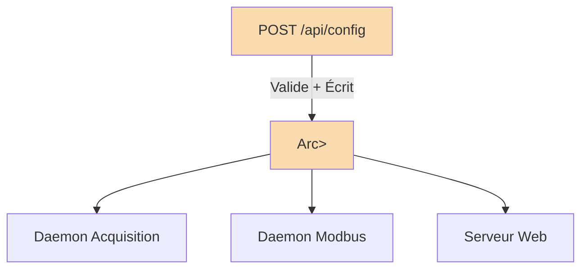
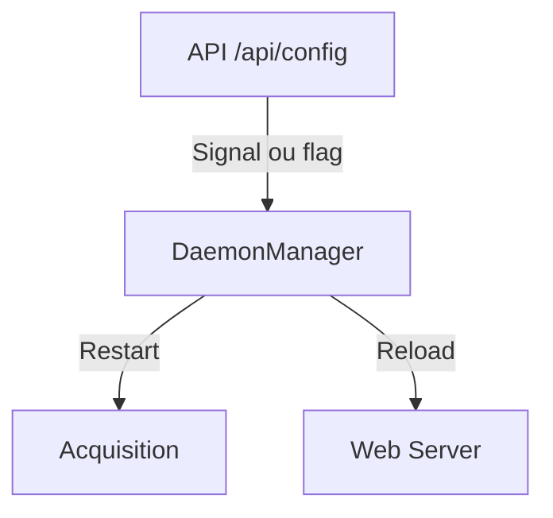

# Audit pour l’introduction d’une configuration dynamique dans `rust-photoacoustic`

## Objectif

Permettre la mise à jour dynamique de la configuration via un endpoint POST `/api/config` (Rocket), avec :
- Validation identique à l’objet `rustphotoacoustic::Config`
- Injection de la nouvelle config dans un `Arc<RwLock<Config>>` partagé
- Analyse des impacts sur les démons/services et la gestion de la propagation côté nœuds

---

## 1. Analyse de l’existant

### 1.1 Structure de la configuration

Le projet utilise une struct `Config` centrale, qui regroupe plusieurs sous-configurations :

```rust
pub struct Config {
    pub photoacoustic: PhotoacousticConfig,
    pub access: AccessConfig,
    pub processing: ProcessingConfig,
    pub generix: GenerixConfig,
    // ...
}
```
- Validation : chaque sous-struct implémente typiquement des méthodes de validation (ex : `validate()`).
- Chargement YAML + validation JSON schema.
- Utilisée à travers le projet dans un `Arc<RwLock<Config>>`.

Voir [mod.rs](https://github.com/sctg-development/rust-photoacoustic/blob/main/rust/src/config/mod.rs).

### 1.2 Utilisation dans le projet

- Lancement des démons avec :  
  ```rust
  let config = Config::from_file("config.yaml")?;
  let config_arc = Arc::new(RwLock::new(config));
  daemon.launch(config_arc).await?;
  ```
- Le démon lit la config depuis l’`Arc<RwLock<Config>>` partagé.

### 1.3 Validation

- Pattern standard :  
  ```rust
  pub fn validate(&self) -> Result<()> { /* ... */ }
  ```
  [Exemple dans rust_patterns_guide.md](https://github.com/sctg-development/rust-photoacoustic/blob/main/rust/docs_conception_fr/rust_patterns_guide.md)

---

## 2. Détail de la marche à suivre

### 2.1 Ajout du endpoint Rocket `/api/config`

#### Route Rocket à ajouter

```rust
#[post("/api/config", data = "<config_data>")]
async fn update_config(
    config_data: rocket::serde::json::Json<Config>,
    shared_config: &State<Arc<RwLock<Config>>>
) -> Result<Status, Custom<String>> {
    // 1. Validation
    if let Err(e) = config_data.validate() {
        return Err(Custom(Status::BadRequest, format!("Invalid config: {e}")));
    }

    // 2. Mise à jour de la config partagée
    {
        let mut config_guard = shared_config.write().unwrap();
        *config_guard = config_data.into_inner();
    }

    // 3. (Optionnel) Notifier les services internes
    // ex: via channel ou flag...
    Ok(Status::Ok)
}
```
- Voir [Rocket State](https://rocket.rs/v0.5-rc/guide/state/#managed-state) pour l’injection de l’`Arc<RwLock<Config>>`.
- Ajouter le handler dans le `main.rs`/serveur.

### 2.2 Validation

Réutiliser la méthode `validate()` sur la structure `Config` pour garantir la cohérence des données.

### 2.3 Injection de la nouvelle config

- Écraser l’objet dans l’`Arc<RwLock<Config>>` partagé.
- Tous les threads/services lisant la config via le lock liront la nouvelle version dès le prochain accès.

### 2.4 Gestion des démons/services

#### Cas où un redémarrage est nécessaire

- Si certains démons/services ne relisent la config qu’à l’initialisation (ex. : thread acquisition qui ne supporte pas le hot-reload des devices).
- Pour chaque service/démon, documenter :
    - **Hot-reload possible** : relit la config à chaque utilisation (OK)
    - **Redémarrage nécessaire** : prend la config uniquement au démarrage (à relancer)

#### Exemple de logique "hot-reload" typique

```rust
fn do_something(&self) {
    let config = self.config.read().unwrap();
    // Utilise la config à chaque appel
}
```
#### Exemple de logique nécessitant un redémarrage

```rust
struct AcquisitionThread {
    device: String, // chargé une fois au démarrage
}
```
Dans ce cas, il faudra :
- Soit modifier le thread pour écouter un channel de notification (pattern watch/reload)
- Soit provoquer son redémarrage lors d’un changement de config

### 2.5 Propagation de la config aux nœuds

- Si chaque nœud lit la config depuis l’`Arc<RwLock<Config>>` partagé, il bénéficiera de la nouvelle config au prochain accès.
- Pour config propagée à distance (cluster/distribué) : implémenter une notification/pubsub ou polling.

---

## 3. Exemple d’implémentation

### 3.1 Diagramme d’architecture (mémoire partagée)



### 3.2 Gestion du redémarrage des démons



---

## 4. Marche à suivre détaillée

1. **Ajouter l’endpoint Rocket** pour recevoir la configuration.
2. **Valider** la configuration reçue avec `.validate()`.
3. **Écrire** la nouvelle config dans l’`Arc<RwLock<Config>>`.
4. **Pour chaque service/démon** :
    - Vérifier s’il supporte le hot-reload en lisant la config à chaque accès.
    - Si non : mettre en place une notification pour arrêter/redémarrer le démon concerné.
5. **Documenter** les sections de config nécessitant un redémarrage.
6. **(Optionnel)** : Pour une architecture distribuée, prévoir la propagation de la config (pub/sub, etc).

---

## 5. Exemples de code

### 5.1 Route Rocket complète

```rust
#[post("/api/config", data = "<new_config>")]
async fn update_config(
    new_config: rocket::serde::json::Json<Config>,
    shared_config: &State<Arc<RwLock<Config>>>,
    daemon_manager: &State<DaemonManager>, // Optionnel
) -> Result<Status, Custom<String>> {
    if let Err(e) = new_config.validate() {
        return Err(Custom(Status::BadRequest, format!("Config invalide: {e}")));
    }
    {
        let mut guard = shared_config.write().unwrap();
        *guard = new_config.into_inner();
    }
    daemon_manager.reload_if_needed().await; // à implémenter
    Ok(Status::Ok)
}
```

### 5.2 Pattern côté thread/démon

```rust
loop {
    {
        let config = shared_config.read().unwrap();
        // Utiliser la config courante
    }
    // ...
    // Si on souhaite supporter un reload immédiat :
    // Utiliser un channel pour notifier un arrêt/redémarrage
}
```

---

## 6. Points de vigilance

- **Validation stricte** : pour éviter d’introduire une config corrompue.
- **Verrouillage (RwLock)** : attention aux deadlocks lors des accès concurrents.
- **Gestion des erreurs** : prévoir un retour d’erreur clair à l’API.
- **Documentation** : bien expliciter pour chaque sous-section de config si le reload à chaud est supporté.

---
