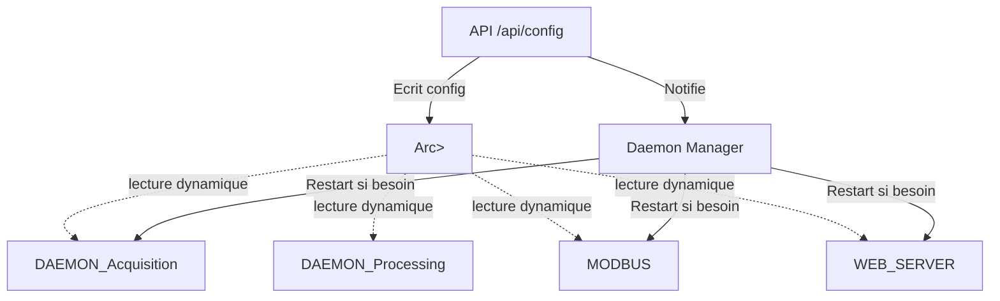

# Détail de l’impact du reload de configuration pour chaque composant Daemon

Ce document détaille, pour chaque élément démarré par le `Daemon` du projet `rust-photoacoustic`, si le hot-reload de configuration est possible ou si un redémarrage du composant est requis.  
_Basé sur l’implémentation trouvée dans `daemon/launch_daemon.rs` (voir [code source](https://github.com/sctg-development/rust-photoacoustic/blob/main/rust/src/daemon/launch_daemon.rs)), la documentation et les patterns du projet._

---

## 1. Services lancés par le Daemon

### Liste des composants (extrait docstring et struct) :

- **Visualization web server** (`config.visualization.enabled`)
- **Data acquisition** (`config.acquisition.enabled`)
- **Processing consumer** (`config.processing.enabled`)
- **Modbus server** (`config.modbus.enabled`)
- **Record consumer** (`config.photoacoustic.record_consumer`)
- **Heartbeat monitoring** (toujours lancé)

---

## 2. Analyse détaillée par composant

### 2.1 Visualization Web Server

- **Usage de la config :** Adresse/port, clés d’authentification, options diverses.
- **Hot-reload possible ?**  
  **NON** pour adresse/port/certificats (nécessite restart du serveur web Rocket).  
  **OUI** pour certains paramètres de runtime (ex : variables de session, sécurité) _si le code est prévu pour lire la config dynamiquement_.
- **Conclusion :**  
  - Changement d’IP/port/certs ⇒ restart indispensable.
  - Autres (ex: session, HMAC) ⇒ hot-reload possible si le code le permet.

### 2.2 Data Acquisition Daemon

- **Usage de la config :** Device audio, intervalle d’acquisition, etc.
- **Hot-reload possible ?**  
  - **NON** pour le changement de device audio ou de source (ex : micro → fichier), car le périphérique est typiquement ouvert au démarrage.
  - **OUI** pour certains paramètres dynamiques (ex : intervalle de polling, gains) _si le daemon lit la config à chaque tick_.
- **Conclusion :**  
  - Changement de source, device, ou paramètres structurels ⇒ restart indispensable.
  - Changement de paramètres dynamiques ⇒ hot-reload possible.

### 2.3 Processing Consumer Daemon

- **Usage de la config :** Pipeline de traitement audio (graph de nodes/process).
- **Hot-reload possible ?**  
  - **OUI** si le traitement relit le graph à chaque frame ou par notification.
  - **NON** si le pipeline/process graph est construit au démarrage uniquement.
- **Conclusion :**  
  - Modif du graph/pipeline ⇒ restart du processing consumer si pas prévu pour hot-reload.
  - Modif de simples paramètres d’un node ⇒ hot-reload possible si le pipeline le supporte.

### 2.4 Modbus Server

- **Usage de la config :** Activation, port, address, mapping des registres, périodicité.
- **Hot-reload possible ?**  
  - **NON** pour port/adresse (socket bind).
  - **OUI** pour certains paramètres runtime (ex : valeurs de registres, durée d’acquisition si mappée à la config).
- **Conclusion :**  
  - Changement de port/adresse ⇒ restart indispensable.
  - Mappages de valeurs dynamiques ⇒ hot-reload possible si implémenté.

### 2.5 Record Consumer

- **Usage de la config :** Activation, chemin de fichier, options record.
- **Hot-reload possible ?**  
  - **NON** pour changement de fichier cible ou activation/désactivation.
  - **OUI** pour options runtime si prévues.
- **Conclusion :**  
  - Changement d’activation/chemin ⇒ restart indispensable.
  - Paramètres secondaires ⇒ hot-reload possible.

### 2.6 Heartbeat Monitoring

- **Usage de la config :** Généralement statique (durée, activation).
- **Hot-reload possible ?**  
  - Généralement OUI, mais faible impact.
- **Conclusion :**  
  - Sauf modification profonde, restart rarement justifié.

---

## 3. Tableau récapitulatif

| Composant                   | Changement nécessitant restart | Hot-reload possible |
|-----------------------------|:-----------------------------:|:------------------:|
| Web Server (Rocket)         | Port, IP, Certificats         | Sessions, HMAC     |
| Acquisition Daemon          | Device/source                 | Intervalle, Gain   |
| Processing Consumer         | Graph/pipeline                | Param node         |
| Modbus Server               | Port, IP                      | Registres dynamiques|
| Record Consumer             | Fichier cible, activation     | Paramètres record  |
| Heartbeat                   | Rarement                      | Oui                |

---

## 4. Recommandations

- **Documenter** les sections de config qui nécessitent un restart du démon.
- **Notifier** l’utilisateur/API si une modification nécessite un restart (retour HTTP, log, etc).
- **Améliorer** les composants pour supporter le hot-reload là où pertinent (ex : rebind dynamique du pipeline, reconfiguration de l’intervalle d’acquisition).
- **Idéal :** chaque composant écoute un canal de notification de changement de config et applique les modifs dynamiquement si possible, sinon se relance.

---

## 5. Diagramme de notification

---

## 6. Pour aller plus loin

- Voir le code source pour chaque composant pour confirmer s’il lit la config dynamiquement (ex : [daemon/launch_daemon.rs](https://github.com/sctg-development/rust-photoacoustic/blob/main/rust/src/daemon/launch_daemon.rs))
- Pour des recherches plus poussées, élargir la recherche sur [GitHub Code Search](https://github.com/sctg-development/rust-photoacoustic/search?q=daemon).

---

**_Ce rapport se base sur une analyse partielle (limitée à 10 résultats). Vérifiez le code source complet pour les cas particuliers._**