# Rust-Photoacoustic: Complete Technical Documentation

[](https://codecov.io/github/sctg-development/rust-photoacoustic)


> **Flexible Gas Analyzer using Laser Photoacoustic Spectroscopy**
>
> A complete software and hardware solution for high-precision gas concentration measurement using differential Helmholtz resonator photoacoustic spectroscopy.

---

## Document Navigation

This documentation is structured for multiple audiences:

| Section | Target Audience | Page |
|---------|----------------|------|
| [Executive Summary](#executive-summary) | All readers | This page |
| [For Investors](#for-investors) | Business stakeholders, VCs | Below |
| [Physical Principles](#physical-principles-of-photoacoustic-spectroscopy) | Physicists, Scientists | Section 2 |
| [Rust Backend Architecture](#rust-backend-architecture) | Senior Rust developers | Section 3 |
| [React Frontend Architecture](#react-frontend-architecture) | Senior TypeScript/React developers | Section 4 |
| [Hardware Interface](#hardware-interface-lasersmart) | Hardware engineers | Section 5 |
| [General Developers Guide](#general-developers-guide) | Graduate students in computer science or related fields | Section 6 |
| [API Reference](#api-reference) | All developers | Section 7 |
| [Deployment Guide](#deployment-guide) | DevOps engineers | Section 8 |

---

## Table of Contents

<!-- TOC will be generated -->

1. [Executive Summary](#executive-summary)
2. [For Investors](#for-investors)
3. [Physical Principles of Photoacoustic Spectroscopy](#physical-principles-of-photoacoustic-spectroscopy)
4. [Rust Backend Architecture](#rust-backend-architecture)
5. [React Frontend Architecture](#react-frontend-architecture)
6. [Hardware Interface: Laser+Smart](#hardware-interface-lasersmart)
7. [General Developers Guide](#general-developers-guide)
8. [API Reference](#api-reference)
9. [Deployment Guide](#deployment-guide)
10. [Appendices](#appendices)

---

# Executive Summary

## What is Rust-Photoacoustic?

**Rust-Photoacoustic** is a comprehensive software platform for laser photoacoustic spectroscopy (LPAS), designed for real-time gas concentration measurement with laboratory-grade precision. The system combines:

- **High-performance Rust backend** for signal acquisition and processing
- **Modern React web interface** for real-time visualization and control
- **Custom hardware interface** (Laser+Smart) for scientific instrumentation
- **Industrial protocols** (Modbus TCP) for process integration

## Key Features


## System Architecture Overview


## Performance Metrics

| Metric | Value | Notes |
|--------|-------|-------|
| **Sampling Rate** | 48 kHz | Stereo, 16-bit |
| **FFT Resolution** | 4096 points | Configurable |
| **Processing Latency** | < 10 ms | Real-time streaming |
| **Web Streaming** | 60 fps | SSE with compression |
| **ADC Resolution** | 16-bit | ±7.8 µV @ PGA=16 |
| **DDS Resolution** | 0.004 Hz | 28-bit frequency register |
| **Temperature Control** | ±0.1°C | PID regulation |

## Technology Stack

### Backend (Rust)
- **Framework**: Rocket 0.5.1 with async TLS
- **Audio**: CPAL 0.17 + RustFFT 6.4
- **Auth**: jsonwebtoken + oxide-auth (OAuth2)
- **Communication**: tokio-modbus, redis-rs, rdkafka
- **Python**: PyO3 0.27 (optional)

### Frontend (TypeScript/React)
- **Framework**: React 19 + Vite 7
- **UI Library**: HeroUI (30+ components)
- **Visualization**: Chart.js, ReactFlow, AudioMotion
- **Auth**: Auth0 / OIDC generic
- **i18n**: 6 languages (including RTL)

### Hardware
- **MCU**: ATmega32U4 (USB-HID native)
- **ADC**: 4× ADS1115 (16-bit, I²C)
- **DAC**: LTC2641 (12/16-bit, SPI)
- **DDS**: AD9833 (28-bit, 500Hz-14kHz)

---

# For Investors

## Market Opportunity

### The Problem

Industrial gas detection and environmental monitoring face critical challenges:

1. **Precision limitations**: Traditional sensors (electrochemical, NDIR) offer ppm-level resolution
2. **Calibration drift**: Frequent recalibration required (weeks/months)
3. **Multi-gas complexity**: Each gas requires dedicated sensors
4. **Cost of ownership**: High maintenance, consumables, expertise required

### Our Solution: Laser Photoacoustic Spectroscopy

```mermaid
graph LR
    subgraph Traditional["Traditional Sensors"]
        A[Electrochemical] --> A1["± 1-5% accuracy"]
        B[NDIR] --> B1["ppm resolution"]
        C[Catalytic] --> C1["Cross-sensitivity"]
    end
    
    subgraph LPAS["Laser Photoacoustic"]
        D[QCL Laser] --> D1["ppb resolution"]
        E[Helmholtz Cell] --> E1["Amplified signal"]
        F[Differential] --> F1["Noise rejection"]
    end
    
    style LPAS fill:#90EE90
```



**Key Advantages:**
- **100-1000× better sensitivity** (ppb vs ppm)
- **Long-term stability** (laser-based, no consumables)
- **Multi-gas capability** (tunable laser wavelength)
- **Compact & robust** (no moving parts)

## Business Model

### Product Offerings

| Product | Target Market | Price Point |
|---------|---------------|-------------|
| **SpectraCore Lab** | Research institutions | €15,000-25,000 |
| **SpectraCore Industrial** | Process industries | €8,000-15,000 |
| **SpectraCore OEM** | Instrument manufacturers | €3,000-5,000 |
| **Software License** | Existing LPAS users | €500-2,000/year |

### Revenue Projections


| Year | Units | Revenue | EBITDA |
|------|-------|---------|--------|
| 2025 | 10 | €150K | -€200K |
| 2026 | 50 | €600K | €50K |
| 2027 | 150 | €1.8M | €400K |
| 2028 | 400 | €4.5M | €1.2M |
| 2029 | 800 | €9M | €2.8M |

### Competitive Landscape

| Company | Technology | Strengths | Weaknesses |
|---------|------------|-----------|------------|
| Gasera | LPAS | Established brand | Proprietary, expensive |
| Aerodyne | TDLAS | High precision | Lab-only, complex |
| Picarro | CRDS | ppb sensitivity | Very expensive (>€50K) |
| **SpectraCore** | LPAS + AI | Open platform, cost-effective | New entrant |

## Technology Moat

### Intellectual Property

1. **Differential Helmholtz resonator design** - Patent pending
2. **Real-time signal processing algorithms** - Trade secret
3. **Hot-reloadable processing graph** - Unique architecture
4. **Integrated hardware/software platform** - Full-stack solution

### Open Source Strategy


- **Open core**: Signal processing, web interface, basic drivers
- **Commercial**: Advanced AI analytics, industrial protocols, support
- **Hardware**: Reference designs open, production optimized closed

## Investment Ask

### Seed Round: €500K

**Use of Funds:**

| Category | Amount | Purpose |
|----------|--------|---------|
| R&D | €250K | Hardware finalization, certifications |
| Team | €150K | 2 engineers (18 months) |
| Operations | €50K | Lab equipment, prototypes |
| Marketing | €50K | Trade shows, website, materials |

### Milestones


## Team

| Role | Name | Background |
|------|------|------------|
| **CEO/CTO** | Ronan Le Meillat | 20+ years embedded systems, spectroscopy |
| **Advisor** | [Academic Partner] | University of Reims, GSMA lab |
| **Advisor** | [Industry Expert] | Ex-Gasera, LPAS specialist |

## Contact

**SCTG Development**
- Website: [sctg-development.github.io](https://sctg-development.github.io)
- GitHub: [github.com/sctg-development/rust-photoacoustic](https://github.com/sctg-development/rust-photoacoustic)
- Email: contact@sctg.eu.org

---

# Physical Principles of Photoacoustic Spectroscopy

## Introduction to Photoacoustic Effect

The photoacoustic effect, discovered by Alexander Graham Bell in 1880, occurs when modulated light is absorbed by a medium, causing periodic heating and expansion that generates acoustic waves.

### Fundamental Equation

The photoacoustic signal amplitude $S_{PA}$ is given by:

$$S_{PA} = \frac{(\gamma - 1) \cdot P_0 \cdot \alpha \cdot C \cdot L}{V \cdot f}$$

Where:
- $\gamma$ = Heat capacity ratio (Cp/Cv)
- $P_0$ = Laser power (W)
- $\alpha$ = Absorption coefficient (cm⁻¹)
- $C$ = Gas concentration (ppm)
- $L$ = Optical path length (cm)
- $V$ = Cell volume (cm³)
- $f$ = Modulation frequency (Hz)

### Beer-Lambert Absorption

The absorption coefficient follows Beer-Lambert law:

$$\alpha(\nu) = \sigma(\nu) \cdot N = \sigma(\nu) \cdot \frac{P \cdot C}{k_B \cdot T}$$

Where:
- $\sigma(\nu)$ = Absorption cross-section at frequency $\nu$
- $N$ = Number density of absorbing molecules
- $P$ = Pressure
- $k_B$ = Boltzmann constant
- $T$ = Temperature

## Differential Helmholtz Resonator

### Resonator Geometry


### Resonance Frequency

The Helmholtz resonance frequency is:

$$f_0 = \frac{c}{2\pi} \sqrt{\frac{A}{V \cdot L_{eff}}}$$

Where:
- $c$ = Speed of sound (~343 m/s in air)
- $A$ = Cross-sectional area of neck
- $V$ = Chamber volume
- $L_{eff}$ = Effective neck length (including end corrections)

**Typical values for our system:**
- Chamber volume: 1-5 cm³
- Neck diameter: 2-5 mm
- Resonance frequency: 500 Hz - 14 kHz

### Quality Factor

The resonator quality factor determines signal amplification:

$$Q = \frac{f_0}{\Delta f} = \frac{\text{Resonance frequency}}{\text{Bandwidth (-3dB)}}$$

Higher Q values (50-200) provide:
- Better signal amplification
- Narrower frequency response
- More selective noise rejection

## Differential Signal Processing

### Noise Rejection Principle


The differential configuration rejects:
- **Acoustic noise**: Environmental sounds, vibrations
- **Electrical noise**: Common-mode interference
- **Thermal noise**: Temperature fluctuations

**Signal-to-Noise Ratio improvement:**

$$SNR_{diff} = SNR_{single} \cdot \sqrt{2} \cdot \frac{1}{1-\rho}$$

Where $\rho$ is the correlation coefficient of noise between channels.

### Mathematical Model

Given microphone signals:
- $m_A(t) = s(t) + n_A(t)$ (excited chamber)
- $m_B(t) = n_B(t)$ (reference chamber)

The differential signal:

$$d(t) = m_A(t) - m_B(t) = s(t) + n_A(t) - n_B(t)$$

If noises are correlated ($n_A \approx n_B$):

$$d(t) \approx s(t)$$

## Signal Processing Pipeline

### Overview

```mermaid
flowchart LR
    subgraph Acquisition["1. Acquisition"]
        ADC["48kHz 16-bit ADC"]
    end
    
    subgraph Preprocessing["2. Preprocessing"]
        BP["Bandpass Filter"]
        DIFF["Differential"]
    end
    
    subgraph Spectral["3. Spectral Analysis"]
        WIN["Windowing"]
        FFT["FFT 4096pt"]
        AVG["Averaging"]
    end
    
    subgraph Detection["4. Peak Detection"]
        PEAK["Find f₀"]
        AMP["Extract Amplitude"]
    end
    
    subgraph Output["5. Concentration"]
        CAL["Calibration"]
        CONC["ppm Output"]
    end
    
    ADC --> BP --> DIFF --> WIN --> FFT --> AVG --> PEAK --> AMP --> CAL --> CONC
```



### Digital Filtering

#### Butterworth Bandpass Filter

The system implements 4th-order Butterworth filters using Second-Order Sections (SOS):

$$H(s) = \prod_{i=1}^{n/2} \frac{1}{s^2 + \frac{\omega_0}{Q_i}s + \omega_0^2}$$

**Implementation in Rust:**

```rust
// SOS coefficients for 4th-order Butterworth bandpass
// Centered at 2000 Hz with 200 Hz bandwidth
let filter = ScipyButterBandpassFilter::new(
    2000.0,    // center_freq_hz
    200.0,     // bandwidth_hz  
    48000.0,   // sample_rate_hz
    4          // order
)?;

// Zero-phase filtering (forward + backward)
let filtered = filter.filtfilt(&signal)?;
```

#### Available Filter Types

| Filter | Characteristics | Use Case |
|--------|----------------|----------|
| **Butterworth** | Maximally flat passband | General purpose |
| **Chebyshev I** | Steeper rolloff, passband ripple | Sharp cutoff needed |
| **Chebyshev II** | Flat passband, stopband ripple | Stopband rejection |
| **Elliptic (Cauer)** | Steepest rolloff, both ripples | Minimum order |

### FFT Analysis

#### Windowing Functions

To reduce spectral leakage:

| Window | Main Lobe | Side Lobe | Best For |
|--------|-----------|-----------|----------|
| Rectangular | Narrowest | -13 dB | Transients |
| Hann | Medium | -31 dB | General |
| Hamming | Medium | -42 dB | General |
| Blackman-Harris | Wide | -92 dB | Precision |

**Implementation:**

```rust
use dasp_window::{hann, blackman_harris};

// Apply Hann window
let windowed: Vec<f32> = signal
    .iter()
    .enumerate()
    .map(|(i, &s)| s * hann(i, signal.len()))
    .collect();
```

#### Frequency Resolution

$$\Delta f = \frac{f_s}{N}$$

For $f_s = 48000$ Hz and $N = 4096$:

$$\Delta f = \frac{48000}{4096} \approx 11.7 \text{ Hz}$$

### Peak Detection Algorithm

```mermaid
flowchart TB
    subgraph Input["FFT Magnitude Spectrum"]
        SPEC["mag[0..N/2]"]
    end
    
    subgraph Search["Peak Search"]
        RANGE["Define search range: f₀ ± Δf"]
        MAX["Find local maximum"]
        PARA["Parabolic interpolation"]
    end
    
    subgraph Output["Results"]
        FREQ["Precise frequency"]
        AMP["Amplitude"]
        PHASE["Phase"]
    end
    
    SPEC --> RANGE --> MAX --> PARA --> FREQ
    PARA --> AMP
    PARA --> PHASE
```



**Parabolic interpolation for sub-bin accuracy:**

$$f_{peak} = f_k + \frac{\delta f}{2} \cdot \frac{m_{k-1} - m_{k+1}}{m_{k-1} - 2m_k + m_{k+1}}$$

Where $m_k$ is the magnitude at bin $k$.

## Concentration Calculation

### Calibration Curve

The relationship between PA signal and concentration is typically polynomial:

$$C = a_0 + a_1 \cdot S + a_2 \cdot S^2 + a_3 \cdot S^3 + a_4 \cdot S^4$$

**Configuration example:**

```yaml
photoacoustic:
  concentration_coefficients: [0.0, 1.0, 0.001, -0.00001, 0.0]
  min_concentration: 0.0
  max_concentration: 10000.0
  concentration_unit: "ppm"
```

### Environmental Corrections

Temperature and pressure affect the measurement:

$$C_{corrected} = C_{measured} \cdot \frac{T}{T_{ref}} \cdot \frac{P_{ref}}{P}$$

The system reads NTC thermistors for automatic temperature compensation.

## Simulation Model

For development and testing, the system includes a physically-realistic photoacoustic signal simulator:

```mermaid
flowchart TB
    subgraph Parameters["Simulation Parameters"]
        F0["Resonance freq: 2000 Hz"]
        Q["Quality factor: 100"]
        T["Temperature: 25°C"]
        C["Concentration: 500 ppm"]
    end
    
    subgraph Model["Physical Model"]
        PA["PA Signal Generation"]
        NOISE["Noise Model"]
        DRIFT["Thermal Drift"]
    end
    
    subgraph Output["Simulated Signals"]
        CH_A["Channel A (Excited)"]
        CH_B["Channel B (Reference)"]
    end
    
    Parameters --> Model --> Output
```



**Features:**
- Realistic SNR modeling
- Temperature-dependent drift
- Concentration-proportional amplitude
- Correlated noise on both channels

---

*Document continues with Rust Backend Architecture...*

---

# Rust Backend Architecture

## Project Structure

```
rust/src/
├── lib.rs                      # Library entry point
├── main.rs                     # Application entry point
├── build_info.rs               # Git/build metadata
│
├── acquisition/                # Audio signal acquisition
│   ├── mod.rs                  # Module exports
│   ├── daemon.rs               # AcquisitionDaemon
│   ├── realtime_daemon.rs      # RealTimeAcquisitionDaemon
│   ├── stream.rs               # SharedAudioStream
│   ├── microphone.rs           # CPAL microphone source
│   ├── file.rs                 # WAV file source
│   ├── mock.rs                 # Mock audio source
│   ├── simulated_photoacoustic.rs  # Physics simulation
│   └── universal.rs            # Universal source wrapper
│
├── preprocessing/              # Signal preprocessing
│   ├── mod.rs
│   ├── differential.rs         # A-B subtraction
│   └── filter/                 # Digital filters
│       ├── standard_filters.rs     # Basic IIR
│       ├── scipy_butter_filter.rs  # Butterworth (SOS)
│       ├── scipy_cheby_filter.rs   # Chebyshev
│       └── scipy_cauer_filter.rs   # Elliptic
│
├── spectral/                   # Spectral analysis
│   ├── mod.rs
│   └── fft.rs                  # FFT analyzer
│
├── processing/                 # Processing pipeline
│   ├── mod.rs
│   ├── graph.rs                # ProcessingGraph (~3000 lines)
│   ├── consumer.rs             # ProcessingConsumer
│   ├── nodes/                  # Processing nodes
│   │   ├── input.rs            # InputNode
│   │   ├── filter.rs           # FilterNode
│   │   ├── differential.rs     # DifferentialNode
│   │   ├── channel.rs          # ChannelSelector/Mixer
│   │   ├── gain.rs             # GainNode
│   │   ├── output.rs           # PhotoacousticOutputNode
│   │   ├── streaming.rs        # StreamingNode (SSE)
│   │   └── python.rs           # PythonNode (PyO3)
│   └── computing_nodes/        # Analytics nodes
│       ├── peak_finder.rs      # PeakFinderNode
│       ├── concentration.rs    # ConcentrationNode
│       ├── universal_action.rs # ActionNode
│       └── action_drivers/     # Pluggable drivers
│           ├── redis.rs
│           ├── http.rs
│           ├── kafka.rs
│           └── python.rs
│
├── visualization/              # Web server
│   ├── mod.rs
│   ├── server/                 # Rocket configuration
│   ├── auth/                   # OAuth2 + JWT
│   ├── api/                    # REST endpoints
│   └── streaming/              # SSE audio streaming
│
├── thermal_regulation/         # Temperature control
│   ├── mod.rs
│   ├── daemon.rs               # PID controller
│   ├── controller.rs           # Advanced thermal control
│   └── drivers/                # I2C drivers
│       ├── mock.rs
│       ├── native.rs           # Linux i2c-dev
│       └── cp2112.rs           # USB-I2C bridge
│
├── modbus/                     # Industrial protocol
│   └── modbus_server.rs        # Modbus TCP server
│
├── daemon/                     # Main daemon
│   └── launch_daemon.rs        # Service orchestration
│
├── config/                     # YAML configuration
│   ├── mod.rs
│   └── *.rs                    # Config structs
│
└── utility/                    # Utilities
    ├── certificate_utilities.rs
    ├── noise_generator.rs
    └── system_stats.rs
```

## Core Concepts

### 1. AudioFrame Structure

The fundamental data unit for audio processing:

```rust
/// Represents a single frame of stereo audio data
#[derive(Debug, Clone)]
pub struct AudioFrame {
    /// Samples from microphone A (excited chamber)
    pub channel_a: Vec<f32>,
    /// Samples from microphone B (reference chamber)
    pub channel_b: Vec<f32>,
    /// Sample rate in Hz
    pub sample_rate: u32,
    /// Timestamp in milliseconds since epoch
    pub timestamp: u64,
    /// Sequential frame number
    pub frame_number: u64,
}
```

### 2. Audio Sources

The system supports multiple audio input sources through the `AudioSource` trait:


### 3. Processing Graph Architecture

The `ProcessingGraph` is the heart of signal processing:


**Key Features:**
- **Hot-reloadable configuration** via YAML
- **Thread-safe** with `Arc<RwLock<>>` pattern
- **Async execution** with Tokio
- **Pluggable nodes** via trait system

### 4. Node Trait System

```rust
/// Core trait for all processing nodes
pub trait ProcessingNode: Send + Sync {
    /// Process input data and produce output
    fn process(&mut self, input: &ProcessingData) -> Result<ProcessingData>;
    
    /// Node identifier
    fn id(&self) -> &str;
    
    /// Node type name
    fn node_type(&self) -> &str;
    
    /// Update configuration at runtime
    fn update_config(&mut self, config: &serde_json::Value) -> Result<bool>;
    
    /// Get current statistics
    fn get_statistics(&self) -> NodeStatistics;
}
```

## Acquisition Daemon

### Real-Time Audio Streaming


### Configuration

```yaml
acquisition:
  source: "simulated"  # microphone | file | simulated
  sample_rate: 48000
  frame_size: 1024
  channels: 2
  
  simulated_source:
    resonance_frequency: 2000.0
    quality_factor: 100.0
    base_concentration: 500.0
    noise_level: 0.01
```

### Source Selection Logic

```rust
pub fn create_audio_source(config: &AcquisitionConfig) -> Result<Box<dyn AudioSource>> {
    match config.source.as_str() {
        "microphone" => Ok(Box::new(MicrophoneSource::new(&config.device)?)),
        "file" => Ok(Box::new(FileSource::new(&config.file_path)?)),
        "simulated" => Ok(Box::new(SimulatedPhotoacousticSource::new(
            &config.simulated_source
        )?)),
        _ => Err(anyhow!("Unknown source type: {}", config.source))
    }
}
```

## Processing Pipeline

### Filter Configuration

```yaml
processing:
  graph:
    nodes:
      - id: "bandpass"
        type: "filter"
        filter_type: "scipy_butter_bandpass"
        center_frequency: 2000.0
        bandwidth: 200.0
        order: 4
        
      - id: "differential"
        type: "differential"
        
      - id: "peak_finder"
        type: "peak_finder"
        search_range_hz: 100.0
        min_peak_height: 0.001
```

### Processing Data Flow

```rust
/// Data container flowing through the processing graph
#[derive(Debug, Clone)]
pub struct ProcessingData {
    /// Audio samples (may be modified by processing)
    pub audio: Option<AudioFrame>,
    
    /// Spectral data after FFT
    pub spectrum: Option<SpectralData>,
    
    /// Detected peaks
    pub peaks: Option<Vec<Peak>>,
    
    /// Computed concentration
    pub concentration: Option<f64>,
    
    /// Metadata and timing
    pub metadata: ProcessingMetadata,
}
```

## Action Driver System

### Architecture


### Redis Driver Example

```yaml
processing:
  graph:
    nodes:
      - id: "action_redis"
        type: "universal_action"
        driver: "redis"
        config:
          url: "redis://localhost:6379"
          mode: "publish"  # publish | set | stream
          channel: "photoacoustic/measurements"
          tls: false
```

### Custom Python Driver

```python
# python/action_handler.py
def process_measurement(measurement: dict) -> dict:
    """
    Custom measurement handler called from Rust via PyO3.
    
    Args:
        measurement: Dict with keys:
            - timestamp: int (ms since epoch)
            - concentration: float (ppm)
            - peak_frequency: float (Hz)
            - peak_amplitude: float
            
    Returns:
        Dict with processing results
    """
    # Custom logic here
    return {
        "status": "processed",
        "alert": measurement["concentration"] > 1000
    }
```

## Thermal Regulation

### PID Controller

```mermaid
flowchart LR
    subgraph Input
        SP["Setpoint"]
        PV["Process Value<br/>(NTC reading)"]
    end
    
    subgraph PID["PID Controller"]
        E["Error = SP - PV"]
        P["P: Kp × e"]
        I["I: Ki × ∫e dt"]
        D["D: Kd × de/dt"]
        SUM["Σ"]
    end
    
    subgraph Output
        DAC["DAC Output"]
        TEC["TEC Driver"]
    end
    
    SP --> E
    PV --> E
    E --> P --> SUM
    E --> I --> SUM
    E --> D --> SUM
    SUM --> DAC --> TEC
```



### I2C Driver Architecture

```rust
/// Trait for I2C bus communication
pub trait I2CBusDriver: Send + Sync {
    fn write(&mut self, addr: u8, data: &[u8]) -> Result<()>;
    fn read(&mut self, addr: u8, len: usize) -> Result<Vec<u8>>;
    fn write_read(&mut self, addr: u8, write: &[u8], read_len: usize) -> Result<Vec<u8>>;
}

/// High-level thermal regulation trait
pub trait ThermalRegulationDriver: Send + Sync {
    fn read_temperature(&mut self, sensor_id: u8) -> Result<f32>;
    fn set_output(&mut self, channel: u8, value: f32) -> Result<()>;
    fn get_status(&self) -> ThermalStatus;
}
```

### Configuration

```yaml
thermal_regulation:
  enabled: true
  update_interval_ms: 100
  
  regulators:
    - id: "laser_tec"
      sensor_address: 0x48
      output_channel: 0
      setpoint: 25.0
      pid:
        kp: 2.0
        ki: 0.5
        kd: 0.1
      limits:
        min_output: 0.0
        max_output: 100.0
        
    - id: "cell_tec"
      sensor_address: 0x49
      output_channel: 1
      setpoint: 30.0
      pid:
        kp: 1.5
        ki: 0.3
        kd: 0.05
```

## Web Server (Rocket)

### Server Architecture


### Authentication Flow


### Request Guards

```rust
/// OAuth2 Bearer token guard
#[derive(Debug)]
pub struct OAuthBearer {
    pub token: String,
    pub claims: JwtClaims,
}

#[rocket::async_trait]
impl<'r> FromRequest<'r> for OAuthBearer {
    type Error = AuthError;
    
    async fn from_request(request: &'r Request<'_>) -> Outcome<Self, Self::Error> {
        // Extract and validate Bearer token
        let token = extract_bearer_token(request)?;
        let claims = validate_jwt(&token)?;
        Outcome::Success(OAuthBearer { token, claims })
    }
}
```

## Modbus Server

### Register Map

```mermaid
flowchart LR
    subgraph Input["Input Registers (Read-Only)"]
        IR0["0: Resonance Freq (Hz×10)"]
        IR1["1: Amplitude (×1000)"]
        IR2["2: Concentration (ppm×10)"]
        IR3["3-4: Timestamp (low/high)"]
        IR5["5: Status Code"]
    end
    
    subgraph Holding["Holding Registers (R/W)"]
        HR0["0: Measurement Interval"]
        HR1["1: Averaging Count"]
        HR2["2: Gain"]
        HR3["3: Filter Strength"]
    end
```



### Integration with SCADA

```rust
// Example Modbus client code (Python)
from pymodbus.client import ModbusTcpClient

client = ModbusTcpClient('192.168.1.100', port=5020)
client.connect()

# Read concentration (register 2, scaled by 10)
result = client.read_input_registers(2, 1)
concentration_ppm = result.registers[0] / 10.0

# Set measurement interval to 5 seconds
client.write_register(0, 5)
```

## Error Handling

### Error Types

```rust
use thiserror::Error;

#[derive(Error, Debug)]
pub enum PhotoacousticError {
    #[error("Audio acquisition failed: {0}")]
    AcquisitionError(String),
    
    #[error("Processing error in node '{node}': {message}")]
    ProcessingError { node: String, message: String },
    
    #[error("Configuration error: {0}")]
    ConfigError(#[from] config::ConfigError),
    
    #[error("Hardware communication error: {0}")]
    HardwareError(String),
    
    #[error("Authentication failed: {0}")]
    AuthError(String),
}
```

### Result Propagation

```rust
// Using anyhow for application errors
use anyhow::{Context, Result};

pub fn process_audio_frame(frame: &AudioFrame) -> Result<ProcessingResult> {
    let filtered = apply_bandpass_filter(frame)
        .context("Failed to apply bandpass filter")?;
        
    let differential = calculate_differential(&filtered)
        .context("Failed to calculate differential")?;
        
    let spectrum = compute_fft(&differential)
        .context("FFT computation failed")?;
        
    Ok(ProcessingResult { spectrum, ..Default::default() })
}
```

## Testing

### Unit Tests

```rust
#[cfg(test)]
mod tests {
    use super::*;
    
    #[test]
    fn test_bandpass_filter() {
        let filter = ScipyButterBandpassFilter::new(
            2000.0, 200.0, 48000.0, 4
        ).unwrap();
        
        // Generate test signal: 2000 Hz + 500 Hz
        let signal = generate_test_signal(48000, 1.0, &[2000.0, 500.0]);
        
        let filtered = filter.apply(&signal);
        
        // 2000 Hz should pass, 500 Hz should be attenuated
        let spectrum = compute_fft(&filtered);
        assert!(spectrum.amplitude_at(2000.0) > spectrum.amplitude_at(500.0) * 10.0);
    }
    
    #[tokio::test]
    async fn test_processing_graph() {
        let config = load_test_config();
        let graph = ProcessingGraph::from_config(&config).await.unwrap();
        
        let frame = generate_test_audio_frame();
        let result = graph.process(frame).await.unwrap();
        
        assert!(result.concentration.is_some());
    }
}
```

### Integration Tests

```bash
# Run all tests
cargo test

# Run with logging
RUST_LOG=debug cargo test -- --nocapture

# Run specific test module
cargo test processing::graph::tests

# Run doc tests
cargo test --doc
```

---

*Document continues with React Frontend Architecture...*

---

# React Frontend Architecture

## Project Structure

```
web/src/
├── App.tsx                     # Root component with routing
├── main.tsx                    # Application entry point
├── provider.tsx                # HeroUI provider
├── i18n.ts                     # Internationalization config
│
├── authentication/             # Auth system
│   ├── index.ts                # Exports
│   ├── auth-root.tsx           # Provider selector
│   ├── auth-components.tsx     # UI components
│   └── providers/
│       ├── auth-provider.ts    # TypeScript interfaces
│       ├── auth0-provider.tsx  # Auth0 implementation
│       ├── generix-provider.tsx # Generic OIDC
│       └── use-auth.tsx        # Unified hook
│
├── components/                 # Reusable components
│   ├── navbar.tsx              # Navigation bar
│   ├── audio-stream-analyzer.tsx  # Audio visualizer
│   ├── processing-graph-view.tsx  # ReactFlow graph
│   ├── theme-switch.tsx        # Dark/light toggle
│   ├── language-switch.tsx     # i18n selector
│   ├── loading-indicator.tsx   # Spinner
│   └── icons.tsx               # SVG icons
│
├── contexts/                   # React contexts
│   └── cookie-consent-context.tsx
│
├── hooks/                      # Custom hooks
│   ├── useAudioStream.ts       # Audio streaming (~2000 lines)
│   ├── useProcessingGraph.ts   # Graph data fetching
│   └── use-theme.ts            # Theme management
│
├── layouts/                    # Page layouts
│   └── default.tsx
│
├── locales/                    # Translation files
│   ├── en-US.json
│   ├── fr-FR.json
│   ├── es-ES.json
│   ├── zh-CN.json
│   ├── ar-SA.json              # RTL
│   └── he-IL.json              # RTL
│
├── pages/                      # Route pages
│   ├── index.tsx               # Dashboard
│   ├── audio.tsx               # Audio analyzer
│   ├── thermal.tsx             # Thermal monitor
│   ├── graph.tsx               # Processing graph
│   └── not-found.tsx           # 404 page
│
├── types/                      # TypeScript definitions
│   ├── index.ts
│   ├── processing-graph.ts
│   ├── thermal.ts
│   ├── computing.ts
│   └── audio-streaming.ts
│
└── utilities/                  # Helper functions
    ├── polynomial-to-mathml.ts
    └── scientific-notation.ts
```

## Technology Stack

| Category | Technology | Version |
|----------|------------|---------|
| **Framework** | React | 19.x |
| **Build Tool** | Vite | 7.x |
| **UI Library** | HeroUI | Latest |
| **Styling** | Tailwind CSS | 4.x |
| **Animation** | Framer Motion | 12.x |
| **Charts** | Chart.js + react-chartjs-2 | 4.x |
| **Flow Diagrams** | ReactFlow | 11.x |
| **Audio Viz** | AudioMotion Analyzer | 4.x |
| **i18n** | i18next | 25.x |
| **Auth** | Auth0 / oidc-client-ts | Latest |

## Routing Structure


**Route Definition (App.tsx):**

```tsx
export default function App() {
  return (
    <Routes>
      <Route element={<Layout />}>
        <Route path="/" element={<IndexPage />} />
        <Route path="/audio" element={
          <AuthenticationGuard>
            <AudioPage />
          </AuthenticationGuard>
        } />
        <Route path="/thermal" element={
          <AuthenticationGuard>
            <ThermalPage />
          </AuthenticationGuard>
        } />
        <Route path="/graph" element={
          <AuthenticationGuard>
            <GraphPage />
          </AuthenticationGuard>
        } />
        <Route path="*" element={<NotFoundPage />} />
      </Route>
    </Routes>
  );
}
```

## Authentication System

### Multi-Provider Architecture

```mermaid
classDiagram
    class AuthProvider {
        <<interface>>
        +isAuthenticated: boolean
        +isLoading: boolean
        +user: AuthUser
        +login(): Promise
        +logout(): Promise
        +getAccessToken(): Promise~string~
        +hasPermission(permission): Promise~boolean~
        +getJson(url): Promise~any~
        +postJson(url, data): Promise~any~
    }
    
    class Auth0Provider {
        -auth0Client: Auth0Client
    }
    
    class GenerixProvider {
        -oidcClient: UserManager
    }
    
    AuthProvider <|-- Auth0Provider
    AuthProvider <|-- GenerixProvider
```

### Configuration

**Environment Variables:**

```bash
# Auth0 Provider
VITE_AUTH_PROVIDER=auth0
VITE_AUTH0_DOMAIN=your-tenant.auth0.com
VITE_AUTH0_CLIENT_ID=your-client-id
VITE_AUTH0_AUDIENCE=https://api.example.com

# Generic OIDC Provider
VITE_AUTH_PROVIDER=generix
VITE_GENERIX_AUTHORITY=https://your-oidc-server.com
VITE_GENERIX_CLIENT_ID=your-client-id
VITE_GENERIX_REDIRECT_URI=https://app.example.com/callback
VITE_GENERIX_SCOPE=openid profile email
```

### Usage Example

```tsx
import { useAuth, AuthenticationGuard, LoginButton } from '@/authentication';

function ProtectedComponent() {
  const { user, isAuthenticated, getAccessToken, getJson } = useAuth();
  
  const fetchData = async () => {
    const token = await getAccessToken();
    const data = await getJson('/api/protected-resource');
    return data;
  };
  
  if (!isAuthenticated) {
    return <LoginButton />;
  }
  
  return (
    <div>
      <p>Welcome, {user?.name}</p>
      <button onClick={fetchData}>Fetch Data</button>
    </div>
  );
}
```

## Audio Streaming Hook

### `useAudioStream` - Complete Implementation

This hook handles real-time audio streaming from the backend via Server-Sent Events (SSE):

```mermaid
sequenceDiagram
    participant Component
    participant Hook as useAudioStream
    participant SSE as EventSource
    participant Audio as Web Audio API
    participant Viz as AudioMotion
    
    Component->>Hook: useAudioStream(streamId)
    Hook->>SSE: Connect to /api/audio/stream
    
    loop Every frame (~20ms)
        SSE->>Hook: AudioFrame (JSON/Binary)
        Hook->>Hook: Decode & buffer
        Hook->>Audio: Queue for playback
        Hook->>Viz: Update analyzer
    end
    
    Hook->>Component: { stats, controls, isConnected }
```

### Hook Interface

```typescript
interface UseAudioStreamOptions {
  /** Stream ID to connect to */
  streamId: string;
  /** Enable audio playback */
  enablePlayback?: boolean;
  /** Auto-reconnect on disconnect */
  autoReconnect?: boolean;
  /** Reconnect delay (ms) */
  reconnectDelay?: number;
}

interface UseAudioStreamReturn {
  /** Connection status */
  isConnected: boolean;
  isLoading: boolean;
  error: Error | null;
  
  /** Stream statistics */
  stats: StreamStatistics;
  
  /** Audio controls */
  controls: {
    play: () => void;
    pause: () => void;
    setVolume: (volume: number) => void;
    startRecording: () => void;
    stopRecording: () => Blob;
  };
  
  /** For AudioMotion integration */
  analyzerNode: AnalyserNode | null;
}
```

### Usage Example

```tsx
import { useAudioStream } from '@/hooks/useAudioStream';
import AudioMotionAnalyzer from 'audiomotion-analyzer';

function AudioVisualizerPage() {
  const containerRef = useRef<HTMLDivElement>(null);
  const [analyzer, setAnalyzer] = useState<AudioMotionAnalyzer | null>(null);
  
  const {
    isConnected,
    stats,
    controls,
    analyzerNode
  } = useAudioStream({
    streamId: 'main',
    enablePlayback: true,
    autoReconnect: true
  });
  
  useEffect(() => {
    if (containerRef.current && analyzerNode) {
      const audioMotion = new AudioMotionAnalyzer(containerRef.current, {
        source: analyzerNode,
        mode: 3,
        gradient: 'rainbow',
        showScaleX: true,
        showPeaks: true
      });
      setAnalyzer(audioMotion);
    }
  }, [analyzerNode]);
  
  return (
    <div>
      <div ref={containerRef} style={{ width: '100%', height: 300 }} />
      
      <Card>
        <p>Status: {isConnected ? 'Connected' : 'Disconnected'}</p>
        <p>Frames: {stats.framesReceived}</p>
        <p>Latency: {stats.latency}ms</p>
      </Card>
      
      <ButtonGroup>
        <Button onClick={controls.play}>Play</Button>
        <Button onClick={controls.pause}>Pause</Button>
        <Slider 
          label="Volume" 
          onChange={(v) => controls.setVolume(v)} 
        />
      </ButtonGroup>
    </div>
  );
}
```

## Processing Graph Visualization

### ReactFlow Integration

```tsx
import ReactFlow, { 
  Node, Edge, Background, Controls 
} from 'reactflow';
import { useProcessingGraph } from '@/hooks/useProcessingGraph';

function ProcessingGraphView() {
  const { graph, isLoading, error, refetch } = useProcessingGraph({
    autoRefresh: true,
    refreshInterval: 5000
  });
  
  const nodes: Node[] = useMemo(() => 
    graph?.nodes.map(node => ({
      id: node.id,
      type: getNodeType(node.node_type),
      position: calculatePosition(node),
      data: {
        label: node.id,
        type: node.node_type,
        stats: node.statistics
      }
    })) ?? []
  , [graph]);
  
  const edges: Edge[] = useMemo(() =>
    graph?.connections.map(conn => ({
      id: `${conn.from}-${conn.to}`,
      source: conn.from,
      target: conn.to,
      animated: true
    })) ?? []
  , [graph]);
  
  return (
    <div style={{ width: '100%', height: 600 }}>
      <ReactFlow
        nodes={nodes}
        edges={edges}
        fitView
      >
        <Background />
        <Controls />
      </ReactFlow>
    </div>
  );
}
```

### Custom Node Components

```tsx
// Custom node for filter visualization
function FilterNode({ data }) {
  return (
    <div className="filter-node">
      <Handle type="target" position={Position.Left} />
      <div className="node-header">
        <FilterIcon />
        <span>{data.label}</span>
      </div>
      <div className="node-body">
        <p>Type: {data.config.filter_type}</p>
        <p>Freq: {data.config.center_frequency} Hz</p>
        <p>BW: {data.config.bandwidth} Hz</p>
      </div>
      <div className="node-stats">
        <ProgressBar value={data.stats.cpu_usage} />
      </div>
      <Handle type="source" position={Position.Right} />
    </div>
  );
}
```

## Thermal Dashboard

### Real-Time Temperature Monitoring

```tsx
import { Line } from 'react-chartjs-2';
import { useThermalData } from '@/hooks/useThermalData';

function ThermalDashboard() {
  const { data, regulators, timeRange, setTimeRange } = useThermalData();
  
  const chartData = {
    labels: data.map(d => formatTime(d.timestamp)),
    datasets: regulators.map((reg, i) => ({
      label: reg.name,
      data: data.map(d => d.temperatures[reg.id]),
      borderColor: COLORS[i],
      tension: 0.1
    }))
  };
  
  const chartOptions = {
    responsive: true,
    scales: {
      y: {
        title: { display: true, text: 'Temperature (°C)' }
      }
    },
    plugins: {
      annotation: {
        annotations: regulators.map(reg => ({
          type: 'line',
          yMin: reg.setpoint,
          yMax: reg.setpoint,
          borderColor: 'red',
          borderDash: [5, 5],
          label: { content: `Setpoint: ${reg.setpoint}°C` }
        }))
      }
    }
  };
  
  return (
    <div>
      <Tabs>
        <Tab key="overview" title="Overview">
          <div className="grid grid-cols-2 gap-4">
            {regulators.map(reg => (
              <TemperatureGauge
                key={reg.id}
                value={reg.currentTemp}
                setpoint={reg.setpoint}
                min={0}
                max={100}
              />
            ))}
          </div>
        </Tab>
        <Tab key="history" title="History">
          <ButtonGroup>
            {['1h', '6h', '12h', '24h'].map(range => (
              <Button
                key={range}
                onClick={() => setTimeRange(range)}
                color={timeRange === range ? 'primary' : 'default'}
              >
                {range}
              </Button>
            ))}
          </ButtonGroup>
          <Line data={chartData} options={chartOptions} />
        </Tab>
      </Tabs>
    </div>
  );
}
```

## Internationalization

### Supported Languages

| Code | Language | Direction | Status |
|------|----------|-----------|--------|
| `en-US` | English | LTR | ✅ Complete |
| `fr-FR` | Français | LTR | ✅ Complete |
| `es-ES` | Español | LTR | ✅ Complete |
| `zh-CN` | 中文 | LTR | ✅ Complete |
| `ar-SA` | العربية | RTL | ✅ Complete |
| `he-IL` | עברית | RTL | ✅ Complete |

### Configuration (i18n.ts)

```typescript
import i18n from 'i18next';
import { initReactI18next } from 'react-i18next';
import HttpBackend from 'i18next-http-backend';

i18n
  .use(HttpBackend)
  .use(initReactI18next)
  .init({
    fallbackLng: 'en-US',
    supportedLngs: ['en-US', 'fr-FR', 'es-ES', 'zh-CN', 'ar-SA', 'he-IL'],
    backend: {
      loadPath: '/locales/{{lng}}.json'
    },
    interpolation: {
      escapeValue: false
    }
  });

export default i18n;
```

### Usage

```tsx
import { useTranslation } from 'react-i18next';

function Dashboard() {
  const { t, i18n } = useTranslation();
  
  return (
    <div dir={i18n.dir()}>
      <h1>{t('dashboard.title')}</h1>
      <p>{t('dashboard.concentration', { value: 523.4 })}</p>
      <LanguageSwitch />
    </div>
  );
}
```

### Translation File Structure

```json
// locales/en-US.json
{
  "dashboard": {
    "title": "Photoacoustic Dashboard",
    "concentration": "Concentration: {{value}} ppm",
    "temperature": "Temperature",
    "status": {
      "connected": "Connected",
      "disconnected": "Disconnected",
      "error": "Error"
    }
  },
  "audio": {
    "title": "Audio Analyzer",
    "stream_select": "Select Stream",
    "frames_received": "Frames Received",
    "latency": "Latency"
  },
  "thermal": {
    "title": "Thermal Regulation",
    "setpoint": "Setpoint",
    "current": "Current",
    "output": "Control Output"
  }
}
```

## State Management

### Context Pattern

```tsx
// contexts/app-state-context.tsx
interface AppState {
  selectedStream: string;
  autoRefresh: boolean;
  refreshInterval: number;
  theme: 'light' | 'dark';
}

const AppStateContext = createContext<AppState | null>(null);

export function AppStateProvider({ children }) {
  const [state, dispatch] = useReducer(appStateReducer, initialState);
  
  return (
    <AppStateContext.Provider value={{ state, dispatch }}>
      {children}
    </AppStateContext.Provider>
  );
}

export function useAppState() {
  const context = useContext(AppStateContext);
  if (!context) {
    throw new Error('useAppState must be used within AppStateProvider');
  }
  return context;
}
```

## Performance Optimization

### React.memo and useMemo

```tsx
// Memoize expensive chart data transformations
const chartData = useMemo(() => {
  return processRawDataForChart(rawData);
}, [rawData]);

// Memoize callback functions
const handleStreamSelect = useCallback((streamId: string) => {
  setSelectedStream(streamId);
}, []);

// Memoize components that receive stable props
const MemoizedGraph = memo(ProcessingGraphView);
```

### Code Splitting

```tsx
// Lazy load heavy components
const AudioAnalyzer = lazy(() => import('./components/audio-stream-analyzer'));
const ProcessingGraph = lazy(() => import('./components/processing-graph-view'));

function App() {
  return (
    <Suspense fallback={<LoadingIndicator />}>
      <Routes>
        <Route path="/audio" element={<AudioAnalyzer />} />
        <Route path="/graph" element={<ProcessingGraph />} />
      </Routes>
    </Suspense>
  );
}
```

### Vite Configuration

```typescript
// vite.config.ts
export default defineConfig({
  plugins: [react()],
  build: {
    rollupOptions: {
      output: {
        manualChunks: {
          'vendor-heroui': ['@heroui/react'],
          'vendor-charts': ['chart.js', 'react-chartjs-2'],
          'vendor-flow': ['reactflow'],
          'vendor-audio': ['audiomotion-analyzer']
        }
      }
    }
  }
});
```

---

*Document continues with Hardware Interface...*

---

# Hardware Interface: Laser+Smart

## Overview

**Laser+Smart** is a custom USB scientific interface designed for precision control of the photoacoustic spectroscopy system. It provides:

- **16 channels** of 16-bit ADC (ADS1115)
- **3 channels** of 12/16-bit DAC (LTC2641 on DTL100)
- **DDS modulator** (AD9833) for laser frequency control
- **16 GPIO** for auxiliary control (MCP23017)
- **4 NTC inputs** for temperature monitoring
- **USB-HID** communication (no driver required)

## System Architecture

```mermaid
flowchart TB
    subgraph Host["Host Computer"]
        RUST["Rust Backend<br/>(USB-HID Driver)"]
    end
    
    subgraph LaserSmart["Laser+Smart Board"]
        subgraph MCU["ATmega32U4"]
            USB["USB 2.0<br/>HID Device"]
            I2C["I²C Master<br/>400kHz"]
            SPI["SPI Master<br/>4MHz"]
        end
        
        subgraph Analog["Analog Subsystem"]
            ADC1["ADS1115 #1<br/>0x48"]
            ADC2["ADS1115 #2<br/>0x49"]
            ADC3["ADS1115 #3<br/>0x4A"]
            ADC4["ADS1115 #4<br/>0x4B"]
            REF["REF5040<br/>4.096V"]
        end
        
        subgraph Digital["Digital Subsystem"]
            DDS["AD9833<br/>DDS"]
            GPIO["MCP23017<br/>GPIO"]
        end
    end
    
    subgraph External["External Hardware"]
        DTL1["DTL100 #1<br/>Laser + TEC"]
        DTL2["DTL100 #2<br/>Cell TEC"]
        NTC["NTC Sensors<br/>×4"]
        MIC["Microphones<br/>A/B"]
    end
    
    RUST <-->|"USB-HID"| USB
    USB <--> I2C
    USB <--> SPI
    I2C <--> ADC1
    I2C <--> ADC2
    I2C <--> ADC3
    I2C <--> ADC4
    I2C <--> GPIO
    SPI <--> DDS
    SPI <-->|"J5 Connector"| DTL1
    SPI <-->|"J5 Connector"| DTL2
    REF --> ADC1
    REF --> ADC2
    REF --> ADC3
    REF --> ADC4
    NTC --> ADC4
    MIC --> ADC1
```

## Hardware Specifications

### Component Summary

| Component | Part Number | Function | Interface | Key Specs |
|-----------|-------------|----------|-----------|-----------|
| **MCU** | ATmega32U4 | USB-HID controller | USB 2.0 | 16MHz, 32KB Flash |
| **ADC** | ADS1115 ×4 | 16-bit acquisition | I²C | 860 SPS, PGA ±6.144V to ±0.256V |
| **DDS** | AD9833BRMZ | Frequency synthesizer | SPI | 28-bit, 0.004Hz resolution |
| **GPIO** | MCP23017 | Port expander | I²C | 16 I/O pins |
| **REF** | REF5040 | Voltage reference | - | 4.096V, ±0.1%, 3ppm/°C |
| **LDO** | MIC5219 | 3.3V regulator | - | 500mA, low dropout |
| **ESD** | USBLC6-2P6 | USB protection | - | ±8kV ESD |

### ADC Channel Allocation

| ADC | Address | Channel | Function | Filter | Notes |
|-----|---------|---------|----------|--------|-------|
| ADS1115_1 | 0x48 | A0 | T_ACT DTL100 #1 | 160Hz | Laser TEC temp |
| | | A1 | T_ACT DTL100 #2 | 160Hz | Cell TEC temp |
| | | A2 | Photoacoustic signal 1 | 160Hz | Mic A |
| | | A3 | Photoacoustic signal 2 | 160Hz | Mic B |
| ADS1115_2 | 0x49 | A0-A3 | Scientific inputs | 160Hz | User defined |
| ADS1115_3 | 0x4A | A0-A3 | Scientific inputs | 160Hz | User defined |
| ADS1115_4 | 0x4B | A0 | NTC1 (Laser TEC) | 16Hz | 10kΩ thermistor |
| | | A1 | NTC2 (Cell TEC) | 16Hz | 10kΩ thermistor |
| | | A2 | NTC3 (General) | 16Hz | 10kΩ thermistor |
| | | A3 | NTC4 (General) | 16Hz | 10kΩ thermistor |

### SPI Bus Configuration

| Device | CS Pin | ATmega Pin | Function |
|--------|--------|------------|----------|
| AD9833 | CS_DDS | PE6 | Laser modulation |
| DTL100 #1 TEC | CS_DAC0 | PB4 | TEC control |
| DTL100 #1 Laser | CS_DAC1 | PB5 | Laser current |
| DTL100 #2 TEC | CS_DAC2 | PD4 | Cell TEC control |

## USB-HID Protocol

### Frame Format

```
USB-HID Frame (64 bytes):
┌─────────┬─────────┬──────────────────────────────────────┐
│ CMD (1B)│ LEN (1B)│ PAYLOAD (0-62 bytes)                 │
└─────────┴─────────┴──────────────────────────────────────┘
```

### Command Set

| CMD | Name | Direction | Payload | Response |
|-----|------|-----------|---------|----------|
| 0x01 | READ_ADC | OUT→IN | `[adc_id, channel]` | `[value_h, value_l]` |
| 0x02 | WRITE_DAC | OUT | `[dac_id, value_h, value_l]` | ACK |
| 0x03 | SET_GPIO | OUT | `[port, mask, value]` | ACK |
| 0x04 | GET_GPIO | OUT→IN | `[port]` | `[value]` |
| 0x05 | SET_DDS_FREQ | OUT | `[freq_reg: 4B]` | ACK |
| 0x06 | SET_DDS_PHASE | OUT | `[phase_reg: 2B]` | ACK |
| 0x07 | SET_DDS_WAVE | OUT | `[waveform]` | ACK |
| 0x10 | READ_NTC | OUT→IN | `[ntc_id]` | `[temp_h, temp_l]` |
| 0x20 | BULK_READ | OUT→IN | `[channels_mask]` | `[data...]` |
| 0xF0 | GET_VERSION | OUT→IN | - | `[major, minor, patch]` |
| 0xFF | RESET | OUT | - | ACK |

### ADC Reading Protocol

```mermaid
sequenceDiagram
    participant Host
    participant MCU as ATmega32U4
    participant ADC as ADS1115
    
    Host->>MCU: READ_ADC [0, 2]
    MCU->>ADC: I2C: Config register (single-shot, A2)
    MCU->>ADC: I2C: Start conversion
    MCU->>MCU: Wait ~1.2ms (860 SPS)
    ADC->>MCU: I2C: Conversion result (16-bit)
    MCU->>Host: HID: [value_h, value_l]
```

### DDS Frequency Calculation

The AD9833 frequency is set via a 28-bit register:

$$\text{FREQ\_REG} = \frac{f_{out} \times 2^{28}}{f_{MCLK}}$$

For $f_{MCLK} = 1\text{ MHz}$:

| Target Frequency | FREQ_REG Value |
|-----------------|----------------|
| 500 Hz | 134,217,728 |
| 2,000 Hz | 536,870,912 |
| 14,000 Hz | 3,758,096,384 |

## DTL100 Interface

### Connector Pinout

```
DTL100 Connector J5 (SPI Interface):
┌────┬────────────┬───────────┐
│Pin │ Signal     │ Direction │
├────┼────────────┼───────────┤
│ 6  │ DIN_TEC    │ → DTL100  │
│ 8  │ CLK_TEC    │ → DTL100  │
│ 10 │ CS_TEC     │ → DTL100  │
│ 16 │ CS_LASER   │ → DTL100  │
│ 18 │ CLK_LASER  │ → DTL100  │
│ 20 │ DIN_LASER  │ → DTL100  │
└────┴────────────┴───────────┘

DTL100 Connector J3 (Analog Interface):
┌────┬─────────────┬───────────┐
│Pin │ Signal      │ Direction │
├────┼─────────────┼───────────┤
│ 2  │ MODUL_LASER │ → DTL100  │
│ 4  │ T_ACT       │ ← DTL100  │
└────┴─────────────┴───────────┘
```

### DAC Control Sequence

```mermaid
sequenceDiagram
    participant MCU as ATmega32U4
    participant DAC as LTC2641 (DTL100)
    
    Note over MCU,DAC: Set TEC temperature setpoint
    MCU->>DAC: CS_TEC = LOW
    MCU->>DAC: SPI: [0x30, value_h, value_l]
    MCU->>DAC: CS_TEC = HIGH
    Note over DAC: DAC output updated
```

## NTC Temperature Measurement

### Circuit Design

```
        REF5040 (4.096V)
            │
            │
           ┌┴┐
           │ │ R_pullup = 10kΩ (0.1%)
           └┬┘
            │
            ├──────────┬──────── To ADS1115
            │          │
           ┌┴┐        ═══
           │ │ NTC     ═══ C = 10µF (X7R)
           └┬┘        ═══
            │          │
           ═╧═        ═╧═
           GND        GND
```

### Temperature Calculation

NTC resistance from ADC reading:

$$R_{NTC} = R_{pullup} \times \frac{V_{ADC}}{V_{REF} - V_{ADC}}$$

Temperature from Steinhart-Hart equation:

$$\frac{1}{T} = A + B \cdot \ln(R_{NTC}) + C \cdot (\ln(R_{NTC}))^3$$

For standard 10kΩ NTC (B=3950K):

$$T(°C) = \frac{1}{\frac{1}{T_0} + \frac{1}{B} \cdot \ln\left(\frac{R_{NTC}}{R_0}\right)} - 273.15$$

Where $T_0 = 298.15K$ (25°C) and $R_0 = 10kΩ$.

## Firmware Architecture

### ATmega32U4 Resources

| Resource | Usage |
|----------|-------|
| USB | HID device (EP1 IN/OUT) |
| TWI (I²C) | ADC, GPIO (PD0/SDA, PD1/SCL) |
| SPI | DDS, DAC (PB1/SCLK, PB2/MOSI) |
| Timer1 | ADC conversion timing |
| Timer3 | USB polling |
| EEPROM | Calibration data |
| Flash | Firmware (~16KB used) |

### Main Loop Pseudocode

```c
void main_loop() {
    while (1) {
        // Check for USB commands
        if (usb_has_command()) {
            Command cmd = usb_read_command();
            Response resp = process_command(cmd);
            usb_send_response(resp);
        }
        
        // Periodic ADC sampling (if enabled)
        if (timer_expired(ADC_TIMER)) {
            for (int ch = 0; ch < ENABLED_CHANNELS; ch++) {
                adc_values[ch] = read_adc(ch);
            }
            if (bulk_mode_enabled) {
                usb_send_bulk_data(adc_values);
            }
        }
        
        // Watchdog reset
        wdt_reset();
    }
}
```

## Rust Driver Integration

### Conceptual Driver Structure

```rust
use hidapi::HidApi;

pub struct LaserSmartDevice {
    device: HidDevice,
    firmware_version: Version,
}

impl LaserSmartDevice {
    /// Connect to Laser+Smart device
    pub fn connect() -> Result<Self> {
        let api = HidApi::new()?;
        let device = api.open(VENDOR_ID, PRODUCT_ID)?;
        
        let version = Self::get_version(&device)?;
        Ok(Self { device, firmware_version: version })
    }
    
    /// Read 16-bit ADC value
    pub fn read_adc(&self, adc_id: u8, channel: u8) -> Result<u16> {
        let cmd = [0x01, 2, adc_id, channel];
        self.device.write(&cmd)?;
        
        let mut buf = [0u8; 64];
        self.device.read_timeout(&mut buf, 100)?;
        
        Ok(u16::from_be_bytes([buf[2], buf[3]]))
    }
    
    /// Write DAC value
    pub fn write_dac(&self, dac_id: u8, value: u16) -> Result<()> {
        let [h, l] = value.to_be_bytes();
        let cmd = [0x02, 3, dac_id, h, l];
        self.device.write(&cmd)?;
        Ok(())
    }
    
    /// Set DDS frequency in Hz
    pub fn set_modulation_frequency(&self, freq_hz: f32) -> Result<()> {
        let freq_reg = ((freq_hz * (1u64 << 28) as f32) / 1_000_000.0) as u32;
        let bytes = freq_reg.to_be_bytes();
        let cmd = [0x05, 4, bytes[0], bytes[1], bytes[2], bytes[3]];
        self.device.write(&cmd)?;
        Ok(())
    }
    
    /// Read NTC temperature in °C
    pub fn read_temperature(&self, ntc_id: u8) -> Result<f32> {
        let cmd = [0x10, 1, ntc_id];
        self.device.write(&cmd)?;
        
        let mut buf = [0u8; 64];
        self.device.read_timeout(&mut buf, 100)?;
        
        let raw = u16::from_be_bytes([buf[2], buf[3]]);
        Ok(self.convert_ntc_to_celsius(raw))
    }
    
    fn convert_ntc_to_celsius(&self, raw: u16) -> f32 {
        let v_adc = (raw as f32 / 65535.0) * 4.096;
        let r_ntc = 10000.0 * v_adc / (4.096 - v_adc);
        
        let t0 = 298.15;
        let b = 3950.0;
        let r0 = 10000.0;
        
        1.0 / (1.0/t0 + (1.0/b) * (r_ntc/r0).ln()) - 273.15
    }
}
```

## Development Status

### Completed (✅)

| Component | Status |
|-----------|--------|
| PowerSupply.SchDoc | ✅ USB-C, LDO, ESD protection |
| CPU.SchDoc | ✅ ATmega32U4, REF5040, crystal |
| ADC16bits.SchDoc | ✅ 4× ADS1115, RC filters |
| GPIOExtender.SchDoc | ✅ MCP23017 |
| PWM.SchDoc | ⏳ AD9833 (buffer pending) |

### Pending (⏳)

| Task | Description |
|------|-------------|
| DDS Buffer | OPA2350 amplifier for 0.65V → 5V |
| DTL100 Interface | J3/J5 connector page |
| PCB Layout | 2-layer routing |
| Firmware | ATmega32U4 USB-HID code |
| Rust Driver | hidapi integration |

### Bill of Materials (Estimated)

| Item | Qty | Unit Price | Total |
|------|-----|------------|-------|
| ATmega32U4-AU | 1 | €5.77 | €5.77 |
| ADS1115IDGSR | 4 | €3.20 | €12.80 |
| AD9833BRMZ | 1 | €5.00 | €5.00 |
| MCP23017 | 1 | €2.00 | €2.00 |
| REF5040AIDR | 1 | €4.00 | €4.00 |
| Passives & connectors | - | €8.00 | €8.00 |
| PCB (JLCPCB, 5 pcs) | 5 | €2.00 | €10.00 |
| **Total (prototype)** | | | **~€47** |

---

*Document continues with General Developers Guide...*

---

# General Developers Guide

> **Target audience**: Graduate students in computer science or related fields looking to understand practical applications of systems programming, real-time data processing, and hardware interfacing.
>
> This section introduces key concepts from the project that align with your curriculum. Each topic includes learning objectives, code examples, and exercises.

## Learning Path Overview

```mermaid
flowchart LR
    subgraph Semester1["Step 1"]
        A1["Git Basics"]
        A2["Rust Fundamentals"]
        A3["TypeScript/React Intro"]
    end
    
    subgraph Semester2["Step 2"]
        B1["Systems Programming"]
        B2["Network Protocols"]
        B3["Database Integration"]
    end
    
    subgraph Advanced["Advanced Topics"]
        C1["Concurrency"]
        C2["Signal Processing"]
        C3["Hardware Interfaces"]
    end
    
    A1 --> A2 --> B1 --> C1
    A3 --> B2 --> C2
    B3 --> C3
```

---

## Module 1: Version Control with Git

### Learning Objectives
- Understand distributed version control
- Master branching and merging
- Collaborate using pull requests

### Project Structure

```bash
# Clone the repository
git clone https://github.com/sctg-development/rust-photoacoustic.git
cd rust-photoacoustic

# View project structure
tree -L 2
# rust/          - Backend Rust code
# web/           - Frontend React code  
# docs/          - Documentation
# hardware/      - Hardware designs
# .github/       - CI/CD workflows
```

### Exercise 1.1: Explore the Git History

```bash
# View recent commits
git log --oneline -20

# See who contributed
git shortlog -sn

# View changes in a file over time
git log --follow -p rust/src/lib.rs

# Find when a function was added
git log -S "ProcessingGraph" --oneline
```

### Exercise 1.2: Create a Feature Branch

```bash
# Create and switch to a new branch
git checkout -b feature/my-improvement

# Make changes, then commit
git add .
git commit -m "feat: add my improvement"

# Push to remote
git push origin feature/my-improvement
```

---

## Module 2: Introduction to Rust

### Learning Objectives
- Understand ownership and borrowing
- Work with structs and enums
- Implement traits
- Handle errors with Result

### Key Rust Concepts in the Project

#### 2.1 Ownership and Borrowing

```rust
// From: rust/src/acquisition/stream.rs

/// AudioFrame owns its data (Vec<f32>)
pub struct AudioFrame {
    pub channel_a: Vec<f32>,  // Owned data
    pub channel_b: Vec<f32>,  // Owned data
    pub sample_rate: u32,
    pub timestamp: u64,
}

// Borrowing example: function that reads but doesn't own
fn calculate_rms(samples: &[f32]) -> f32 {
    // &[f32] is a borrowed slice - we can read but not modify
    let sum: f32 = samples.iter().map(|&x| x * x).sum();
    (sum / samples.len() as f32).sqrt()
}

// Mutable borrowing: function that modifies
fn apply_gain(samples: &mut [f32], gain: f32) {
    // &mut [f32] allows modification
    for sample in samples.iter_mut() {
        *sample *= gain;
    }
}
```

#### 2.2 Structs and Implementations

```rust
// From: rust/src/preprocessing/filter/standard_filters.rs

/// A digital filter structure
pub struct BandpassFilter {
    // Private fields
    center_freq: f32,
    bandwidth: f32,
    sample_rate: f32,
    // Biquad coefficients
    b0: f32, b1: f32, b2: f32,
    a1: f32, a2: f32,
    // Filter state
    x1: f32, x2: f32,
    y1: f32, y2: f32,
}

impl BandpassFilter {
    /// Constructor - creates a new filter
    pub fn new(center_freq: f32, bandwidth: f32, sample_rate: f32) -> Self {
        let mut filter = Self {
            center_freq,
            bandwidth,
            sample_rate,
            b0: 0.0, b1: 0.0, b2: 0.0,
            a1: 0.0, a2: 0.0,
            x1: 0.0, x2: 0.0,
            y1: 0.0, y2: 0.0,
        };
        filter.calculate_coefficients();
        filter
    }
    
    /// Apply filter to a single sample
    pub fn process_sample(&mut self, x0: f32) -> f32 {
        let y0 = self.b0 * x0 + self.b1 * self.x1 + self.b2 * self.x2
                 - self.a1 * self.y1 - self.a2 * self.y2;
        
        // Shift state
        self.x2 = self.x1;
        self.x1 = x0;
        self.y2 = self.y1;
        self.y1 = y0;
        
        y0
    }
}
```

#### 2.3 Traits (Interfaces)

```rust
// From: rust/src/processing/nodes/traits.rs

/// Trait defining behavior for all processing nodes
pub trait ProcessingNode: Send + Sync {
    /// Process input data
    fn process(&mut self, input: &ProcessingData) -> Result<ProcessingData>;
    
    /// Get node identifier
    fn id(&self) -> &str;
    
    /// Get node type
    fn node_type(&self) -> &str;
}

// Different node types implement the same trait
struct FilterNode { /* ... */ }
struct GainNode { /* ... */ }

impl ProcessingNode for FilterNode {
    fn process(&mut self, input: &ProcessingData) -> Result<ProcessingData> {
        // Filter-specific processing
        todo!()
    }
    fn id(&self) -> &str { &self.id }
    fn node_type(&self) -> &str { "filter" }
}

impl ProcessingNode for GainNode {
    fn process(&mut self, input: &ProcessingData) -> Result<ProcessingData> {
        // Gain-specific processing
        todo!()
    }
    fn id(&self) -> &str { &self.id }
    fn node_type(&self) -> &str { "gain" }
}
```

#### 2.4 Error Handling

```rust
// Using Result<T, E> for error handling
use anyhow::{Result, Context};

fn read_config_file(path: &str) -> Result<Config> {
    // The ? operator propagates errors
    let content = std::fs::read_to_string(path)
        .context("Failed to read config file")?;  // Adds context to error
    
    let config: Config = serde_yaml::from_str(&content)
        .context("Failed to parse YAML")?;
    
    Ok(config)
}

// Using the function
fn main() {
    match read_config_file("config.yaml") {
        Ok(config) => println!("Loaded config: {:?}", config),
        Err(e) => eprintln!("Error: {:#}", e),  // Pretty-print error chain
    }
}
```

### Exercise 2.1: Implement a Simple Node

```rust
// TODO: Complete this implementation
struct AverageNode {
    id: String,
    window_size: usize,
    buffer: Vec<f32>,
}

impl AverageNode {
    pub fn new(id: &str, window_size: usize) -> Self {
        Self {
            id: id.to_string(),
            window_size,
            buffer: Vec::with_capacity(window_size),
        }
    }
    
    pub fn add_sample(&mut self, sample: f32) -> Option<f32> {
        // TODO: Add sample to buffer
        // Return average when buffer is full
        // Hint: Use self.buffer.len(), .push(), .drain()
        todo!()
    }
}

#[cfg(test)]
mod tests {
    use super::*;
    
    #[test]
    fn test_average_node() {
        let mut node = AverageNode::new("avg", 3);
        
        assert_eq!(node.add_sample(1.0), None);
        assert_eq!(node.add_sample(2.0), None);
        assert_eq!(node.add_sample(3.0), Some(2.0));  // (1+2+3)/3
        assert_eq!(node.add_sample(4.0), None);
    }
}
```

---

## Module 3: Asynchronous Programming

### Learning Objectives
- Understand async/await paradigm
- Work with Tokio runtime
- Handle concurrent tasks safely

### 3.1 Basic Async Concepts

```rust
// Synchronous (blocking)
fn fetch_data_sync(url: &str) -> String {
    // This blocks the thread until complete
    reqwest::blocking::get(url).unwrap().text().unwrap()
}

// Asynchronous (non-blocking)
async fn fetch_data_async(url: &str) -> String {
    // This yields control while waiting
    reqwest::get(url).await.unwrap().text().await.unwrap()
}

// Running async code
#[tokio::main]
async fn main() {
    // Sequential execution
    let data1 = fetch_data_async("http://api1.com").await;
    let data2 = fetch_data_async("http://api2.com").await;
    
    // Parallel execution (faster!)
    let (data1, data2) = tokio::join!(
        fetch_data_async("http://api1.com"),
        fetch_data_async("http://api2.com")
    );
}
```

### 3.2 Channels for Communication

```rust
// From: rust/src/acquisition/stream.rs

use tokio::sync::broadcast;

/// Shared audio stream using broadcast channel
pub struct SharedAudioStream {
    sender: broadcast::Sender<AudioFrame>,
}

impl SharedAudioStream {
    pub fn new(capacity: usize) -> Self {
        let (sender, _) = broadcast::channel(capacity);
        Self { sender }
    }
    
    /// Send a frame to all subscribers
    pub fn broadcast(&self, frame: AudioFrame) -> Result<usize> {
        Ok(self.sender.send(frame)?)
    }
    
    /// Subscribe to receive frames
    pub fn subscribe(&self) -> broadcast::Receiver<AudioFrame> {
        self.sender.subscribe()
    }
}

// Usage example
async fn process_stream(stream: SharedAudioStream) {
    let mut receiver = stream.subscribe();
    
    while let Ok(frame) = receiver.recv().await {
        // Process each frame
        println!("Got frame {}", frame.frame_number);
    }
}
```

### 3.3 Thread-Safe Shared State

```rust
use std::sync::Arc;
use tokio::sync::RwLock;

/// Thread-safe shared state pattern
pub struct SharedState {
    inner: Arc<RwLock<StateData>>,
}

struct StateData {
    concentration: f64,
    temperature: f32,
    last_update: u64,
}

impl SharedState {
    pub fn new() -> Self {
        Self {
            inner: Arc::new(RwLock::new(StateData {
                concentration: 0.0,
                temperature: 25.0,
                last_update: 0,
            })),
        }
    }
    
    /// Read access (multiple readers allowed)
    pub async fn get_concentration(&self) -> f64 {
        self.inner.read().await.concentration
    }
    
    /// Write access (exclusive)
    pub async fn update(&self, concentration: f64, temp: f32) {
        let mut state = self.inner.write().await;
        state.concentration = concentration;
        state.temperature = temp;
        state.last_update = current_timestamp();
    }
}
```

---

## Module 4: Web Development with React

### Learning Objectives
- Understand React components and hooks
- Manage state effectively
- Fetch data from APIs

### 4.1 Component Structure

```tsx
// From: web/src/components/loading-indicator.tsx

import { motion } from 'framer-motion';

interface LoadingIndicatorProps {
  size?: 'sm' | 'md' | 'lg';
  message?: string;
}

/**
 * Animated loading indicator component
 */
export function LoadingIndicator({ 
  size = 'md', 
  message = 'Loading...' 
}: LoadingIndicatorProps) {
  
  const sizeMap = {
    sm: 'w-8 h-8',
    md: 'w-16 h-16',
    lg: 'w-24 h-24'
  };
  
  return (
    <div className="flex flex-col items-center justify-center p-4">
      <motion.div
        className={`${sizeMap[size]} border-4 border-blue-500 border-t-transparent rounded-full`}
        animate={{ rotate: 360 }}
        transition={{ duration: 1, repeat: Infinity, ease: 'linear' }}
      />
      {message && (
        <p className="mt-4 text-gray-600">{message}</p>
      )}
    </div>
  );
}
```

### 4.2 Custom Hooks

```tsx
// From: web/src/hooks/useProcessingGraph.ts

import { useState, useEffect, useCallback } from 'react';
import { useAuth } from '@/authentication';

interface UseProcessingGraphOptions {
  autoRefresh?: boolean;
  refreshInterval?: number;
}

export function useProcessingGraph(options: UseProcessingGraphOptions = {}) {
  const { autoRefresh = false, refreshInterval = 5000 } = options;
  
  const [graph, setGraph] = useState<ProcessingGraph | null>(null);
  const [isLoading, setIsLoading] = useState(true);
  const [error, setError] = useState<Error | null>(null);
  
  const { getJson } = useAuth();
  
  const fetchGraph = useCallback(async () => {
    try {
      setIsLoading(true);
      const data = await getJson('/api/graph');
      setGraph(data);
      setError(null);
    } catch (e) {
      setError(e as Error);
    } finally {
      setIsLoading(false);
    }
  }, [getJson]);
  
  // Initial fetch
  useEffect(() => {
    fetchGraph();
  }, [fetchGraph]);
  
  // Auto-refresh
  useEffect(() => {
    if (!autoRefresh) return;
    
    const interval = setInterval(fetchGraph, refreshInterval);
    return () => clearInterval(interval);
  }, [autoRefresh, refreshInterval, fetchGraph]);
  
  return { graph, isLoading, error, refetch: fetchGraph };
}
```

### 4.3 Data Fetching with Authentication

```tsx
// Example: Protected data fetching
function ConcentrationDisplay() {
  const [concentration, setConcentration] = useState<number | null>(null);
  const { getJson, isAuthenticated } = useAuth();
  
  useEffect(() => {
    if (!isAuthenticated) return;
    
    const fetchData = async () => {
      try {
        const data = await getJson('/api/computing/concentration');
        setConcentration(data.value);
      } catch (error) {
        console.error('Failed to fetch:', error);
      }
    };
    
    // Fetch immediately and every 5 seconds
    fetchData();
    const interval = setInterval(fetchData, 5000);
    
    return () => clearInterval(interval);
  }, [isAuthenticated, getJson]);
  
  if (!isAuthenticated) {
    return <p>Please log in to view data</p>;
  }
  
  return (
    <div className="text-4xl font-bold">
      {concentration !== null 
        ? `${concentration.toFixed(2)} ppm`
        : <LoadingIndicator size="sm" />
      }
    </div>
  );
}
```

### Exercise 4.1: Create a Temperature Card

```tsx
// TODO: Create a component that displays temperature data
// Requirements:
// 1. Fetch from /api/thermal/current
// 2. Display current temperature and setpoint
// 3. Show a color indicator (green if within range, red if not)
// 4. Auto-refresh every 10 seconds

interface TemperatureData {
  current: number;
  setpoint: number;
  unit: string;
}

function TemperatureCard() {
  // TODO: Implement this component
  // Hint: Use useState, useEffect, useAuth
  
  return (
    <div className="card">
      {/* Your implementation here */}
    </div>
  );
}
```

---

## Module 5: REST APIs and HTTP

### Learning Objectives
- Understand HTTP methods and status codes
- Design RESTful endpoints
- Handle authentication with JWT

### 5.1 API Endpoint Structure

```
REST API Endpoints:

Authentication:
  POST /oauth/authorize     - Start OAuth flow
  POST /oauth/token         - Exchange code for token
  GET  /oauth/userinfo      - Get user information

Configuration:
  GET  /api/config          - Get current configuration
  
Thermal:
  GET  /api/thermal         - Get thermal data (paginated)
  GET  /api/thermal/current - Get current temperatures
  
Processing Graph:
  GET  /api/graph           - Get graph structure
  GET  /api/graph/stats     - Get performance statistics
  
Computing:
  GET  /api/computing       - Get computed values
  GET  /api/computing/peaks - Get detected peaks
  
Streaming (SSE):
  GET  /api/audio/stream    - Real-time audio stream
  GET  /api/spectral/stream - Real-time spectral data
```

### 5.2 JWT Authentication

```mermaid
sequenceDiagram
    participant Client
    participant Server
    participant Auth as Auth Service
    
    Note over Client,Auth: Authentication Flow
    Client->>Server: POST /oauth/token {credentials}
    Server->>Auth: Validate credentials
    Auth-->>Server: User valid
    Server-->>Client: JWT Token
    
    Note over Client,Server: API Request
    Client->>Server: GET /api/data<br/>Authorization: Bearer <token>
    Server->>Server: Validate JWT signature
    Server->>Server: Check expiration
    Server->>Server: Extract claims
    Server-->>Client: Protected data
```

### 5.3 Making API Calls (Rust Server)

```rust
// From: rust/src/visualization/api/get/thermal.rs

use rocket::serde::json::Json;
use rocket::State;

/// API endpoint to get thermal data
#[openapi(tag = "Thermal")]
#[get("/thermal?<from>&<to>&<limit>")]
pub async fn get_thermal_data(
    from: Option<u64>,
    to: Option<u64>,
    limit: Option<u32>,
    state: &State<SharedThermalState>,
    _auth: OAuthBearer,  // Requires authentication
) -> Json<ThermalResponse> {
    let data = state.read().await;
    
    let filtered = data.history
        .iter()
        .filter(|d| from.map_or(true, |f| d.timestamp >= f))
        .filter(|d| to.map_or(true, |t| d.timestamp <= t))
        .take(limit.unwrap_or(100) as usize)
        .cloned()
        .collect();
    
    Json(ThermalResponse { data: filtered })
}
```

---

## Module 6: Signal Processing Basics

### Learning Objectives
- Understand sampling and aliasing
- Apply digital filters
- Perform frequency analysis with FFT

### 6.1 Sampling Theory

```
Nyquist-Shannon Theorem:
To accurately capture a signal, sample rate must be > 2× highest frequency

Example:
- Audio signal: 0-20 kHz
- Minimum sample rate: 40 kHz
- Standard CD quality: 44.1 kHz
- Our system: 48 kHz ✓
```

### 6.2 Digital Filtering

```mermaid
flowchart LR
    subgraph Input
        SIG["Mixed Signal<br/>100Hz + 2000Hz + 5000Hz"]
    end
    
    subgraph Filter["Bandpass Filter<br/>1800-2200 Hz"]
        BP["Butterworth<br/>4th order"]
    end
    
    subgraph Output
        OUT["Filtered Signal<br/>2000Hz only"]
    end
    
    SIG --> BP --> OUT
```

### 6.3 FFT Analysis

```rust
// Simplified FFT example
use rustfft::{FftPlanner, num_complex::Complex};

fn analyze_frequency(samples: &[f32], sample_rate: u32) -> Vec<(f32, f32)> {
    let n = samples.len();
    
    // Convert to complex numbers
    let mut buffer: Vec<Complex<f32>> = samples
        .iter()
        .map(|&s| Complex::new(s, 0.0))
        .collect();
    
    // Perform FFT
    let mut planner = FftPlanner::new();
    let fft = planner.plan_fft_forward(n);
    fft.process(&mut buffer);
    
    // Calculate magnitude and frequency for each bin
    let freq_resolution = sample_rate as f32 / n as f32;
    
    buffer[..n/2].iter().enumerate().map(|(i, c)| {
        let frequency = i as f32 * freq_resolution;
        let magnitude = c.norm() / n as f32;
        (frequency, magnitude)
    }).collect()
}
```

### Exercise 6.1: Find the Dominant Frequency

```rust
// TODO: Complete this function
fn find_peak_frequency(
    spectrum: &[(f32, f32)],  // (frequency, magnitude) pairs
    min_freq: f32,
    max_freq: f32
) -> Option<(f32, f32)> {
    // 1. Filter frequencies to the range [min_freq, max_freq]
    // 2. Find the (frequency, magnitude) pair with maximum magnitude
    // 3. Return it, or None if no frequencies in range
    
    todo!()
}

#[test]
fn test_find_peak() {
    let spectrum = vec![
        (100.0, 0.1),
        (500.0, 0.2),
        (1000.0, 0.8),  // Peak
        (1500.0, 0.3),
        (2000.0, 0.5),
    ];
    
    let peak = find_peak_frequency(&spectrum, 800.0, 1200.0);
    assert_eq!(peak, Some((1000.0, 0.8)));
}
```

---

## Project Setup for General Development

### Prerequisites

```bash
# Install Rust
curl --proto '=https' --tlsv1.2 -sSf https://sh.rustup.rs | sh

# Install Node.js (v20+)
# Use nvm or download from nodejs.org

# Install pnpm (faster than npm)
npm install -g pnpm
```

### Building the Project

```bash
# Clone repository
git clone https://github.com/sctg-development/rust-photoacoustic.git
cd rust-photoacoustic

# Build Rust backend
cd rust
cargo build

# Run tests
cargo test

# Build frontend
cd ../web
pnpm install
pnpm run build

# Start development server
pnpm run dev
```

### Running with Docker

```bash
# Build and run with Docker Compose
docker-compose up -d

# View logs
docker-compose logs -f

# Stop
docker-compose down
```

---

## Further Reading

### Rust Resources
- [The Rust Programming Language](https://doc.rust-lang.org/book/) (official book)
- [Rust by Example](https://doc.rust-lang.org/rust-by-example/)
- [Async Rust](https://rust-lang.github.io/async-book/)

### React Resources
- [React Documentation](https://react.dev/)
- [TypeScript Handbook](https://www.typescriptlang.org/docs/)

### Signal Processing
- [DSP Guide](https://www.dspguide.com/) (free online book)
- [Julius O. Smith III - DSP](https://ccrma.stanford.edu/~jos/)

---

*Document continues with API Reference...*

---

# API Reference

## Authentication Endpoints

### OAuth2 Authorization

#### `GET /oauth/authorize`

Initiates OAuth2 authorization code flow.

**Query Parameters:**

| Parameter | Type | Required | Description |
|-----------|------|----------|-------------|
| `response_type` | string | ✅ | Must be `code` |
| `client_id` | string | ✅ | Registered client ID |
| `redirect_uri` | string | ✅ | Callback URL |
| `scope` | string | ❌ | Space-separated scopes |
| `state` | string | ✅ | CSRF protection token |

**Example:**
```
GET /oauth/authorize?response_type=code&client_id=webapp&redirect_uri=https://app.example.com/callback&scope=openid%20profile&state=abc123
```

#### `POST /oauth/token`

Exchange authorization code for tokens.

**Request Body (application/x-www-form-urlencoded):**

| Parameter | Type | Description |
|-----------|------|-------------|
| `grant_type` | string | `authorization_code` or `refresh_token` |
| `code` | string | Authorization code (for `authorization_code`) |
| `redirect_uri` | string | Same as authorize request |
| `client_id` | string | Client ID |
| `client_secret` | string | Client secret (if confidential) |

**Response:**
```json
{
  "access_token": "eyJhbGciOiJSUzI1NiIs...",
  "token_type": "Bearer",
  "expires_in": 3600,
  "refresh_token": "dGhpcyBpcyBhIHJlZnJl...",
  "scope": "openid profile"
}
```

#### `GET /oauth/userinfo`

Get authenticated user information.

**Headers:**
```
Authorization: Bearer <access_token>
```

**Response:**
```json
{
  "sub": "user123",
  "name": "John Doe",
  "email": "john@example.com",
  "email_verified": true
}
```

---

## Configuration API

### `GET /api/config`

Get current system configuration (sanitized).

**Authentication:** Required

**Response:**
```json
{
  "visualization": {
    "port": 8080,
    "address": "127.0.0.1",
    "name": "LaserSmartApiServer/0.1.0"
  },
  "acquisition": {
    "source": "simulated",
    "sample_rate": 48000,
    "frame_size": 1024
  },
  "photoacoustic": {
    "resonance_frequency": 2000.0,
    "concentration_unit": "ppm"
  }
}
```

---

## Thermal API

### `GET /api/thermal`

Get paginated thermal regulation data.

**Authentication:** Required

**Query Parameters:**

| Parameter | Type | Default | Description |
|-----------|------|---------|-------------|
| `from` | u64 | - | Start timestamp (ms) |
| `to` | u64 | - | End timestamp (ms) |
| `step` | u32 | 60 | Time step in seconds |
| `page` | u32 | 1 | Page number |
| `limit` | u32 | 100 | Items per page |
| `regulators` | string | all | Comma-separated regulator IDs |

**Response:**
```json
{
  "data": [
    {
      "timestamp": 1703980800000,
      "regulators": {
        "laser_tec": {
          "temperature": 25.3,
          "setpoint": 25.0,
          "output": 42.5,
          "status": "regulating"
        },
        "cell_tec": {
          "temperature": 30.1,
          "setpoint": 30.0,
          "output": 38.2,
          "status": "regulating"
        }
      }
    }
  ],
  "pagination": {
    "page": 1,
    "limit": 100,
    "total_items": 1440,
    "total_pages": 15
  }
}
```

### `GET /api/thermal/current`

Get current temperature readings.

**Response:**
```json
{
  "regulators": [
    {
      "id": "laser_tec",
      "temperature": 25.3,
      "setpoint": 25.0,
      "output": 42.5,
      "pid": {
        "p_term": 0.6,
        "i_term": 41.2,
        "d_term": 0.7
      }
    }
  ],
  "timestamp": 1703980800000
}
```

---

## Processing Graph API

### `GET /api/graph`

Get processing graph structure and statistics.

**Authentication:** Required

**Response:**
```json
{
  "nodes": [
    {
      "id": "input",
      "node_type": "input",
      "config": {},
      "statistics": {
        "frames_processed": 15420,
        "avg_processing_time_us": 12,
        "max_processing_time_us": 156
      }
    },
    {
      "id": "bandpass",
      "node_type": "filter",
      "config": {
        "filter_type": "scipy_butter_bandpass",
        "center_frequency": 2000.0,
        "bandwidth": 200.0,
        "order": 4
      },
      "statistics": {
        "frames_processed": 15420,
        "avg_processing_time_us": 245,
        "max_processing_time_us": 1230
      }
    }
  ],
  "connections": [
    { "from": "input", "to": "bandpass" },
    { "from": "bandpass", "to": "differential" }
  ],
  "output_node": "photoacoustic_output"
}
```

---

## Computing API

### `GET /api/computing`

Get current computed values.

**Authentication:** Required

**Response:**
```json
{
  "concentration": {
    "value": 523.4,
    "unit": "ppm",
    "timestamp": 1703980800000
  },
  "peak": {
    "frequency": 2003.5,
    "amplitude": 0.0234,
    "phase": 1.234
  },
  "quality": {
    "snr_db": 42.3,
    "confidence": 0.95
  }
}
```

### `GET /api/computing/peaks`

Get detected peaks in spectrum.

**Query Parameters:**

| Parameter | Type | Default | Description |
|-----------|------|---------|-------------|
| `min_freq` | f32 | 0 | Minimum frequency (Hz) |
| `max_freq` | f32 | Nyquist | Maximum frequency (Hz) |
| `threshold` | f32 | 0.001 | Minimum peak amplitude |

**Response:**
```json
{
  "peaks": [
    {
      "frequency": 2003.5,
      "amplitude": 0.0234,
      "bin_index": 171
    },
    {
      "frequency": 4007.2,
      "amplitude": 0.0089,
      "bin_index": 342
    }
  ],
  "timestamp": 1703980800000
}
```

---

## Streaming API (SSE)

### `GET /api/audio/stream`

Real-time audio frame streaming via Server-Sent Events.

**Authentication:** Required (via query parameter or cookie)

**Query Parameters:**

| Parameter | Type | Default | Description |
|-----------|------|---------|-------------|
| `stream_id` | string | "main" | Stream identifier |
| `format` | string | "json" | `json` or `binary` |

**Event Format:**
```
event: audio_frame
data: {"channel_a":[0.1,0.2,...],"channel_b":[0.05,0.15,...],"sample_rate":48000,"timestamp":1703980800000,"frame_number":1234}

event: audio_frame
data: {"channel_a":[...],...}
```

### `GET /api/spectral/stream`

Real-time spectral data streaming.

**Event Format:**
```
event: spectrum
data: {"frequencies":[0,11.7,23.4,...],"magnitudes":[0.001,0.002,...],"timestamp":1703980800000}
```

---

## Modbus TCP Interface

### Connection

- **Port:** 5020 (configurable)
- **Protocol:** Modbus TCP
- **Unit ID:** 1

### Input Registers (Read-Only)

| Register | Type | Scale | Description |
|----------|------|-------|-------------|
| 0 | UINT16 | ×10 | Resonance frequency (Hz) |
| 1 | UINT16 | ×1000 | Signal amplitude |
| 2 | UINT16 | ×10 | Concentration (ppm) |
| 3 | UINT16 | - | Timestamp low word |
| 4 | UINT16 | - | Timestamp high word |
| 5 | UINT16 | - | Status code |

### Holding Registers (Read/Write)

| Register | Type | Default | Description |
|----------|------|---------|-------------|
| 0 | UINT16 | 10 | Measurement interval (s) |
| 1 | UINT16 | 20 | Averaging count |
| 2 | UINT16 | 100 | Gain (%) |
| 3 | UINT16 | 50 | Filter strength (%) |

### Status Codes

| Code | Meaning |
|------|---------|
| 0 | OK - Normal operation |
| 1 | Warning - Low signal |
| 2 | Warning - High noise |
| 3 | Error - Acquisition failed |
| 4 | Error - Processing failed |

---

# Deployment Guide

## Docker Deployment

### Quick Start

```bash
# Pull and run
docker pull sctg/rust-photoacoustic:latest
docker run -d -p 8080:8080 -p 5020:5020 \
  -v ./config.yaml:/app/config.yaml \
  sctg/rust-photoacoustic:latest
```

### Docker Compose

```yaml
# docker-compose.yml
version: '3.8'

services:
  photoacoustic:
    image: sctg/rust-photoacoustic:latest
    ports:
      - "8080:8080"   # Web interface
      - "5020:5020"   # Modbus TCP
    volumes:
      - ./config.yaml:/app/config.yaml:ro
      - ./recordings:/app/recordings
    environment:
      - RUST_LOG=info
    restart: unless-stopped
    
  redis:
    image: redis:alpine
    ports:
      - "6379:6379"
    volumes:
      - redis_data:/data

volumes:
  redis_data:
```

### Multi-Architecture Build

```bash
# Build for multiple platforms
docker buildx build \
  --platform linux/amd64,linux/arm64 \
  --tag sctg/rust-photoacoustic:latest \
  --push .
```

## Kubernetes Deployment

```yaml
# deployment.yaml
apiVersion: apps/v1
kind: Deployment
metadata:
  name: photoacoustic
spec:
  replicas: 1
  selector:
    matchLabels:
      app: photoacoustic
  template:
    metadata:
      labels:
        app: photoacoustic
    spec:
      containers:
      - name: photoacoustic
        image: sctg/rust-photoacoustic:latest
        ports:
        - containerPort: 8080
          name: http
        - containerPort: 5020
          name: modbus
        volumeMounts:
        - name: config
          mountPath: /app/config.yaml
          subPath: config.yaml
        resources:
          requests:
            memory: "256Mi"
            cpu: "500m"
          limits:
            memory: "1Gi"
            cpu: "2000m"
      volumes:
      - name: config
        configMap:
          name: photoacoustic-config
---
apiVersion: v1
kind: Service
metadata:
  name: photoacoustic
spec:
  selector:
    app: photoacoustic
  ports:
  - port: 8080
    name: http
  - port: 5020
    name: modbus
  type: LoadBalancer
```

## Configuration

### Full Configuration Example

```yaml
# config.yaml

# Web server configuration
visualization:
  port: 8080
  address: 0.0.0.0
  name: "PhotoacousticServer/1.0"
  
  # TLS certificates (base64 encoded)
  # cert: LS0tLS1CRUdJTi...
  # key: LS0tLS1CRUdJTi...
  
  # JWT configuration
  hmac_secret: "your-secure-secret-key-min-32-chars"

# Audio acquisition
acquisition:
  source: "simulated"  # microphone | file | simulated
  sample_rate: 48000
  frame_size: 1024
  channels: 2
  
  # For microphone source
  # device: "hw:0,0"
  
  # For file source
  # file_path: "/path/to/recording.wav"
  # loop: true
  
  # For simulated source
  simulated_source:
    resonance_frequency: 2000.0
    quality_factor: 100.0
    base_concentration: 500.0
    concentration_variation: 50.0
    noise_level: 0.01
    drift_rate: 0.001

# Signal processing
processing:
  enabled: true
  
  graph:
    nodes:
      - id: "input"
        type: "input"
        
      - id: "bandpass"
        type: "filter"
        filter_type: "scipy_butter_bandpass"
        center_frequency: 2000.0
        bandwidth: 200.0
        order: 4
        
      - id: "differential"
        type: "differential"
        
      - id: "gain"
        type: "gain"
        gain: 10.0
        
      - id: "peak_finder"
        type: "peak_finder"
        search_range_hz: 100.0
        min_peak_height: 0.001
        
      - id: "concentration"
        type: "concentration"
        coefficients: [0.0, 1.0, 0.001, -0.00001, 0.0]
        
      - id: "action"
        type: "universal_action"
        driver: "redis"
        config:
          url: "redis://localhost:6379"
          mode: "publish"
          channel: "photoacoustic/measurements"
          
      - id: "stream"
        type: "streaming"
        stream_id: "main"
        
      - id: "output"
        type: "photoacoustic_output"
        
    connections:
      - [input, bandpass]
      - [bandpass, differential]
      - [differential, gain]
      - [gain, peak_finder]
      - [peak_finder, concentration]
      - [concentration, action]
      - [gain, stream]
      - [gain, output]
      
    output_node: "output"

# Photoacoustic parameters
photoacoustic:
  resonance_frequency: 2000.0
  quality_factor: 100.0
  concentration_coefficients: [0.0, 1.0, 0.001, -0.00001, 0.0]
  min_concentration: 0.0
  max_concentration: 10000.0
  concentration_unit: "ppm"

# Thermal regulation
thermal_regulation:
  enabled: true
  update_interval_ms: 100
  
  driver: "mock"  # mock | native | cp2112
  
  regulators:
    - id: "laser_tec"
      sensor_address: 0x48
      output_channel: 0
      setpoint: 25.0
      pid:
        kp: 2.0
        ki: 0.5
        kd: 0.1
      limits:
        min_output: 0.0
        max_output: 100.0
        
    - id: "cell_tec"
      sensor_address: 0x49
      output_channel: 1
      setpoint: 30.0
      pid:
        kp: 1.5
        ki: 0.3
        kd: 0.05

# Modbus server
modbus:
  enabled: true
  address: "0.0.0.0"
  port: 5020

# User access control
access:
  users:
    - username: "admin"
      password_hash: "$argon2id$v=19$m=65536,t=3,p=4$..."
      roles: ["admin", "operator"]
    - username: "viewer"
      password_hash: "$argon2id$v=19$m=65536,t=3,p=4$..."
      roles: ["viewer"]
```

## Environment Variables

| Variable | Description | Default |
|----------|-------------|---------|
| `RUST_LOG` | Log level (trace, debug, info, warn, error) | info |
| `CONFIG_PATH` | Configuration file path | ./config.yaml |
| `WEB_PORT` | Web server port (overrides config) | - |
| `WEB_ADDRESS` | Web server address (overrides config) | - |
| `HMAC_SECRET` | JWT HMAC secret (overrides config) | - |

## Logging Configuration

```bash
# Set log level
export RUST_LOG=debug

# Fine-grained control
export RUST_LOG="rust_photoacoustic=debug,rocket=info,tokio=warn"

# Log to file
./rust_photoacoustic 2>&1 | tee app.log
```

---

# Appendices

## Appendix A: Glossary

| Term | Definition |
|------|------------|
| **ADC** | Analog-to-Digital Converter |
| **DAC** | Digital-to-Analog Converter |
| **DDS** | Direct Digital Synthesis |
| **FFT** | Fast Fourier Transform |
| **I²C** | Inter-Integrated Circuit (serial bus) |
| **JWT** | JSON Web Token |
| **LPAS** | Laser Photoacoustic Spectroscopy |
| **NTC** | Negative Temperature Coefficient (thermistor) |
| **OAuth2** | Open Authorization 2.0 protocol |
| **OIDC** | OpenID Connect |
| **PID** | Proportional-Integral-Derivative (controller) |
| **QCL** | Quantum Cascade Laser |
| **SOS** | Second-Order Sections (filter implementation) |
| **SPI** | Serial Peripheral Interface |
| **SSE** | Server-Sent Events |
| **TEC** | Thermoelectric Cooler |

## Appendix B: References

### Scientific Papers

1. Miklós, A., Hess, P., & Bozóki, Z. (2001). Application of acoustic resonators in photoacoustic trace gas analysis. *Review of Scientific Instruments*, 72(4), 1937-1955.

2. Kosterev, A. A., et al. (2005). Quartz-enhanced photoacoustic spectroscopy. *Optics Letters*, 30(24), 3330-3332.

3. Patimisco, P., et al. (2014). Recent advances in quartz enhanced photoacoustic sensing. *Applied Physics Reviews*, 5(1), 011106.

### Technical Standards

- RFC 6749: The OAuth 2.0 Authorization Framework
- RFC 7519: JSON Web Token (JWT)
- RFC 7662: OAuth 2.0 Token Introspection
- Modbus Application Protocol Specification V1.1b3

### Software Documentation

- [Rust Documentation](https://doc.rust-lang.org/)
- [Rocket Framework](https://rocket.rs/guide/)
- [React Documentation](https://react.dev/)
- [Tokio Async Runtime](https://tokio.rs/)

## Appendix C: License

```
SCTG Development Non-Commercial License v1.0

Copyright (c) 2024-2025 Ronan LE MEILLAT, SCTG Development

This software is provided for non-commercial use only.
Commercial use requires a separate license agreement.

See LICENSE.md for full terms.
```

## Appendix D: Version History

| Version | Date | Changes |
|---------|------|---------|
| 0.1.0 | 2024-Q4 | Initial development |
| 0.2.0 | 2025-Q1 | Processing graph system |
| 0.3.0 | 2025-Q2 | Thermal regulation |
| 0.4.0 | 2025-Q3 | Action drivers |
| 0.5.0 | 2025-Q4 | Hardware interface |

---

## Document Information

| Property | Value |
|----------|-------|
| **Title** | Rust-Photoacoustic Complete Technical Documentation |
| **Version** | 1.0.0 |
| **Date** | December 31, 2025 |
| **Author** | SCTG Development |
| **Repository** | github.com/sctg-development/rust-photoacoustic |

---

*End of Document*

