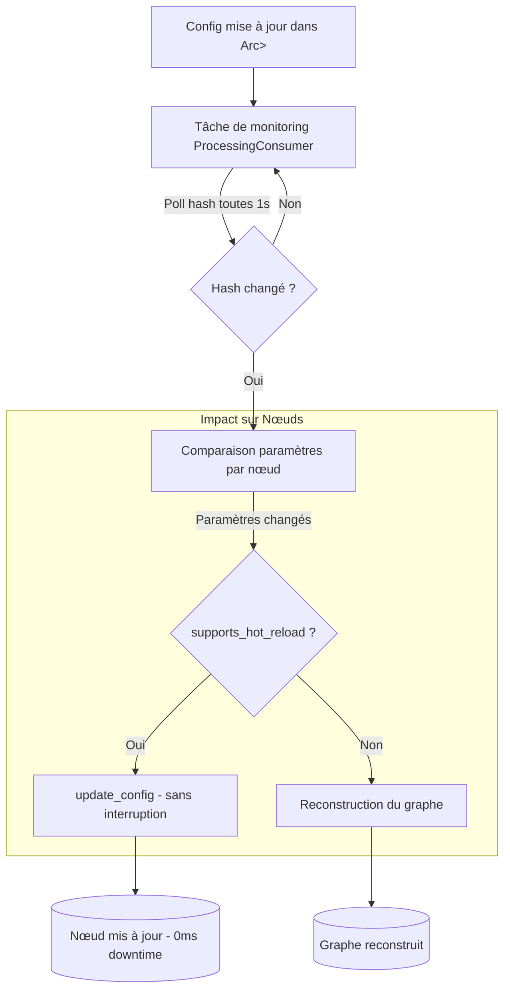
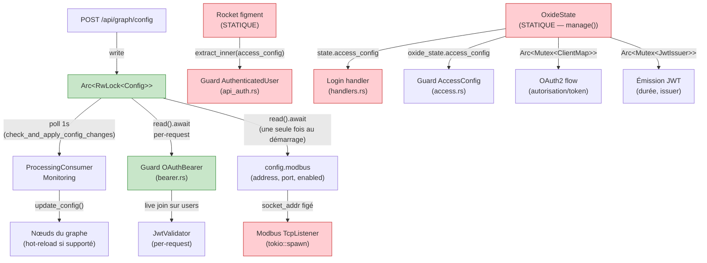

# Audit pour l’introduction d’une configuration dynamique dans `rust-photoacoustic`

## Objectif

Permettre la mise à jour dynamique de la configuration de nœuds de traitement via un endpoint `POST /api/graph/config` (Rocket), avec :
- Validation des paramètres de nœud via le trait `ProcessingNode::update_config()`
- Injection des nouveaux paramètres dans le `Arc<tokio::sync::RwLock<Config>>` partagé
- Détection automatique des changements par la tâche de monitoring du `ProcessingConsumer`
- Analyse des impacts sur les démons/services et la gestion de la propagation côté nœuds
---

## 🚀 Mises à Jour Récentes - Configuration Dynamique Étendue

**Date de mise à jour** : 15 juin 2025

### ✅ Nouvelles Fonctionnalités Implémentées : Hot-Reload des Filtres Numériques

**Filtres avec Hot-Reload Entièrement Supporté** :

1. **LowpassFilter** - Paramètres : `cutoff_freq`, `sample_rate`, `order`
2. **HighpassFilter** - Paramètres : `cutoff_freq`, `sample_rate`, `order`
3. **BandpassFilter** - Paramètres : `center_freq`, `bandwidth`, `sample_rate`, `order`
4. **FilterNode** - Paramètre : `target_channel` (ChannelA, ChannelB, Both)

**Nœuds avec Hot-Reload Entièrement Supporté** (mis à jour) :

1. **GainNode** - Gain en décibels (`gain_db`)
2. **ChannelSelectorNode** - Sélection de canal (`target_channel`)  
3. **ChannelMixerNode** - Stratégie de mixage (`mix_strategy`)
4. **FilterNode** - **ENTIÈREMENT IMPLÉMENTÉ ✅** 
   - **Canalisation** : `target_channel` (ChannelA, ChannelB, Both)
   - **Filtres numériques** : Tous paramètres avec validation complète
     - **LowpassFilter/HighpassFilter** : `cutoff_freq`, `sample_rate`, `order`
     - **BandpassFilter** : `center_freq`, `bandwidth`, `sample_rate`, `order`

**Nœuds avec Infrastructure Préparée** :
5. **DifferentialNode** - Infrastructure `update_config()` en place, en attente de paramètres configurables

**Impact Global** :
- **4 nœuds entièrement hot-reloadables** dans le ProcessingGraph (vs 0 précédemment)
- **3 types de filtres numériques hot-reloadables** avec validation complète des paramètres
- **Validation robuste** : fréquences < Nyquist, ordre > 0, ordre pair pour bandpass
- **Recalcul automatique des coefficients** pour BandpassFilter après mise à jour
- **Propagation via trait Filter** : Interface uniforme pour tous les filtres
- **FilterNode complet** : `target_channel` + propagation aux filtres sous-jacents
- **Base architecturale solide** pour étendre le hot-reload à d'autres nœuds
- **Pattern validé** : `update_config()` + validation + gestion d'erreurs + recalcul de coefficients

### 📈 Impact sur la Configuration Dynamique

1. **Quatre nœuds avec hot-reload complet dans le ProcessingGraph** (vs 0 précédemment) :
   - **4 nœuds entièrement hot-reloadables** : GainNode, ChannelSelectorNode, ChannelMixerNode, **FilterNode ✅**
   - **3 filtres hot-reloadables** : LowpassFilter, HighpassFilter, BandpassFilter (via FilterNode)
   - **1 nœud avec infrastructure préparée** : DifferentialNode
2. **FilterNode entièrement implémenté** avec support complet des filtres numériques et propagation via trait Filter
3. **Réduction drastique des interruptions de service** pour les ajustements de traitement audio
4. **Architecture extensible** pour ajouter le hot-reload à d'autres nœuds
5. **Validation robuste du pattern** `update_config()` pour la configuration dynamique

---

## 1. Analyse de l’existant

### 1.1 Structure de la configuration

Le projet utilise une struct `Config` centrale, qui regroupe plusieurs sous-configurations :

```rust
pub struct Config {
    pub photoacoustic: PhotoacousticConfig,
    pub access: AccessConfig,
    pub processing: ProcessingConfig,
    pub generix: GenerixConfig,
    // ...
}
```
- Validation : chaque sous-struct implémente typiquement des méthodes de validation (ex : `validate()`).
- Chargement YAML + validation JSON schema.
- Utilisée à travers le projet dans un `Arc<RwLock<Config>>`.

Voir [mod.rs](https://github.com/sctg-development/rust-photoacoustic/blob/main/rust/src/config/mod.rs).

### 1.2 Utilisation dans le projet

- Lancement des démons avec :  
  ```rust
  let config = Config::from_file("config.yaml")?;
  let config_arc = Arc::new(RwLock::new(config));
  daemon.launch(config_arc).await?;
  ```
- Le démon lit la config depuis l’`Arc<RwLock<Config>>` partagé.

### 1.3 Validation

- Pattern standard :  
  ```rust
  pub fn validate(&self) -> Result<()> { /* ... */ }
  ```
  [Exemple dans rust_patterns_guide.md](https://github.com/sctg-development/rust-photoacoustic/blob/main/rust/docs_conception_fr/rust_patterns_guide.md)

---

## 2. Stratégie d'Implémentation de la Configuration Dynamique

Cette section détaille la marche à suivre pour introduire la configuration dynamique de manière robuste.

### 2.1. Mise en Place de l'Endpoint API `/api/graph/config`

> **⚠️ Implémentation réelle** : L'endpoint implémenté est `POST /api/graph/config` (et non `/api/config`). Il accepte un `NodeConfig` (`id`, `node_type`, `parameters`) pour la mise à jour de nœuds individuels, pas un objet `Config` complet. Voir section 4.1 pour l'implémentation réelle.

   2.1.1. **Définir la Route Rocket** : Utiliser `#[openapi_protect_post("/api/graph/config", "admin:api", ...)]` avec le corps de requête `Json<NodeConfig>` (voir Section 4.1).
   2.1.2. **Injection des Dépendances** :
      - Injecter l'état partagé `config: &ConfigState` (`Arc<tokio::sync::RwLock<Config>>`).
      - Injecter `shared_state: &State<SharedVisualizationState>` pour accéder au graphe en cours.

### 2.2. Réception et Validation de la Configuration
   2.2.1. **Désérialisation** : Rocket et Serde gèrent la désérialisation du JSON entrant en un objet `NodeConfig` (contenant `id`, `node_type`, et `parameters`).
   2.2.2. **Validation Approfondie** :
      - Appeler `config_data.validate()` sur l'objet `Config` désérialisé.
      - S'assurer que cette méthode `validate()` est exhaustive et couvre :
         - **Validation syntaxique/structurelle** (généralement assurée par Serde et le typage fort de Rust).
         - **Validation sémantique** (ex : plages de valeurs, formats spécifiques, conditions logiques).
         - **Validation des inter-dépendances** entre différentes sections de la configuration.
   2.2.3. **Gestion des Erreurs de Validation** :
      - En cas d'échec de `config_data.validate()`, retourner une réponse `Status::BadRequest` (HTTP 400).
      - Le corps de la réponse d'erreur doit être clair et informatif, idéalement un JSON structuré indiquant les champs invalides et les raisons (ex: `Custom(Status::BadRequest, json!({"error": "Validation failed", "details": validation_errors}))`).

### 2.3. Mise à Jour Atomique de la Configuration Partagée
   2.3.1. **Acquisition du Verrou en Écriture** : Obtenir un verrou exclusif en écriture. Le projet utilise `tokio::sync::RwLock` (asynchrone), pas `std::sync::RwLock`. **Important** : `tokio::sync::RwLock` ne supporte pas le concept de `PoisonError` — il n'y a pas d'empoisonnement de lock en cas de panique dans un autre task.
      ```rust
      let mut config_write = config.inner().write().await;
      ```
   2.3.2. **Mise à Jour des Paramètres** : Pour `POST /api/graph/config`, on fusionne les nouveaux paramètres dans la configuration du nœud concerné (pas de remplacement global de `Config`).
   2.3.3. **Libération du Verrou** : Le verrou est automatiquement relâché à la fin de la portée (drop). Garder la portée aussi courte que possible.

### 2.4. Gestion de l'Impact sur les Services et Démons
   Cette étape s'appuie sur le mécanisme de monitoring intégré au `ProcessingConsumer` et les analyses de `AUDIT_IMPACT_RELOAD_DAEMON.md`.

> **⚠️ Architecture réelle** : Il n'existe pas de composant `DaemonManager` dans le code. Le mécanisme de hot-reload est assuré par `ProcessingConsumer::start_config_monitoring()`, qui démarre une tâche asynchrone (`tokio::spawn`) au lancement du consumer. Cette tâche poll le `Arc<tokio::sync::RwLock<Config>>` toutes les **1 seconde** via `check_and_apply_config_changes()`, compare les hashes de configuration, détecte les paramètres modifiés nœud par nœud, et appelle `node.update_config(new_params)` directement.

   2.4.1. **Identification des Changements Pertinents**:
      - La tâche de monitoring calcule un hash de `processing.default_graph` à chaque cycle.
      - Si le hash change, elle compare les paramètres de chaque nœud individuellement avec leur valeur précédente (stockée dans `last_node_parameters`).
      - Seuls les nœuds dont les paramètres ont effectivement changé reçoivent un appel `update_config()`.

   2.4.2. **Analyse d'Impact par Composant**:
      - La tâche consulte `node.supports_hot_reload()` (via le graphe en mémoire) et `node.update_config()` pour chaque nœud modifié.
      - Se référer aux conclusions de `AUDIT_IMPACT_RELOAD_DAEMON.md` pour les autres services (acquisition, modbus, web).

   2.4.3. **Détection automatique — pas de notification explicite**:
      - Après la mise à jour du `Arc<tokio::sync::RwLock<Config>>` par `POST /api/graph/config`, aucune notification n'est envoyée.
      - La tâche de monitoring du `ProcessingConsumer` détecte le changement lors de son prochain cycle (au plus 1 seconde de délai).
      - Les nœuds supportant le hot-reload (`supports_hot_reload() == true`) sont mis à jour sans interruption.
      - Les nœuds nécessitant une reconstruction déclenchent un rebuild du graphe de traitement.

   2.4.4. **Documentation des Comportements**:
      - Maintenir à jour `AUDIT_IMPACT_RELOAD_DAEMON.md` et la documentation utilisateur pour refléter quels changements de configuration entraînent un hot-reload, un redémarrage, ou n'ont pas d'effet immédiat.

### 2.5. Propagation aux Nœuds Distribués (Si Applicable)
   Si le système `rust-photoacoustic` opère en mode cluster ou distribué où les nœuds ne partagent pas directement le même `Arc<RwLock<Config>>`:
   2.5.1. **Stratégie de Propagation**:
      - **Push (Pub/Sub)**: Le nœud central publie la nouvelle configuration (ou un delta) sur un topic auquel les nœuds esclaves sont abonnés (ex: via MQTT, NATS, Redis Pub/Sub).
      - **Pull (Polling)**: Les nœuds esclaves interrogent périodiquement un endpoint sur le nœud central pour obtenir la dernière version de la configuration.
      - **Notification Push + Pull**: Le nœud central envoie une notification légère de changement, et les esclaves tirent la configuration complète.
   2.5.2. **Implémentation**: Mettre en place le mécanisme choisi après la mise à jour locale réussie.
   2.5.3. **Cohérence et Gestion des Erreurs**: Gérer les accusés de réception, les erreurs de propagation, et les stratégies de retry. Définir le comportement en cas d'incapacité d'un nœud à appliquer la nouvelle configuration.

### 2.6. Réponse API et Journalisation
   2.6.1. **Réponse de Succès**: En cas de succès complet (validation, écriture dans `Arc<RwLock<Config>>`), retourner les paramètres fusionnés (`Json<serde_json::Value>`).
   2.6.2. **Journalisation (Logging)**:
      - Journaliser l'événement de mise à jour de configuration (succès ou échec), incluant l'initiateur (si authentifié) et un résumé des changements ou un ID de version de la config.
      - La tâche de monitoring du `ProcessingConsumer` journalise les actions de hot-reload (quels nœuds mis à jour, lesquels nécessitent une reconstruction).

### 2.7. Considérations Spécifiques pour le ProcessingGraph et les Nœuds

Le `ProcessingGraph` contient différents types de nœuds de traitement, chacun avec ses propres paramètres configurables. L'audit détaillé de chaque type de nœud est couvert dans `AUDIT_PROCESSINGGRAPH_NODES_HOT_RELOAD.md`, mais voici les points clés pour la configuration dynamique :

#### 2.7.1. **Nœuds avec Configuration Dynamique Entièrement Supportée** ✅

**GainNode** - Le **premier nœud du ProcessingGraph à supporter entièrement la configuration dynamique** :
- **Paramètre Configurable** : `gain_db` (gain en décibels)
- **Impact sur la Configuration Dynamique** : ✅ **Aucun redémarrage requis** - Les changements sont appliqués immédiatement

**ChannelSelectorNode** - **Sélection de canal dynamique** :
- **Paramètre Configurable** : `target_channel` (ChannelA ou ChannelB)
- **Impact sur la Configuration Dynamique** : ✅ **Aucun redémarrage requis** - Changement instantané du canal sélectionné

**ChannelMixerNode** - **Stratégie de mixage dynamique** :
- **Paramètre Configurable** : `mix_strategy` (Add, Subtract, Average, ou Weighted)
- **Impact sur la Configuration Dynamique** : ✅ **Aucun redémarrage requis** - Changement instantané de la stratégie de mixage

**Mécanisme de Hot-Reload commun** :
- Implémente la méthode `update_config()` du trait `ProcessingNode`
- Thread-safe et sans interruption de service
- Validation des paramètres avec gestion d'erreurs appropriée

#### 2.7.2. **Nœuds avec Infrastructure Préparée** ⚠️

**DifferentialNode** - **Infrastructure préparée pour futures améliorations** :
- **État actuel** : Méthode `update_config()` implémentée mais retourne `false`
- **Raison** : Pas de paramètres configurables dans l'implémentation actuelle (`SimpleDifferential`)
- **Potentiel futur** : Support de différents calculateurs (weighted, adaptive) avec paramètres configurables
- **Impact** : ⚠️ **Reconstruction de nœud requise** pour tout changement actuellement

**Exemples de configuration JSON pour les nœuds hot-reloadables** :
```json
{
  "processing": {
    "default_graph": {
      "nodes": [
        {
          "id": "gain_amplifier",
          "type": "GainNode",
          "parameters": {
            "gain_db": 12.0  // ← Modifiable dynamiquement
          }
        },
        {
          "id": "channel_selector",
          "type": "ChannelSelectorNode", 
          "parameters": {
            "target_channel": "ChannelA"  // ← Modifiable dynamiquement (ChannelA/ChannelB)
          }
        },
        {
          "id": "channel_mixer",
          "type": "ChannelMixerNode",
          "parameters": {
            "mix_strategy": "Average"  // ← Modifiable dynamiquement
            // ou: { "a_weight": 0.7, "b_weight": 0.3 } pour Weighted
          }
        },
        {
          "id": "bandpass_filter",
          "type": "FilterNode",
          "parameters": {
            "filter_type": "BandpassFilter",
            "center_freq": 1000.0,     // ← Modifiable dynamiquement
            "bandwidth": 100.0,        // ← Modifiable dynamiquement  
            "order": 4,                // ← Modifiable dynamiquement (doit être pair)
            "sample_rate": 44100,      // ← Modifiable dynamiquement
            "target_channel": "Both"   // ← Modifiable dynamiquement (ChannelA/ChannelB/Both)
          }
        },
        {
          "id": "lowpass_filter", 
          "type": "FilterNode",
          "parameters": {
            "filter_type": "LowpassFilter",
            "cutoff_freq": 5000.0,     // ← Modifiable dynamiquement
            "order": 2,                // ← Modifiable dynamiquement
            "sample_rate": 44100,      // ← Modifiable dynamiquement
            "target_channel": "ChannelA" // ← Modifiable dynamiquement
          }
        }
      ]
    }
  }
}
```

**Propagation des changements (exemple avec tous les nœuds hot-reloadables)** :
1. L'API `POST /api/graph/config` reçoit un `NodeConfig` avec les nouveaux paramètres du nœud
2. Les paramètres sont validés (types, clés existantes) et fusionnés dans `config.processing.default_graph.nodes`
3. Le `Arc<tokio::sync::RwLock<Config>>` est mis à jour atomiquement
4. La tâche de monitoring de `ProcessingConsumer` détecte le changement de hash (dans ≤ 1 seconde)
5. Le `ProcessingConsumer` appelle `node.update_config(new_parameters)` pour chaque nœud dont les paramètres ont changé :
   - **GainNode** : Met à jour `gain_db` de manière thread-safe
   - **ChannelSelectorNode** : Change `target_channel` instantanément
   - **ChannelMixerNode** : Modifie `mix_strategy` sans interruption
   - **FilterNode** : ✅ **Met à jour `target_channel` ET propage les paramètres aux filtres sous-jacents**
     - **BandpassFilter** : `center_freq`, `bandwidth`, `order`, `sample_rate` avec recalcul automatique des coefficients
     - **LowpassFilter/HighpassFilter** : `cutoff_freq`, `order`, `sample_rate`
6. Les nouveaux échantillons audio sont traités avec les nouveaux paramètres

#### 2.7.3. Autres Nœuds du ProcessingGraph

- **FilterNode** : **ENTIÈREMENT SUPPORTÉ ✅** - Hot-reload complet pour tous les paramètres des filtres individuels (`cutoff_freq`, `center_freq`, `bandwidth`, `order`, `sample_rate`) + `target_channel` avec propagation via trait Filter 
- **RecordNode, etc.** : Support partiel ou aucun support de hot-reload selon le paramètre modifié
- **Modifications structurelles** : Ajout/suppression de nœuds ou modification des connexions nécessitent une reconstruction complète du graphe

#### 2.7.4. Stratégie de Gestion pour le ProcessingGraph

```rust
// Mécanisme réel : tâche de monitoring dans ProcessingConsumer (simplifié)
impl ProcessingConsumer {
    async fn check_and_apply_config_changes(config: &Arc<RwLock<Config>>, ...) -> Result<bool> {
        let graph_config = &new_config.processing.default_graph;
        
        // 1. Analyser les changements
        for (node_id, new_node_config) in &graph_config.nodes {
            if let Some(existing_node) = self.graph.get_node_mut(node_id) {
                // 2. Tenter le hot-reload pour les nœuds qui le supportent
                match existing_node.update_config(&new_node_config.parameters) {
                    Ok(true) => {
                        debug!("Hot-reload successful for node {}", node_id);
                        // ✅ GainNode prend ce chemin
                    }
                    Ok(false) => {
                        debug!("Node {} doesn't support hot-reload for these parameters", node_id);
                        // Marquer pour reconstruction
                    }
                    Err(e) => {
                        warn!("Hot-reload failed for node {}: {}", node_id, e);
                        // Marquer pour reconstruction
                    }
                }
            }
        }
        
        // 3. Reconstruire les nœuds qui ne supportent pas le hot-reload
        // (seulement si nécessaire)
        
        Ok(())
    }
}
```
---

## 3. Exemple d’implémentation

### 3.1 Diagramme d’architecture (mémoire partagée)
```mermaid
graph TD
    USER[Utilisateur/Admin API] -- JSON NodeConfig --> API[POST /api/graph/config]
    API --> |1. Valide NodeConfig| VALIDATOR{Validation type+clés}
    VALIDATOR -- OK --> |2. Fusionne params| RWLOCK[Arc<tokio::sync::RwLock<Config>>]
    VALIDATOR -- Erreur --> API
    API -- JSON params fusionnés --> USER
    RWLOCK --> |Lecture directe| DAEMON1[Daemon Acquisition]
    RWLOCK --> |Lecture directe| DAEMON2[Daemon Modbus]
    RWLOCK --> |Lecture directe| WEB[Serveur Web]
    RWLOCK --> |Poll toutes 1s| MONITOR[ProcessingConsumer::start_config_monitoring]
    MONITOR --> |update_config| NODE1[Nœud hot-reloadable]
    MONITOR --> |rebuild graph| NODE2[Nœud non hot-reloadable]
    classDef changed fill:#f9dbaf
    class API,RWLOCK,MONITOR,VALIDATOR changed
```

### 3.2 Gestion du hot-reload des nœuds (via ProcessingConsumer)

> **Note** : Il n'existe pas de `DaemonManager` dans le code. Le diagramme ci-dessous reflète l'architecture réelle.


```mermaid
graph TD
    EVENT_CONFIG_UPDATE[Config mise à jour dans Arc<tokio::sync::RwLock<Config>>] --> MONITOR[Tâche de monitoring ProcessingConsumer]
    MONITOR --> |Poll hash toutes 1s| HASH_CHECK{Hash changé ?}
    HASH_CHECK -- Non --> MONITOR
    HASH_CHECK -- Oui --> DIFF[Comparaison paramètres par nœud]
    
    subgraph Impact sur Nœuds
        DIFF --> |Paramètres changés| NODE_CHECK{supports_hot_reload ?}
        NODE_CHECK -- Oui --> HOT_RELOAD[update_config - sans interruption]
        NODE_CHECK -- Non --> REBUILD[Reconstruction du graphe]
    end

    HOT_RELOAD --> NODE_UPDATED[(Nœud mis à jour - 0ms downtime)]
    REBUILD --> GRAPH_REBUILT[(Graphe reconstruit)]
```
---
## 4. Exemples de code

### 4.1 Route Rocket réelle : `POST /api/graph/config`

L'implémentation réelle se trouve dans `rust/src/visualization/api/graph/graph.rs`. Elle accepte un `NodeConfig` (pas un `Config` complet) et fusionne les paramètres dans la configuration existante du nœud :

```rust
// Signature réelle (simplifiée depuis graph.rs)
#[openapi_protect_post("/api/graph/config", "admin:api", tag = "Processing", data = "<new_config>")]
pub async fn post_node_config(
    config: &ConfigState,                          // Arc<tokio::sync::RwLock<Config>>
    shared_state: &State<SharedVisualizationState>, // pour accéder au graphe en cours
    new_config: Json<NodeConfig>,                  // { id, node_type, parameters }
) -> Result<Json<serde_json::Value>, status::BadRequest<String>> {

    let node_id = new_config.id.clone();

    // 1. Vérifier que le graphe est actif et que le nœud existe
    match shared_state.get_processing_graph().await {
        Some(graph) => {
            match graph.nodes.iter().find(|n| n.id == node_id) {
                Some(node) if node.supports_hot_reload => {
                    // 2. Mise à jour atomique de la config (tokio RwLock, pas de PoisonError)
                    let mut config_write = config.inner().write().await;

                    // 3. Trouver le nœud dans config.processing.default_graph.nodes
                    if let Some(node_config) = config_write
                        .processing.default_graph.nodes
                        .iter_mut().find(|n| n.id == node_id)
                    {
                        // 4. Valider les types et fusionner les paramètres (merge, pas remplacement)
                        // Validation: type mismatch et clés inconnues sont refusés (400 Bad Request)
                        merge_and_validate_params(node_config, &new_config.parameters)?;

                        // 5. Aucune notification explicite nécessaire :
                        // ProcessingConsumer::start_config_monitoring() détecte le changement
                        // automatiquement dans ≤ 1 seconde via hash polling.
                        info!("Updated configuration for node '{}' — hot-reload pending", node_id);
                        Ok(Json(node_config.parameters.clone()))
                    } else {
                        Err(status::BadRequest(format!("Node '{}' not found in configuration", node_id)))
                    }
                }
                Some(_) => Err(status::BadRequest(format!("Node '{}' does not support hot reloading", node_id))),
                None => Err(status::BadRequest(format!("Node '{}' not found in graph", node_id))),
            }
        }
        None => Err(status::BadRequest("No processing graph active".to_string())),
    }
}
```

### 4.2 Pattern côté thread/démon (pour hot-reload)

#### Option A: Relecture périodique ou à chaque opération

```rust
struct MyService {
    config: Arc<RwLock<Config>>,
    // ... autres états ...
}

impl MyService {
    async fn do_something_with_config(&self) {
        let config_guard = self.config.read().unwrap_or_else(|e| e.into_inner());
        let specific_value = config_guard.processing.some_parameter;
        // ... utiliser specific_value ...
    } // config_guard est relâché
}
```
**Avantage**: Simple. **Inconvénient**: Peut lire des données obsolètes entre les opérations, latence dans la prise en compte.

#### Option B: Utilisation d'un canal de notification (ex: `tokio::sync::watch`)

Le `DaemonManager` (ou un service dédié à la configuration) maintient un `tokio::sync::watch::Sender<RelevantConfigPart>`.
Les services s'abonnent via un `tokio::sync::watch::Receiver<RelevantConfigPart>`.

```rust
// Dans le DaemonManager ou service de config:
// sender: watch::Sender<ProcessingConfig>

// Dans MyService:
struct MyServiceRequiringProcessingConfig {
    // Garde une copie locale de la config pertinente, mise à jour sur notification
    current_processing_config: ProcessingConfig, 
    config_update_rx: watch::Receiver<ProcessingConfig>,
    // ...
}

impl MyServiceRequiringProcessingConfig {
    async fn run_loop(&mut self) {
        loop {
            tokio::select! {
                _ = tokio::time::sleep(Duration::from_secs(1)) => {
                    // Travail normal utilisant self.current_processing_config
                    println!("Doing work with threshold: {}", self.current_processing_config.threshold);
                }
                Ok(_) = self.config_update_rx.changed() => {
                    let new_config_part = self.config_update_rx.borrow().clone(); // Clone pour la stocker
                    println!("Processing config changed, updating local copy.");
                    self.current_processing_config = new_config_part;
                    // Potentiellement, réinitialiser/reconfigurer des états internes du service ici
                }
            }
        }
    }
}
```
**Avantage**: Réactif, évite la relecture constante du `RwLock` global. **Inconvénient**: Plus complexe, nécessite de découper la config ou d'avoir des canaux par section.

### 4.3 Exemple spécifique de hot-reload pour GainNode

```rust
// Exemple de mise à jour dynamique du GainNode via l'API de configuration
impl ProcessingGraph {
    pub async fn update_node_config(&mut self, node_id: &str, new_params: &serde_json::Value) -> Result<bool, ProcessingError> {
        if let Some(node) = self.nodes.get_mut(node_id) {
            match node.update_config(new_params) {
                Ok(true) => {
                    info!("Node {} configuration updated successfully via hot-reload", node_id);
                    Ok(true)
                }
                Ok(false) => {
                    warn!("Node {} does not support hot-reload for the provided parameters", node_id);
                    Ok(false)
                }
                Err(e) => {
                    error!("Failed to update configuration for node {}: {}", node_id, e);
                    Err(e)
                }
            }
        } else {
            Err(ProcessingError::NodeNotFound(node_id.to_string()))
        }
    }
}

// Mécanisme réel : ProcessingConsumer::check_and_apply_config_changes (simplifié)
impl ProcessingConsumer {
    async fn check_and_apply_config_changes(config: &Arc<RwLock<Config>>, ...) -> Result<bool> {
        // Vérifier si le graphe a changé via hash
        if current_hash != last_hash {
            // Analyser les changements nœud par nœud
            // Champ réel : processing.default_graph (pas graph_definition)
            for (node_id, new_node_config) in &new_config.processing.default_graph.nodes {
                if let Some(old_node_config) = old_config.processing.default_graph.nodes.get(node_id) {
                    // Vérifier si seuls les paramètres ont changé (pas le type de nœud)
                    if old_node_config.node_type == new_node_config.node_type {
                        // Tenter le hot-reload
                        match self.processing_consumer.update_node_config(node_id, &new_node_config.parameters).await {
                            Ok(true) => {
                                info!("✅ Hot-reload successful for {} ({})", node_id, new_node_config.node_type);
                                // Pour GainNode, on arrive ici !
                            }
                            Ok(false) => {
                                info!("⚠️  Node {} requires restart for these parameter changes", node_id);
                                // Marquer pour reconstruction partielle ou complète
                                self.schedule_processing_graph_rebuild().await?;
                                break;
                            }
                            Err(e) => {
                                error!("❌ Hot-reload failed for {}: {}", node_id, e);
                                // Fallback : reconstruction complète
                                self.restart_processing_consumer().await?;
                                return Ok(());
                            }
                        }
                    } else {
                        // Changement de type de nœud : reconstruction nécessaire
                        info!("Node {} type changed, full graph rebuild required", node_id);
                        self.restart_processing_consumer().await?;
                        return Ok(());
                    }
                }
            }
        }
        Ok(())
    }
}
```

**Scénarios de test pour les nœuds hot-reloadables** :

**GainNode** :
1. Configuration initiale : `GainNode` avec `gain_db: 0.0`
2. Requête API : `POST /api/graph/config` avec `{"id": "node_id", "node_type": "gain", "parameters": {"gain_db": 12.0}}`
3. Résultat : ✅ Nouveau gain appliqué dans ≤ 1 seconde

**ChannelSelectorNode** :
1. Configuration initiale : `ChannelSelectorNode` avec `target_channel: "ChannelA"`
2. Requête API : `POST /api/graph/config` avec `{"id": "node_id", "node_type": "channel_selector", "parameters": {"target_channel": "ChannelB"}}`
3. Résultat : ✅ Sélection de canal changée dans ≤ 1 seconde

**ChannelMixerNode** :
1. Configuration initiale : `ChannelMixerNode` avec `mix_strategy: "Add"`
2. Requête API : `POST /api/graph/config` avec `{"id": "node_id", "node_type": "channel_mixer", "parameters": {"mix_strategy": {"a_weight": 0.7, "b_weight": 0.3}}}`
3. Résultat : ✅ Stratégie de mixage mise à jour dans ≤ 1 seconde

**Résultats attendus pour tous** :
- ✅ Aucune interruption du traitement audio
- ✅ Changements détectés par la tâche de monitoring (≤ 1s) et appliqués aux prochains échantillons
- ✅ Logs de succès : `"ProcessingConsumer 'X': Hot-reload applied to node 'Y'"`
- ✅ Réponse API : HTTP 200 OK avec les paramètres fusionnés
- ⚠️ Format du corps : `NodeConfig` avec `id`, `node_type`, `parameters` — pas un `Config` complet
---
## 5. Points de Vigilance et Bonnes Pratiques

### 5.1. Validation Stricte et Multi-Niveaux
- La validation via `config.validate()` doit être la plus exhaustive possible.
- Envisager plusieurs couches de validation pour la configuration entrante :
    - **Syntaxique**: Assurée par Rocket/Serde pour le format JSON.
    - **Schéma/Type**: Assurée par la structure `Config` et le typage fort de Rust.
    - **Sémantique des Valeurs**: Les valeurs individuelles doivent être dans des plages acceptables, respecter des formats spécifiques (ex: expressions régulières valides, chemins existants si vérifiables au moment de la validation).
    - **Inter-dépendances Logiques**: Cohérence entre différentes sections ou champs (ex: si `feature_x.enabled = true`, alors `feature_x.parameter_y` doit être défini).
- **Objectif Principal**: Éviter à tout prix d'introduire une configuration invalide ou sémantiquement incorrecte dans le `Arc<RwLock<Config>>` partagé, car cela pourrait corrompre l'état du système ou causer des pannes.

### 5.2. Gestion du Verrouillage (`RwLock`)
- **Minimiser la Durée de Détention des Verrous**:
    - Le verrou en écriture (`write()`) doit être détenu le moins longtemps possible (typiquement, juste le temps de remplacer le pointeur `Config`). Les opérations longues (comme notifier les services) doivent se faire en dehors de la section critique du `write lock`.
    - Les verrous en lecture (`read()`) sont partagés mais peuvent affamer les écritures si trop nombreux ou trop longs.
- **Risque de Deadlock**: Soyez vigilant si des callbacks ou d'autres locks sont acquis/appelés pendant qu'un verrou sur la configuration est détenu, surtout lors de la notification des services.
- **Empoisonnement du Lock** :
    - Le projet utilise `tokio::sync::RwLock` (asynchrone), qui **ne supporte pas le concept de `PoisonError`** — contrairement à `std::sync::RwLock`. Une panique dans un autre task n'empoisonne pas le lock.
    - L'accès se fait avec `.await` : `config.write().await` ou `config.read().await`.
    - `unwrap_or_else(|e| e.into_inner())` est un pattern `std::sync` qui **ne s'applique pas** ici.
- **Contention**: Sous forte charge, de nombreux lecteurs accédant fréquemment à la configuration peuvent être ralentis par des écritures. Si la configuration est lue très fréquemment par un service, celui-ci peut cloner les parties pertinentes ou utiliser un canal `watch` (voir 4.2 Option B) pour réduire la contention sur le `RwLock` global.

### 5.3. Gestion des Erreurs et Atomicité des Mises à Jour
- **Réponses API Claires**: L'API `POST /api/graph/config` retourne les paramètres fusionnés en JSON (succès) ou une `BadRequest` avec message textuel (erreur de validation : type mismatch, clé inconnue, nœud inexistant, pas de hot-reload supporté).
- **Atomicité**: La mise à jour de la configuration dans `Arc<RwLock<Config>>` est atomique. Cependant, le processus global (validation, écriture, notification/redémarrage des services) ne l'est pas.
- **Gestion des Échecs Post-Mise à Jour**: Si la notification ou le redémarrage des services échoue *après* que la nouvelle configuration a été écrite dans `Arc<RwLock<Config>>`, le système peut se retrouver dans un état partiellement incohérent (config mise à jour, mais services pas tous en phase).
    - Journaliser ces erreurs de manière critique.
    - Envisager des mécanismes de "health check" pour les services après un rechargement de configuration.
    - Une stratégie de rollback (voir 5.8) peut être envisagée pour les cas graves.

### 5.4. Documentation Exhaustive
- **API `POST /api/graph/config`**: Le corps est un `NodeConfig` JSON (`id`, `node_type`, `parameters`). Requiert le scope `admin:api`. Retourne les paramètres fusionnés (200) ou une erreur 400/401/403. Documenter les cas d'erreur : nœud inexistant, type mismatch, hot-reload non supporté.
- **Paramètres de Configuration**: Pour chaque section et paramètre de la `Config`:
    - Son rôle, ses valeurs possibles, et les unités si applicable.
    - Quel(s) service(s) ou démon(s) il affecte directement.
    - Indiquer clairement si sa modification supporte le hot-reload, nécessite un redémarrage du service concerné, ou n'a d'effet qu'au prochain démarrage complet.
- **Maintenance des Audits**: Tenir à jour `AUDIT_IMPACT_RELOAD_DAEMON.md` et `AUDIT_PROCESSINGGRAPH_NODES_HOT_RELOAD.md` à mesure que le code évolue. **Note importante** : Le `GainNode` est maintenant entièrement hot-reloadable (✅), ce qui représente une amélioration significative par rapport aux analyses précédentes.

### 5.5. Impact sur les Performances et la Disponibilité
- **Lecture de Configuration**: La relecture fréquente de la configuration par de nombreux threads/services peut avoir un coût. Optimiser si cela devient un goulot d'étranglement (cf. 5.2 Contention).
- **Redémarrage de Services**: Le redémarrage de services peut entraîner une interruption temporaire de leur fonctionnalité spécifique ou une dégradation des performances globales.
    - Planifier les mises à jour de configuration critiques en conséquence (ex: pendant les heures creuses si possible).
    - Implémenter des redémarrages "gracieux" (graceful shutdown/restart) pour minimiser l'impact.

### 5.6. Sécurité de l'Endpoint de Configuration
- **Authentification et Autorisation**: L'endpoint `POST /api/graph/config` est protégé par `openapi_protect_post` avec le scope `admin:api`. Seuls les JWT Bearer valides avec ce scope sont acceptés. L'implémentation utilise `auth-macros` — ne pas ré-implémenter manuellement la vérification de scope.
- **Validation des Entrées (Sécurité)**: Au-delà de la validation fonctionnelle, valider les entrées pour prévenir les vulnérabilités si la configuration contient des chaînes qui pourraient être interprétées dangereusement (ex: chemins de fichiers menant à du path traversal, chaînes de formatage, etc.). Utiliser des types forts et des validateurs spécifiques.
- **HTTPS**: Utiliser HTTPS pour protéger la transmission de la configuration.

### 5.7. Tests Approfondis et Scénarios de Défaillance
- **Tests Unitaires**: Pour la logique de validation de la `Config` et de ses sous-structures.
- **Tests d'Intégration**:
    - Tester l'API de mise à jour `POST /api/graph/config` avec des `NodeConfig` valides et divers cas invalides (type mismatch, clé inconnue, nœud sans hot-reload).
    - Vérifier que les services réagissent correctement aux changements (hot-reload effectif, redémarrage correct).
    - Tester la gestion des locks et la prévention des deadlocks sous charge simulée.
- **Tests de Robustesse et de Défaillance**:
    - Que se passe-t-il si un service ne parvient pas à redémarrer ?
    - Que se passe-t-il si la configuration est valide mais sémantiquement problématique pour un service ?
    - Simuler des pannes partielles pendant le processus de mise à jour.

### 5.8. Stratégie de Rollback (Retour Arrière)
- Bien qu'une validation stricte doive prévenir la plupart des configurations erronées, envisager un mécanisme pour revenir rapidement à une configuration précédente connue et stable en cas de problème imprévu après le déploiement d'une nouvelle configuration.
- **Options**:
    - **Manuelle**: Stocker les N dernières configurations valides (ex: dans des fichiers versionnés, une base de données simple) et permettre à un administrateur de reposter une version antérieure.
    - **Automatisée (Complexe)**: Si des "health checks" post-mise à jour échouent de manière persistante, un système pourrait tenter de revenir à la dernière configuration stable. Ceci est complexe à mettre en œuvre correctement.
- La journalisation de l'ancienne et de la nouvelle configuration (ou de leurs hashs/versions) est une première étape utile.

---

## 6. Étude Hot-Reload : `AccessConfig` et `ModbusConfig`

Cette section analyse la faisabilité du hot-reload pour les deux sections de configuration qui n'appartiennent pas au graphe de traitement des signaux : la configuration d'accès utilisateur/OAuth2 (`AccessConfig`) et la configuration du serveur Modbus (`ModbusConfig`).

---

### 6.1. `ModbusConfig` — Analyse du Cycle de Vie

#### Structure

```rust
// rust/src/config/modbus.rs
pub struct ModbusConfig {
    pub enabled: bool,   // Active ou désactive le serveur Modbus
    pub port: u16,       // Port TCP d'écoute (défaut : 502)
    pub address: String, // Adresse IP de bind (défaut : "0.0.0.0")
}
```

#### Chemin d'exécution au démarrage

Dans `launch_daemon.rs`, la méthode `launch()` conditionne le démarrage au flag `enabled`, puis délègue à `start_modbus_server()` :

```rust
// launch_daemon.rs::launch()
if self.config.read().await.modbus.enabled {
    self.start_modbus_server().await?;
}

// launch_daemon.rs::start_modbus_server()
async fn start_modbus_server(&mut self) -> Result<()> {
    let config_read = self.config.read().await;
    let socket_addr_str = format!("{}:{}", config_read.modbus.address, config_read.modbus.port);
    drop(config_read); // Le lock est relâché immédiatement

    let running = self.running.clone();
    let computing_state = Arc::clone(&self.computing_state);

    let task = tokio::spawn(async move {
        let socket_addr: SocketAddr = socket_addr_str.parse().unwrap();
        let listener = TcpListener::bind(socket_addr).await?;  // ← bind unique
        let server = Server::new(listener);
        // ...
        while running.load(Ordering::SeqCst) {
            time::sleep(Duration::from_secs(1)).await;          // ← boucle de monitoring
        }
        server_handle.abort(); // arrêt sur signal
    });
    self.tasks.push(task);
}
```

**Points clés** :
1. `address` et `port` sont extraits en `String` et le lock est relâché **immédiatement**
2. `TcpListener::bind()` est appelé **une seule fois** dans le `tokio::spawn` — il n'y a aucune possibilité de re-bind sans arrêter le task
3. La boucle de monitoring contrôle l'arrêt via `Arc<AtomicBool>` — pas de relecture de config
4. Le serveur lui-même (`PhotoacousticModbusServer`) ne lit jamais `Config` pendant les requêtes Modbus — il n'accède qu'à `SharedComputingState`

#### Handler existant de changement de config

Le handler dans `launch_daemon.rs` (section monitoring) reconnaît déjà explicitement cette limitation :

```rust
"modbus" => {
    warn!("Modbus configuration changes require daemon restart to take effect");
}
```

#### Tableau de faisabilité

| Paramètre | Hot-reload possible ? | Raison |
|---|---|---|
| `enabled` | ❌ Non | Vérifié une seule fois dans `launch()` au démarrage |
| `port` | ❌ Non | Le `TcpListener::bind()` est appelé une seule fois dans `tokio::spawn` |
| `address` | ❌ Non | Idem — socket_addr_str extrait et figé avant le spawn |

#### Amélioration possible : Redémarrage partiel du serveur Modbus

Un hot-reload partiel est techniquement réalisable sans redémarrer le daemon complet. Il suffirait d'ajouter une méthode `restart_modbus_server()` dans `Daemon` :

```rust
// Pseudocode — amélioration possible dans launch_daemon.rs
pub async fn restart_modbus_server(&mut self) -> Result<()> {
    // 1. Signaler l'arrêt du task courant
    self.running.store(false, Ordering::SeqCst);

    // 2. Attendre que le task se termine (avec timeout de 5-7 secondes)
    if let Some(task) = self.tasks.last() {
        let _ = tokio::time::timeout(Duration::from_secs(7), task).await;
    }

    // 3. Réarmer le flag running
    self.running.store(true, Ordering::SeqCst);

    // 4. Re-spawn avec la nouvelle config (re-lecture du Arc<RwLock<Config>>)
    self.start_modbus_server().await
}
```

⚠️ **Caveat** : Le flag `running` est partagé avec tous les autres services. Il faudrait en pratique utiliser un `AtomicBool` dédié au serveur Modbus pour éviter d'interférer avec les autres démons.

**Latence de redémarrage estimée** : 5–7 secondes (timeout de shutdown gracieux déjà implémenté dans `start_modbus_server`).

---

### 6.2. `AccessConfig` — Analyse du Cycle de Vie

#### Structure

```rust
// rust/src/config/access.rs
pub struct AccessConfig {
    pub users: Vec<User>,           // Liste des utilisateurs (login, hash de mot de passe, permissions)
    pub clients: Vec<Client>,       // Clients OAuth2 (client_id, callbacks autorisées, scopes)
    pub duration: Option<i64>,      // Durée de vie des tokens JWT (heures)
    pub iss: Option<String>,        // Valeur du claim "iss" dans les JWT émis
}
```

#### Architecture d'authentification : trois guards, trois sources

L'architecture présente une asymétrie importante entre les guards d'authentification. Ils ne lisent pas tous la même source de configuration :

```
Arc<RwLock<Config>>   ←── POST /api/graph/config (écriture dynamique)
        │
        ├──→ OAuthBearer guard (bearer.rs)
        │         └─ lit config.read().await.access per-request  ✅ LIVE
        │
        └──→ (non utilisé par les autres guards)

Rocket figment (STATIQUE, figé au démarrage)
        │
        └──→ AuthenticatedUser guard (api_auth.rs → get_config_from_request)
                  └─ request.rocket().figment().extract_inner("access_config")  ❌ FIGÉ

OxideState (STATIQUE, figé au démarrage via manage())
        │
        ├──→ Login handler (handlers.rs:198)
        │         └─ &state.access_config  ❌ FIGÉ
        │
        ├──→ AccessConfig request guard (access.rs)
        │         └─ oxide_state.access_config.clone()  ❌ FIGÉ
        │
        └──→ ClientMap / JwtIssuer (oauth2/state.rs)
                  └─ construits depuis access_config au démarrage  ❌ FIGÉ
```

#### `OxideState::from_config()` — Construction à l'initialisation

La méthode `from_config()` est appelée **une seule fois** dans `build_rocket()` :

```rust
// builder.rs
let oxide_state = OxideState::from_config(&config).await;
rocket.manage(oxide_state)  // passsé à Rocket comme état statique
```

À l'intérieur de `from_config()` :

```rust
let access_config = config_read.access.clone(); // clone figé au démarrage

// ClientMap construit depuis access_config.clients
for client in &access_config.clients {
    client_map.push(Client::public(client.client_id, ...));
}

// JwtIssuer construit depuis access_config.duration + iss
jwt_issuer.with_issuer(access_config.iss.unwrap_or(...))
          .valid_for(chrono::Duration::hours(1));

OxideState {
    registrar: Arc::new(Mutex::new(ClientMap::from(client_map))),
    issuer:    Arc::new(Mutex::new(jwt_issuer)),
    access_config: access_config, // copie figée stockée dans Rocket state
    ...
}
```

**Conséquence directe** : Toute modification de `AccessConfig` via `POST /api/graph/config` est bien écrite dans `Arc<RwLock<Config>>`, mais elle n'est **pas propagée** vers `OxideState` ni vers le figment Rocket.

#### Le guard `OAuthBearer` est déjà partiellement hot-reload

Le guard `OAuthBearer` (utilisé pour les routes API protégées par des tokens OAuth2) lit **directement** depuis le `Arc<RwLock<Config>>` péer-request :

```rust
// bearer.rs::from_request()
let config_state = request.guard::<&State<Arc<RwLock<Config>>>>().await;
let config = config_state.read().await.clone(); // ← lecture LIVE
let access_config = config.access.clone();      // ← access_config LIVE

let validator = JwtValidator::new(Some(hmac_secret), rs256_public_key, access_config.clone());
validator.get_user_info(token, access_config.clone());
```

Et la méthode `get_user_info` effectue une **jointure à l'exécution** entre les claims du JWT et la liste d'utilisateurs courante :

```rust
// validator.rs::get_user_info()
let user = access_config.users.iter()
    .find(|u| u.user == claims.sub) // ← cherche dans la liste LIVE
    .ok_or_else(|| anyhow!("User not found"))?;

let permissions = user.permissions.clone(); // ← permissions LIVE (pas celles du token)
```

**Cela signifie** : Pour les routes protégées par `OAuthBearer`, les **permissions** d'un utilisateur existant et la **liste des utilisateurs valides** sont lues depuis la config dynamique. Un token JWT émis pour un utilisateur supprimé de la config sera immédiatement rejeté à la prochaine requête.

#### Tableau de faisabilité détaillé

| Paramètre | Guard `OAuthBearer` | Guard `AuthenticatedUser` | Login handler | ClientMap (OAuth flow) |
|---|---|---|---|---|
| `users` — authentification (hash) | ✅ Live (`Arc<RwLock>`) | ❌ Figment statique | ❌ `OxideState` figé | N/A |
| `users` — permissions | ✅ Live (jointure per-request) | ❌ Figment statique | N/A | N/A |
| `clients` — OAuth2 | N/A | N/A | N/A | ❌ `ClientMap` figé |
| `duration` — durée des tokens | N/A | N/A | N/A | ❌ `JwtIssuer` figé |
| `iss` — issuer | N/A | N/A | N/A | ❌ `JwtIssuer` figé |

#### Cas particulier : tokens JWT déjà émis

Les tokens JWT (HMAC-HS256 ou RSA-RS256) sont **auto-signés** et contiennent les claims au moment de l'émission :
- **Modification des permissions d'un utilisateur** : Les nouveaux tokens reflèteront les nouvelles permissions. Les tokens existants restent valides jusqu'à expiration MAIS, via `OAuthBearer`, les permissions retournées sont celles de la config courante (jointure live) — ce qui signifie que la révocation de permission est **immédiate** pour les routes utilisant `OAuthBearer`.
- **Suppression d'un utilisateur** : Via `OAuthBearer`, son token est immédiatement rejeté (user not found). Via `AuthenticatedUser`, son token reste valide jusqu'à expiration (figment statique).
- **Aucun mécanisme de révocation de token** n'est implémenté — une blacklist ou des tokens à courte durée de vie sont recommandés.

#### Voie d'amélioration : Unification vers `Arc<RwLock<Config>>`

Pour rendre le hot-reload cohérent entre tous les guards, il faudrait :

1. **Migrer `AuthenticatedUser`** : remplacer `get_config_from_request()` (lecture figment) par une lecture de `Arc<RwLock<Config>>` depuis le state Rocket, sur le même modèle que `OAuthBearer`.

2. **Migrer le login handler** : faire passer `OxideState.access_config` de `AccessConfig` (copie figée) à un `Arc<tokio::sync::RwLock<AccessConfig>>` partagé avec le `Arc<RwLock<Config>>` principal, ou lire depuis un `Arc<RwLock<Config>>` au moment du login.

3. **`ClientMap` et `JwtIssuer`** : nécessitent une reconstruction complète — soit via un `RwLock<OxideState>`, soit en exposant des méthodes de mise à jour sur `OxideState`. C'est le refactoring le plus complexe.

⚠️ Ce refactoring est **significatif** — il affecte le chemin d'authentification critique et doit être couvert par des tests approfondis avant déploiement.

---

### 6.3. Diagramme Comparatif des Mécanismes


```mermaid
flowchart TD
    API["POST /api/graph/config"] -->|write| RWL["Arc&lt;RwLock&lt;Config&gt;&gt;"]

    RWL -->|"poll 1s\n(check_and_apply_config_changes)"| PCM["ProcessingConsumer\nMonitoring"]
    PCM -->|"update_config()"| NODES["Nœuds du graphe\n(hot-reload si supporté)"]

    RWL -->|"read().await\nper-request"| OB["Guard OAuthBearer\n(bearer.rs)"]
    OB -->|"live join sur users"| JV["JwtValidator\n(per-request)"]

    FIGMENT["Rocket figment\n(STATIQUE)"] -->|"extract_inner(access_config)"| AU["Guard AuthenticatedUser\n(api_auth.rs)"]

    OXS["OxideState\n(STATIQUE — manage())"]
    OXS -->|"state.access_config"| LH["Login handler\n(handlers.rs)"]
    OXS -->|"oxide_state.access_config"| ACG["Guard AccessConfig\n(access.rs)"]
    OXS -->|"Arc&lt;Mutex&lt;ClientMap&gt;&gt;"| OF["OAuth2 flow\n(autorisation/token)"]
    OXS -->|"Arc&lt;Mutex&lt;JwtIssuer&gt;&gt;"| JI["Émission JWT\n(durée, issuer)"]

    MODBUSCFG["config.modbus\n(address, port, enabled)"]
    RWL -->|"read().await\n(une seule fois au démarrage)"| MODBUSCFG
    MODBUSCFG -->|"socket_addr figé"| MB["Modbus TcpListener\n(tokio::spawn)"]

    style RWL fill:#c8e6c9,stroke:#388e3c
    style FIGMENT fill:#ffcdd2,stroke:#c62828
    style OXS fill:#ffcdd2,stroke:#c62828
    style MB fill:#ffcdd2,stroke:#c62828
    style OB fill:#c8e6c9,stroke:#388e3c
    style AU fill:#ffcdd2,stroke:#c62828
    style LH fill:#ffcdd2,stroke:#c62828
```

**Légende** :
- 🟢 Vert : lit depuis `Arc<RwLock<Config>>` → réactif aux modifications dynamiques
- 🔴 Rouge : lit depuis une source figée (figment ou `OxideState`) → nécessite redémarrage

---

### 6.4. Résumé des Recommandations

| Composant | Statut actuel | Action recommandée | Complexité |
|---|---|---|---|
| Modbus `port`/`address` | ❌ Restart total requis | Ajouter `restart_modbus_server()` dans `Daemon` | Moyenne |
| Modbus `enabled` | ❌ Restart total requis | Idem + monitor le flag dans la boucle | Moyenne |
| `users` via `OAuthBearer` | ✅ Déjà hot-reloadable | Documenter, ajouter tests | Faible |
| `users` via `AuthenticatedUser` | ❌ Figment statique | Migrer vers `Arc<RwLock<Config>>` (modèle bearer.rs) | Faible |
| `users` login handler | ❌ `OxideState` figé | Lire depuis `Arc<RwLock<Config>>` au moment du login | Moyenne |
| `clients` OAuth2 | ❌ `ClientMap` figé | Reconstruire `OxideState` → `RwLock<OxideState>` | Élevée |
| `duration`/`iss` | ❌ `JwtIssuer` figé | Idem | Élevée |

