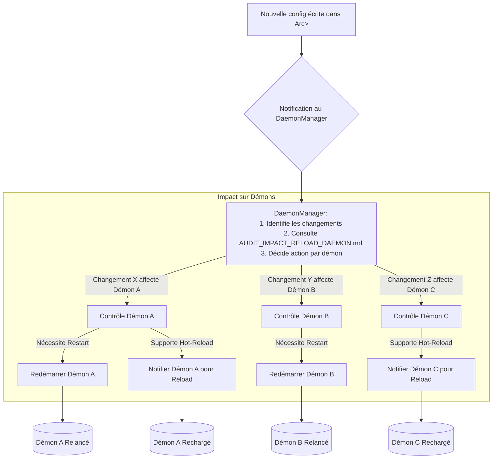

# Audit pour l’introduction d’une configuration dynamique dans `rust-photoacoustic`

## Objectif

Permettre la mise à jour dynamique de la configuration via un endpoint POST `/api/config` (Rocket), avec :
- Validation identique à l’objet `rustphotoacoustic::Config`
- Injection de la nouvelle config dans un `Arc<RwLock<Config>>` partagé
- Analyse des impacts sur les démons/services et la gestion de la propagation côté nœuds

---

## 1. Analyse de l’existant

### 1.1 Structure de la configuration

Le projet utilise une struct `Config` centrale, qui regroupe plusieurs sous-configurations :

```rust
pub struct Config {
    pub photoacoustic: PhotoacousticConfig,
    pub access: AccessConfig,
    pub processing: ProcessingConfig,
    pub generix: GenerixConfig,
    // ...
}
```
- Validation : chaque sous-struct implémente typiquement des méthodes de validation (ex : `validate()`).
- Chargement YAML + validation JSON schema.
- Utilisée à travers le projet dans un `Arc<RwLock<Config>>`.

Voir [mod.rs](https://github.com/sctg-development/rust-photoacoustic/blob/main/rust/src/config/mod.rs).

### 1.2 Utilisation dans le projet

- Lancement des démons avec :  
  ```rust
  let config = Config::from_file("config.yaml")?;
  let config_arc = Arc::new(RwLock::new(config));
  daemon.launch(config_arc).await?;
  ```
- Le démon lit la config depuis l’`Arc<RwLock<Config>>` partagé.

### 1.3 Validation

- Pattern standard :  
  ```rust
  pub fn validate(&self) -> Result<()> { /* ... */ }
  ```
  [Exemple dans rust_patterns_guide.md](https://github.com/sctg-development/rust-photoacoustic/blob/main/rust/docs_conception_fr/rust_patterns_guide.md)

---

## 2. Stratégie d'Implémentation de la Configuration Dynamique

Cette section détaille la marche à suivre pour introduire la configuration dynamique de manière robuste.

### 2.1. Mise en Place de l'Endpoint API `/api/config`
   2.1.1. **Définir la Route Rocket** : Utiliser `#[post("/api/config", data = "<config_data>")]` comme spécifié dans la section des exemples de code (voir Section 4.1).
   2.1.2. **Injection des Dépendances** :
      - Injecter l'état partagé `shared_config: &State<Arc<RwLock<Config>>>`.
      - Injecter un gestionnaire de démons `daemon_manager: &State<DaemonManager>` (si une gestion centralisée des redémarrages/reloads est adoptée).

### 2.2. Réception et Validation de la Configuration
   2.2.1. **Désérialisation** : Rocket et Serde gèrent la désérialisation du JSON entrant en un objet `Config`.
   2.2.2. **Validation Approfondie** :
      - Appeler `config_data.validate()` sur l'objet `Config` désérialisé.
      - S'assurer que cette méthode `validate()` est exhaustive et couvre :
         - **Validation syntaxique/structurelle** (généralement assurée par Serde et le typage fort de Rust).
         - **Validation sémantique** (ex : plages de valeurs, formats spécifiques, conditions logiques).
         - **Validation des inter-dépendances** entre différentes sections de la configuration.
   2.2.3. **Gestion des Erreurs de Validation** :
      - En cas d'échec de `config_data.validate()`, retourner une réponse `Status::BadRequest` (HTTP 400).
      - Le corps de la réponse d'erreur doit être clair et informatif, idéalement un JSON structuré indiquant les champs invalides et les raisons (ex: `Custom(Status::BadRequest, json!({"error": "Validation failed", "details": validation_errors}))`).

### 2.3. Mise à Jour Atomique de la Configuration Partagée
   2.3.1. **Acquisition du Verrou en Écriture** : Obtenir un verrou exclusif sur `shared_config.write()`. Gérer la possibilité d'un `PoisonError` si un thread précédent a paniqué en détenant le verrou.
      ```rust
      let mut config_guard = match shared_config.write() {
          Ok(guard) => guard,
          Err(poisoned) => {
              // Gérer l'erreur de "poisoning", potentiellement en restaurant un état sain ou en paniquant.
              // Pour une robustesse maximale, on pourrait tenter de récupérer les données.
              // Ici, on propage la panique pour simplifier, mais en production, une gestion plus fine est requise.
              poisoned.into_inner() 
          }
      };
      ```
   2.3.2. **Remplacement de la Configuration** : Assigner la nouvelle configuration (`config_data.into_inner()`) à `*config_guard`.
   2.3.3. **Libération du Verrou** : Le verrou est automatiquement relâché à la fin de la portée de `config_guard`. S'assurer que cette portée est aussi courte que possible.

### 2.4. Gestion de l'Impact sur les Services et Démons
   Cette étape est cruciale et s'appuie sur le `DaemonManager` et les analyses de `AUDIT_IMPACT_RELOAD_DAEMON.md`.

   2.4.1. **Identification des Changements Pertinents (Optionnel mais Recommandé)**:
      - Avant de remplacer la configuration dans le `RwLock` (ou juste après, en clonant l'ancienne config avant modification), il peut être utile de comparer l'ancienne et la nouvelle configuration.
      - Cela permet au `DaemonManager` de ne réagir qu'aux changements réels et d'identifier précisément quels services sont impactés. Nécessite que `Config` supporte `PartialEq` et potentiellement `Clone`.

   2.4.2. **Analyse d'Impact par Composant**:
      - Le `DaemonManager`, une fois notifié (voir 2.4.3), consultera (ou aura en interne) la logique pour :
         - Déterminer quels services/démons sont affectés par les sections modifiées de la configuration.
         - Se référer aux conclusions de `AUDIT_IMPACT_RELOAD_DAEMON.md` pour savoir si un hot-reload est possible ou si un redémarrage est inévitable pour chaque service affecté.

   2.4.3. **Notification et Orchestration via `DaemonManager`**:
      - Après la mise à jour réussie du `Arc<RwLock<Config>>`, appeler une méthode sur `daemon_manager`, par exemple `daemon_manager.notify_config_updated(old_config_opt, &*config_guard).await;`.
      - Responsabilités du `DaemonManager`:
         - **Redémarrage Sélectif**: Arrêter et redémarrer les services/démons qui ne supportent pas le hot-reload pour les changements spécifiques appliqués. Cela doit être fait de manière ordonnée pour gérer les dépendances.
         - **Notification pour Hot-Reload**: Pour les services capables de hot-reload, le `DaemonManager` pourrait leur envoyer un signal (ex: via un `tokio::sync::watch` channel, un `mpsc` channel, ou un simple flag atomique) pour les inciter à relire et appliquer les changements. Certains services pourraient simplement relire la config depuis l'`Arc<RwLock<Config>>` à chaque cycle/requête, rendant une notification explicite moins critique mais potentiellement moins réactive.

   2.4.4. **Documentation des Comportements**:
      - Maintenir à jour `AUDIT_IMPACT_RELOAD_DAEMON.md` et la documentation utilisateur pour refléter quels changements de configuration entraînent un hot-reload, un redémarrage, ou n'ont pas d'effet immédiat.

### 2.5. Propagation aux Nœuds Distribués (Si Applicable)
   Si le système `rust-photoacoustic` opère en mode cluster ou distribué où les nœuds ne partagent pas directement le même `Arc<RwLock<Config>>`:
   2.5.1. **Stratégie de Propagation**:
      - **Push (Pub/Sub)**: Le nœud central publie la nouvelle configuration (ou un delta) sur un topic auquel les nœuds esclaves sont abonnés (ex: via MQTT, NATS, Redis Pub/Sub).
      - **Pull (Polling)**: Les nœuds esclaves interrogent périodiquement un endpoint sur le nœud central pour obtenir la dernière version de la configuration.
      - **Notification Push + Pull**: Le nœud central envoie une notification légère de changement, et les esclaves tirent la configuration complète.
   2.5.2. **Implémentation**: Mettre en place le mécanisme choisi après la mise à jour locale réussie.
   2.5.3. **Cohérence et Gestion des Erreurs**: Gérer les accusés de réception, les erreurs de propagation, et les stratégies de retry. Définir le comportement en cas d'incapacité d'un nœud à appliquer la nouvelle configuration.

### 2.6. Réponse API et Journalisation
   2.6.1. **Réponse de Succès**: En cas de succès complet (validation, écriture, notification au `DaemonManager` initiée), retourner `Ok(Status::Ok)`.
   2.6.2. **Journalisation (Logging)**:
      - Journaliser l'événement de mise à jour de configuration (succès ou échec), incluant l'initiateur (si authentifié) et un résumé des changements ou un ID de version de la config.
      - Journaliser les actions entreprises par le `DaemonManager` (quels services redémarrés/notifiés).

---
## 3. Exemple d’implémentation

### 3.1 Diagramme d’architecture (mémoire partagée)
```mermaid
graph TD
    USER[Utilisateur/Admin API] -- JSON Config --> API[POST /api/config]
    API --> |1. Valide Config| VALIDATOR{Validation}
    VALIDATOR -- OK --> |2. Écrit| RWLOCK[Arc<RwLock<Config>>]
    VALIDATOR -- Erreur --> API
    API -- Réponse HTTP --> USER
    RWLOCK --> |Lecture directe| DAEMON1[Daemon Acquisition]
    RWLOCK --> |Lecture directe| DAEMON2[Daemon Modbus]
    RWLOCK --> |Lecture directe| WEB[Serveur Web]
    API --> |3. Notifie| MANAGER[DaemonManager]
    MANAGER --> |4. Analyse Impact & Action| DAEMON1
    MANAGER --> |4. Analyse Impact & Action| DAEMON2
    MANAGER --> |4. Analyse Impact & Action| WEB
    MANAGER -.-> |Redémarre si besoin| DAEMON1
    MANAGER -.-> |Notifie reload si supporté| WEB
    classDef changed fill:#f9dbaf
    class API,RWLOCK,MANAGER,VALIDATOR changed
```

### 3.2 Gestion du redémarrage des démons (via DaemonManager)

---
## 4. Exemples de code

### 4.1 Route Rocket complète
```rust
#[post("/api/config", data = "<new_config_json>")]
async fn update_config(
    new_config_json: rocket::serde::json::Json<Config>,
    shared_config: &State<Arc<RwLock<Config>>>,
    daemon_manager: &State<DaemonManager>, // Optionnel, selon l'architecture de notification
    // old_config_snapshot: &State<Arc<Mutex<Config>>> // Autre approche pour garder une copie de l'ancienne config
) -> Result<Status, Custom<rocket::serde::json::Value>> { // Retourner un JSON pour les erreurs
    
    let new_config = new_config_json.into_inner();

    // 1. Validation
    if let Err(e) = new_config.validate() { // Supposant que validate() retourne un type qui peut être sérialisé
        // Log l'erreur de validation e
        return Err(Custom(Status::BadRequest, rocket::serde::json::json!({
            "status": "error",
            "message": "Invalid configuration",
            "details": e.to_string() // ou une structure d'erreur plus détaillée
        })));
    }

    // Optionnel: Cloner l'ancienne configuration pour une comparaison détaillée par le DaemonManager
    // let old_config = shared_config.read().unwrap().clone(); // Nécessite Config: Clone

    // 2. Mise à jour de la config partagée
    {
        let mut config_guard = shared_config.write().unwrap_or_else(|e| e.into_inner());
        *config_guard = new_config; 
        // new_config est déplacée ici, config_guard la détient maintenant.
    } // Verrou en écriture relâché

    // 3. Notifier les services internes (ex: via DaemonManager)
    // Le DaemonManager pourrait avoir besoin de l'ancienne et de la nouvelle config pour une logique fine,
    // ou simplement être notifié qu'un changement a eu lieu et relire la nouvelle config lui-même.
    // if let Err(e) = daemon_manager.reload_services(/* &old_config, &*shared_config.read().unwrap() */).await {
    //     // Log l'erreur de notification/reload
    //     // Décider si cela doit résulter en une erreur API (potentiellement 500)
    //     return Err(Custom(Status::InternalServerError, rocket::serde::json::json!({
    //         "status": "error",
    //         "message": "Failed to reload services",
    //         "details": e.to_string()
    //     })));
    // }
    daemon_manager.notify_config_changed().await;


    Ok(Status::Ok)
}
```

### 4.2 Pattern côté thread/démon (pour hot-reload)

#### Option A: Relecture périodique ou à chaque opération

```rust
struct MyService {
    config: Arc<RwLock<Config>>,
    // ... autres états ...
}

impl MyService {
    async fn do_something_with_config(&self) {
        let config_guard = self.config.read().unwrap_or_else(|e| e.into_inner());
        let specific_value = config_guard.processing.some_parameter;
        // ... utiliser specific_value ...
    } // config_guard est relâché
}
```
**Avantage**: Simple. **Inconvénient**: Peut lire des données obsolètes entre les opérations, latence dans la prise en compte.

#### Option B: Utilisation d'un canal de notification (ex: `tokio::sync::watch`)

Le `DaemonManager` (ou un service dédié à la configuration) maintient un `tokio::sync::watch::Sender<RelevantConfigPart>`.
Les services s'abonnent via un `tokio::sync::watch::Receiver<RelevantConfigPart>`.

```rust
// Dans le DaemonManager ou service de config:
// sender: watch::Sender<ProcessingConfig>

// Dans MyService:
struct MyServiceRequiringProcessingConfig {
    // Garde une copie locale de la config pertinente, mise à jour sur notification
    current_processing_config: ProcessingConfig, 
    config_update_rx: watch::Receiver<ProcessingConfig>,
    // ...
}

impl MyServiceRequiringProcessingConfig {
    async fn run_loop(&mut self) {
        loop {
            tokio::select! {
                _ = tokio::time::sleep(Duration::from_secs(1)) => {
                    // Travail normal utilisant self.current_processing_config
                    println!("Doing work with threshold: {}", self.current_processing_config.threshold);
                }
                Ok(_) = self.config_update_rx.changed() => {
                    let new_config_part = self.config_update_rx.borrow().clone(); // Clone pour la stocker
                    println!("Processing config changed, updating local copy.");
                    self.current_processing_config = new_config_part;
                    // Potentiellement, réinitialiser/reconfigurer des états internes du service ici
                }
            }
        }
    }
}
```
**Avantage**: Réactif, évite la relecture constante du `RwLock` global. **Inconvénient**: Plus complexe, nécessite de découper la config ou d'avoir des canaux par section.

---
## 5. Points de Vigilance et Bonnes Pratiques

### 5.1. Validation Stricte et Multi-Niveaux
- La validation via `config.validate()` doit être la plus exhaustive possible.
- Envisager plusieurs couches de validation pour la configuration entrante :
    - **Syntaxique**: Assurée par Rocket/Serde pour le format JSON.
    - **Schéma/Type**: Assurée par la structure `Config` et le typage fort de Rust.
    - **Sémantique des Valeurs**: Les valeurs individuelles doivent être dans des plages acceptables, respecter des formats spécifiques (ex: expressions régulières valides, chemins existants si vérifiables au moment de la validation).
    - **Inter-dépendances Logiques**: Cohérence entre différentes sections ou champs (ex: si `feature_x.enabled = true`, alors `feature_x.parameter_y` doit être défini).
- **Objectif Principal**: Éviter à tout prix d'introduire une configuration invalide ou sémantiquement incorrecte dans le `Arc<RwLock<Config>>` partagé, car cela pourrait corrompre l'état du système ou causer des pannes.

### 5.2. Gestion du Verrouillage (`RwLock`)
- **Minimiser la Durée de Détention des Verrous**:
    - Le verrou en écriture (`write()`) doit être détenu le moins longtemps possible (typiquement, juste le temps de remplacer le pointeur `Config`). Les opérations longues (comme notifier les services) doivent se faire en dehors de la section critique du `write lock`.
    - Les verrous en lecture (`read()`) sont partagés mais peuvent affamer les écritures si trop nombreux ou trop longs.
- **Risque de Deadlock**: Soyez vigilant si des callbacks ou d'autres locks sont acquis/appelés pendant qu'un verrou sur la configuration est détenu, surtout lors de la notification des services.
- **Empoisonnement du Lock (`PoisonError`)**:
    - Un `unwrap()` sur `read()` ou `write()` provoquera une panique si un autre thread a paniqué alors qu'il détenait le verrou.
    - Pour une robustesse accrue, utiliser `try_read()`/`try_write()` ou gérer explicitement le `PoisonError` (ex: `read().unwrap_or_else(|e| e.into_inner())`) pour décider de la stratégie (paniquer, logger, tenter de restaurer un état par défaut).
- **Contention**: Sous forte charge, de nombreux lecteurs accédant fréquemment à la configuration peuvent être ralentis par des écritures. Si la configuration est lue très fréquemment par un service, celui-ci peut cloner les parties pertinentes ou utiliser un canal `watch` (voir 4.2 Option B) pour réduire la contention sur le `RwLock` global.

### 5.3. Gestion des Erreurs et Atomicité des Mises à Jour
- **Réponses API Claires**: L'API `/api/config` doit retourner des messages d'erreur clairs et structurés (JSON recommandé) indiquant la source et la nature du problème (validation, erreur interne).
- **Atomicité**: La mise à jour de la configuration dans `Arc<RwLock<Config>>` est atomique. Cependant, le processus global (validation, écriture, notification/redémarrage des services) ne l'est pas.
- **Gestion des Échecs Post-Mise à Jour**: Si la notification ou le redémarrage des services échoue *après* que la nouvelle configuration a été écrite dans `Arc<RwLock<Config>>`, le système peut se retrouver dans un état partiellement incohérent (config mise à jour, mais services pas tous en phase).
    - Journaliser ces erreurs de manière critique.
    - Envisager des mécanismes de "health check" pour les services après un rechargement de configuration.
    - Une stratégie de rollback (voir 5.8) peut être envisagée pour les cas graves.

### 5.4. Documentation Exhaustive
- **API `/api/config`**: Documenter le format JSON attendu, les détails d'authentification/autorisation, les codes de statut HTTP possibles et les formats de réponse (succès et erreur).
- **Paramètres de Configuration**: Pour chaque section et paramètre de la `Config`:
    - Son rôle, ses valeurs possibles, et les unités si applicable.
    - Quel(s) service(s) ou démon(s) il affecte directement.
    - Indiquer clairement si sa modification supporte le hot-reload, nécessite un redémarrage du service concerné, ou n'a d'effet qu'au prochain démarrage complet.
- **Maintenance des Audits**: Tenir à jour `AUDIT_IMPACT_RELOAD_DAEMON.md` et `AUDIT_PROCESSINGGRAPH_NODES_HOT_RELOAD.md` à mesure que le code évolue.

### 5.5. Impact sur les Performances et la Disponibilité
- **Lecture de Configuration**: La relecture fréquente de la configuration par de nombreux threads/services peut avoir un coût. Optimiser si cela devient un goulot d'étranglement (cf. 5.2 Contention).
- **Redémarrage de Services**: Le redémarrage de services peut entraîner une interruption temporaire de leur fonctionnalité spécifique ou une dégradation des performances globales.
    - Planifier les mises à jour de configuration critiques en conséquence (ex: pendant les heures creuses si possible).
    - Implémenter des redémarrages "gracieux" (graceful shutdown/restart) pour minimiser l'impact.

### 5.6. Sécurité de l'Endpoint de Configuration
- **Authentification et Autorisation**: L'endpoint `/api/config` est sensible. Il DOIT être protégé par des mécanismes d'authentification et d'autorisation robustes. Seuls les utilisateurs ou systèmes dument habilités (ex: administrateurs) devraient pouvoir y accéder.
- **Validation des Entrées (Sécurité)**: Au-delà de la validation fonctionnelle, valider les entrées pour prévenir les vulnérabilités si la configuration contient des chaînes qui pourraient être interprétées dangereusement (ex: chemins de fichiers menant à du path traversal, chaînes de formatage, etc.). Utiliser des types forts et des validateurs spécifiques.
- **HTTPS**: Utiliser HTTPS pour protéger la transmission de la configuration.

### 5.7. Tests Approfondis et Scénarios de Défaillance
- **Tests Unitaires**: Pour la logique de validation de la `Config` et de ses sous-structures.
- **Tests d'Intégration**:
    - Tester l'API de mise à jour `/api/config` avec des configurations valides et divers cas invalides.
    - Vérifier que les services réagissent correctement aux changements (hot-reload effectif, redémarrage correct).
    - Tester la gestion des locks et la prévention des deadlocks sous charge simulée.
- **Tests de Robustesse et de Défaillance**:
    - Que se passe-t-il si un service ne parvient pas à redémarrer ?
    - Que se passe-t-il si la configuration est valide mais sémantiquement problématique pour un service ?
    - Simuler des pannes partielles pendant le processus de mise à jour.

### 5.8. Stratégie de Rollback (Retour Arrière)
- Bien qu'une validation stricte doive prévenir la plupart des configurations erronées, envisager un mécanisme pour revenir rapidement à une configuration précédente connue et stable en cas de problème imprévu après le déploiement d'une nouvelle configuration.
- **Options**:
    - **Manuelle**: Stocker les N dernières configurations valides (ex: dans des fichiers versionnés, une base de données simple) et permettre à un administrateur de reposter une version antérieure.
    - **Automatisée (Complexe)**: Si des "health checks" post-mise à jour échouent de manière persistante, un système pourrait tenter de revenir à la dernière configuration stable. Ceci est complexe à mettre en œuvre correctement.
- La journalisation de l'ancienne et de la nouvelle configuration (ou de leurs hashs/versions) est une première étape utile.

---
