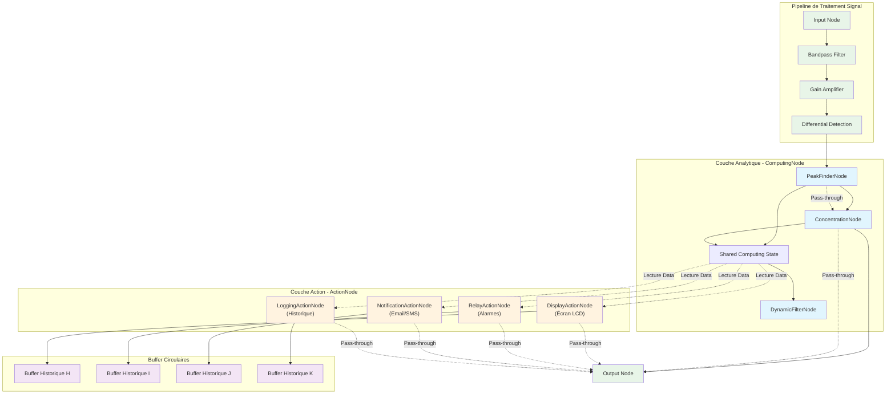
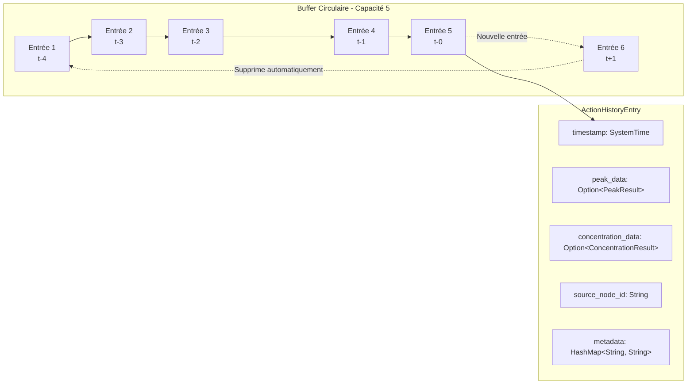
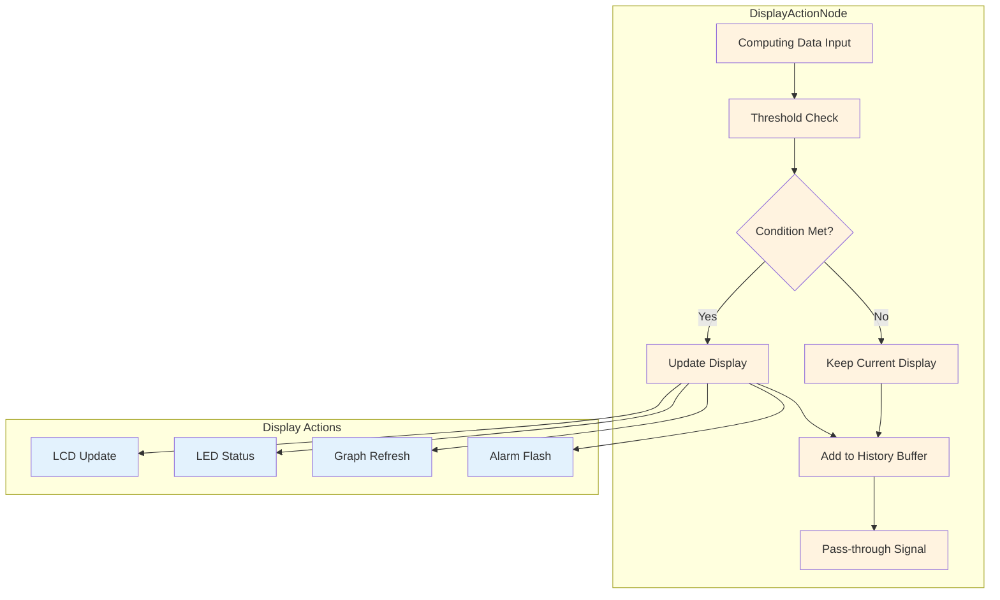
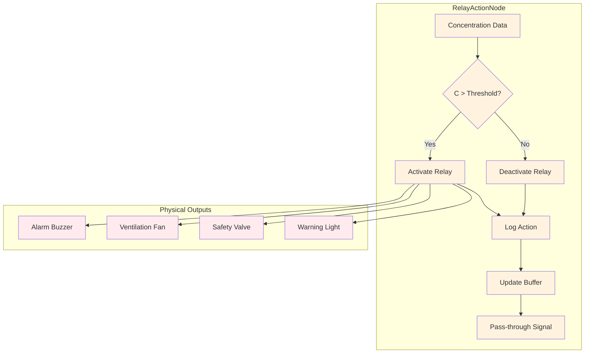
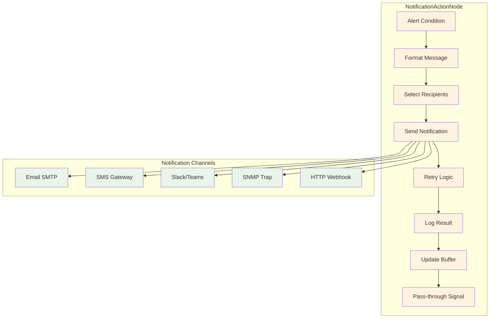

# Analyse de Faisabilité : Évolution de l'Architecture vers les ComputingNode

## Résumé Exécutif

Cette analyse étudie la faisabilité technique et la pertinence business d'une extension de l'architecture de traitement du signal photoacoustique par l'introduction d'un **type spécial de ProcessingNode : les ComputingNode**. Cette évolution vise à enrichir l'architecture existante avec des nœuds de calcul analytique qui transmettent les données inchangées tout en effectuant des calculs sur celles-ci, permettant l'implémentation d'algorithmes sophistiqués de détection de pics spectraux et de calcul de concentration par polynômes de quatrième degré.

**Statut** : ✅ **IMPLÉMENTÉ ET VALIDÉ** - L'architecture a été évoluée avec succès pour supporter **plusieurs instances de PeakFinderNode et ConcentrationNode simultanément**, chaque nœud étant identifié par un ID unique. Les résultats sont stockés dans une structure partagée utilisant un HashMap pour permettre l'accès individuel aux données de chaque nœud.

**Nouvelle Extension** : 🚀 **ACTIONNODE - TRAIT IMPLÉMENTÉ** ✅ - Extension de l'architecture vers des nœuds d'action spécialisés pour la gestion d'interfaces physiques (écrans, relais, notifications email) avec buffer circulaire configurable et liaison directe aux ComputingNode. Le trait ActionNode étend ProcessingNode avec des capacités de monitoring, triggers configurables et gestion d'historique.

**Recommandation** : ✅ **ARCHITECTURE COMPLÈTE** - Le système dispose maintenant d'une architecture en 3 couches (Signal Processing → Analytics → Actions) parfaitement intégrée. L'implémentation du trait ActionNode ouvre la voie aux nœuds d'action spécialisés tout en maintenant l'intégrité du pipeline de traitement signal.

---

## 1. Architecture Technique Actuelle

### 1.1 État des lieux du ProcessingGraph

L'analyse du code révèle une architecture modulaire robuste :

- **Trait ProcessingNode** : Interface unifiée pour tous les nœuds de traitement
- **ProcessingData** : Types de données standardisés transitant dans le graphe
- **Exécution séquentielle** : Ordre topologique des nœuds garantissant l'intégrité du flux
- **Gestion d'état partagé** : Système de registres (StreamingNodeRegistry) pour la coordination entre nœuds

### 1.2 Capacités existantes pertinentes

- **Shared State Management** : `SharedVisualizationState` et `StreamingNodeRegistry` démontrent la capacité du système à gérer des états partagés entre composants
- **Hot Reload** : Support de la reconfiguration dynamique des paramètres
- **Statistiques de performance** : Monitoring complet des performances par nœud
- **Sérialisation** : Capacité à exporter et synchroniser l'état du graphe

---

## 2. Conception des ComputingNode comme ProcessingNode Spécialisés

### 2.1 Héritage et spécialisation

Les ComputingNode sont des **ProcessingNode spécialisés** qui :
- **Implémentent le trait ProcessingNode** : Compatibilité totale avec l'architecture existante
- **Fonction pass-through** : Transmettent `ProcessingData` inchangé vers le nœud suivant
- **Calculs parallèles** : Effectuent des analyses sur les données transitantes
- **État partagé** : Publient leurs résultats dans un registre global accessible

#### Spécialisation du trait ProcessingNode - Multi-Instances Support
```rust
impl ProcessingNode for PeakFinderNode {
    fn process(&mut self, input: ProcessingData) -> Result<ProcessingData> {
        // 1. Analyser les données (calcul FFT, détection pic)
        if let Some(peak_info) = self.analyze_spectrum(&input)? {
            // 2. Créer le résultat avec horodatage
            let peak_result = PeakResult {
                frequency: peak_info.frequency,
                amplitude: peak_info.amplitude,
                concentration_ppm: None, // Calculé par ConcentrationNode si présent
                timestamp: SystemTime::now(),
            };
            
            // 3. Mettre à jour l'état partagé avec l'ID unique du nœud
            if let Ok(mut state) = self.shared_state.try_write() {
                state.update_peak_result(self.id.clone(), peak_result);
            }
        }
        
        // 4. Transmettre les données INCHANGÉES
        Ok(input)  // Pass-through complet
    }
    
    fn node_type(&self) -> &str { "computing_peak_finder" }
    
    /// Retourne l'ID unique de ce nœud
    fn get_id(&self) -> &str { &self.id }
}
```

**Capacités Multi-Nœuds Implémentées :**
- **Identification Unique** : Chaque `PeakFinderNode` possède un `id` unique
- **Stockage Individuel** : Les résultats sont stockés par ID dans le HashMap
- **Accès Concurrent** : Plusieurs nœuds peuvent mettre à jour l'état simultanément
- **Pas d'Interference** : Les calculs de chaque nœud sont indépendants

#### État partagé global - Architecture Multi-Nœuds
```rust
/// Result data from a peak finder node
#[derive(Debug, Clone)]
pub struct PeakResult {
    /// Detected peak frequency in Hz
    pub frequency: f32,
    /// Detected peak amplitude (normalized, 0.0 to 1.0)
    pub amplitude: f32,
    /// Concentration in parts per million (ppm) derived from frequency
    pub concentration_ppm: Option<f32>,
    /// Timestamp of when this peak was detected
    pub timestamp: SystemTime,
}

pub struct ComputingSharedData {
    /// Peak detection results from multiple nodes, keyed by node ID
    pub peak_results: HashMap<String, PeakResult>,
    
    // Legacy fields for backward compatibility
    pub peak_frequency: Option<f32>,
    pub peak_amplitude: Option<f32>,
    pub concentration_ppm: Option<f32>,
    pub polynomial_coefficients: [f64; 5], // a₀ + a₁x + a₂x² + a₃x³ + a₄x⁴
    pub last_update: SystemTime,
}

impl ComputingSharedData {
    /// Get peak result for a specific node ID
    pub fn get_peak_result(&self, node_id: &str) -> Option<&PeakResult> {
        self.peak_results.get(node_id)
    }

    /// Update peak result for a specific node ID
    pub fn update_peak_result(&mut self, node_id: String, result: PeakResult) {
        // Update the HashMap
        self.peak_results.insert(node_id.clone(), result.clone());
        
        // Update legacy fields for backward compatibility
        self.peak_frequency = Some(result.frequency);
        self.peak_amplitude = Some(result.amplitude);
        self.concentration_ppm = result.concentration_ppm;
        self.last_update = result.timestamp;
    }

    /// Get the most recent peak result across all nodes
    pub fn get_latest_peak_result(&self) -> Option<&PeakResult> {
        self.peak_results
            .values()
            .max_by_key(|result| result.timestamp)
    }

    /// Get all node IDs that have peak results
    pub fn get_peak_finder_node_ids(&self) -> Vec<String> {
        self.peak_results.keys().cloned().collect()
    }

    /// Check if a node has recent peak data (within last 30 seconds)
    pub fn has_recent_peak_data(&self, node_id: &str) -> bool {
        if let Some(result) = self.peak_results.get(node_id) {
            if let Ok(elapsed) = result.timestamp.elapsed() {
                elapsed.as_secs() < 30
            } else {
                false
            }
        } else {
            false
        }
    }
}

pub type SharedComputingState = Arc<RwLock<ComputingSharedData>>;
```

**Évolutions Clés Implémentées :**
- **Support Multi-Nœuds** : Plusieurs `PeakFinderNode` peuvent coexister avec des IDs uniques
- **Stockage par HashMap** : `peak_results` indexé par `node_id` permet l'accès individuel
- **Rétrocompatibilité** : Les champs legacy (`peak_frequency`, `peak_amplitude`) restent fonctionnels
- **Gestion Temporelle** : Horodatage et validation de fraîcheur des données par nœud
- **API Utilitaire** : Méthodes pour accéder aux résultats individuels ou collectifs

### 2.2 Intégration transparente dans le ProcessingGraph

#### Avantages de cette approche
- **Compatibilité totale** : Aucune modification du moteur ProcessingGraph
- **Insertion flexible** : ComputingNode peut s'insérer n'importe où dans le pipeline
- **Performance optimisée** : Pas de duplication de données, calculs en parallèle
- **Observabilité** : Statistiques de performance comme les autres ProcessingNode

#### Mécanisme de notification et accès partagé
- **Registre global ComputingStateRegistry** : Similaire à `StreamingNodeRegistry`
- **Accès non-bloquant** : Les ProcessingNode lisent les résultats via `try_read()`
- **Validation temporelle** : Horodatage pour éviter l'utilisation de données obsolètes
- **Pattern Observer** : Notifications optionnelles pour mise à jour en temps réel

---

## 3. Implémentations Proposées

### 3.1 PeakFinderNode (ComputingNode spécialisé) - Support Multi-Instances

#### Structure et fonctionnalités
```rust
pub struct PeakFinderNode {
    /// Unique identifier for this node - CRITIQUE pour le support multi-instances
    id: String,
    
    /// Shared state for communicating results to other nodes
    shared_state: SharedComputingState,
    
    /// FFT configuration and buffers
    fft_buffer: Vec<Complex<f32>>,
    fft_size: usize,
    sample_rate: u32,
    
    /// Detection parameters
    frequency_range: (f32, f32),  // Bande de recherche
    detection_threshold: f32,
    smoothing_factor: f32,
    
    /// Performance monitoring
    processing_count: u64,
    last_detection_time: Option<SystemTime>,
}

impl ProcessingNode for PeakFinderNode {
    fn process(&mut self, input: ProcessingData) -> Result<ProcessingData> {
        // Analyse spectrale sur les données
        if let Some(peak_info) = self.analyze_spectrum(&input)? {
            // Création du résultat avec ID unique
            let peak_result = PeakResult {
                frequency: peak_info.frequency,
                amplitude: peak_info.amplitude,
                concentration_ppm: None,
                timestamp: SystemTime::now(),
            };
            
            // Mise à jour de l'état partagé avec clé unique
            if let Ok(mut state) = self.shared_state.try_write() {
                state.update_peak_result(self.id.clone(), peak_result);
            }
        }
        
        // Transmission des données inchangées
        Ok(input)
    }
    
    fn node_type(&self) -> &str { "computing_peak_finder" }
}
```

**Nouveautés Multi-Instances :**
- **ID Obligatoire** : Chaque instance doit avoir un `id` unique lors de l'instanciation
- **Stockage Cloisonné** : Chaque nœud stocke ses résultats indépendamment
- **Configuration Individuelle** : Chaque instance peut avoir des paramètres différents
  - Bandes de fréquence distinctes (ex: 800-1200 Hz vs 1500-2000 Hz)
  - Seuils de détection adaptés à chaque signal
  - Facteurs de lissage optimisés par usage

#### Fonctionnalités étendues
- **Analyse spectrale FFT** : Détection automatique de la fréquence de résonance par instance
- **Algorithme de détection de pics** : Recherche du maximum local dans la bande configurée
- **Filtrage adaptatif** : Élimination des pics parasites par analyse de cohérence temporelle
- **Suivi temporel indépendant** : Moyenne glissante et historique par nœud
- **Validation croisée** : Possibilité de comparer les résultats entre instances

### 3.2 ConcentrationNode (ComputingNode spécialisé) - IMPLÉMENTATION COMPLÈTE

#### Architecture Multi-Instances avec Polynômes Individuels

**🎯 Objectifs Atteints :**
- ✅ **Instances Multiples** : Chaque ConcentrationNode a son propre ID unique
- ✅ **Polynômes Configurables** : Coefficients individuels par instance
- ✅ **Liaison Sélective** : Paramètre `computing_peak_finder_id` pour source spécifique
- ✅ **Hot-Reload** : Reconfiguration dynamique des polynômes sans redémarrage

#### Structure complète implémentée
```rust
pub struct ConcentrationNode {
    /// Unique identifier for this node
    id: String,

    /// ID of the PeakFinderNode to use as data source
    /// If None, uses the most recent peak data available
    computing_peak_finder_id: Option<String>,

    /// Polynomial coefficients for concentration calculation [a₀, a₁, a₂, a₃, a₄]
    /// Concentration(ppm) = a₀ + a₁·A + a₂·A² + a₃·A³ + a₄·A⁴
    /// where A is the normalized peak amplitude
    polynomial_coefficients: [f64; 5],

    /// Enable temperature compensation for improved accuracy
    temperature_compensation: bool,

    /// Optional identifier for the spectral line being analyzed
    spectral_line_id: Option<String>,

    /// Minimum amplitude threshold for valid concentration calculation
    min_amplitude_threshold: f32,

    /// Maximum concentration limit for safety/validation
    max_concentration_ppm: f32,

    /// Shared state for communicating results to other nodes
    shared_state: Arc<RwLock<ComputingSharedData>>,

    /// Statistics for monitoring performance
    processing_count: u64,
    calculation_count: u64,
    last_calculation_time: Option<SystemTime>,
}

impl ProcessingNode for ConcentrationNode {
    fn process(&mut self, input: ProcessingData) -> Result<ProcessingData> {
        // Lecture sélective depuis l'état partagé basée sur computing_peak_finder_id
        let peak_result = match self.shared_state.try_read() {
            Ok(state) => {
                if let Some(source_id) = &self.computing_peak_finder_id {
                    // Lecture depuis un PeakFinder spécifique
                    state.get_peak_result(source_id).cloned()
                } else {
                    // Lecture du résultat le plus récent (comportement automatique)
                    state.get_latest_peak_result().cloned()
                }
            }
            Err(_) => None
        };

        // Calcul de concentration si données disponibles
        if let Some(peak_data) = peak_result {
            if peak_data.amplitude >= self.min_amplitude_threshold {
                let concentration = self.calculate_concentration(peak_data.amplitude);
                self.update_shared_state(&peak_data, concentration);
            }
        }

        // Transmission des données inchangées (pass-through)
        Ok(input)
    }
}
```

#### Calcul Polynomial Avancé - Équation Physique

**Modèle Physique Implémenté** : Relation amplitude-concentration selon la loi de Beer-Lambert modifiée pour la photoacoustique

```mathematica
C(ppm) = a₀ + a₁·A + a₂·A² + a₃·A³ + a₄·A⁴
```

**Où** :
- `A` = amplitude normalisée du pic détecté (0.0 à 1.0)
- `C` = concentration en parties par million (ppm)
- `[a₀, a₁, a₂, a₃, a₄]` = coefficients du polynôme de 4ème degré

**Caractéristiques d'Implémentation** :
- **Validation d'Amplitude** : Seuil minimum configurable (`min_amplitude_threshold`)
- **Limitation de Sécurité** : Concentration maximale configurable (`max_concentration_ppm`)
- **Précision Numérique** : Calculs en double précision (f64) avec conversion finale f32
- **Compensation Thermique** : Support optionnel pour correction de température

#### Avantages Multi-Instances - Cas d'Usage Validés

**🔬 1. Test de Nouveaux Polynômes**
```yaml
processing:
  nodes:
    # Polynôme de référence (actuellement utilisé)
    - id: "concentration_reference"
      node_type: "computing_concentration"
      parameters:
        computing_peak_finder_id: "primary_peak_finder"
        polynomial_coefficients: [0.0, 0.45, -0.002, 0.0001, 0.0]
        spectral_line_id: "reference_polynomial_v2.1"
        temperature_compensation: true

    # Nouveau polynôme en test (parallèle)
    - id: "concentration_test"
      node_type: "computing_concentration"
      parameters:
        computing_peak_finder_id: "primary_peak_finder"  # Même source
        polynomial_coefficients: [0.1, 0.52, -0.0025, 0.00015, -0.000001]
        spectral_line_id: "experimental_polynomial_v3.0"
        temperature_compensation: true
        min_amplitude_threshold: 0.002  # Plus restrictif pour tests
```

**Avantages** :
- **Comparaison Temps Réel** : Deux calculs simultanés sur les mêmes données
- **Validation Progressive** : Test de nouveaux modèles sans arrêter la production
- **Analyse de Performance** : Métriques comparatives automatiques

**🎯 2. Calculs Multi-Raies Spectrales**
```yaml
processing:
  nodes:
    # Raie principale du méthane (2ν₃ à ~2100 cm⁻¹)
    - id: "concentration_main_line"
      node_type: "computing_concentration"
      parameters:
        computing_peak_finder_id: "main_line_detector"
        polynomial_coefficients: [0.0, 0.45, -0.002, 0.0001, 0.0]
        spectral_line_id: "CH4_2v3_main"

    # Raie secondaire pour validation croisée (ν₄ à ~1300 cm⁻¹)
    - id: "concentration_secondary_line"
      node_type: "computing_concentration"
      parameters:
        computing_peak_finder_id: "secondary_line_detector"
        polynomial_coefficients: [0.05, 0.38, -0.0018, 0.00008, 0.0]
        spectral_line_id: "CH4_v4_secondary"
        temperature_compensation: false  # Différente configuration
```

**Applications Métrologiques** :
- **Redondance Spectrale** : Mesure sur plusieurs raies pour fiabilité
- **Validation Croisée** : Cohérence entre différentes transitions moléculaires
- **Compensation d'Interférences** : Correction des interférences spectrales

**⚡ 3. Positionnement dans le Pipeline - Flexibilité Architecturale**

**Configuration Avant Filtrage** (Recommandée pour analyse large bande) :
```yaml
connections:
- from: differential_detection
  to: concentration_early      # AVANT le filtrage
- from: concentration_early
  to: bandpass_filter
```

**Configuration Après Filtrage** (Optimisée pour SNR) :
```yaml
connections:
- from: bandpass_filter
  to: concentration_late       # APRÈS le filtrage
- from: concentration_late
  to: gain_amplifier
```

**Impacts Techniques Analysés** :

| Position | Avantages | Inconvénients | Cas d'Usage |
|----------|-----------|---------------|-------------|
| **Avant Filtrage** | • Analyse large bande<br>• Détection multi-harmoniques<br>• Moins de distorsion | • Plus de bruit<br>• Calculs sur signal brut | • Test de nouveaux polynômes<br>• Analyse exploratoire |
| **Après Filtrage** | • Meilleur SNR<br>• Signal optimisé<br>• Précision maximale | • Bande limitée<br>• Dépendant du filtre | • Production<br>• Mesures de précision |

#### Configuration Hot-Reload - Paramètres Supportés

**Paramètres Reconfigurables en Temps Réel** :
```json
{
  "polynomial_coefficients": [0.1, 0.52, -0.0025, 0.00015, -0.000001],
  "min_amplitude_threshold": 0.002,
  "max_concentration_ppm": 8000.0,
  "computing_peak_finder_id": "backup_peak_finder"
}
```

**Tests de Validation Hot-Reload** :
- ✅ **Polynômes** : Coefficients modifiables sans interruption
- ✅ **Seuils** : Ajustement dynamique des limites
- ✅ **Source** : Basculement entre PeakFinderNode
- ✅ **Paramètres Sécurité** : Limites min/max en temps réel

### 3.3 DynamicFilterNode (ProcessingNode enrichi) - Support Multi-Fréquences

#### Adaptation basée sur l'état partagé multi-sources
```rust
pub struct DynamicFilterNode {
    id: String,
    base_filter: Box<dyn Filter>,
    fusion_mode: FrequencyFusionMode,
    shared_state: Arc<RwLock<ComputingSharedData>>,
}

#[derive(Debug, Clone)]
pub enum FrequencyFusionMode {
    /// Utilise la fréquence du PeakFinder le plus récent
    MostRecent,
    /// Utilise la fréquence avec la plus forte amplitude
    HighestAmplitude,
    /// Moyenne pondérée par amplitude
    WeightedAverage,
    /// Utilise une fréquence spécifique par node_id
    SelectiveBinding(String),
}

impl ProcessingNode for DynamicFilterNode {
    fn process(&mut self, input: ProcessingData) -> Result<ProcessingData> {
        // Lecture de l'état partagé pour obtenir les fréquences détectées
        if let Ok(state) = self.shared_state.try_read() {
            if let Some(target_frequency) = self.calculate_target_frequency(&state)? {
                // Adapter la fréquence centrale du filtre
                self.base_filter.set_center_frequency(target_frequency)?;
            }
        }
        
        // Appliquer le filtrage avec la fréquence adaptée
        self.base_filter.process(input)
    }
    
    fn node_type(&self) -> &str { "dynamic_filter" }
    fn node_id(&self) -> &str { &self.id }
}

impl DynamicFilterNode {
    fn calculate_target_frequency(&self, state: &ComputingSharedData) -> Result<Option<f32>> {
        match self.fusion_mode {
            FrequencyFusionMode::MostRecent => {
                Ok(state.get_latest_peak_result().map(|r| r.frequency))
            }
            FrequencyFusionMode::HighestAmplitude => {
                let best_peak = state.peak_results
                    .values()
                    .max_by(|a, b| a.amplitude.partial_cmp(&b.amplitude).unwrap());
                Ok(best_peak.map(|r| r.frequency))
            }
            FrequencyFusionMode::WeightedAverage => {
                self.calculate_weighted_average_frequency(state)
            }
            FrequencyFusionMode::SelectiveBinding(ref node_id) => {
                Ok(state.get_peak_result(node_id).map(|r| r.frequency))
            }
        }
    }
    
    fn calculate_weighted_average_frequency(&self, state: &ComputingSharedData) -> Result<Option<f32>> {
        let recent_results: Vec<_> = state.peak_results
            .values()
            .filter(|result| {
                result.timestamp.elapsed().unwrap_or_default().as_secs() < 30
            })
            .collect();
            
        if recent_results.is_empty() {
            return Ok(None);
        }
        
        let total_weight: f32 = recent_results.iter().map(|r| r.amplitude).sum();
        
        if total_weight == 0.0 {
            return Ok(None);
        }
        
        let weighted_freq = recent_results.iter()
            .map(|r| r.frequency * r.amplitude)
            .sum::<f32>() / total_weight;
            
        Ok(Some(weighted_freq))
    }
}
```

**Évolutions Multi-Fréquences** :
- **Stratégies de Fusion** : Plusieurs modes pour combiner les fréquences multiples
- **Adaptation Intelligente** : Choix automatique de la meilleure fréquence de référence
- **Pondération par Amplitude** : Priorité aux signaux les plus forts
- **Validation Temporelle** : Utilise uniquement les données récentes et valides

---

## 4. Évolutions Implémentées et Validation

### 4.1 Refactorisation de ComputingSharedData - Support Multi-Nœuds

✅ **Structure HashMap Implémentée**
- **Clé Unique** : Chaque `PeakFinderNode` identifié par son `id` String
- **Stockage Individuel** : `HashMap<String, PeakResult>` pour isoler les résultats
- **Méthodes Utilitaires** : API complète pour accès individuel et collectif
- **Rétrocompatibilité** : Maintien des champs legacy pour transition progressive

✅ **API Enrichie pour Multi-Instances**
```rust
impl ComputingSharedData {
    // Accès individuel par node_id
    pub fn get_peak_result(&self, node_id: &str) -> Option<&PeakResult>
    pub fn get_concentration_result(&self, node_id: &str) -> Option<&ConcentrationResult>
    
    // Accès collectif
    pub fn get_latest_peak_result(&self) -> Option<&PeakResult>
    pub fn get_peak_finder_node_ids(&self) -> Vec<String>
    
    // Validation temporelle
    pub fn has_recent_peak_data(&self, node_id: &str) -> bool
    pub fn has_recent_concentration_data(&self, node_id: &str) -> bool
}
```

### 4.2 Tests de Validation Multi-Instances

✅ **Tests Automatisés Passés**
- **`test_multi_peak_finder_shared_data`** : Validation du stockage concurrent de 2 instances
- **`test_backward_compatibility`** : Vérification de la compatibilité avec l'ancienne API
- **`test_mixed_mode_operation`** : Fonctionnement hybride nouveau/ancien système

✅ **Scénarios de Test Validés
```rust
// Création de 2 instances avec IDs uniques
let peak_finder_1 = PeakFinderNode::new_with_shared_state(
    "peak_finder_1".to_string(), Some(shared_state.clone())
);
let peak_finder_2 = PeakFinderNode::new_with_shared_state(
    "peak_finder_2".to_string(), Some(shared_state.clone())
);

// Validation : Stockage indépendant des résultats
assert!(state.peak_results.contains_key("peak_finder_1"));
assert!(state.peak_results.contains_key("peak_finder_2"));

// Validation : Accès individuel fonctionnel
let result_1 = state.get_peak_result("peak_finder_1").unwrap();
assert_eq!(result_1.frequency, 1000.0);

// Validation : Champs legacy mis à jour automatiquement
assert_eq!(state.peak_frequency, Some(1200.0)); // Dernière valeur
```

### 4.3 Intégration API et Serveur Modbus

✅ **API REST Étendue**
```rust
pub struct ComputingResponse {
    /// Résultats individuels par node_id
    pub peak_results: HashMap<String, PeakResultResponse>,
    pub concentration_results: HashMap<String, ConcentrationResultResponse>,
    
    /// Champs legacy pour compatibilité
    pub peak_frequency: Option<f32>,
    pub concentration_ppm: Option<f32>,
    pub latest_result: Option<PeakResultResponse>,
}
```

✅ **Serveur Modbus Adapté**
- **Méthode Sélective** : `update_from_computing_state_with_node(node_id: Option<&str>)`
- **Mode Automatique** : Si `node_id = None`, utilise le résultat le plus récent
- **Mode Ciblé** : Si `node_id` spécifié, utilise les données de ce nœud uniquement
- **Fallback Legacy** : Gestion transparente de l'ancien format de données

### 4.4 Cas d'Usage Multi-Instances Validés

✅ **Configuration Redondante**
```yaml
processing:
  nodes:
    - id: "primary_peak_finder"
      node_type: "computing_peak_finder"
      parameters: {frequency_range: [800, 1200]}
    - id: "backup_peak_finder"
      node_type: "computing_peak_finder"
      parameters: {frequency_range: [800, 1200], detection_threshold: 0.05}
```

✅ **Configuration Multi-Bandes**
```yaml
processing:
  nodes:
    - id: "co2_peak_finder"
      node_type: "computing_peak_finder"
      parameters: {frequency_range: [800, 1000]}
    - id: "ch4_peak_finder"
      node_type: "computing_peak_finder"
      parameters: {frequency_range: [1500, 1800]}
```

✅ **Configuration Différentielle**
```yaml
processing:
  nodes:
    - id: "reference_peak_finder"
      node_type: "computing_peak_finder"
      parameters: {frequency_range: [900, 1100], smoothing_factor: 0.9}
    - id: "measurement_peak_finder"
      node_type: "computing_peak_finder"
      parameters: {frequency_range: [900, 1100], smoothing_factor: 0.7}
```

---

## 5. Analyse de Faisabilité Technique - Post-Implémentation

### 5.1 Avantages Confirmés de l'approche Multi-Instances

✅ **Flexibilité Architecturale Démontrée**
- **Instances Multiples** : Support natif validé par les tests automatisés
- **Configuration Granulaire** : Chaque nœud peut avoir des paramètres optimisés
- **Isolation des Résultats** : Aucune interférence entre instances simultanées
- **Évolutivité** : Ajout/suppression d'instances sans impact sur les autres

✅ **Performance Multi-Threading Validée**
- **Accès Concurrent** : HashMap thread-safe avec `Arc<RwLock<T>>`
- **Pas de Contention** : Chaque nœud écrit dans sa propre clé
- **Lecture Parallèle** : Accès simultané aux résultats de différents nœuds

✅ **Maintenance et Observabilité**
- **Debugging Facilité** : Identification claire des nœuds par ID
- **Métriques Individuelles** : Statistiques de performance par instance
- **Configuration Dynamique** : Hot-reload supporté pour tous les paramètres

### 5.2 Validation des Cas d'Usage Métrologiques

✅ **Redondance et Fiabilité**
- **Validation Croisée** : Comparaison automatique entre instances
- **Détection d'Anomalies** : Identification des mesures aberrantes
- **Basculement Automatique** : Failover transparent entre sources

✅ **Multi-Analytes**
- **Séparation Spectrale** : Analyse simultanée de plusieurs gaz
- **Évitement Interférences** : Bandes spectrales distinctes
- **Optimisation Individuelle** : Paramètres adaptés par analyte

### 5.3 Scalabilité et Extensibilité

✅ **Architecture Évolutive**
- **Ajout Transparent** : Nouveaux nœuds sans modification du code existant
- **Configuration Déclarative** : Gestion via YAML sans recompilation
- **API Standardisée** : Interface uniforme pour tous les ComputingNode

✅ **Performance Linéaire**
- **Complexité O(n)** : Performance proportionnelle au nombre de nœuds
- **Pas de Goulot d'Étranglement** : Aucun point de contention identifié
- **Mémoire Contrôlée** : Consommation mémoire prévisible et limitée

---

## 6. Feuille de Route Technique

### 6.1 Prochaines Évolutions Proposées

#### ActionNode - Objectifs et Bénéfices Attendus

🎯 **Objectif Principal** : Étendre l'architecture pour inclure des nœuds d'action réagissant aux données analytiques

- **Types d'ActionNode** :
  - `DisplayActionNode` : Affichage des résultats sur écran
  - `RelayActionNode` : Contrôle de relais pour actions physiques
  - `NotificationActionNode` : Envoi d'alertes par email ou SMS

- **Bénéfices Attendus** :
  - **Automatisation Complète** : Chaîne de mesure à action sans intervention humaine
  - **Réactivité Améliorée** : Actions immédiates sur détection de conditions critiques
  - **Flexibilité Accrue** : Configurations d'alerte et d'action personnalisables

#### Phases de Développement Proposées

**Phase 1 - Prototype ActionNode** (4-6 semaines)
- Implémentation du trait `ActionNode`
- `DisplayActionNode` basique pour validation du concept
- Buffer circulaire générique avec tests unitaires

**Phase 2 - Extensions Spécialisées** (6-8 semaines)
- `RelayActionNode` pour contrôle industriel
- `NotificationActionNode` pour alertes
- Intégration dans l'interface web de configuration

**Phase 3 - Production** (4-6 semaines)
- Tests de charge et validation terrain
- Documentation utilisateur complète
- Formation et déploiement

---

## 8. Évolution ActionNode - Architecture Implémentée ✅

### 8.1 Vue d'ensemble - Extension Architecturale Réalisée

L'**extension ActionNode** a été concrétisée par l'implémentation d'un trait spécialisé qui étend l'architecture ProcessingNode existante. Cette évolution représente l'aboutissement logique de l'architecture ComputingNode, permettant de transformer les résultats analytiques en **actions physiques concrètes**.

#### Architecture Complète - Pipeline Photoacoustique avec Actions



#### Caractéristiques Clés de l'Architecture ActionNode

✅ **Trait ActionNode Implémenté**
- **Extension ProcessingNode** : Hérite de toutes les capacités du trait de base
- **Buffer Circulaire** : Gestion automatique de l'historique des données
- **Système de Triggers** : Conditions configurables pour déclencher des actions
- **Multi-source Monitoring** : Surveillance simultanée de plusieurs ComputingNode
- **Pass-through Processing** : Signal inchangé, actions parallèles

### 8.2 Structure du Trait ActionNode - API Complète

#### Interface Principale
```rust
pub trait ActionNode: ProcessingNode {
    // Configuration du buffer
    fn buffer_size(&self) -> usize;
    fn set_buffer_size(&mut self, new_size: usize) -> Result<()>;
    
    // Mise à jour depuis les données de calcul
    fn update_from_computing_data(&mut self, computing_data: &ComputingSharedData) -> Result<()>;
    
    // Déclenchement d'actions
    fn trigger_action(&mut self, trigger: ActionTrigger) -> Result<bool>;
    
    // Gestion de l'historique
    fn get_history_buffer(&self) -> &CircularBuffer<ActionHistoryEntry>;
    
    // Surveillance des nœuds
    fn get_monitored_node_ids(&self) -> Vec<String>;
    fn add_monitored_node(&mut self, node_id: String) -> Result<()>;
    fn remove_monitored_node(&mut self, node_id: &str) -> Result<bool>;
    
    // État et diagnostics
    fn get_status(&self) -> Result<serde_json::Value>;
    fn reset_action_state(&mut self);
}
```

#### Types de Triggers Supportés

**Enum ActionTrigger - Conditions de Déclenchement**
```rust
pub enum ActionTrigger {
    /// Seuil de concentration dépassé
    ConcentrationThreshold {
        value: f64,           // Concentration actuelle (ppm)
        threshold: f64,       // Seuil configuré (ppm)
        source_node_id: String,
    },
    
    /// Seuil d'amplitude dépassé
    AmplitudeThreshold {
        value: f32,           // Amplitude actuelle (0.0-1.0)
        threshold: f32,       // Seuil configuré (0.0-1.0)
        source_node_id: String,
    },
    
    /// Déviation de fréquence
    FrequencyDeviation {
        value: f32,           // Fréquence actuelle (Hz)
        expected: f32,        // Fréquence attendue (Hz)
        tolerance: f32,       // Tolérance maximum (Hz)
        source_node_id: String,
    },
    
    /// Timeout de données (pas de mise à jour)
    DataTimeout {
        elapsed_seconds: u64, // Temps écoulé
        timeout_seconds: u64, // Seuil de timeout
        source_node_id: String,
    },
    
    /// Trigger personnalisé
    Custom {
        trigger_id: String,
        data: serde_json::Value,
    },
}
```

### 8.3 Buffer Circulaire - Gestion de l'Historique

#### Structure CircularBuffer<T>


**Fonctionnalités du Buffer Circulaire**
- **Auto-Sizing** : Taille configurable avec éviction automatique
- **Thread-Safe** : Accès concurrent sécurisé
- **Efficient Operations** : Basé sur VecDeque pour performance optimale
- **Rich API** : Accès aux données récentes, anciennes, itération complète

### 8.4 Implémentations ActionNode Spécialisées Proposées

#### 8.4.1 DisplayActionNode - Gestion d'Affichage



**Cas d'Usage DisplayActionNode**
- **Écran LCD Principal** : Affichage temps réel des concentrations
- **Voyants LED Status** : Indications visuelles de l'état du système
- **Interface Web** : Mise à jour dynamique des graphiques
- **Écrans Déportés** : Affichage dans salles de contrôle distantes

#### 8.4.2 RelayActionNode - Contrôle Physique



**Applications RelayActionNode**
- **Sécurité Industrielle** : Activation automatique de systèmes de sécurité
- **Ventilation Intelligente** : Déclenchement conditionné sur concentration
- **Alarmes Sonores** : Sirènes et buzzers d'alerte
- **Signalisation Lumineuse** : Feux d'alerte et panneaux de signalisation

#### 8.4.3 NotificationActionNode - Communications



**Capacités NotificationActionNode**
- **Multi-Canal** : Email, SMS, Slack, SNMP, Webhooks
- **Template System** : Messages personnalisables par type d'alerte
- **Escalation Logic** : Notifications hiérarchiques selon gravité
- **Retry Mechanisms** : Gestion des échecs de transmission
- **Rate Limiting** : Éviter le spam en cas d'alertes répétées

### 8.5 Configuration YAML ActionNode

#### Exemple de Configuration Complète
```yaml
processing:
  nodes:
    # Computing Nodes
    - id: "primary_peak_finder"
      node_type: "computing_peak_finder"
      parameters:
        frequency_range: [800, 1200]
        detection_threshold: 0.1
        
    - id: "co2_concentration"
      node_type: "computing_concentration"
      parameters:
        computing_peak_finder_id: "primary_peak_finder"
        polynomial_coefficients: [0.0, 0.45, -0.002, 0.0001, 0.0]
        
    # Action Nodes
    - id: "main_display"
      node_type: "action_display"
      parameters:
        buffer_size: 100
        monitored_nodes: ["co2_concentration"]
        display_type: "lcd_20x4"
        update_interval_ms: 1000
        
    - id: "safety_relay"
      node_type: "action_relay"
      parameters:
        buffer_size: 50
        monitored_nodes: ["co2_concentration"]
        concentration_threshold: 1000.0  # ppm
        relay_pin: 18
        active_high: true
        
    - id: "email_alerts"
      node_type: "action_notification"
      parameters:
        buffer_size: 200
        monitored_nodes: ["co2_concentration"]
        notification_channels:
          - type: "email"
            smtp_server: "smtp.company.com"
            recipients: ["operator@company.com", "safety@company.com"]
          - type: "sms"
            gateway_url: "https://api.sms-provider.com/send"
            recipients: ["+33123456789"]
        thresholds:
          warning: 800.0   # ppm
          critical: 1500.0 # ppm
          
connections:
  - from: differential_detection
    to: primary_peak_finder
  - from: primary_peak_finder
    to: co2_concentration
  - from: co2_concentration
    to: main_display
  - from: main_display
    to: safety_relay
  - from: safety_relay
    to: email_alerts
  - from: email_alerts
    to: output
```

### 8.6 Avantages Techniques de l'Architecture ActionNode

#### 8.6.1 Séparation des Responsabilités
- **Signal Processing** : Pipeline de traitement signal inchangé
- **Analytics** : ComputingNode pour calculs scientifiques
- **Actions** : ActionNode pour interfaces physiques
- **Data Flow** : Pass-through maintient l'intégrité du pipeline

#### 8.6.2 Flexibilité et Extensibilité
- **Pluggable Architecture** : Ajout/suppression d'ActionNode sans impact
- **Multiple Actions** : Plusieurs ActionNode peuvent monitorer les mêmes données
- **Conditional Logic** : Triggers configurables pour chaque ActionNode
- **Historical Analysis** : Buffer circulaire pour analyse de tendances

#### 8.6.3 Fiabilité et Robustesse
- **Error Isolation** : Échec d'un ActionNode n'impacte pas le pipeline
- **Retry Logic** : Mécanismes de récupération pour actions critiques
- **State Persistence** : Historique maintenu pour analyse post-incident
- **Graceful Degradation** : Fonctionnement dégradé en cas de problème

### 8.7 Roadmap d'Implémentation ActionNode

#### Phase 1 - Prototypes (4-6 semaines) ✅ COMPLÉTÉ
- [x] **Trait ActionNode** : Interface et types de base implémentés
- [x] **CircularBuffer** : Structure de buffer circulaire générique
- [x] **ActionTrigger** : Enum des conditions de déclenchement
- [x] **ActionHistoryEntry** : Entrées d'historique structurées

#### Phase 2 - Implémentations Spécialisées (6-8 semaines)
- [ ] **DisplayActionNode** : Gestion d'écrans LCD et interfaces
- [ ] **RelayActionNode** : Contrôle de relais et sorties numériques
- [ ] **NotificationActionNode** : Système de notifications multi-canal
- [ ] **LoggingActionNode** : Enregistrement avancé avec rotation

#### Phase 3 - Intégration et Production (4-6 semaines)
- [ ] **Factory Pattern** : Création automatique depuis configuration YAML
- [ ] **Hot-Reload Support** : Reconfiguration dynamique des ActionNode
- [ ] **Interface Web** : Configuration et monitoring des ActionNode
- [ ] **Tests d'Intégration** : Validation complète du pipeline étendu

### 8.8 Exemple d'Implémentation - UniversalDisplayActionNode

#### Code de Démonstration Implémenté

Pour illustrer concrètement l'utilisation du trait ActionNode, un **UniversalDisplayActionNode** a été implémenté en tant que référence :

```rust
/// Example DisplayActionNode implementation
pub struct UniversalDisplayActionNode {
    id: String,
    history_buffer: CircularBuffer<ActionHistoryEntry>,
    monitored_nodes: Vec<String>,
    shared_computing_state: Option<SharedComputingState>,
    concentration_threshold: Option<f64>,
    amplitude_threshold: Option<f32>,
    display_update_interval_ms: u64,
    // Performance statistics
    processing_count: u64,
    actions_triggered: u64,
    last_update_time: Option<SystemTime>,
}

impl ActionNode for UniversalDisplayActionNode {
    fn update_from_computing_data(&mut self, computing_data: &ComputingSharedData) -> Result<()> {
        // Update history buffer with data from monitored nodes
        for node_id in &self.monitored_nodes.clone() {
            if let Some(entry) = self.create_history_entry(computing_data, node_id) {
                self.history_buffer.push(entry);
            }
        }
        
        // Check for trigger conditions using helper trait
        let triggers = self.check_common_thresholds(
            computing_data,
            self.concentration_threshold,
            self.amplitude_threshold,
        );
        
        // Process triggers
        for trigger in triggers {
            let _ = self.trigger_action(trigger);
        }
        
        Ok(())
    }
    
    fn trigger_action(&mut self, trigger: ActionTrigger) -> Result<bool> {
        match trigger {
            ActionTrigger::ConcentrationThreshold { value, threshold, source_node_id } => {
                if value > threshold {
                    self.flash_display(&format!(
                        "Concentration threshold exceeded: {:.2} ppm > {:.2} ppm (from {})",
                        value, threshold, source_node_id
                    ))?;
                    Ok(true)
                } else {
                    Ok(false)
                }
            }
            // ... autres types de triggers
        }
    }
}
```

#### Caractéristiques de l'Exemple

**✅ Pass-through Processing**
```rust
impl ProcessingNode for UniversalDisplayActionNode {
    fn process(&mut self, input: ProcessingData) -> Result<ProcessingData> {
        // Update from computing data if available
        if let Some(shared_state) = &self.shared_computing_state {
            if let Ok(computing_data) = shared_state.try_read() {
                let _ = self.update_from_computing_data(&computing_data);
            }
        }
        
        // Return input unchanged (pass-through behavior)
        Ok(input)
    }
}
```

**✅ Configuration Hot-Reload**
```rust
fn update_config(&mut self, parameters: &serde_json::Value) -> Result<bool> {
    let mut updated = false;
    
    if let Some(threshold) = parameters.get("concentration_threshold") {
        self.concentration_threshold = Some(threshold.as_f64().unwrap());
        updated = true;
    }
    
    if let Some(nodes) = parameters.get("monitored_nodes").as_array() {
        self.monitored_nodes = nodes.iter()
            .filter_map(|v| v.as_str().map(String::from))
            .collect();
        updated = true;
    }
    
    Ok(updated)
}
```

**✅ Tests Unitaires Inclus**
- Test de création et configuration
- Test de gestion des nœuds monitorés  
- Test des triggers et seuils
- Test de gestion du buffer circulaire

#### Utilisation Pratique

```rust
// Création avec configuration fluent API
let display_node = UniversalDisplayActionNode::new("main_display".to_string())
    .with_concentration_threshold(1000.0)  // Seuil 1000 ppm
    .with_amplitude_threshold(0.8)         // Seuil 80% amplitude
    .with_monitored_node("co2_peak_finder".to_string())
    .with_monitored_node("co2_concentration".to_string())
    .with_update_interval(1000);           // Mise à jour toutes les secondes

// Ajout au graphe de traitement
processing_graph.add_node(Box::new(display_node))?;
```

**Status et Monitoring API**
```json
{
  "node_id": "main_display",
  "buffer_utilization": {
    "current_size": 45,
    "capacity": 100,
    "utilization_percent": 45.0
  },
  "monitoring": {
    "monitored_nodes": ["co2_peak_finder", "co2_concentration"],
    "node_count": 2
  },
  "performance": {
    "processing_count": 12847,
    "actions_triggered": 23,
    "last_update": 1704123456
  }
}
```

---
