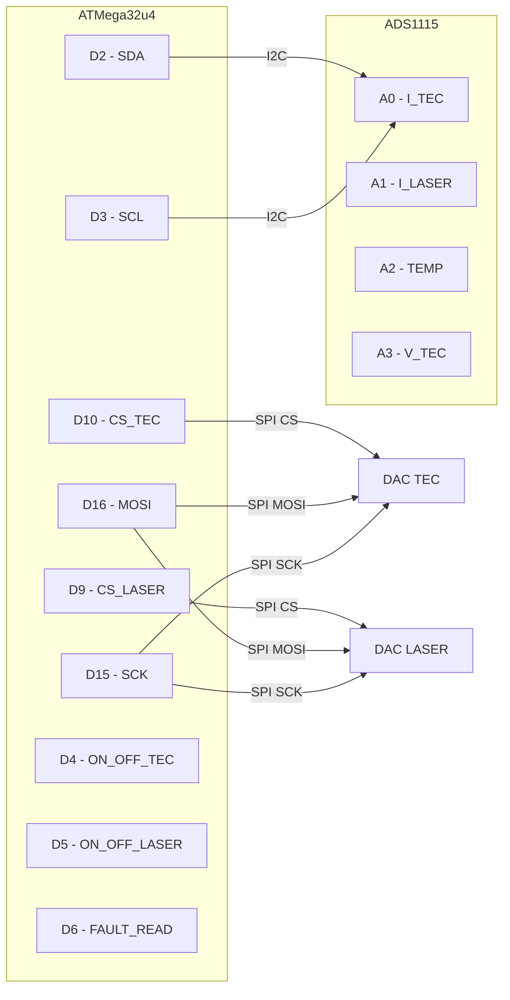

# Développement de la plateforme matérielle

Logiciel Altium Designer 25.8
Réutilisation de schéma validés trouvables sur Github ou sur les sites des fabricants si possible avec des modules achetables facilement sur Amazon/Bangood/Aliexpress

Un schéma par page pour valider sans erreurs les portions
Un schéma pour l'alimentation

## Plateforme

Plateforme USB ATMega32u4 avec communication hôte HID 28€ les 5 https://amzn.eu/d/4W1vUn8
Schéma à vérifier et à valider dans [arduino_pro_micro](doc/resources/arduino_pro_microhttps:/) [source](https://www.electroniclinic.com/how-to-make-arduino-pro-micro-at-home-altium-designer/https:/)
Vérifier que les composants utilisés sont facilement disponibles chez le [fabricant](https://jlcpcb.com/https:/) éventuellement dans [mes composants](https://jlcpcb.com/user-center/smtPrivateLibrary/myPartsLib)
Communication avec le Raspberry Pi en USB via HID ce qui permet de séparer l'interface matériel de l'UC

## Acquisition 16 bits

Acquisition ADS1115 16 bits 800sps https://amzn.eu/d/66uGC1o 16€ pour 5 modules
16 bits mais < 1€ , 4 canaux et 4 adresses I2C configurables donc potentiellement 4 ADS1115 et 16 canaux
Librairie disponible pour bootlooader [Arduino](https://github.com/wollewald/ADS1115_WE)

1 ADS1115 pour le pilotage du laser et de sa TEC (4 canaux)

- **Canal 0** : Courant TEC (I_READ_TEC)
- **Canal 1** : Courant Laser (I_READ_LAS01)
- **Canal 2** : Température (DELTA_T)
- **Canal 3** : Tension TEC ou extension

## Pilotage DL150

utilisation d'un ADS1115 pour la lecture du courant TEC et Laser, du delta-T et de la tension TEC
Besoin de deux SPI (le port SPI du ATmega32U8 et deux chip select) pour piloter les deux LTC2641
Une bibliothèque arduino est disponible sur le github d'[Analog Devices](https://github.com/analogdevicesinc/Linduino/tree/master/LTSketchbook/libraries/LTC2461)
### Schéma de connexion détaillé

## Acquisition 24 bits

ADS122C04IPWR 24 bits I2C 2ksps
Librairie disponible pour bootloader [Arduino](https://github.com/sparkfun/SparkFun_ADS122C04_ADC_Arduino_Library)
