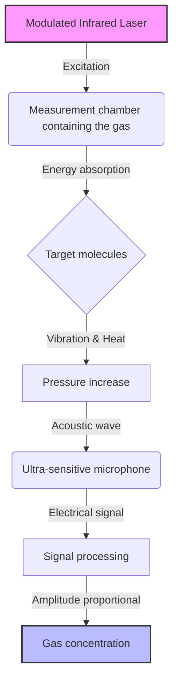
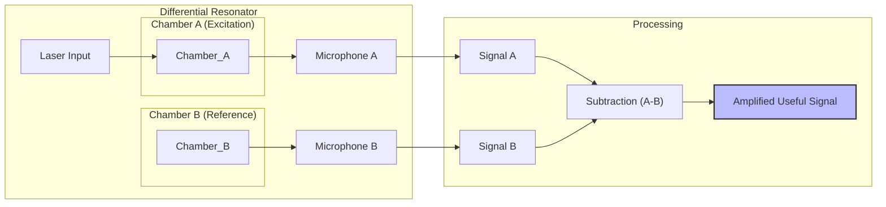
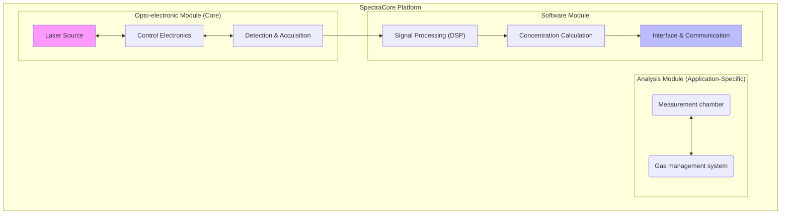
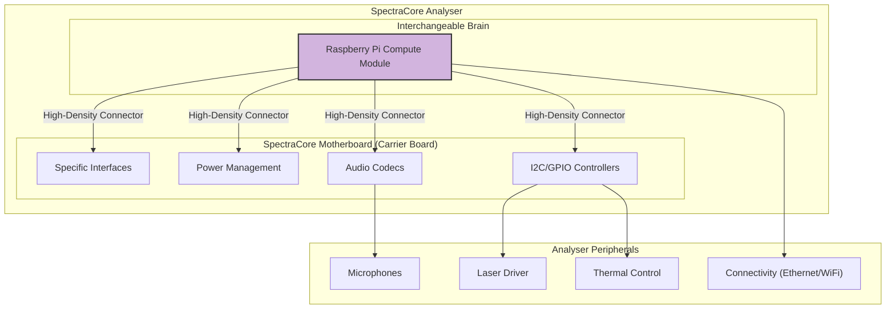
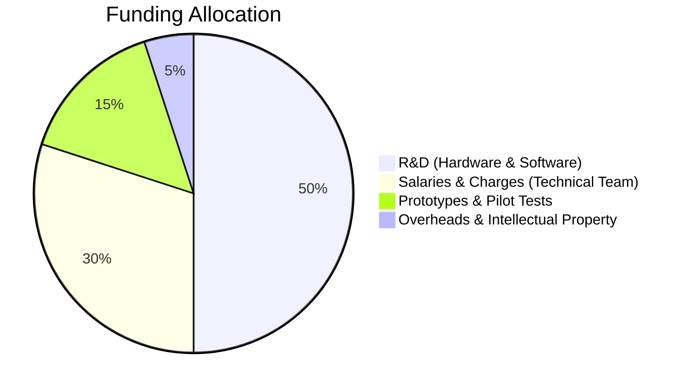

# Project "SpectraCore": Gas Analysis Platform Using Laser Photoacoustic Spectroscopy

**Investor Presentation Document**
**Date:** 23 September 2025
**Status:** Confidential

---

## 1. Executive Summary

The **SpectraCore** project aims to develop and commercialise a new generation of industrial gas analysers based on breakthrough technology: laser photoacoustic spectroscopy (L-PAS) in a differential Helmholtz resonator.

Our technology offers sensitivity, selectivity, and robustness far superior to existing solutions (NDIR, electrochemistry), while being more cost-effective than complex alternatives such as gas chromatography.

We have designed a modular hardware and software architecture that will enable us to create a **flexible analysis platform**, capable of quickly adapting to the detection of different gases for various industrial applications (process control, environmental monitoring, safety).

The process gas analyser market is estimated at several billion euros, with strong demand for more precise, reliable, and versatile solutions. SpectraCore is ideally positioned to capture a significant share of this market.

We are seeking funding of €320k to finalise the development of our industrial prototype, launch the pre-series, and deploy our first pilot installations. This investment will allow us to turn a major technological innovation into a highly profitable commercial product.

---

## 2. Market Opportunity

### Current Challenges

Industries (chemicals, energy, food, semiconductors) rely on precise, real-time measurement of gas concentrations to optimise processes, ensure safety, and comply with environmental standards.

However, current technologies have significant limitations:
- **Lack of sensitivity:** Difficulty detecting trace gases (ppm/ppb).
- **Interferences:** Measurements are often distorted by the presence of other gases.
- **High maintenance:** Frequent drift requiring costly recalibrations.
- **Lack of flexibility:** An analyser is generally designed for a single gas.

There is a pressing need for a solution that is **ultra-precise, robust, versatile, and economically viable**.

### Market Size

The global process gas analyser market is steadily growing, driven by tightening environmental regulations and the need to improve industrial process efficiency.

- **Global market:** ~€5 billion.
- **Annual growth rate (CAGR):** ~6%.
- **Key segments:** Oil & gas, chemicals, power generation, water treatment, pharmaceuticals.

Our modular platform will allow us to successively penetrate these different segments with tailored solutions.

---

## 3. Our Solution: Photoacoustic Spectroscopy

### Physical Principle

Photoacoustic spectroscopy is a direct and highly sensitive detection method.

1.  A **laser** is precisely tuned to a wavelength where only the target gas molecule absorbs light.
2.  The laser beam is **modulated** (switched on/off) at an acoustic frequency.
3.  Gas molecules absorb the laser energy and convert it into heat, creating a **pressure wave** (a sound).
4.  A **microphone** detects this sound, whose intensity is directly **proportional to the gas concentration**.

### Our Key Innovations

We do not simply apply this principle: we have optimised it for industrial performance.

#### a. Differential Helmholtz Resonator

Our measurement chamber is an **acoustic resonator** that amplifies the generated sound, increasing sensitivity by a factor of 100 to 1000. It incorporates two microphones in a **differential configuration**, which eliminates ambient noise (vibrations, pumps) to retain only the pure photoacoustic signal.

#### b. Intelligent Software Platform

The heart of our system is advanced software that manages acquisition, real-time signal processing, and analysis. It is designed to be **modular and extensible**.

---

## 4. Product Vision: The "SpectraCore" Analysis Platform

We are not building a simple analyser, but a **complete technology platform**.

### Modular Architecture

- **The "Core":** The opto-electronic and software module is the standard core of all our analysers.
- **The "Analysis Module":** The measurement chamber and laser can be changed to target a new gas, without redeveloping the entire system.

This approach will allow us to quickly develop a complete range of products for different markets with reduced R&D effort.

### Technical Architecture: Modularity and Sustainability

At the heart of our product vision is a hardware architecture designed for performance, flexibility, and long-term cost control. We do not rely on a monolithic computing system, but on a modular approach based on a **proprietary motherboard** hosting a **Raspberry Pi Compute Module**.

**How it works:**

-   **The Motherboard (Carrier Board):** This is our expertise. It integrates all the electronic components specific to our application: high-performance audio codecs, sensor controllers, laser power management, etc. It is the stable and optimised base of our system.
-   **The Compute Module:** This is the "brain" of the analyser. It contains the processor, memory, and storage. By using this industrial standard, we benefit from the power and ecosystem of Raspberry Pi.

**Strategic Advantages:**

1.  **Scalability and Sustainability:** When new, more powerful or more efficient Compute Modules become available, we can integrate them **without changing the motherboard**. The product remains at the cutting edge of technology with minimal R&D effort.
2.  **Cost Optimisation:** We benefit from the economies of scale of mass-produced Compute Modules. The cost of our "brain" decreases over time, which **directly improves our margins**.
3.  **Reliability and Availability:** We secure our supply chain by relying on a standardised and widely available component.
4.  **Focus on Core Business:** We focus our development efforts on the motherboard and software, where our true added value lies, rather than reinventing the wheel on generic computing.

This architecture is a major asset that guarantees the long-term competitiveness of our platform.

---

## 5. Strategic Roadmap

We have defined a 3-phase development plan to bring our technology to market.

### Phase 1: Proof of Concept & Technological Validation (12 months)

*   **Objective:** Build a first functional prototype and validate the performance of our technology in the laboratory.
*   **Key Deliverables:**
    1.  **Resonator Design and Optimisation:** Physical modelling and manufacturing of the differential measurement chamber.
    2.  **Acquisition System Development:** Creation of a real-time audio acquisition chain synchronised for both microphones.
    3.  **Signal Processing Algorithms:** Implementation of essential software modules:
        - Digital filtering to isolate the useful signal.
        - Spectral analysis (FFT) to extract signal amplitude.
    4.  **Laboratory Validation:** Measurements on standard gases to quantify sensitivity, linearity, and repeatability.

### Phase 2: Industrial Prototype Development (18 months)

*   **Objective:** Transform the laboratory prototype into a robust, reliable device ready for real-world testing.
*   **Key Deliverables:**
    1.  **Hardware Engineering:** Design of an industrial enclosure (IP65 standards), integration of electronics and thermal management.
    2.  **Precision Thermal Control:** Development of a temperature regulation system (PID) for the measurement cell, ensuring measurement stability under all ambient conditions.
    3.  **Advanced Software Architecture:**
        - Implementation of a configurable data processing pipeline.
        - Development of calibration models (polynomials) to convert signal amplitude into precise concentration.
    4.  **User Interface and Connectivity:** Creation of an embedded web interface for configuration and data visualisation. Implementation of industrial communication protocols (Modbus, OPC-UA).
    5.  **Pilot Tests:** Deployment of the prototype at an industrial partner for validation under operational conditions.

### Phase 3: Industrialisation and Commercialisation (12 months)

*   **Objective:** Finalise the product, obtain certifications, and launch mass production.
*   **Key Deliverables:**
    1.  **Certification:** Obtain CE, ATEX certifications (for explosive environments).
    2.  **Industrialisation:** Set up the production and quality control chain.
    3.  **Multi-Gas Platform Development:** Create "application kits" (laser + calibration) for 2 to 3 new high-value gases.
    4.  **Commercial Deployment:** Launch sales, develop the distribution network and support services.

---

## 6. Business Model

Our business model is based on several revenue streams:

1.  **Sale of Analysers:** Direct sale of "SpectraCore" systems to industrial clients.
2.  **Licences and OEM Partnerships:** Licensing our technology to integrators or equipment manufacturers wishing to integrate our modules into their own systems.
3.  **Service and Maintenance Contracts:** Service offers including calibration, preventive maintenance, and technical support.
4.  **Sale of "Application Kits":** Sale of extension modules (laser, optics, software calibrations) to adapt an existing analyser to the measurement of a new gas.

This diversified approach ensures recurring revenue and maximises market penetration.

### Forecast Sales in Phase 1 Development

Our commercial strategy is based on a gradual rollout targeting three key gas segments. The projections below are based on a conservative market analysis and take into account our progressive ramp-up.

| **Product** | **01/10/2026 (N)** | **N+1** | **N+2** | **N+3** | **N+4** |
|-------------|----------------------|---------|---------|---------|---------|
| **NH₃**     | -              | €300k (20 units) | €450k (30 units) | €600k (40 units) | €600k (40 units) |
| **H₂S**     | -              | -     | €150k (10 units) | €300k (20 units) | €1,050k (70 units) |
| **CO/H₂O**  | -              | €225k (15 units) | €300k (20 units) | €450k (30 units) | €600k (40 units) |
| **Total**   | **-**          | **€525k** | **€900k** | **€1,350k** | **€2,250k** |

**Key assumptions:**
- Average price per unit: €15k (NH₃ and CO/H₂O analyser) and €15k (premium H₂S analyser)
- Commercial launch from year N (2027)
- Progressive ramp-up with staggered product introduction
- Sustained growth thanks to the platform effect and range expansion

### Financial Aspects – Global Budget

The development of the SpectraCore platform requires a structured investment spread over the different development phases. Our budgetary approach favours controlled progression with clear validation milestones.

| **Phase** | **Pre-study** | **Labour** | **Prototype** | **Demo unit** | **Total** |
|-----------|---------------|------------|---------------|----------------|-----------|
| **Budget** | €50k | €200k | €35k | €35k | **€320k** |

**Phase details:**
- **Pre-study (€50k):** Theoretical validation, physical modelling, and technical feasibility studies
- **Labour (€200k):** Software development, electronic design, and system integration
- **Prototype (€35k):** Manufacture of the first functional prototype and specialised components
- **Demo unit (€35k):** Production of a demonstration version for client testing

This €320k budget covers phase 1 of our roadmap and brings us to full technological validation, positioning the company for subsequent industrialisation phases.

---

## 7. The Team and Funding Request

### Founding Team

**Emmanuel Morizot:** 25 years' experience as a manager in industrial analysis
**Ronan Le Meillat:** 25 years' experience managing projects combining electronics and software for industry.

### Funding Request

We are seeking funding of €320k to execute phases 1 and 2 of our roadmap. The funds will be allocated as follows:

This investment will enable us to overcome the key technological and commercial milestones to position SpectraCore as the future standard in industrial gas analysis.
