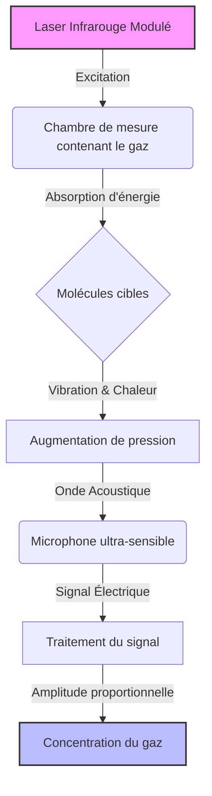
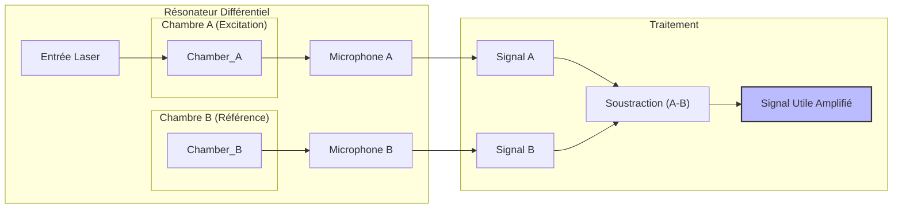
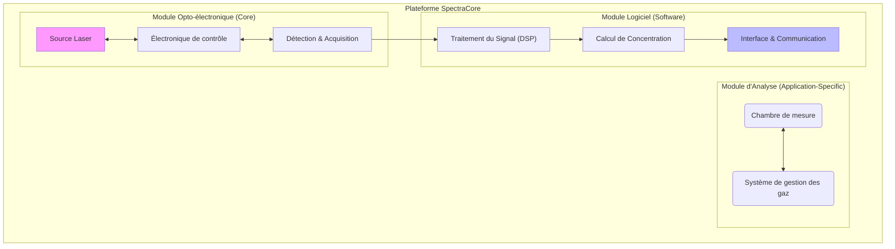
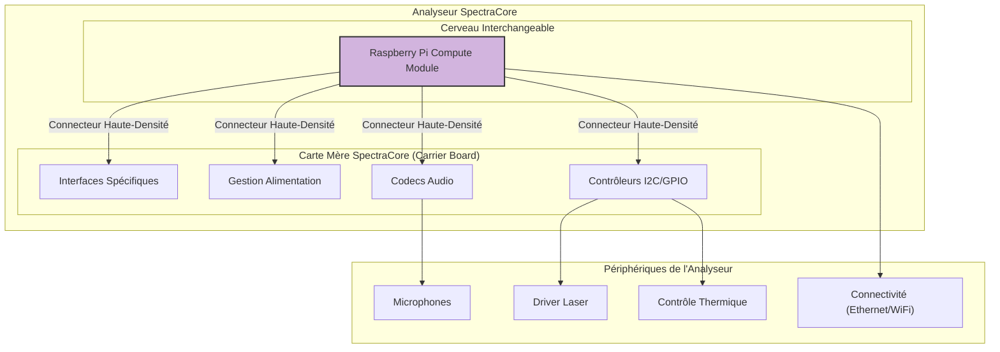
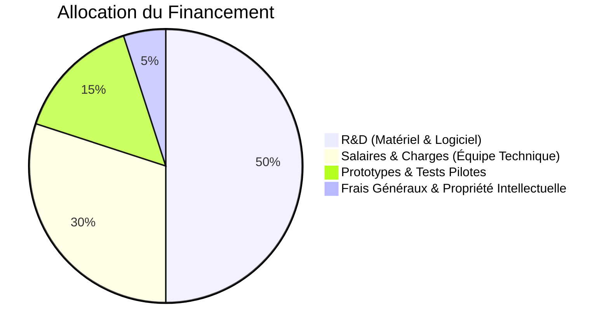

# Projet "SpectraCore" : Plateforme d'Analyse de Gaz par Spectroscopie Photoacoustique Laser

**Document de Présentation pour Investisseurs**
**Date :** 23 septembre 2025
**Statut :** Confidentiel

---

## 1. Synthèse Exécutive

Le projet **SpectraCore** vise à développer et commercialiser une nouvelle génération d'analyseurs de gaz industriels basés sur une technologie de rupture : la spectroscopie photoacoustique laser (L-PAS) dans un résonateur de Helmholtz différentiel.

Notre technologie offre une sensibilité, une sélectivité et une robustesse largement supérieures aux solutions existantes (NDIR, électrochimie), tout en étant plus économique que des alternatives complexes comme la chromatographie en phase gazeuse.

Nous avons conçu une architecture matérielle et logicielle modulaire qui nous permettra de créer une **plateforme d'analyse flexible**, capable de s'adapter rapidement à la détection de différents gaz pour diverses applications industrielles (contrôle de processus, surveillance environnementale, sécurité).

Le marché des analyseurs de gaz de processus est estimé à plusieurs milliards d'euros, avec une forte demande pour des solutions plus précises, fiables et polyvalentes. SpectraCore est idéalement positionné pour capter une part significative de ce marché.

Nous sollicitons un financement de 320 k€ pour finaliser le développement de notre prototype industriel, lancer la présérie et déployer nos premières installations pilotes. Cet investissement nous permettra de transformer une innovation technologique majeure en un produit commercial à fort potentiel de rentabilité.

---

## 2. L'Opportunité de Marché

### La Problématique Actuelle

Les industries (chimie, énergie, agroalimentaire, semi-conducteurs) dépendent de la mesure précise et en temps réel des concentrations de gaz pour optimiser leurs procédés, garantir la sécurité et se conformer aux normes environnementales.

Cependant, les technologies actuelles présentent des limites importantes :
- **Manque de sensibilité :** Difficulté à détecter des traces de gaz (ppm/ppb).
- **Interférences :** Les mesures sont souvent faussées par la présence d'autres gaz.
- **Maintenance élevée :** Dérives fréquentes nécessitant des recalibrages coûteux.
- **Manque de flexibilité :** Un analyseur est généralement conçu pour un seul gaz.

Il existe un besoin criant pour une solution qui soit à la fois **ultra-précise, robuste, polyvalente et économiquement viable**.

### La Taille du Marché

Le marché mondial des analyseurs de gaz de processus est en croissance constante. Il est tiré par le durcissement des réglementations environnementales et la nécessité d'améliorer l'efficacité des processus industriels.

- **Marché global :** ~5 milliards d'euros.
- **Taux de croissance annuel (CAGR) :** ~6%.
- **Segments clés :** Pétrole et gaz, chimie, production d'énergie, traitement de l'eau, pharmacie.

Notre plateforme modulaire nous permettra de pénétrer successivement ces différents segments avec des solutions adaptées.

---

## 3. Notre Solution : La Spectroscopie Photoacoustique

### Principe Physique

La spectroscopie photoacoustique est une méthode de détection directe et de haute sensibilité.

1.  Un **laser** est précisément accordé sur une longueur d'onde où seule la molécule de gaz ciblée absorbe la lumière.
2.  Le faisceau laser est **modulé** (allumé/éteint) à une fréquence acoustique.
3.  Les molécules de gaz absorbent l'énergie du laser et la transforment en chaleur, créant une **onde de pression** (un son).
4.  Un **microphone** détecte ce son, dont l'intensité est directement **proportionnelle à la concentration du gaz**.

### Nos Innovations Clés

Nous ne nous contentons pas d'appliquer ce principe : nous l'avons optimisé pour des performances industrielles.

#### a. Résonateur de Helmholtz Différentiel

Notre chambre de mesure est un **résonateur acoustique** qui amplifie le son généré, augmentant la sensibilité d'un facteur 100 à 1000. Elle intègre deux microphones en **configuration différentielle**, ce qui permet de supprimer les bruits ambiants (vibrations, pompes) pour ne conserver que le signal photoacoustique pur.

#### b. Plateforme Logicielle Intelligente

Le cœur de notre système est un logiciel avancé qui gère l'acquisition, le traitement du signal en temps réel et l'analyse. Il est conçu pour être **modulaire et extensible**.

---

## 4. Vision Produit : La Plateforme d'Analyse "SpectraCore"

Nous ne construisons pas un simple analyseur, mais une **plateforme technologique complète**.

### Architecture Modulaire

- **Le "Core"** : Le module opto-électronique et logiciel est le cœur standard de tous nos analyseurs.
- **Le "Module d'Analyse"** : La chambre de mesure et le laser peuvent être changés pour cibler un nouveau gaz, sans re-développer tout le système.

Cette approche nous permettra de décliner rapidement une gamme complète de produits pour différents marchés avec un effort de R&D réduit.

### Architecture Technique : Modularité et Pérennité

Au cœur de notre vision produit se trouve une architecture matérielle conçue pour la performance, la flexibilité et la maîtrise des coûts à long terme. Nous ne dépendons pas d'un système de calcul monolithique, mais d'une approche modulaire basée sur une **carte mère propriétaire** accueillant un **Raspberry Pi Compute Module**.

**Comment ça fonctionne :**

-   **La Carte Mère (Carrier Board) :** C'est notre savoir-faire. Elle intègre tous les composants électroniques spécifiques à notre application : codecs audio haute performance, contrôleurs pour les capteurs, gestion de l'alimentation des lasers, etc. C'est la base stable et optimisée de notre système.
-   **Le Compute Module :** C'est le "cerveau" de l'analyseur. Il contient le processeur, la mémoire et le stockage. En utilisant ce standard industriel, nous bénéficions de la puissance et de l'écosystème Raspberry Pi.

**Les Avantages Stratégiques :**

1.  **Évolutivité et Pérennité :** Lorsque de nouveaux Compute Modules plus puissants ou plus économes sont disponibles, nous pouvons les intégrer **sans changer la carte mère**. Le produit reste à la pointe de la technologie avec un effort de R&D minimal.
2.  **Optimisation des Coûts :** Nous profitons des économies d'échelle de la production de masse des Compute Modules. Le coût de notre "cerveau" diminue avec le temps, ce qui **améliore directement nos marges**.
3.  **Fiabilité et Disponibilité :** Nous sécurisons notre chaîne d'approvisionnement en nous appuyant sur un composant standardisé et largement disponible.
4.  **Concentration sur notre Cœur de Métier :** Nous concentrons nos efforts de développement sur la carte mère et le logiciel, là où se trouve notre véritable valeur ajoutée, plutôt que de réinventer la roue sur la partie calcul générique.

Cette architecture est un atout majeur qui garantit la compétitivité de notre plateforme sur le long terme.

---

## 5. Feuille de Route Stratégique

Nous avons défini un plan de développement en 3 phases pour amener notre technologie sur le marché.

### Phase 1 : Preuve de Concept & Validation Technologique (12 mois)

*   **Objectif :** Construire un premier prototype fonctionnel et valider les performances de notre technologie en laboratoire.
*   **Livrables Clés :**
    1.  **Conception et Optimisation du Résonateur :** Modélisation physique et fabrication de la chambre de mesure différentielle.
    2.  **Développement du Système d'Acquisition :** Création d'une chaîne d'acquisition audio temps réel synchronisée pour les deux microphones.
    3.  **Algorithmes de Traitement du Signal :** Implémentation des briques logicielles essentielles :
        - Filtrage numérique pour isoler le signal utile.
        - Analyse spectrale (FFT) pour extraire l'amplitude du signal.
    4.  **Validation en Laboratoire :** Mesures sur des gaz étalons pour quantifier la sensibilité, la linéarité et la répétabilité.

### Phase 2 : Développement du Prototype Industriel (18 mois)

*   **Objectif :** Transformer le prototype de laboratoire en un appareil robuste, fiable et prêt pour des tests en conditions réelles.
*   **Livrables Clés :**
    1.  **Ingénierie Matérielle :** Conception d'un boîtier industriel (normes IP65), intégration de l'électronique et gestion thermique.
    2.  **Contrôle Thermique de Précision :** Développement d'un système de régulation de température (PID) pour la cellule de mesure, garantissant la stabilité des mesures quelles que soient les conditions ambiantes.
    3.  **Architecture Logicielle Avancée :**
        - Mise en place d'un pipeline de traitement de données configurable.
        - Développement de modèles de calibration (polynômes) pour convertir l'amplitude du signal en concentration précise.
    4.  **Interface Utilisateur et Connectivité :** Création d'une interface web embarquée pour la configuration et la visualisation des données. Implémentation des protocoles de communication industriels (Modbus, OPC-UA).
    5.  **Tests Pilotes :** Déploiement du prototype chez un partenaire industriel pour validation en conditions opérationnelles.

### Phase 3 : Industrialisation et Commercialisation (12 mois)

*   **Objectif :** Finaliser le produit, obtenir les certifications et lancer la production en série.
*   **Livrables Clés :**
    1.  **Certification :** Obtention des certifications CE, ATEX (pour les environnements explosifs).
    2.  **Industrialisation :** Mise en place de la chaîne de production et de contrôle qualité.
    3.  **Développement de la Plateforme Multi-Gaz :** Création de "kits d'application" (laser + calibration) pour 2 à 3 nouveaux gaz à forte valeur ajoutée.
    4.  **Déploiement Commercial :** Lancement des ventes, développement du réseau de distribution et des services de support.

---

## 6. Modèle Économique

Notre modèle économique repose sur plusieurs sources de revenus :

1.  **Vente d'Analyseurs :** Vente directe des systèmes "SpectraCore" aux clients industriels.
2.  **Licences et Partenariats OEM :** Concession de licences de notre technologie à des intégrateurs ou des fabricants d'équipements qui souhaitent intégrer nos modules dans leurs propres systèmes.
3.  **Contrats de Service et de Maintenance :** Offres de services incluant calibration, maintenance préventive et support technique.
4.  **Vente de "Kits d'Application" :** Vente de modules d'extension (laser, optiques, calibrations logicielles) pour adapter un analyseur existant à la mesure d'un nouveau gaz.

Cette approche diversifiée assure des revenus récurrents et maximise la pénétration du marché.

### Ventes prévisionnelles en phase 1 de développement

Notre stratégie commerciale s'articule autour d'un déploiement progressif ciblant trois segments gaziers clés. Les projections ci-dessous sont basées sur une analyse de marché conservative et tiennent compte de notre montée en charge progressive.

| **Produit** | **01/10/2026** **(N)** | **N+1** | **N+2** | **N+3** | **N+4** |
|-------------|----------------------|---------|---------|---------|---------|
| **NH₃**     | -              | 300 k€ (20 unités) | 450 k€ (30 unités) | 600 k€ (40 unités) | 600 k€ (40 unités) |
| **H₂S**     | -              | -     | 150 k€ (10 unités) | 300 k€ (20 unités) | 1050 k€ (70 unités) |
| **CO/H₂O**  | -              | 225 k€ (15 unités) | 300 k€ (20 unités) | 450 k€ (30 unités) | 600 k€ (40 unités) |
| **Total**   | **-**          | **525 k€** | **900 k€** | **1350 k€** | **2250 k€** |

**Hypothèses de base :**
- Prix moyen par unité : 15 k€ (analyseur NH₃ et CO/H₂O) et 15 k€ (analyseur H₂S premium)
- Démarrage commercial à partir de l'année N (2027)
- Montée en charge progressive avec introduction échelonnée des produits
- Croissance soutenue grâce à l'effet de plateforme et à l'élargissement de la gamme

### Aspects financier – Budget global

Le développement de la plateforme SpectraCore nécessite un investissement structuré réparti sur les différentes phases de développement. Notre approche budgétaire privilégie une progression maîtrisée avec des jalons de validation clairs.

| **Phase** | **Pré-étude** | **M.O.** | **Prototype** | **Unité de démo** | **Total** |
|-----------|---------------|----------|---------------|--------------------|-----------|
| **Budget** | 50 k€ | 200 k€ | 35 k€ | 35 k€ | **320 k€** |

**Détail des phases :**
- **Pré-étude (50 k€) :** Validation théorique, modélisation physique et études de faisabilité technique
- **Main d'œuvre (200 k€) :** Développement logiciel, conception électronique et intégration système
- **Prototype (35 k€) :** Fabrication du premier prototype fonctionnel et composants spécialisés
- **Unité de démo (35 k€) :** Réalisation d'une version de démonstration pour les tests clients

Ce budget de 320 k€ couvre la phase 1 de notre feuille de route et nous amène jusqu'à la validation technologique complète, positionnant l'entreprise pour les phases d'industrialisation ultérieures.

---

## 7. L'Équipe et la Demande de Financement

### L'Équipe Fondatrice

**Emmanuel Morizot** : 25 ans d’expérience en tant que manager dans l’analyse industrielle 
**Ronan Le Meillat** : 25 ans d’expérience dans le pilotage de projets mêlant électronique et logiciel pour l’industrie. 

### Demande de Financement

Nous sollicitons un financement de 320 k€ pour exécuter les phases 1 et 2 de notre feuille de route. Les fonds seront alloués comme suit :

Cet investissement nous permettra de franchir les étapes technologiques et commerciales décisives pour positionner SpectraCore comme le futur standard de l'analyse de gaz industrielle.
