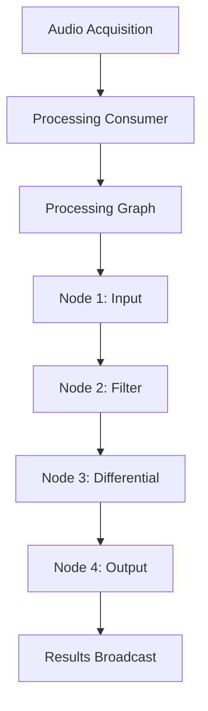
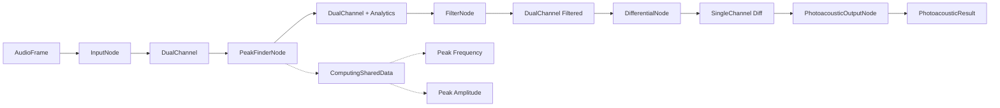

# Processing Module Developer Guide

> **Comprehensive guide to the rust-photoacoustic processing module for Rust developers**

## Table of Contents

1. [Overview](#overview)
2. [Architecture](#architecture)
3. [Core Components](#core-components)
4. [Node Types](#node-types)
5. [Data Flow](#data-flow)
6. [Configuration](#configuration)
7. [Examples](#examples)
8. [Best Practices](#best-practices)
9. [Advanced Usage](#advanced-usage)
10. [Testing](#testing)
11. [Performance Considerations](#performance-considerations)
12. [Troubleshooting](#troubleshooting)

## Overview

The **processing module** (`src/processing/`) is the heart of the rust-photoacoustic system, providing a modular, configurable audio processing pipeline architecture. It implements a **directed acyclic graph (DAG)** pattern where audio data flows through interconnected processing nodes, each performing specific signal processing operations.

### Key Features

- **🔄 Real-time Processing**: Optimized for low-latency streaming audio processing
- **🎛️ Modular Architecture**: Each processing step is encapsulated in a separate node
- **⚙️ Runtime Configuration**: Processing graphs can be created and modified from YAML configuration
- **🔒 Type Safety**: Uses Rust's type system to ensure correct data flow between nodes
- **📊 Metadata Tracking**: Comprehensive tracking of processing steps and performance metrics
- **🔗 Flexible Connections**: Nodes can be connected in various configurations

### Use Cases

- **Photoacoustic Signal Processing**: Primary use for water vapor detection via laser photoacoustics
- **Real-time Audio Analysis**: General-purpose audio processing and analysis
- **Signal Filtering**: Digital filter chains for noise reduction and signal enhancement
- **Multi-channel Processing**: Dual-channel audio operations and differential analysis
- **Analytical Computing**: Real-time spectral analysis and peak detection for frequency tracking
- **Concentration Calculation**: Polynomial-based gas concentration computation from photoacoustic signals

---

## Architecture

### High-Level Design

The processing module follows a **producer-consumer** pattern with a **graph-based processing pipeline**:



### Core Components

```rust,ignore
// Main processing module structure
pub mod processing {
    pub mod consumer;         // ProcessingConsumer - main processing orchestrator
    pub mod graph;           // ProcessingGraph - node container and execution engine
    pub mod nodes;           // ProcessingNode trait and implementations
    pub mod result;          // ProcessingResult and analysis structures
    pub mod computing_nodes; // ComputingNode - specialized analytical processing nodes
}
```

### Module Dependencies

```rust,ignore
use crate::acquisition::AudioFrame;        // Input audio data
use crate::preprocessing::{Filter, DifferentialCalculator}; // Processing algorithms
use crate::config::processing::*;          // Configuration structures
use realfft::{RealFftPlanner, RealToComplex}; // FFT processing for ComputingNodes
use num_complex;                           // Complex number arithmetic for spectral analysis
```

---

## Core Components

### 1. ProcessingConsumer

**Purpose**: Main orchestrator that receives audio frames from the acquisition system and processes them through the configured processing graph.

```rust,ignore
pub struct ProcessingConsumer {
    graph: Arc<RwLock<ProcessingGraph>>,
    stats: Arc<RwLock<ProcessingStats>>,
    result_sender: broadcast::Sender<ProcessingResult>,
    // ... other fields
}
```

**Key Methods**:
- `new()` - Create a new consumer with processing graph
- `start()` - Begin consuming audio frames from SharedAudioStream
- `stop()` - Stop processing and cleanup resources
- `get_stats()` - Retrieve processing performance statistics

### 2. ProcessingGraph

**Purpose**: Container and execution engine for processing nodes. Manages node connections, validates graph structure, and executes processing chains.

```rust,ignore
pub struct ProcessingGraph {
    nodes: HashMap<NodeId, Box<dyn ProcessingNode>>,
    connections: Vec<Connection>,
    execution_order: Option<Vec<NodeId>>,
    input_node: Option<NodeId>,
    output_nodes: Vec<NodeId>,
}
```

**Key Methods**:
- `new()` - Create empty graph
- `add_node()` - Add processing node
- `connect()` - Connect two nodes
- `execute()` - Process data through the graph
- `validate()` - Check graph structure validity

### 3. ProcessingNode Trait

**Purpose**: Core interface that all processing nodes must implement. Defines the contract for data transformation and node behavior.

```rust,ignore
pub trait ProcessingNode: Send + Sync {
    fn process(&mut self, input: ProcessingData) -> Result<ProcessingData>;
    fn node_id(&self) -> &str;
    fn node_type(&self) -> &str;
    fn accepts_input(&self, input: &ProcessingData) -> bool;
    fn output_type(&self, input: &ProcessingData) -> Option<String>;
    fn reset(&mut self);
    fn clone_node(&self) -> Box<dyn ProcessingNode>;
}
```

### 4. ProcessingData Enum

**Purpose**: Type-safe representation of data flowing between nodes. Ensures correct data types and transformations.

```rust,ignore
#[derive(Debug, Clone)]
pub enum ProcessingData {
    AudioFrame(AudioFrame),                    // Raw dual-channel audio
    SingleChannel {                            // Single channel processed audio
        samples: Vec<f32>,
        sample_rate: u32,
        timestamp: u64,
        frame_number: u64,
    },
    DualChannel {                              // Dual channel processed audio
        channel_a: Vec<f32>,
        channel_b: Vec<f32>,
        sample_rate: u32,
        timestamp: u64,
        frame_number: u64,
    },
    PhotoacousticResult {                      // Final analysis result
        signal: Vec<f32>,
        metadata: ProcessingMetadata,
    },
}
```

---

## Node Types

### Input Nodes

#### InputNode
**Purpose**: Entry point for audio data from the acquisition system.

```rust,ignore
// Create input node
let input_node = InputNode::new("audio_input".to_string());

// Usage in graph
graph.add_node(Box::new(input_node))?;
```

**Behavior**:
- Accepts `AudioFrame` and converts to `DualChannel`
- Acts as passthrough for other data types
- Always accepts any input (validation node)

---

### Filter Nodes

#### FilterNode
**Purpose**: Applies digital signal processing filters to audio channels.

```rust,ignore
use rust_photoacoustic::preprocessing::BandpassFilter;

// Create bandpass filter for both channels
let filter = Box::new(BandpassFilter::new(1000.0, 100.0)); // 1kHz ±100Hz
let filter_node = FilterNode::new(
    "bandpass_filter".to_string(),
    filter,
    ChannelTarget::Both
);
```

**Channel Targeting**:
```rust,ignore
pub enum ChannelTarget {
    ChannelA,    // Process only channel A
    ChannelB,    // Process only channel B  
    Both,        // Process both channels
}
```

**Supported Filter Types**:
- `BandpassFilter::new(center_freq, bandwidth)` - Bandpass filter
- `LowpassFilter::new(cutoff_freq)` - Lowpass filter

---

### Channel Operation Nodes

#### DifferentialNode
**Purpose**: Calculates the difference between two audio channels to enhance signal-to-noise ratio.

```rust,ignore
use rust_photoacoustic::preprocessing::differential::SimpleDifferential;

let calculator = Box::new(SimpleDifferential::new());
let diff_node = DifferentialNode::new("differential".to_string(), calculator);
```

**Input/Output**:
- **Input**: `DualChannel` (two audio channels)
- **Output**: `SingleChannel` (differential signal)

#### ChannelSelectorNode
**Purpose**: Selects a specific channel from dual-channel audio data.

```rust,ignore
// Select only channel A
let selector = ChannelSelectorNode::new(
    "select_a".to_string(), 
    ChannelTarget::ChannelA
);
```

**Input/Output**:
- **Input**: `DualChannel`
- **Output**: `SingleChannel` (selected channel)

#### ChannelMixerNode
**Purpose**: Mixes two audio channels using various strategies.

```rust,ignore
// Average mixing
let mixer = ChannelMixerNode::new(
    "mixer".to_string(),
    MixStrategy::Average
);

// Weighted mixing
let weighted_mixer = ChannelMixerNode::new(
    "weighted_mixer".to_string(),
    MixStrategy::Weighted { a_weight: 0.7, b_weight: 0.3 }
);
```

**Mix Strategies**:
```rust,ignore
pub enum MixStrategy {
    Add,                                    // A + B
    Subtract,                              // A - B  
    Average,                               // (A + B) / 2
    Weighted { a_weight: f32, b_weight: f32 }, // A*a_weight + B*b_weight
}
```

---

### Computing Nodes (Analytical Processing)

Computing Nodes are specialized ProcessingNodes that implement the **pass-through pattern** while performing analytical computations on the data. They allow the original signal to flow unchanged to the next node while extracting analytical information and publishing it to a shared state for use by other nodes.

#### Key Features:
- **Pass-through Processing**: Data flows unchanged, maintaining pipeline integrity
- **Parallel Analysis**: Performs computations without affecting data latency
- **Shared State**: Results are published to thread-safe shared state (`Arc<RwLock<ComputingSharedData>>`)
- **Real-time Analytics**: Enables real-time frequency tracking and concentration calculation

#### PeakFinderNode (Spectral Analysis)
**Purpose**: Performs real-time FFT-based spectral analysis to detect frequency peaks while passing data through unchanged.

```rust,ignore
use rust_photoacoustic::processing::computing_nodes::PeakFinderNode;

// Create peak finder with custom configuration
let peak_finder = PeakFinderNode::new("peak_detector".to_string())
    .with_detection_threshold(0.1)         // 10% amplitude threshold
    .with_frequency_range(900.0, 1100.0)   // Focus on 1kHz range
    .with_fft_size(2048)                   // FFT window size
    .with_smoothing_factor(0.7)            // Temporal smoothing
    .with_sample_rate(48000);

// Add to processing graph
graph.add_node(Box::new(peak_finder))?;
```

**Configuration Options**:
```rust,ignore
// Builder pattern configuration
let peak_finder = PeakFinderNode::new("peak_detector".to_string())
    .with_detection_threshold(0.15)        // Minimum peak amplitude (0.0-1.0)
    .with_frequency_range(800.0, 1200.0)   // Analysis frequency range (Hz)
    .with_fft_size(4096)                   // FFT window size (power of 2)
    .with_sample_rate(44100)               // Sample rate adaptation
    .with_smoothing_factor(0.8);           // Moving average smoothing (0.0-1.0)
```

**Algorithmic Features**:
- **FFT Spectral Analysis**: Uses `realfft` for efficient real-valued FFT
- **Hann Windowing**: Reduces spectral leakage for better frequency resolution
- **Coherence Filtering**: Requires multiple consecutive detections for validation
- **Adaptive Thresholding**: Configurable amplitude threshold for peak detection
- **Frequency Range Limiting**: Focus analysis on specific frequency bands

**Input/Output**:
- **Input**: `AudioFrame`, `SingleChannel`, or `DualChannel` (pass-through)
- **Output**: Same as input (unchanged)
- **Shared State**: Publishes `peak_frequency` and `peak_amplitude` to `ComputingSharedData`

**Accessing Results**:
```rust,ignore
// Get shared state for reading results
let shared_state = peak_finder.get_shared_state();
if let Ok(state) = shared_state.read() {
    if let Some(freq) = state.peak_frequency {
        println!("Detected peak at {} Hz", freq);
    }
    if let Some(amp) = state.peak_amplitude {
        println!("Peak amplitude: {}", amp);
    }
}
```

#### ComputingSharedData Structure
**Purpose**: Thread-safe shared data structure for communicating analytical results between computing nodes and other processing nodes.

```rust,ignore
use rust_photoacoustic::processing::computing_nodes::{ComputingSharedData, SharedComputingState};

// Shared data structure
pub struct ComputingSharedData {
    pub peak_frequency: Option<f32>,           // Detected resonance frequency (Hz)
    pub peak_amplitude: Option<f32>,           // Normalized peak amplitude (0.0-1.0)
    pub concentration_ppm: Option<f32>,        // Calculated gas concentration (ppm)
    pub polynomial_coefficients: [f64; 5],    // 4th-degree polynomial coefficients
    pub last_update: SystemTime,              // Timestamp for data validation
}

// Type alias for easy access
pub type SharedComputingState = Arc<RwLock<ComputingSharedData>>;
```

**Integration with Other Nodes**:
```rust,ignore
// Example: Dynamic filter that adapts based on detected peak frequency
impl ProcessingNode for DynamicFilterNode {
    fn process(&mut self, input: ProcessingData) -> Result<ProcessingData> {
        // Read current peak frequency from shared state
        if let Ok(state) = self.computing_state.read() {
            if let Some(peak_freq) = state.peak_frequency {
                // Adapt filter center frequency
                self.update_center_frequency(peak_freq)?;
            }
        }
        
        // Apply adaptive filtering
        self.apply_filter(input)
    }
}
```

**Use Cases for Computing Nodes**:
1. **Frequency Tracking**: Real-time adaptation of filter parameters based on detected resonance
2. **Signal Quality Assessment**: Continuous monitoring of signal characteristics
3. **Concentration Calculation**: Polynomial-based gas concentration from peak amplitudes
4. **Performance Monitoring**: Real-time analysis of signal processing effectiveness
5. **Adaptive Processing**: Dynamic parameter adjustment based on signal conditions

---

### Output Nodes

#### StreamingNode (Real-Time Streaming Output)
**Purpose**: Provides real-time audio streams for HTTP consumption and web visualization. Each StreamingNode registers its own `SharedAudioStream` in a central `StreamingNodeRegistry`, enabling dynamic routing and multi-client access.

```rust,ignore
use rust_photoacoustic::processing::nodes::{StreamingNode, StreamingNodeRegistry};
use uuid::Uuid;

let registry = StreamingNodeRegistry::new();
let node_id = Uuid::new_v4();
let streaming_node = StreamingNode::new(
    node_id,
    "Live Audio Stream",
    registry.clone(),
);

// The node automatically registers its stream with the registry
assert!(registry.get_stream(&node_id).is_some());
```

**Behavior**:
- Acts as a pass-through node in the processing graph, forwarding data unchanged.
- Converts input data (AudioFrame, DualChannel, SingleChannel) to `AudioFrame` for streaming.
- Registers its stream in the `StreamingNodeRegistry` for discovery and HTTP access.
- Stream is automatically unregistered when the node is dropped.

**Input/Output**:
- **Input**: `AudioFrame`, `DualChannel`, or `SingleChannel` (but not `PhotoacousticResult`)
- **Output**: Pass-through (same as input)
- **Stream**: Publishes real-time audio frames to a shared stream for HTTP endpoints

**Integration**:
- Use the registry to discover available streaming nodes and their UUIDs.
- Streams can be consumed via the `/stream/audio/fast/<node_id>` endpoint for efficient binary streaming.

#### PhotoacousticOutputNode
**Purpose**: Final analysis node that produces photoacoustic analysis results.

```rust,ignore
let output_node = PhotoacousticOutputNode::new("output".to_string())
    .with_detection_threshold(0.05)    // 5% detection threshold
    .with_analysis_window_size(2048);  // 2048 sample analysis window
```

**Configuration**:
- `detection_threshold`: Threshold for signal presence detection
- `analysis_window_size`: Window size for spectral analysis

**Input/Output**:
- **Input**: `SingleChannel` or `DualChannel`
- **Output**: `PhotoacousticResult` with comprehensive analysis

---

## Real-Time Streaming API Endpoints

### Dynamic Node Streaming: `/stream/audio/fast/<node_id>`

This endpoint allows clients to subscribe to the real-time audio stream of a specific `StreamingNode` by its UUID. It uses a fast, base64-encoded binary format for efficient transfer.

**Route Pattern:**
```
/stream/audio/fast/<node_id>
```
Where `<node_id>` is the UUID of a registered `StreamingNode`.

**Example:**
```
GET /api/stream/audio/fast/123e4567-e89b-12d3-a456-426614174000
```

**Behavior:**
- Returns a Server-Sent Events (SSE) stream of audio frames from the specified node.
- If the node does not exist, returns an error event.
- Uses the same fast binary format as `/stream/audio/fast` (see [audio-stream-reconstruction-guide.md](audio-stream-reconstruction-guide.md)).

**Use Case:**
- Enables clients to select and subscribe to any active stream in the processing graph, supporting multi-stream and multi-client scenarios.

**Node Discovery:**
- Use the `/stream/nodes` endpoint to list all available streaming nodes and their UUIDs/names.
- Use `/stream/nodes/<node_id>/stats` for per-node statistics.

---

## Data Flow

### Processing Pipeline Example



**Note**: The PeakFinderNode demonstrates the pass-through pattern - data flows unchanged while analytical results are published to shared state.

### Data Transformation Chain

1. **AudioFrame** → **InputNode** → **DualChannel**
   ```rust,ignore
   // Raw acquisition data converted to processing format
   ProcessingData::DualChannel {
       channel_a: vec![0.1, 0.2, 0.3],
       channel_b: vec![0.4, 0.5, 0.6], 
       sample_rate: 44100,
       timestamp: 1000,
       frame_number: 1,
   }
   ```

2. **DualChannel** → **FilterNode** → **DualChannel (Filtered)**
   ```rust,ignore
   // Both channels filtered through bandpass filter
   // Noise reduction and frequency selection
   ```

3. **DualChannel** → **DifferentialNode** → **SingleChannel**
   ```rust,ignore
   // Differential calculation: channel_a - channel_b
   ProcessingData::SingleChannel {
       samples: vec![-0.3, -0.3, -0.3], // A - B
       sample_rate: 44100,
       timestamp: 1000,
       frame_number: 1,
   }
   ```

4. **SingleChannel** → **PhotoacousticOutputNode** → **PhotoacousticResult**
   ```rust,ignore
   // Final analysis with spectral data and detection results
   ProcessingData::PhotoacousticResult {
       signal: vec![...],
       metadata: ProcessingMetadata { /* ... */ },
   }
   ```

---

## Configuration

### YAML Configuration

Processing graphs can be defined in YAML configuration files:

```yaml
processing:
  enabled: true
  result_buffer_size: 1000
  default_graph:
    id: "photoacoustic_pipeline"
    nodes:
      - id: "input"
        node_type: "input"
        parameters: null
        
      - id: "bandpass_filter"
        node_type: "filter"
        parameters:
          type: "bandpass"
          center_frequency: 1000.0
          bandwidth: 100.0
          target_channel: "Both"
          order: 4
          
      - id: "differential"
        node_type: "differential"
        parameters: null
          
      - id: "photoacoustic_output"
        node_type: "photoacoustic_output"
        parameters:
          detection_threshold: 0.05
          analysis_window_size: 2048
          
      # Computing nodes for analytical processing
      - id: "peak_detector"
        node_type: "computing_peak_finder"
        parameters:
          detection_threshold: 0.1
          frequency_min: 800.0
          frequency_max: 1200.0
          fft_size: 2048
          smoothing_factor: 0.7
          coherence_threshold: 3
          
    connections:
      - from: "input"
        to: "peak_detector"
      - from: "peak_detector"
        to: "bandpass_filter"
      - from: "bandpass_filter"  
        to: "differential"
      - from: "differential"
        to: "photoacoustic_output"
        
    output_node: "photoacoustic_output"
```

### Programmatic Configuration

```rust,ignore
use rust_photoacoustic::processing::*;
use rust_photoacoustic::preprocessing::*;

// Create graph from configuration
let config = ProcessingGraphConfig {
    id: "custom_graph".to_string(),
    nodes: vec![
        NodeConfig {
            id: "input".to_string(),
            node_type: "input".to_string(),
            parameters: serde_json::Value::Null,
        },
        NodeConfig {
            id: "filter".to_string(),
            node_type: "filter".to_string(),
            parameters: serde_json::json!({
                "type": "bandpass",
                "center_frequency": 1000.0,
                "bandwidth": 100.0,
                "target_channel": "Both"
            }),
        },
        // ... more nodes
    ],
    connections: vec![
        ConnectionConfig {
            from: "input".to_string(),
            to: "filter".to_string(),
        },
        // ... more connections
    ],
    output_node: Some("photoacoustic".to_string()),
};

let graph = ProcessingGraph::from_config(&config)?;
```

---

## Examples

### Basic Processing Chain

```rust,ignore
use rust_photoacoustic::processing::*;
use rust_photoacoustic::preprocessing::*;

fn create_basic_processing_chain() -> Result<ProcessingGraph> {
    let mut graph = ProcessingGraph::new();
    
    // 1. Input node
    let input = Box::new(InputNode::new("input".to_string()));
    graph.add_node(input)?;
    
    // 2. Bandpass filter
    let filter = Box::new(BandpassFilter::new(1000.0, 100.0));
    let filter_node = Box::new(FilterNode::new(
        "bandpass".to_string(),
        filter,
        ChannelTarget::Both
    ));
    graph.add_node(filter_node)?;
    
    // 3. Differential calculation
    let diff_calc = Box::new(SimpleDifferential::new());
    let diff_node = Box::new(DifferentialNode::new(
        "differential".to_string(),
        diff_calc
    ));
    graph.add_node(diff_node)?;
    
    // 4. Final analysis
    let output = Box::new(
        PhotoacousticOutputNode::new("output".to_string())
            .with_detection_threshold(0.05)
    );
    graph.add_node(output)?;
    
    // Connect nodes
    graph.connect("input", "bandpass")?;
    graph.connect("bandpass", "differential")?;
    graph.connect("differential", "output")?;
    
    // Set output
    graph.set_output_node("output")?;
    
    Ok(graph)
}
```

### Parallel Processing Chain

```rust,ignore
fn create_parallel_processing_chain() -> Result<ProcessingGraph> {
    let mut graph = ProcessingGraph::new();
    
    // Input
    graph.add_node(Box::new(InputNode::new("input".to_string())))?;
    
    // Channel selectors for parallel processing
    graph.add_node(Box::new(ChannelSelectorNode::new(
        "select_a".to_string(), ChannelTarget::ChannelA
    )))?;
    graph.add_node(Box::new(ChannelSelectorNode::new(
        "select_b".to_string(), ChannelTarget::ChannelB
    )))?;
    
    // Separate filters for each channel
    let filter_a = Box::new(BandpassFilter::new(1000.0, 50.0));
    graph.add_node(Box::new(FilterNode::new(
        "filter_a".to_string(), filter_a, ChannelTarget::ChannelA
    )))?;
    
    let filter_b = Box::new(BandpassFilter::new(1200.0, 50.0));
    graph.add_node(Box::new(FilterNode::new(
        "filter_b".to_string(), filter_b, ChannelTarget::ChannelB
    )))?;
    
    // Mix the processed channels
    graph.add_node(Box::new(ChannelMixerNode::new(
        "mixer".to_string(), MixStrategy::Subtract
    )))?;
    
    // Final output
    graph.add_node(Box::new(PhotoacousticOutputNode::new("output".to_string())))?;
    
    // Connections
    graph.connect("input", "select_a")?;
    graph.connect("input", "select_b")?;
    graph.connect("select_a", "filter_a")?;
    graph.connect("select_b", "filter_b")?;
    graph.connect("filter_a", "mixer")?;
    graph.connect("filter_b", "mixer")?;
    graph.connect("mixer", "output")?;
    
    graph.set_output_node("output")?;
    Ok(graph)
}
```

### Computing Node Integration

```rust,ignore
use rust_photoacoustic::processing::computing_nodes::PeakFinderNode;

fn create_analytical_processing_chain() -> Result<ProcessingGraph> {
    let mut graph = ProcessingGraph::new();
    
    // 1. Input node
    graph.add_node(Box::new(InputNode::new("input".to_string())))?;
    
    // 2. Peak finder for real-time frequency analysis (pass-through)
    let peak_finder = Box::new(
        PeakFinderNode::new("peak_detector".to_string())
            .with_detection_threshold(0.1)
            .with_frequency_range(800.0, 1200.0)
            .with_fft_size(2048)
            .with_smoothing_factor(0.7)
    );
    graph.add_node(peak_finder)?;
    
    // 3. Adaptive bandpass filter (could use peak frequency from shared state)
    let filter = Box::new(BandpassFilter::new(1000.0, 100.0));
    let filter_node = Box::new(FilterNode::new(
        "adaptive_bandpass".to_string(),
        filter,
        ChannelTarget::Both
    ));
    graph.add_node(filter_node)?;
    
    // 4. Differential calculation
    let diff_calc = Box::new(SimpleDifferential::new());
    let diff_node = Box::new(DifferentialNode::new(
        "differential".to_string(),
        diff_calc
    ));
    graph.add_node(diff_node)?;
    
    // 5. Final analysis
    let output = Box::new(
        PhotoacousticOutputNode::new("output".to_string())
            .with_detection_threshold(0.05)
    );
    graph.add_node(output)?;
    
    // Connect nodes - peak finder in pass-through mode
    graph.connect("input", "peak_detector")?;
    graph.connect("peak_detector", "adaptive_bandpass")?;
    graph.connect("adaptive_bandpass", "differential")?;
    graph.connect("differential", "output")?;
    
    graph.set_output_node("output")?;
    
    Ok(graph)
}

// Example of accessing computing results
fn monitor_peak_detection(peak_finder: &PeakFinderNode) {
    let shared_state = peak_finder.get_shared_state();
    
    if let Ok(state) = shared_state.read() {
        match (state.peak_frequency, state.peak_amplitude) {
            (Some(freq), Some(amp)) => {
                println!("Peak detected: {} Hz at {:.2}% amplitude", freq, amp * 100.0);
                
                // Check data freshness
                let age = state.last_update.elapsed().unwrap_or_default();
                if age.as_millis() < 100 {
                    println!("Data is fresh ({}ms old)", age.as_millis());
                } else {
                    println!("Warning: Stale data ({}ms old)", age.as_millis());
                }
            }
            _ => println!("No peak detected"),
        }
    }
}
```

### Custom Processing Node

```rust,ignore
use rust_photoacoustic::processing::*;

// Custom gain node implementation
pub struct GainNode {
    id: String,
    gain: f32,
}

impl GainNode {
    pub fn new(id: String, gain: f32) -> Self {
        Self { id, gain }
    }
}

impl ProcessingNode for GainNode {
    fn process(&mut self, input: ProcessingData) -> Result<ProcessingData> {
        match input {
            ProcessingData::SingleChannel { mut samples, sample_rate, timestamp, frame_number } => {
                // Apply gain to all samples
                for sample in &mut samples {
                    *sample *= self.gain;
                }
                Ok(ProcessingData::SingleChannel { 
                    samples, sample_rate, timestamp, frame_number 
                })
            }
            ProcessingData::DualChannel { mut channel_a, mut channel_b, sample_rate, timestamp, frame_number } => {
                // Apply gain to both channels
                for sample in &mut channel_a { *sample *= self.gain; }
                for sample in &mut channel_b { *sample *= self.gain; }
                Ok(ProcessingData::DualChannel { 
                    channel_a, channel_b, sample_rate, timestamp, frame_number 
                })
            }
            _ => anyhow::bail!("GainNode doesn't support this input type"),
        }
    }
    
    fn node_id(&self) -> &str { &self.id }
    fn node_type(&self) -> &str { "gain" }
    
    fn accepts_input(&self, input: &ProcessingData) -> bool {
        matches!(input, 
            ProcessingData::SingleChannel { .. } | 
            ProcessingData::DualChannel { .. }
        )
    }
    
    fn output_type(&self, input: &ProcessingData) -> Option<String> {
        match input {
            ProcessingData::SingleChannel { .. } => Some("SingleChannel".to_string()),
            ProcessingData::DualChannel { .. } => Some("DualChannel".to_string()),
            _ => None,
        }
    }
    
    fn reset(&mut self) { /* No internal state to reset */ }
    
    fn clone_node(&self) -> Box<dyn ProcessingNode> {
        Box::new(GainNode::new(self.id.clone(), self.gain))
    }
}
```

---

## Best Practices

### 1. Node Design Principles

```rust,ignore
// ✅ Good: Stateless processing when possible
impl ProcessingNode for FilterNode {
    fn process(&mut self, input: ProcessingData) -> Result<ProcessingData> {
        // Each call is independent, no shared state issues
        self.filter.process_samples(samples)
    }
}

// ⚠️ Be careful: Stateful processing
impl ProcessingNode for BufferNode {
    fn process(&mut self, input: ProcessingData) -> Result<ProcessingData> {
        // Maintain internal buffers - ensure thread safety
        self.buffer.push(input);
        if self.buffer.len() >= self.window_size {
            // Process buffered data
        }
    }
}
```

### 2. Error Handling

```rust,ignore
impl ProcessingNode for MyNode {
    fn process(&mut self, input: ProcessingData) -> Result<ProcessingData> {
        // ✅ Use anyhow for detailed error context
        let samples = match input {
            ProcessingData::SingleChannel { samples, .. } => samples,
            _ => anyhow::bail!("Expected SingleChannel input, got {:?}", input),
        };
        
        // ✅ Propagate errors with context
        self.algorithm.process(&samples)
            .with_context(|| format!("Failed to process in node {}", self.node_id()))?;
            
        Ok(/* processed data */)
    }
}
```

### 3. Performance Optimization

```rust,ignore
// ✅ Reuse allocations
pub struct EfficientNode {
    id: String,
    work_buffer: Vec<f32>,  // Reuse this buffer
}

impl ProcessingNode for EfficientNode {
    fn process(&mut self, input: ProcessingData) -> Result<ProcessingData> {
        let samples = /* extract samples */;
        
        // ✅ Reuse existing allocation
        self.work_buffer.clear();
        self.work_buffer.reserve(samples.len());
        
        // Process into work_buffer
        // ...
        
        Ok(ProcessingData::SingleChannel {
            samples: std::mem::take(&mut self.work_buffer),
            // ... other fields
        })
    }
}
```

### 4. Configuration Validation

```rust,ignore
impl ProcessingGraph {
    pub fn validate(&self) -> Result<()> {
        // ✅ Check for cycles
        self.check_for_cycles()?;
        
        // ✅ Validate data type compatibility
        for conn in &self.connections {
            let from_node = self.nodes.get(&conn.from)
                .ok_or_else(|| anyhow::anyhow!("Node {} not found", conn.from))?;
            let to_node = self.nodes.get(&conn.to)
                .ok_or_else(|| anyhow::anyhow!("Node {} not found", conn.to))?;
                
            // Check output/input type compatibility
            // ...
        }
        
        Ok(())
    }
}
```

### 5. Computing Node Best Practices

```rust,ignore
// ✅ Good: Pass-through behavior with analytical computation
impl ProcessingNode for PeakFinderNode {
    fn process(&mut self, input: ProcessingData) -> Result<ProcessingData> {
        // Perform analysis on input data
        self.analyze_spectrum(&input)?;
        
        // ✅ Return input unchanged (pass-through)
        Ok(input)
    }
}

// ✅ Efficient shared state access
impl ProcessingNode for AdaptiveFilterNode {
    fn process(&mut self, input: ProcessingData) -> Result<ProcessingData> {
        // ✅ Non-blocking read attempt
        if let Ok(state) = self.computing_state.try_read() {
            if let Some(peak_freq) = state.peak_frequency {
                // Adapt parameters based on fresh data
                if state.last_update.elapsed().unwrap_or_default().as_millis() < 100 {
                    self.update_center_frequency(peak_freq)?;
                }
            }
        }
        
        // Process with current parameters
        self.apply_filter(input)
    }
}

// ✅ Robust error handling in computing nodes
impl ProcessingNode for PeakFinderNode {
    fn process(&mut self, input: ProcessingData) -> Result<ProcessingData> {
        // ✅ Graceful handling of analysis failures
        match self.analyze_spectrum(&input) {
            Ok(peak_data) => {
                self.update_shared_state(peak_data);
            }
            Err(e) => {
                // Log error but don't fail the pipeline
                log::warn!("Peak analysis failed: {}, continuing with pass-through", e);
            }
        }
        
        // Always return input unchanged
        Ok(input)
    }
}
```

---

## Advanced Usage

### Dynamic Graph Reconfiguration

```rust,ignore
use std::sync::{Arc, RwLock};

pub struct DynamicProcessingSystem {
    graph: Arc<RwLock<ProcessingGraph>>,
    consumer: ProcessingConsumer,
}

impl DynamicProcessingSystem {
    pub async fn reconfigure_graph(&self, new_config: ProcessingGraphConfig) -> Result<()> {
        // 1. Create new graph
        let new_graph = ProcessingGraph::from_config(&new_config)?;
        new_graph.validate()?;
        
        // 2. Replace existing graph atomically
        {
            let mut graph = self.graph.write().await;
            *graph = new_graph;
        }
        
        // 3. Processing consumer will use new graph on next frame
        Ok(())
    }
    
    pub async fn add_monitoring_node(&self, node_id: &str) -> Result<()> {
        let mut graph = self.graph.write().await;
        
        // Insert monitoring node into existing chain
        let monitor = Box::new(MonitoringNode::new(node_id.to_string()));
        graph.add_node(monitor)?;
        
        // Reconnect with monitoring
        // ... reconnection logic
        
        Ok(())
    }
}
```

### Performance Monitoring

```rust,ignore
pub struct PerformanceMonitoringNode {
    id: String,
    metrics: Arc<RwLock<NodeMetrics>>,
}

impl ProcessingNode for PerformanceMonitoringNode {
    fn process(&mut self, input: ProcessingData) -> Result<ProcessingData> {
        let start = std::time::Instant::now();
        
        // Process data (pass-through for monitoring)
        let result = Ok(input); // Pass through unchanged
        
        let processing_time = start.elapsed();
        
        // Update metrics
        {
            let mut metrics = self.metrics.write().unwrap();
            metrics.add_sample(processing_time);
        }
        
        result
    }
}

#[derive(Debug)]
pub struct NodeMetrics {
    pub total_samples: u64,
    pub total_time: std::time::Duration,
    pub min_time: std::time::Duration,
    pub max_time: std::time::Duration,
}
```

### Multi-threaded Processing

```rust,ignore
use tokio::sync::mpsc;
use std::sync::Arc;

pub struct ParallelProcessingGraph {
    stages: Vec<ProcessingStage>,
}

pub struct ProcessingStage {
    nodes: Vec<Box<dyn ProcessingNode>>,
    input: mpsc::Receiver<ProcessingData>,
    output: mpsc::Sender<ProcessingData>,
}

impl ParallelProcessingGraph {
    pub async fn process_parallel(&mut self, input: ProcessingData) -> Result<ProcessingData> {
        // Stage 1: Parallel processing
        let (tx1, rx1) = mpsc::channel(100);
        let (tx2, rx2) = mpsc::channel(100);
        
        // Send to first stage
        tx1.send(input).await?;
        
        // Process through stages
        tokio::spawn(async move {
            // Stage processing logic
        });
        
        // Collect final result
        rx2.recv().await.ok_or_else(|| anyhow::anyhow!("No result"))
    }
}
```

---

## Testing

### Unit Testing Nodes

```rust,ignore
#[cfg(test)]
mod tests {
    use super::*;
    
    #[test]
    fn test_filter_node_processing() {
        let filter = Box::new(BandpassFilter::new(1000.0, 100.0));
        let mut node = FilterNode::new(
            "test_filter".to_string(),
            filter,
            ChannelTarget::Both
        );
        
        let input = ProcessingData::DualChannel {
            channel_a: vec![0.1, 0.2, 0.3, 0.4],
            channel_b: vec![0.5, 0.6, 0.7, 0.8],
            sample_rate: 44100,
            timestamp: 1000,
            frame_number: 1,
        };
        
        let result = node.process(input).unwrap();
        
        match result {
            ProcessingData::DualChannel { channel_a, channel_b, .. } => {
                assert_eq!(channel_a.len(), 4);
                assert_eq!(channel_b.len(), 4);
                // Verify filtering applied
            }
            _ => panic!("Expected DualChannel output"),
        }
    }
    
    #[test]
    fn test_node_type_compatibility() {
        let node = FilterNode::new("test".to_string(), /* ... */);
        
        let single_channel = ProcessingData::SingleChannel { /* ... */ };
        let dual_channel = ProcessingData::DualChannel { /* ... */ };
        
        assert!(node.accepts_input(&dual_channel));
        assert!(node.accepts_input(&single_channel));
        assert_eq!(node.output_type(&dual_channel), Some("DualChannel".to_string()));
    }
}
```

### Integration Testing

```rust,ignore
#[cfg(test)]
mod integration_tests {
    use super::*;
    
    #[tokio::test]
    async fn test_complete_processing_chain() {
        // Create test graph
        let mut graph = create_test_graph().unwrap();
        
        // Create test audio frame
        let audio_frame = AudioFrame {
            channel_a: generate_test_signal(1000.0, 44100, 1.0), // 1kHz sine wave
            channel_b: generate_test_signal(1000.0, 44100, 0.5), // Same but quieter
            sample_rate: 44100,
            timestamp: 1000,
            frame_number: 1,
        };
        
        // Execute processing
        let input = ProcessingData::AudioFrame(audio_frame);
        let results = graph.execute(input).unwrap();
        
        // Verify results
        assert_eq!(results.len(), 1);
        match &results[0] {
            ProcessingData::PhotoacousticResult { signal, metadata } => {
                assert!(!signal.is_empty());
                assert!(!metadata.processing_steps.is_empty());
            }
            _ => panic!("Expected PhotoacousticResult"),
        }
    }
    
    fn generate_test_signal(freq: f32, sample_rate: u32, amplitude: f32) -> Vec<f32> {
        let duration = 0.1; // 100ms
        let samples = (sample_rate as f32 * duration) as usize;
        
        (0..samples)
            .map(|i| {
                let t = i as f32 / sample_rate as f32;
                amplitude * (2.0 * std::f32::consts::PI * freq * t).sin()
            })
            .collect()
    }
}
```

### Benchmarking

```rust,ignore
#[cfg(test)]
mod benches {
    use super::*;
    use criterion::{black_box, criterion_group, criterion_main, Criterion};
    
    fn benchmark_filter_processing(c: &mut Criterion) {
        let filter = Box::new(BandpassFilter::new(1000.0, 100.0));
        let mut node = FilterNode::new("bench".to_string(), filter, ChannelTarget::Both);
        
        let input = create_test_input(1024); // 1024 samples
        
        c.bench_function("filter_processing", |b| {
            b.iter(|| {
                let result = node.process(black_box(input.clone()));
                black_box(result)
            })
        });
    }
    
    criterion_group!(benches, benchmark_filter_processing);
    criterion_main!(benches);
}
```

---

## Performance Considerations

### Memory Management

```rust,ignore
// ✅ Efficient memory usage
impl ProcessingNode for EfficientNode {
    fn process(&mut self, input: ProcessingData) -> Result<ProcessingData> {
        match input {
            ProcessingData::SingleChannel { mut samples, sample_rate, timestamp, frame_number } => {
                // Process in-place when possible
                self.process_in_place(&mut samples)?;
                
                Ok(ProcessingData::SingleChannel {
                    samples, // Reuse the original Vec
                    sample_rate,
                    timestamp,
                    frame_number,
                })
            }
            _ => { /* ... */ }
        }
    }
}
```

### Lock-Free Operations

```rust,ignore
use std::sync::atomic::{AtomicU64, Ordering};

pub struct LockFreeStats {
    processed_frames: AtomicU64,
    total_processing_time: AtomicU64,
}

impl LockFreeStats {
    pub fn record_processing(&self, duration_us: u64) {
        self.processed_frames.fetch_add(1, Ordering::Relaxed);
        self.total_processing_time.fetch_add(duration_us, Ordering::Relaxed);
    }
    
    pub fn get_average_time(&self) -> f64 {
        let frames = self.processed_frames.load(Ordering::Relaxed);
        let total_time = self.total_processing_time.load(Ordering::Relaxed);
        
        if frames > 0 {
            total_time as f64 / frames as f64
        } else {
            0.0
        }
    }
}
```

### SIMD Optimization

```rust,ignore
#[cfg(target_arch = "x86_64")]
use std::arch::x86_64::*;

impl ProcessingNode for SIMDFilterNode {
    fn process(&mut self, input: ProcessingData) -> Result<ProcessingData> {
        match input {
            ProcessingData::SingleChannel { samples, .. } => {
                let processed = if is_x86_feature_detected!("avx2") {
                    unsafe { self.process_avx2(&samples) }
                } else {
                    self.process_scalar(&samples)
                };
                
                Ok(ProcessingData::SingleChannel { 
                    samples: processed,
                    // ... other fields
                })
            }
            _ => { /* ... */ }
        }
    }
    
    #[target_feature(enable = "avx2")]
    unsafe fn process_avx2(&self, samples: &[f32]) -> Vec<f32> {
        // SIMD processing implementation
        // Up to 8x faster for compatible operations
        todo!("Implement SIMD processing")
    }
}
```

---

## Troubleshooting

### Common Issues

#### 1. Graph Validation Errors

```rust,ignore
// Problem: Cyclic connections
graph.connect("node_a", "node_b")?;
graph.connect("node_b", "node_a")?; // ❌ Creates cycle

// Solution: Check graph structure
graph.validate()?; // Will return CyclicConnection error
```

#### 2. Type Compatibility Issues

```rust,ignore
// Problem: Incompatible data types
let filter_node = FilterNode::new(/* ... */); // Expects DualChannel
let diff_node = DifferentialNode::new(/* ... */); // Outputs SingleChannel
graph.connect("filter", "differential")?; // ❌ Type mismatch

// Solution: Use appropriate conversion nodes
graph.add_node(Box::new(ChannelSelectorNode::new("selector", ChannelTarget::ChannelA)))?;
graph.connect("filter", "selector")?;
graph.connect("selector", "differential")?; // ✅ Now compatible
```

#### 3. Performance Issues

```rust,ignore
// Problem: Expensive operations in hot path
impl ProcessingNode for SlowNode {
    fn process(&mut self, input: ProcessingData) -> Result<ProcessingData> {
        // ❌ Expensive operation on every sample
        let result = expensive_calculation(input);
        Ok(result)
    }
}

// Solution: Cache or optimize expensive operations
impl ProcessingNode for OptimizedNode {
    fn process(&mut self, input: ProcessingData) -> Result<ProcessingData> {
        // ✅ Use pre-computed lookup tables or SIMD
        let result = self.lookup_table.process(input);
        Ok(result)
    }
}
```

### Debug Tools

```rust,ignore
pub struct DebugNode {
    id: String,
    log_samples: bool,
}

impl ProcessingNode for DebugNode {
    fn process(&mut self, input: ProcessingData) -> Result<ProcessingData> {
        if self.log_samples {
            match &input {
                ProcessingData::SingleChannel { samples, .. } => {
                    log::debug!("Node {}: {} samples, RMS: {:.6}", 
                        self.id, samples.len(), calculate_rms(samples));
                }
                ProcessingData::DualChannel { channel_a, channel_b, .. } => {
                    log::debug!("Node {}: A={} samples, B={} samples", 
                        self.id, channel_a.len(), channel_b.len());
                }
                _ => {}
            }
        }
        Ok(input) // Pass through unchanged
    }
}

fn calculate_rms(samples: &[f32]) -> f32 {
    let sum_squares: f32 = samples.iter().map(|x| x * x).sum();
    (sum_squares / samples.len() as f32).sqrt()
}
```

### Performance Profiling

```rust,ignore
pub struct ProfilingGraph {
    inner: ProcessingGraph,
    node_timings: HashMap<String, Vec<std::time::Duration>>,
}

impl ProfilingGraph {
    pub fn execute_with_profiling(&mut self, input: ProcessingData) -> Result<Vec<ProcessingData>> {
        let start_time = std::time::Instant::now();
        
        // Execute with timing
        for node_id in &self.execution_order {
            let node_start = std::time::Instant::now();
            
            // Process node
            let _result = self.process_node(node_id, input.clone())?;
            
            let node_duration = node_start.elapsed();
            self.node_timings.entry(node_id.clone())
                .or_insert_with(Vec::new)
                .push(node_duration);
        }
        
        log::info!("Total processing time: {:?}", start_time.elapsed());
        Ok(vec![]) // Return actual results
    }
    
    pub fn print_performance_report(&self) {
        for (node_id, timings) in &self.node_timings {
            let avg_time: std::time::Duration = timings.iter().sum::<std::time::Duration>() / timings.len() as u32;
            println!("Node {}: avg {:?}, samples {}", node_id, avg_time, timings.len());
        }
    }
}
```

---

## Conclusion

The processing module provides a powerful, flexible foundation for real-time audio processing in photoacoustic applications. Its modular design allows for:

- **Easy Extension**: Add new node types by implementing the `ProcessingNode` trait
- **Runtime Configuration**: Modify processing chains without recompilation
- **Performance Optimization**: Fine-tune processing for specific hardware and requirements
- **Type Safety**: Leverage Rust's type system to prevent data flow errors

For additional examples and advanced usage patterns, refer to the test files in `src/processing/` and the configuration examples in the main documentation.

---

**Key Files Reference**:
- `src/processing/mod.rs` - Module exports and high-level documentation
- `src/processing/nodes.rs` - Node implementations and `ProcessingNode` trait
- `src/processing/graph.rs` - Graph management and execution logic
- `src/processing/consumer.rs` - Main processing orchestrator
- `src/processing/result.rs` - Result types and analysis structures
- `src/config/processing.rs` - Configuration structures for YAML setup
