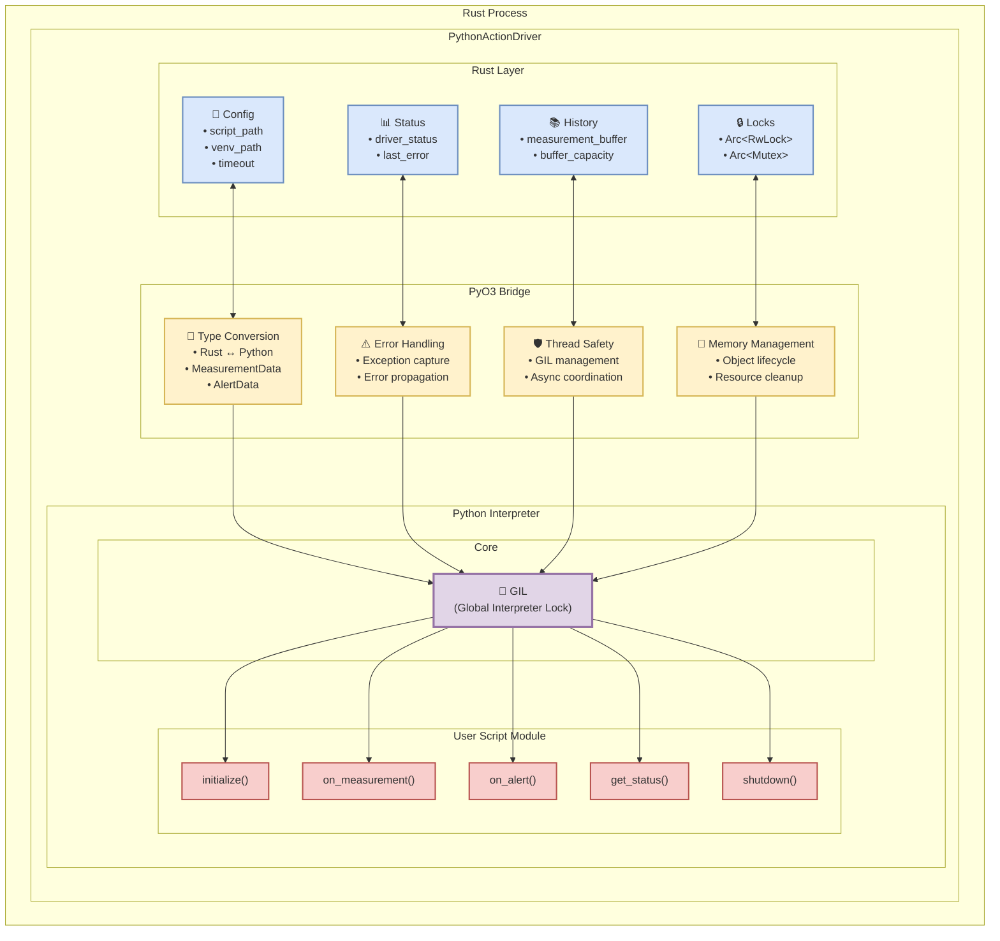

# PythonActionDriver - Design Document

## Vue d'ensemble

Le **PythonActionDriver** est un driver de première classe qui implémente le trait `ActionDriver`, permettant d'exécuter des scripts Python personnalisés comme actions dans le système rust-photoacoustic. Il s'intègre au même niveau architectural que les autres drivers (HttpsCallbackActionDriver, RedisActionDriver, KafkaActionDriver).

## Architecture

```text
UniversalActionNode
         ↓
  ActionDriver trait
         ↓
┌─────────────┬─────────────┬─────────────┬─────────────────┐
│   HTTPS     │    Redis    │    Kafka    │    Python       │
│  Callback   │   Driver    │   Driver    │    Driver       │
│   Driver    │             │             │  ⚡ NOUVEAU      │
└─────────────┴─────────────┴─────────────┴─────────────────┘
```

## Intégration Technique avec PyO3

### Vue d'ensemble de PyO3

PyO3 est une bibliothèque Rust qui permet l'interopérabilité bidirectionnelle entre Rust et Python. Dans le contexte du PythonActionDriver, PyO3 nous permet d'exécuter du code Python de manière native depuis Rust tout en maintenant les garanties de sécurité et de performance de Rust.

### Architecture d'Intégration



### 1. Cycle de Vie de l'Interpréteur Python

#### Initialisation
```rust
// Préparation de Python pour l'utilisation multi-threadée
pyo3::prepare_freethreaded_python();

// Acquisition du GIL (Global Interpreter Lock)
let gil = Python::acquire_gil();
let py = gil.python();

// Configuration de l'environnement Python
let sys = py.import("sys")?;
let path = sys.getattr("path")?;
// Ajout de chemins personnalisés au sys.path
for py_path in &config.python_paths {
    path.call_method1("append", (py_path.to_string_lossy(),))?;
}

// Activation d'environnement virtuel (optionnel)
if let Some(venv_path) = &config.venv_path {
    let activate_script = venv_path.join("bin/activate_this.py");
    if activate_script.exists() {
        let activate_code = std::fs::read_to_string(activate_script)?;
        py.run(&activate_code, None, None)?;
    }
}

// Chargement du script utilisateur
let script_content = std::fs::read_to_string(&config.script_path)?;
let module = PyModule::from_code(py, &script_content, "action_script.py", "action_script")?;
```

Le PythonActionDriver initialise un interpréteur Python embedé dans le processus Rust. Cette approche offre plusieurs avantages :
- **Performance** : Pas de processus externe à démarrer
- **Contrôle** : Gestion fine des ressources et timeouts
- **Intégration** : Partage de mémoire direct entre Rust et Python

#### Gestion du GIL (Global Interpreter Lock)
PyO3 gère automatiquement le GIL Python, mais le driver doit être conscient de ses implications :
- **Thread Safety** : Toutes les opérations Python sont protégées par le GIL
- **Performance** : Le GIL peut limiter la concurrence pour les tâches CPU-intensives
- **Deadlocks** : Attention aux situations où Rust et Python attendent mutuellement

### 2. Conversion de Types

#### Rust vers Python
```rust
// Conversion MeasurementData → Python dict
fn measurement_to_py_dict(&self, py: Python<'_>, data: &MeasurementData) -> Result<PyObject> {
    let dict = PyDict::new(py);
    dict.set_item("concentration_ppm", data.concentration_ppm)?; // f64 → float
    dict.set_item("source_node_id", &data.source_node_id)?;     // String → str
    dict.set_item("timestamp", data.timestamp.duration_since(UNIX_EPOCH)?.as_secs())?; // SystemTime → int
    
    // HashMap<String, Value> → dict
    let metadata_dict = PyDict::new(py);
    for (key, value) in &data.metadata {
        metadata_dict.set_item(key, value.to_string())?;
    }
    dict.set_item("metadata", metadata_dict)?;
    
    Ok(dict.into())
}
```

#### Python vers Rust
```rust
// Extraction de valeurs de retour Python
if let Ok(py_result) = func.call1(args) {
    // Python dict/str → Rust Value/String
    if let Ok(status_str) = py_result.extract::<String>(py) {
        let json_value: Value = serde_json::from_str(&status_str)?;
    }
}
```

### 3. Gestion des Erreurs

#### Propagation d'Erreurs Python → Rust
```rust
match self.call_python_function(&self.config.update_function, &[&py_data]).await {
    Ok(_) => {
        // Succès - continuer le traitement
        Ok(())
    }
    Err(e) => {
        // Erreur Python propagée vers Rust
        error!("Python update function failed: {}", e);
        *self.status.lock().unwrap() = format!("Error: {}", e);
        Err(e) // Propagation vers le système de monitoring
    }
}
```

#### Types d'erreurs gérées :
- **Erreurs de syntaxe Python** : Détectées au chargement du script
- **Erreurs d'exécution Python** : Exceptions Python converties en `anyhow::Error`
- **Timeouts** : Protection contre les scripts qui traînent
- **Erreurs de conversion** : Types incompatibles entre Rust et Python

### 4. Thread Safety et Concurrence

#### Isolation des Ressources Python
```rust
pub struct PythonActionDriver {
    // Interpréteur protégé par RwLock pour accès concurrent
    py_instance: Arc<RwLock<Option<Python<'static>>>>,
    // Module Python protégé par Mutex
    py_module: Arc<Mutex<Option<Py<PyModule>>>>,
    // État partagé thread-safe
    status: Arc<Mutex<String>>,
    history: Arc<Mutex<Vec<MeasurementData>>>,
}
```

#### Modèle de Concurrence
- **Lecture Parallèle** : Plusieurs threads peuvent lire l'état simultanément
- **Écriture Exclusive** : Modification Python thread-safe via Mutex
- **Isolation** : Chaque driver a son propre interpréteur Python

### 5. Gestion Mémoire

#### Cycle de Vie des Objets Python
```rust
// Stockage d'objets Python dans Rust
let py_module: Py<PyModule> = module.into(); // Référence persistante
{
    let mut py_mod = self.py_module.lock().unwrap();
    *py_mod = Some(py_module); // Stockage thread-safe
}
// Le GIL garantit la validité des références Python
```

#### Nettoyage des Ressources
```rust
async fn shutdown(&mut self) -> Result<()> {
    // Appel de la fonction shutdown Python
    self.call_python_function(&self.config.shutdown_function, &[]).await?;
    
    // Libération explicite des ressources Python
    {
        let mut py_inst = self.py_instance.write().await;
        *py_inst = None; // Libère l'interpréteur
    }
    {
        let mut py_mod = self.py_module.lock().unwrap();
        *py_mod = None; // Libère le module
    }
    
    Ok(())
}
```

### 6. Auto-Reload et Développement

#### Mécanisme de Rechargement
```rust
async fn load_script(&self, py: Python<'_>) -> Result<()> {
    // Vérification de la modification du fichier
    let metadata = std::fs::metadata(&self.config.script_path)?;
    let modified = metadata.modified()?;
    
    if self.config.auto_reload {
        let mut last_mod = self.last_modified.lock().unwrap();
        if let Some(last) = *last_mod {
            if modified <= last {
                return Ok(); // Pas de rechargement nécessaire
            }
        }
        *last_mod = Some(modified);
    }
    
    // Rechargement du module Python
    let script_content = std::fs::read_to_string(&self.config.script_path)?;
    let new_module = PyModule::from_code(py, &script_content, "action_script.py", "action_script")?;
    
    // Remplacement atomique du module
    let mut py_mod = self.py_module.lock().unwrap();
    *py_mod = Some(new_module.into());
    
    Ok(())
}
```

### 7. Performance et Optimisations

#### Stratégies d'Optimisation
- **Réutilisation d'Interpréteur** : Un seul interpréteur par driver (pas de redémarrage)
- **Compilation Bytecode** : Python compile automatiquement en bytecode
- **Mise en Cache de Modules** : Rechargement seulement si nécessaire
- **Pool de Threads** : Utilisation du pool Tokio pour les appels async

#### Monitoring des Performances
```rust
// Mesure du temps d'exécution
let start = std::time::Instant::now();
let result = func.call1(args)?;
if start.elapsed() > timeout {
    warn!("Python function '{}' took {} ms", func_name, start.elapsed().as_millis());
}
```

### 8. Configuration Avancée

#### Support des Environnements Virtuels
```rust
// Activation d'un environnement virtuel Python
if let Some(venv_path) = &config.venv_path {
    let activate_script = venv_path.join("bin/activate_this.py");
    if activate_script.exists() {
        let activate_code = std::fs::read_to_string(activate_script)?;
        py.run(&activate_code, None, None)?; // Exécution du script d'activation
    }
}
```

#### Paths Python Personnalisés
```rust
// Ajout de chemins de modules personnalisés
for py_path in &config.python_paths {
    let sys = py.import("sys")?;
    let path = sys.getattr("path")?;
    path.call_method1("append", (py_path.to_string_lossy().to_string(),))?;
}
```

### 9. Sécurité et Isolation

#### Sandbox Python
Bien que PyO3 exécute le code Python dans le même processus, plusieurs mesures de sécurité sont en place :
- **Timeout d'Exécution** : Limitation du temps d'exécution des scripts
- **Gestion d'Erreurs** : Isolation des erreurs Python
- **Logs Structurés** : Traçabilité complète des appels Python
- **État Isolé** : Chaque driver a son propre contexte Python

#### Validation des Scripts
```rust
// Validation lors du chargement
let module = PyModule::from_code(py, &script_content, "action_script.py", "action_script")?;
// Si la compilation échoue, l'erreur est propagée immédiatement
```

Cette intégration PyO3 permet d'obtenir le meilleur des deux mondes : la performance et la sécurité de Rust avec la flexibilité et l'écosystème riche de Python.

## Considérations de Déploiement et Alternatives

### Réalité des Dépendances PyO3

#### 🎯 Dépendances par Plateforme
```bash
# Linux: libpython dynamique (acceptable en production)
ldd target/release/rust-photoacoustic
# libpython3.11.so.1.0 => /usr/lib/libpython3.11.so.1.0

# Windows: python3x.dll (généralement présent)
# Dependencies: python311.dll

# macOS: Python.framework (via Homebrew/system)
# Dependencies: /usr/lib/libpython3.11.dylib
```

#### 📋 Dépendances système (acceptables en production)
- **Python runtime** (3.8+) - Standard sur la plupart des systèmes
- **Bibliothèques de développement Python** (`python3-dev` sur Ubuntu)
- **Variables d'environnement** configurées automatiquement
- **Permissions d'exécution** pour les scripts Python

#### 🔧 Compilation Statique Linux avec libpython.a

Pour les cas où un binaire complètement statique est requis sur Linux, il est possible de compiler Python en version statique :

```bash
# 1. Compilation de Python avec bibliothèque statique
./configure --enable-static --disable-shared --prefix=/opt/python-static
make -j$(nproc)
make install

# 2. Configuration PyO3 pour utiliser la version statique
export PYO3_PYTHON=/opt/python-static/bin/python3
export PYTHONHOME=/opt/python-static
export PYO3_LIB_DIR=/opt/python-static/lib

# 3. Compilation Rust avec liaison statique
RUSTFLAGS="-C target-feature=+crt-static" cargo build --release --target x86_64-unknown-linux-musl
```

#### 🏗️ Build Script pour PyO3 Statique
```rust
// build.rs
fn main() {
    #[cfg(all(target_os = "linux", feature = "python-static"))]
    {
        println!("cargo:rustc-link-lib=static=python3.11");
        println!("cargo:rustc-link-lib=static=util");
        println!("cargo:rustc-link-lib=static=dl");
        println!("cargo:rustc-link-lib=static=m");
        println!("cargo:rustc-link-search=native=/opt/python-static/lib");
    }
}
```

### 🎯 Stratégies de Déploiement Recommandées

#### Option 1: Déploiement Standard (Recommandé)
```toml
# Cargo.toml - Configuration simple
[features]
default = ["python-driver"]  # Python activé par défaut
python-driver = ["pyo3"]

[dependencies]
pyo3 = { version = "0.20", optional = true }
```

**Justification :**
- ✅ **Windows/macOS** : Pas de besoin de binaire statique
- ✅ **Linux** : libpython3.x.so acceptable en production
- ✅ **Simplicité** : Configuration standard, déploiement direct
- ✅ **Performance** : Pas de overhead de processus externe

#### Option 2: Linux Statique avec libpython.a (Cas spéciaux)
```toml
# Cargo.toml - Pour déploiement Linux embarqué
[features]
default = []
python-driver = ["pyo3"]
python-static = ["pyo3"]  # Force liaison statique Linux

[dependencies]
pyo3 = { version = "0.20", optional = true }

[build-dependencies]
pyo3-build-config = "0.20"
```

**Script de Build Avancé :**
```rust
// build.rs
use std::env;

fn main() {
    let target_os = env::var("CARGO_CFG_TARGET_OS").unwrap();
    
    #[cfg(feature = "python-static")]
    if target_os == "linux" {
        // Configuration pour Python statique
        println!("cargo:rustc-link-lib=static=python3.11");
        println!("cargo:rustc-link-lib=static=util");
        println!("cargo:rustc-link-lib=static=dl");
        println!("cargo:rustc-link-lib=static=m");
        println!("cargo:rustc-link-lib=static=pthread");
        
        // Chemin vers Python statique compilé
        if let Ok(static_path) = env::var("PYTHON_STATIC_LIB_DIR") {
            println!("cargo:rustc-link-search=native={}", static_path);
        } else {
            println!("cargo:rustc-link-search=native=/opt/python-static/lib");
        }
    }
}
```

#### Option 3: Processus Externe (Haute Sécurité)
Pour les environnements nécessitant une isolation maximale :

```rust
/// Python action driver via processus externe isolé
pub struct IsolatedPythonDriver {
    script_path: PathBuf,
    python_executable: PathBuf,
    working_dir: PathBuf,
    timeout: Duration,
}

impl IsolatedPythonDriver {
    async fn execute_python_isolated(&self, function: &str, data: &MeasurementData) -> Result<String> {
        let json_data = serde_json::to_string(data)?;
        
        let output = tokio::process::Command::new(&self.python_executable)
            .arg(&self.script_path)
            .arg(function)
            .arg(&json_data)
            .current_dir(&self.working_dir)
            .stdout(Stdio::piped())
            .stderr(Stdio::piped())
            .kill_on_drop(true)
            .spawn()?
            .wait_with_output()
            .await?;
            
        if !output.status.success() {
            let stderr = String::from_utf8_lossy(&output.stderr);
            return Err(anyhow!("Python script failed: {}", stderr));
        }
        
        Ok(String::from_utf8(output.stdout)?)
    }
}
```

### 🎯 Recommandation Architecturale Finale

#### Configuration Cargo.toml Optimisée
```toml
[package]
name = "rust-photoacoustic"
version = "0.1.0"

[features]
default = ["python-driver"]  # Python activé par défaut
python-driver = ["pyo3"]
python-static = ["pyo3"]      # Liaison statique Linux (cas spéciaux)

[dependencies]
# Dépendances core
anyhow = "1.0"
tokio = { version = "1.0", features = ["full"] }
serde = { version = "1.0", features = ["derive"] }
serde_json = "1.0"

# Driver Python (par défaut)
pyo3 = { version = "0.20", optional = true, features = ["auto-initialize"] }

[build-dependencies]
pyo3-build-config = { version = "0.20", optional = true }
```

#### Guide de Compilation par Plateforme
```bash
# Windows/macOS (standard) - Dépendance dynamique acceptable
cargo build --release

# Linux standard (production) - libpython.so acceptable  
cargo build --release

# Linux embarqué (cas spéciaux) - Binaire complètement statique
export PYTHON_STATIC_LIB_DIR=/opt/python-static/lib
RUSTFLAGS="-C target-feature=+crt-static" \
cargo build --release --target x86_64-unknown-linux-musl --features python-static

# Sans Python (drivers Kafka/Redis/HTTP seulement)
cargo build --release --no-default-features --features "kafka-driver,redis-driver,http-driver"
```

#### Structure de Modules Recommandée
```rust
// src/processing/computing_nodes/action_drivers/mod.rs
pub trait ActionDriver: Send + Sync + std::fmt::Debug {
    // ...existing code...
}

// Drivers toujours disponibles
pub mod http;
pub mod redis; 
pub mod kafka;

// Driver Python (activé par défaut)
#[cfg(feature = "python-driver")]
pub mod python;

pub fn create_driver(driver_type: &str, config: Value) -> Result<Box<dyn ActionDriver>> {
    match driver_type {
        "http" => Ok(Box::new(http::HttpActionDriver::from_config(config)?)),
        "redis" => Ok(Box::new(redis::RedisActionDriver::from_config(config)?)),
        "kafka" => Ok(Box::new(kafka::KafkaActionDriver::from_config(config)?)),
        
        #[cfg(feature = "python-driver")]
        "python" => Ok(Box::new(python::PythonActionDriver::from_config(config)?)),
        
        _ => Err(anyhow!("Driver '{}' not available or not compiled", driver_type)),
    }
}
```

### 🚀 Plan de Mise en Œuvre

#### Phase 1: Implémentation Standard PyO3
- ✅ **PythonActionDriver** avec dépendance libpython dynamique
- ✅ **Configuration par défaut** avec Python activé
- ✅ **Tests sur Windows/macOS/Linux** avec Python système

#### Phase 2: Support Liaison Statique Linux (Optionnel)
- 🔧 **Script de compilation** Python statique
- 🔧 **Build script Rust** pour liaison statique
- 🔧 **Feature flag** `python-static` pour cas spéciaux

#### Phase 3: Documentation et Exemples
- 📚 **Guide utilisateur** Python
- 📚 **Exemples de scripts** pour différents cas d'usage
- 📚 **Instructions de déploiement** par plateforme

#### Conclusion: Pragmatisme et Flexibilité

Cette approche révisée reconnaît que :
- **libpython.so est acceptable** en production moderne
- **Windows/macOS n'ont pas besoin** de binaires statiques
- **Linux peut utiliser libpython.a** pour les cas spéciaux nécessitant un binaire statique
- **PyO3 offre les meilleures performances** pour l'intégration Python

Le PythonActionDriver devient ainsi un **driver de première classe** activé par défaut, tout en préservant la possibilité de compilation statique pour les déploiements Linux embarqués spécialisés.
