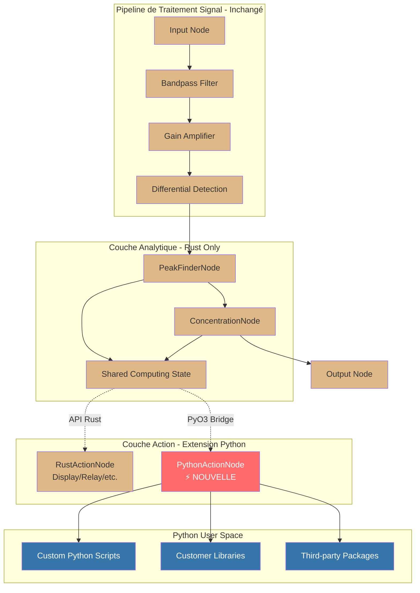
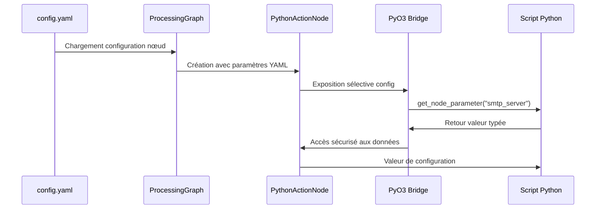
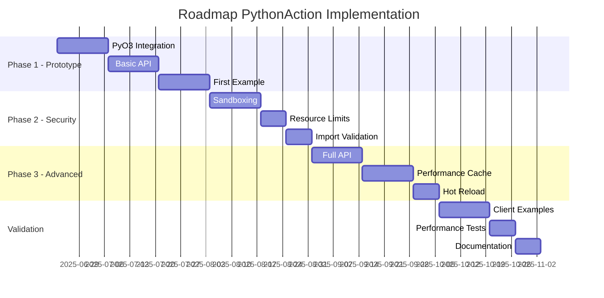

# Analyse de Faisabilité : PythonAction - Extension Python pour ActionNode

## Résumé Exécutif

**Objectif** : Étendre l'architecture ActionNode existante avec un modèle `PythonAction` permettant aux clients de développer des actions propriétaires en Python, interfacées avec rust-photoacoustic via PyO3.

**Faisabilité** : ✅ **HAUTEMENT FAISABLE** - L'architecture ActionNode existante offre une base solide pour cette extension. PyO3 s'intègre naturellement avec l'écosystème Rust existant et permet d'exposer de manière sélective les API Rust tout en gardant les performances critiques.

**Stratégie Recommandée** : Implémentation progressive en 3 phases avec exposition limitée des API pour maintenir les performances et la sécurité.

---

## 1. Contexte et Architecture Existante

### 1.1 Base Architecturale Disponible

L'analyse du code révèle une architecture ActionNode robuste déjà implémentée :

```rust
// Trait ActionNode existant dans /src/processing/computing_nodes/
pub trait ActionNode: ProcessingNode {
    fn buffer_size(&self) -> usize;
    fn set_buffer_size(&mut self, new_size: usize) -> Result<()>;
    fn update_from_computing_data(&mut self, computing_data: &ComputingSharedData) -> Result<()>;
    fn trigger_action(&mut self, trigger: ActionTrigger) -> Result<bool>;
    fn get_history_buffer(&self) -> &CircularBuffer<ActionHistoryEntry>;
    fn get_monitored_node_ids(&self) -> Vec<String>;
    // ... autres méthodes
}
```

**Atouts pour l'extension Python** :
- ✅ **Trait stabilisé** : Interface ActionNode mature et testée
- ✅ **Pass-through processing** : Aucun impact sur les performances du pipeline principal
- ✅ **Buffer circulaire** : Gestion d'historique déjà implémentée en Rust (performances préservées)
- ✅ **SharedComputingState** : Accès aux données analytiques déjà sécurisé
- ✅ **UniversalDisplayActionNode** : Template de référence disponible

### 1.2 Points d'Extension Identifiés



---

## 2. Architecture Technique PythonAction

### 2.1 Composants Principaux

#### 2.1.1 PythonActionNode (Rust Core)

```rust
/// PythonActionNode - Pont entre Rust et Python
/// 
/// Responsabilités :
/// - Implémente le trait ActionNode (cohérence architecturale)
/// - Gère l'interpréteur Python via PyO3
/// - Expose une API Rust limitée aux scripts Python
/// - Maintient la performance des opérations critiques en Rust
pub struct PythonActionNode {
    // Champs ActionNode standards (en Rust pour performance)
    id: String,
    history_buffer: CircularBuffer<ActionHistoryEntry>,  // RUST ONLY
    monitored_nodes: Vec<String>,
    shared_computing_state: Option<SharedComputingState>, // RUST ONLY
    
    // Extension Python
    python_interpreter: Python,                           // PyO3 interpreter
    python_module: PyObject,                             // Module Python chargé
    python_config: PythonActionConfig,                   // Configuration
    
    // Cache et performance
    exposed_api_cache: PyO3APICache,                     // Cache d'API exposée
    performance_metrics: PythonPerformanceMetrics,      // Monitoring
}
```

#### 2.1.2 API Python Exposée (Limitée et Sécurisée)

```python
# API Python disponible aux clients
class RustPhotoacousticAPI:
    """
    API exposée aux scripts Python - LECTURE SEULE pour données critiques
    """
    
    def get_concentration_data(self, node_id: str) -> Optional[float]:
        """Lecture des données de concentration (ppm)"""
        
    def get_peak_frequency(self, node_id: str) -> Optional[float]:
        """Lecture de la fréquence de pic détectée (Hz)"""
        
    def get_peak_amplitude(self, node_id: str) -> Optional[float]:
        """Lecture de l'amplitude de pic (0.0-1.0)"""
        
    def get_node_statistics(self, node_id: str) -> Dict[str, Any]:
        """Statistiques de performance du nœud"""
        
    def log_message(self, level: str, message: str):
        """Écriture dans le système de log Rust"""
        
    def trigger_notification(self, message: str, severity: str) -> bool:
        """Déclencher une notification système"""
        
    def get_node_config(self) -> Dict[str, Any]:
        """
        Accès à la configuration du nœud PythonAction (LECTURE SEULE)
        
        Retourne la configuration YAML spécifique à ce nœud PythonAction,
        permettant aux scripts Python d'accéder à leurs paramètres de configuration.
        
        Returns:
            Dict[str, Any]: Configuration du nœud depuis config.yaml
            
        Example:
            ```python
            config = api.get_node_config()
            smtp_server = config.get("smtp_server", "localhost")
            threshold = config.get("concentration_threshold", 1000.0)
            recipients = config.get("email_recipients", [])
            ```
        """
        
    def get_node_parameter(self, parameter_name: str, default_value: Any = None) -> Any:
        """
        Accès direct à un paramètre de configuration spécifique
        
        Args:
            parameter_name: Nom du paramètre dans la configuration YAML
            default_value: Valeur par défaut si le paramètre n'existe pas
            
        Returns:
            Any: Valeur du paramètre ou default_value
            
        Example:
            ```python
            # Plus pratique que get_node_config() pour un seul paramètre
            smtp_server = api.get_node_parameter("smtp_server", "localhost")
            port = api.get_node_parameter("smtp_port", 587)
            ```
        """
        
    def get_monitored_node_ids(self) -> List[str]:
        """
        Liste des nœuds de calcul monitorés par ce PythonAction
        
        Retourne la liste des IDs de nœuds (PeakFinder, Concentration) que
        ce PythonAction surveille, telle que configurée dans monitored_nodes.
        
        Returns:
            List[str]: Liste des IDs de nœuds monitorés
        """
        
    # Buffer circulaire - LECTURE SEULE (performance critique)
    def get_history_count(self) -> int:
        """Nombre d'entrées dans l'historique"""
        
    def get_recent_entries(self, count: int) -> List[Dict[str, Any]]:
        """Dernières entrées d'historique (lecture seule)"""
```

#### 2.1.3 Interface Python Client

```python
# Interface que le client doit implémenter
class CustomPythonAction:
    """
    Interface à implémenter par les clients
    """
    
    def __init__(self, api: RustPhotoacousticAPI):
        """
        Initialisation avec API Rust
        
        L'API fournit l'accès à la configuration via get_node_config() et get_node_parameter().
        Plus besoin de passer la configuration manuellement.
        
        Args:
            api: Instance de RustPhotoacousticAPI avec accès à la configuration
        """
        self.api = api
        
        # Accès direct à la configuration du nœud depuis Rust
        self.config = api.get_node_config()
        
        # Ou accès paramètre par paramètre avec valeurs par défaut
        self.threshold = api.get_node_parameter("concentration_threshold", 1000.0)
        self.monitored_nodes = api.get_monitored_node_ids()
        
    def on_trigger(self, trigger_type: str, data: Dict[str, Any]) -> bool:
        """
        Appelé quand une condition de déclenchement est détectée
        
        Args:
            trigger_type: Type de trigger ("concentration", "amplitude", etc.)
            data: Données associées au trigger
            
        Returns:
            bool: True si l'action a été exécutée avec succès
        """
        raise NotImplementedError("Clients must implement on_trigger")
        
    def on_update(self, computing_data: Dict[str, Any]):
        """
        Appelé périodiquement avec les dernières données de calcul
        """
        pass
        
    def get_status(self) -> Dict[str, Any]:
        """
        Retourne le statut actuel de l'action Python
        """
        return {"status": "active"}
```

### 2.2 Exemple d'Implémentation Client

```python
# /user_scripts/custom_email_action.py
import smtplib
from email.mime.text import MIMEText
from datetime import datetime
from typing import Dict, Any

class EmailNotificationAction(CustomPythonAction):
    """
    Action personnalisée : notifications email sur seuils
    """
    
    def __init__(self, api: RustPhotoacousticAPI):
        super().__init__(api)
        
        # Configuration récupérée automatiquement depuis Rust
        self.smtp_server = self.api.get_node_parameter("smtp_server", "localhost")
        self.smtp_port = self.api.get_node_parameter("smtp_port", 587)
        self.username = self.api.get_node_parameter("username")
        self.password = self.api.get_node_parameter("password")
        self.recipients = self.api.get_node_parameter("recipients", [])
        self.notification_interval = self.api.get_node_parameter("notification_interval_seconds", 300)
        
        # État interne
        self.last_notification = {}
        
        # Validation de la configuration
        if not self.username or not self.password:
            raise ValueError("SMTP username and password are required in node configuration")
        if not self.recipients:
            raise ValueError("Email recipients list is required in node configuration")
        
    def on_trigger(self, trigger_type: str, data: Dict[str, Any]) -> bool:
        """Envoi d'email sur déclenchement"""
        try:
            # Éviter le spam - max 1 email par 5 minutes
            now = datetime.now()
            last = self.last_notification.get(trigger_type)
            if last and (now - last).seconds < 300:
                return False
                
            # Construire le message
            if trigger_type == "concentration":
                concentration = data.get("value", 0)
                threshold = data.get("threshold", 0)
                source = data.get("source_node_id", "unknown")
                
                subject = f"⚠️ Alerte Concentration - {source}"
                body = f"""
                Seuil de concentration dépassé :
                
                • Concentration actuelle : {concentration:.2f} ppm
                • Seuil configuré : {threshold:.2f} ppm  
                • Nœud source : {source}
                • Horodatage : {now}
                
                Vérifiez votre système photoacoustique.
                """
                
                # Envoyer l'email
                self._send_email(subject, body)
                self.last_notification[trigger_type] = now
                
                # Logger dans le système Rust
                self.api.log_message("info", f"Email notification sent for {trigger_type}")
                return True
                
        except Exception as e:
            self.api.log_message("error", f"Email action failed: {str(e)}")
            return False
            
        return False
        
    def _send_email(self, subject: str, body: str):
        """Envoi d'email via SMTP"""
        msg = MIMEText(body)
        msg['Subject'] = subject
        msg['From'] = self.username
        msg['To'] = ', '.join(self.recipients)
        
        with smtplib.SMTP(self.smtp_server, self.smtp_port) as server:
            server.starttls()
            server.login(self.username, self.password)
            server.send_message(msg)
            
    def on_update(self, computing_data: Dict[str, Any]):
        """Mise à jour périodique - analyse de tendances"""
        # Optionnel : analyser les tendances pour alertes prédictives
        pass
        
    def get_status(self) -> Dict[str, Any]:
        """Statut de l'action email"""
        return {
            "status": "active",
            "smtp_server": self.smtp_server,
            "recipients_count": len(self.recipients),
            "last_notifications": self.last_notification
        }
```

### 2.3 Configuration YAML

```yaml
# config.yaml - Extension pour PythonAction
processing:
  default_graph:
    nodes:
      # ... autres nœuds existants
      
      - id: "python_email_alerts"
        type: "python_action"
        parameters:
          # Configuration PythonAction
          python_script_path: "/user_scripts/custom_email_action.py"
          python_class_name: "EmailNotificationAction"
          
          # Configuration de monitoring
          monitored_nodes: ["co2_peak_finder", "co2_concentration"]
          buffer_size: 100
          
          # Déclencheurs 
          concentration_threshold: 1000.0   # ppm
          amplitude_threshold: 0.8          # 0.0-1.0
          
          # Configuration Python spécifique
          python_config:
            smtp_server: "smtp.gmail.com"
            smtp_port: 587
            username: "alerts@company.com"
            password: "${EMAIL_PASSWORD}"     # Variable d'environnement
            recipients: 
              - "operator@company.com"
              - "supervisor@company.com"
              
          # Sécurité
          python_timeout_ms: 5000           # Timeout d'exécution Python
          max_memory_mb: 64                 # Limite mémoire Python
          allowed_imports:                  # Modules Python autorisés
            - "smtplib"
            - "email"
            - "datetime"
            - "json"
            - "csv"
            - "requests"                    # HTTP client
```

### 2.4 Architecture de l'API de Configuration

#### 2.4.1 Pont Configuration Rust ↔ Python

L'architecture suivante assure un accès sécurisé et performant à la configuration :



#### 2.4.2 Implémentation Rust de l'API de Configuration

```rust
/// API de configuration exposée aux scripts Python
impl RustPhotoacousticAPIImpl {
    /// Accès à la configuration complète du nœud
    fn get_node_config(&self) -> PyResult<PyDict> {
        Python::with_gil(|py| {
            let dict = PyDict::new(py);
            
            // Conversion sécurisée des paramètres Rust vers Python
            let config_data = &self.node_config.parameters;
            
            for (key, value) in config_data.iter() {
                let py_value = self.json_to_python(py, value)?;
                dict.set_item(key, py_value)?;
            }
            
            Ok(dict.into())
        })
    }
    
    /// Accès à un paramètre spécifique avec type-checking
    fn get_node_parameter(&self, param_name: &str, default_value: Option<&PyAny>) -> PyResult<PyObject> {
        Python::with_gil(|py| {
            // Recherche dans la configuration du nœud
            if let Some(value) = self.node_config.parameters.get(param_name) {
                self.json_to_python(py, value)
            } else if let Some(default) = default_value {
                Ok(default.into())
            } else {
                Ok(py.None())
            }
        })
    }
    
    /// Conversion sécurisée JSON → Python avec validation de type
    fn json_to_python(&self, py: Python, value: &serde_json::Value) -> PyResult<PyObject> {
        match value {
            serde_json::Value::String(s) => Ok(s.into_py(py)),
            serde_json::Value::Number(n) => {
                if let Some(i) = n.as_i64() {
                    Ok(i.into_py(py))
                } else if let Some(f) = n.as_f64() {
                    Ok(f.into_py(py))
                } else {
                    Err(PyErr::new::<pyo3::exceptions::PyValueError, _>("Invalid number"))
                }
            },
            serde_json::Value::Bool(b) => Ok(b.into_py(py)),
            serde_json::Value::Array(arr) => {
                let py_list = PyList::new(py, arr.iter().map(|v| self.json_to_python(py, v)));
                Ok(py_list.into())
            },
            serde_json::Value::Object(obj) => {
                let py_dict = PyDict::new(py);
                for (k, v) in obj {
                    py_dict.set_item(k, self.json_to_python(py, v)?)?;
                }
                Ok(py_dict.into())
            },
            serde_json::Value::Null => Ok(py.None()),
        }
    }
}
```

#### 2.4.3 Validation et Sécurité de Configuration

```rust
/// Validation de la configuration Python avant exécution
impl PythonActionNode {
    fn validate_python_config(&self, config: &PythonActionConfig) -> Result<()> {
        // 1. Vérifier que le script Python existe
        if !std::path::Path::new(&config.python_script_path).exists() {
            return Err(anyhow::anyhow!("Python script not found: {}", config.python_script_path));
        }
        
        // 2. Valider les limites de ressources
        if config.max_memory_mb > 512 {
            return Err(anyhow::anyhow!("Python memory limit too high: {} MB", config.max_memory_mb));
        }
        
        if config.python_timeout_ms > 30000 {
            return Err(anyhow::anyhow!("Python timeout too high: {} ms", config.python_timeout_ms));
        }
        
        // 3. Valider les imports autorisés
        for import in &config.allowed_imports {
            if !self.is_safe_import(import) {
                return Err(anyhow::anyhow!("Unsafe Python import: {}", import));
            }
        }
        
        Ok(())
    }
    
    fn is_safe_import(&self, module: &str) -> bool {
        // Liste blanche de modules Python sécurisés
        const SAFE_MODULES: &[&str] = &[
            "smtplib", "email", "datetime", "json", "csv", "time", "math",
            "requests", "urllib", "base64", "hashlib", "hmac", "os.path",
            "logging", "re", "collections", "itertools", "functools"
        ];
        
        SAFE_MODULES.contains(&module) || module.starts_with("email.")
    }
}
```

#### 2.4.4 Exemple d'Utilisation Complète

```python
# /user_scripts/advanced_webhook_action.py
class WebhookNotificationAction(CustomPythonAction):
    """Action webhook avec configuration flexible"""
    
    def __init__(self, api: RustPhotoacousticAPI):
        super().__init__(api)
        
        # Configuration récupérée de manière type-safe
        self.webhook_url = self.api.get_node_parameter("webhook_url")
        self.api_key = self.api.get_node_parameter("api_key")
        self.timeout_seconds = self.api.get_node_parameter("timeout_seconds", 10)
        self.retry_count = self.api.get_node_parameter("retry_count", 3)
        
        # Configuration avancée avec structure complexe
        notification_config = self.api.get_node_parameter("notification_config", {})
        self.templates = notification_config.get("templates", {})
        self.escalation_rules = notification_config.get("escalation", [])
        
        # Validation
        if not self.webhook_url:
            raise ValueError("webhook_url is required in node configuration")
            
    def on_trigger(self, trigger_type: str, data: Dict[str, Any]) -> bool:
        """Envoi webhook avec template dynamique"""
        template = self.templates.get(trigger_type, self.templates.get("default", {}))
        
        payload = {
            "timestamp": datetime.now().isoformat(),
            "trigger_type": trigger_type,
            "sensor_data": data,
            "message": template.get("message", "Photoacoustic alert triggered"),
            "severity": template.get("severity", "warning"),
            "node_id": self.api.get_monitored_node_ids()
        }
        
        return self._send_webhook(payload)
```

---

## 3. Implémentation Technique Détaillée

### 3.1 Intégration PyO3

#### 3.1.1 Dépendances Cargo.toml

```toml
[dependencies]
# ... dépendances existantes

# Extension Python
pyo3 = { version = "0.22", features = ["auto-initialize", "extension-module"] }
pyo3-asyncio = { version = "0.22", features = ["tokio-runtime"] }
```

#### 3.1.2 Module PyO3 Rust

```rust
// /src/processing/python_action/mod.rs
use pyo3::prelude::*;
use pyo3::types::*;
use std::sync::Arc;
use tokio::sync::RwLock;
use crate::processing::computing_nodes::{
    ActionNode, ActionTrigger, ComputingSharedData, SharedComputingState
};

/// Configuration pour PythonActionNode
#[derive(Debug, Clone, Serialize, Deserialize)]
pub struct PythonActionConfig {
    pub python_script_path: String,
    pub python_class_name: String,
    pub python_config: serde_json::Value,
    pub python_timeout_ms: u64,
    pub max_memory_mb: u64,
    pub allowed_imports: Vec<String>,
}

/// API exposée aux scripts Python
#[pyclass]
struct RustPhotoacousticAPI {
    shared_state: SharedComputingState,
    node_id: String,
}

#[pymethods]
impl RustPhotoacousticAPI {
    #[getter]
    fn get_concentration_data(&self, node_id: String) -> PyResult<Option<f64>> {
        Python::with_gil(|py| {
            // Accès thread-safe aux données de concentration
            if let Ok(state) = self.shared_state.try_read() {
                // Accès spécifique par node_id si multi-nodes
                Ok(state.concentration_ppm.map(|c| c as f64))
            } else {
                Ok(None)
            }
        })
    }
    
    #[getter] 
    fn get_peak_frequency(&self, node_id: String) -> PyResult<Option<f64>> {
        Python::with_gil(|py| {
            if let Ok(state) = self.shared_state.try_read() {
                Ok(state.peak_frequency.map(|f| f as f64))
            } else {
                Ok(None)
            }
        })
    }
    
    fn log_message(&self, level: String, message: String) -> PyResult<()> {
        match level.as_str() {
            "info" => log::info!("[PythonAction:{}] {}", self.node_id, message),
            "warn" => log::warn!("[PythonAction:{}] {}", self.node_id, message),
            "error" => log::error!("[PythonAction:{}] {}", self.node_id, message),
            _ => log::debug!("[PythonAction:{}] {}", self.node_id, message),
        }
        Ok(())
    }
    
    // Autres méthodes API...
}

/// PythonActionNode principal
pub struct PythonActionNode {
    id: String,
    history_buffer: CircularBuffer<ActionHistoryEntry>,
    monitored_nodes: Vec<String>,
    shared_computing_state: Option<SharedComputingState>,
    
    // Python components
    python_config: PythonActionConfig,
    python_instance: PyObject,
    python_api: Arc<RustPhotoacousticAPI>,
    
    // Performance monitoring
    execution_time_stats: ExecutionTimeStats,
    error_count: u64,
}

impl PythonActionNode {
    pub fn new(id: String, config: PythonActionConfig) -> Result<Self> {
        // Initialiser l'interpréteur Python
        let python_instance = Python::with_gil(|py| -> PyResult<PyObject> {
            // Charger le script Python
            let code = std::fs::read_to_string(&config.python_script_path)?;
            let module = PyModule::from_code(py, &code, "user_script.py", "user_script")?;
            
            // Instancier la classe Python
            let class = module.getattr(&config.python_class_name)?;
            
            // Créer l'API Rust pour Python
            let api = RustPhotoacousticAPI {
                shared_state: Default::default(), // Sera mis à jour par set_shared_computing_state
                node_id: id.clone(),
            };
            
            // Instancier avec config
            let instance = class.call1((api, config.python_config.clone()))?;
            Ok(instance.to_object(py))
        })?;
        
        Ok(Self {
            id,
            history_buffer: CircularBuffer::new(100),
            monitored_nodes: Vec::new(),
            shared_computing_state: None,
            python_config: config,
            python_instance,
            python_api: Arc::new(api),
            execution_time_stats: ExecutionTimeStats::new(),
            error_count: 0,
        })
    }
    
    /// Exécution sécurisée du code Python avec timeout
    fn execute_python_action(&mut self, method: &str, args: &PyTuple) -> Result<PyObject> {
        let start_time = std::time::Instant::now();
        
        let result = Python::with_gil(|py| -> PyResult<PyObject> {
            // Timeout protection
            let timeout = Duration::from_millis(self.python_config.python_timeout_ms);
            
            // Appel de la méthode Python
            let method_obj = self.python_instance.getattr(py, method)?;
            let result = method_obj.call1(py, args)?;
            
            Ok(result)
        });
        
        // Mesurer les performances
        let execution_time = start_time.elapsed();
        self.execution_time_stats.record(execution_time);
        
        match result {
            Ok(obj) => Ok(obj),
            Err(e) => {
                self.error_count += 1;
                log::error!("[PythonAction:{}] Python execution failed: {}", self.id, e);
                Err(anyhow::anyhow!("Python execution failed: {}", e))
            }
        }
    }
}

impl ProcessingNode for PythonActionNode {
    fn process(&mut self, input: ProcessingData) -> Result<ProcessingData> {
        // Pass-through processing (comme les autres ActionNode)
        
        // Mise à jour depuis shared computing state
        if let Some(shared_state) = &self.shared_computing_state {
            if let Ok(computing_data) = shared_state.try_read() {
                let _ = self.update_from_computing_data(&computing_data);
            }
        }
        
        // Retourner l'input inchangé (pass-through)
        Ok(input)
    }
    
    fn node_id(&self) -> &str { &self.id }
    fn node_type(&self) -> &str { "python_action" }
    
    fn accepts_input(&self, _input: &ProcessingData) -> bool { true }
    fn output_type(&self, input: &ProcessingData) -> Option<String> {
        Some("PassThrough".to_string())
    }
    
    fn reset(&mut self) {
        self.history_buffer.clear();
        self.execution_time_stats.reset();
        self.error_count = 0;
    }
    
    fn clone_node(&self) -> Box<dyn ProcessingNode> {
        // Recréer l'instance Python
        Box::new(PythonActionNode::new(self.id.clone(), self.python_config.clone()).unwrap())
    }
    
    fn supports_hot_reload(&self) -> bool { true }
}

impl ActionNode for PythonActionNode {
    fn trigger_action(&mut self, trigger: ActionTrigger) -> Result<bool> {
        // Convertir le trigger Rust en format Python
        let trigger_data = Python::with_gil(|py| -> PyResult<PyObject> {
            match trigger {
                ActionTrigger::ConcentrationThreshold { value, threshold, source_node_id } => {
                    let dict = PyDict::new(py);
                    dict.set_item("type", "concentration")?;
                    dict.set_item("value", value)?;
                    dict.set_item("threshold", threshold)?;
                    dict.set_item("source_node_id", source_node_id)?;
                    Ok(dict.to_object(py))
                }
                // ... autres types de triggers
            }
        })?;
        
        // Appeler on_trigger en Python
        let args = Python::with_gil(|py| PyTuple::new(py, &[trigger_data]));
        let result = self.execute_python_action("on_trigger", &args)?;
        
        // Convertir le résultat Python en bool
        Python::with_gil(|py| {
            result.extract::<bool>(py).unwrap_or(false)
        })
    }
    
    fn update_from_computing_data(&mut self, computing_data: &ComputingSharedData) -> Result<()> {
        // Convertir les données en format Python
        let data_dict = Python::with_gil(|py| -> PyResult<PyObject> {
            let dict = PyDict::new(py);
            
            if let Some(conc) = computing_data.concentration_ppm {
                dict.set_item("concentration_ppm", conc)?;
            }
            if let Some(freq) = computing_data.peak_frequency {
                dict.set_item("peak_frequency", freq)?;
            }
            if let Some(amp) = computing_data.peak_amplitude {
                dict.set_item("peak_amplitude", amp)?;
            }
            
            Ok(dict.to_object(py))
        })?;
        
        // Appeler on_update en Python
        let args = Python::with_gil(|py| PyTuple::new(py, &[data_dict]));
        self.execute_python_action("on_update", &args)?;
        
        Ok(())
    }
    
    // Implémentations des autres méthodes ActionNode...
    fn buffer_size(&self) -> usize { self.history_buffer.capacity() }
    fn get_history_buffer(&self) -> &CircularBuffer<ActionHistoryEntry> { &self.history_buffer }
    fn get_monitored_node_ids(&self) -> Vec<String> { self.monitored_nodes.clone() }
}
```

### 3.2 Factory Pattern pour Configuration

```rust
// /src/config/python_action.rs
impl ProcessingGraphFactory {
    fn create_python_action_node(config: &NodeConfig) -> Result<Box<dyn ProcessingNode>> {
        let python_config: PythonActionConfig = serde_json::from_value(
            config.parameters.clone()
        )?;
        
        // Validation de sécurité
        validate_python_script(&python_config.python_script_path)?;
        validate_python_imports(&python_config.allowed_imports)?;
        
        let node = PythonActionNode::new(config.id.clone(), python_config)?;
        Ok(Box::new(node))
    }
}

fn validate_python_script(script_path: &str) -> Result<()> {
    // Vérifications de sécurité :
    // 1. Le fichier existe et est lisible
    // 2. Le chemin est dans un répertoire autorisé
    // 3. Le script ne contient pas d'imports dangereux
    
    if !std::path::Path::new(script_path).exists() {
        return Err(anyhow::anyhow!("Python script not found: {}", script_path));
    }
    
    // Vérifier que le script est dans /user_scripts/ ou similaire
    let allowed_dirs = vec!["/user_scripts/", "./user_scripts/", "user_scripts/"];
    if !allowed_dirs.iter().any(|dir| script_path.starts_with(dir)) {
        return Err(anyhow::anyhow!("Python script must be in allowed directory"));
    }
    
    // Scanner le code pour imports dangereux
    let content = std::fs::read_to_string(script_path)?;
    let dangerous_imports = vec!["os", "sys", "subprocess", "__import__"];
    for dangerous in &dangerous_imports {
        if content.contains(&format!("import {}", dangerous)) {
            return Err(anyhow::anyhow!("Dangerous import detected: {}", dangerous));
        }
    }
    
    Ok(())
}
```

---

## 4. Avantages et Limitations

### 4.1 Avantages Majeurs

#### 4.1.1 Pour les Clients
✅ **Flexibilité Maximale** : Développement d'actions personnalisées en Python
✅ **Écosystème Python** : Accès aux bibliothèques Python (requests, pandas, matplotlib)
✅ **Prototypage Rapide** : Développement itératif sans recompilation Rust
✅ **APIs Familières** : Syntaxe Python naturelle pour les non-Rustaceans

#### 4.1.2 Pour l'Architecture
✅ **Isolation de Performance** : Pipeline principal en Rust inchangé
✅ **Sécurité Contrôlée** : API exposée limitée, pas d'accès direct aux structures critiques
✅ **Cohérence Architecturale** : Implémente le trait ActionNode existant
✅ **Monitoring Intégré** : Métriques de performance Python intégrées

### 4.2 Limitations et Contraintes

#### 4.2.1 Performances
⚠️ **Overhead PyO3** : Coût de marshalling des données Rust ↔ Python
⚠️ **GIL Python** : Limitations de concurrence Python (mais actions généralement I/O bound)
⚠️ **Mémoire** : Consommation mémoire supplémentaire pour l'interpréteur Python

#### 4.2.2 Sécurité et Stabilité
⚠️ **Code Non-Contrôlé** : Scripts Python clients peuvent être instables
⚠️ **Surface d'Attaque** : Extension de la surface d'attaque avec Python
⚠️ **Isolation** : Nécessite des mécanismes de sandboxing pour la production

### 4.3 Comparaison avec Alternatives

| Critère | PythonAction | ActionNode Rust Pur | WASM Action |
|---------|--------------|---------------------|-------------|
| **Facilité Développement** | ⭐⭐⭐⭐⭐ | ⭐⭐⭐ | ⭐⭐⭐⭐ |
| **Performance** | ⭐⭐⭐ | ⭐⭐⭐⭐⭐ | ⭐⭐⭐⭐ |
| **Écosystème** | ⭐⭐⭐⭐⭐ | ⭐⭐⭐ | ⭐⭐ |
| **Sécurité** | ⭐⭐⭐ | ⭐⭐⭐⭐⭐ | ⭐⭐⭐⭐ |
| **Déploiement** | ⭐⭐⭐ | ⭐⭐⭐⭐⭐ | ⭐⭐⭐⭐ |

---

## 5. Stratégie d'Implémentation

### 5.1 Roadmap en 3 Phases

#### Phase 1 : Prototype et Validation (4-6 semaines)
- [ ] **Intégration PyO3** : Configuration et dépendances de base
- [ ] **API minimale** : Exposition de 3-4 méthodes critiques (concentration, peak_frequency)
- [ ] **PythonActionNode basique** : Implémentation trait ActionNode
- [ ] **Exemple simple** : Script Python de notification basique
- [ ] **Tests unitaires** : Validation marshalling Rust ↔ Python

#### Phase 2 : Enrichissement API (6-8 semaines)  
- [ ] **API complète** : Toutes les méthodes de lecture SharedComputingState
- [ ] **Gestion erreurs** : Timeout, exception handling, recovery
- [ ] **Configuration avancée** : Support complet configuration YAML
- [ ] **Exemples clients** : Email, HTTP webhook, base de données
- [ ] **Monitoring** : Métriques de performance Python intégrées

#### Phase 3 : Production et Sécurité (4-6 semaines)
- [ ] **Sandboxing** : Isolation mémoire et imports restreints
- [ ] **Hot-reload** : Rechargement dynamique scripts Python
- [ ] **Documentation** : Guide développeur et API référence
- [ ] **Tests d'intégration** : Validation en conditions réelles
- [ ] **Optimisations** : Cache API, réduction overhead PyO3

### 5.2 Métriques de Succès

| Métrique | Objectif | Mesure |
|----------|----------|--------|
| **Performance Pipeline** | < 5% overhead | Temps d'exécution graphe avec/sans PythonAction |
| **Latence Python** | < 10ms par trigger | Temps moyen d'exécution on_trigger |
| **Mémoire** | < 50MB par instance | Consommation mémoire PythonActionNode |
| **Stabilité** | > 99.9% uptime | Taux de succès exécution Python |
| **Facilité Usage** | < 1h pour script simple | Temps développement notification email |

---

## 6. Cas d'Usage Clients Identifiés

### 6.1 Notifications et Alertes

```python
# Cas d'usage : Notifications multi-canal
class MultiChannelAlertAction(CustomPythonAction):
    def on_trigger(self, trigger_type: str, data: Dict[str, Any]) -> bool:
        # Email, SMS, Slack, Teams, Discord
        # Escalation selon gravité
        # Templates personnalisables
```

### 6.2 Intégrations Tiers

```python
# Cas d'usage : Intégration ERP/SCADA
class ERPIntegrationAction(CustomPythonAction):
    def on_trigger(self, trigger_type: str, data: Dict[str, Any]) -> bool:
        # API REST vers ERP
        # Création tickets maintenance
        # Mise à jour tableaux de bord
```

### 6.3 Analyses Avancées

```python
# Cas d'usage : Analytics et ML
class MLPredictionAction(CustomPythonAction):
    def on_update(self, computing_data: Dict[str, Any]):
        # Modèles de prédiction
        # Analyses de tendances
        # Maintenance prédictive
```

### 6.4 Base de Données et Reporting

```python
# Cas d'usage : Logging avancé
class DatabaseLoggingAction(CustomPythonAction):
    def on_trigger(self, trigger_type: str, data: Dict[str, Any]) -> bool:
        # PostgreSQL, MongoDB, InfluxDB
        # Rapports automatiques
        # Compliance et audit
```

---

## 7. Considérations de Sécurité

### 7.1 Sandboxing Python

```rust
// Restrictions d'exécution
pub struct PythonSandbox {
    allowed_imports: HashSet<String>,
    memory_limit_mb: usize,
    execution_timeout_ms: u64,
    file_access_whitelist: Vec<PathBuf>,
}

impl PythonSandbox {
    fn validate_script(&self, script_content: &str) -> Result<()> {
        // Analyse statique du code Python
        // Vérification imports autorisés
        // Détection patterns dangereux
    }
    
    fn execute_with_limits<F>(&self, f: F) -> Result<PyObject> 
    where F: FnOnce() -> PyResult<PyObject> {
        // Contrôle mémoire et timeout
        // Monitoring resources
    }
}
```

### 7.2 API Surface Minimale

```python
# API exposée - LECTURE SEULE pour données critiques
class RustPhotoacousticAPI:
    # ✅ Autorisé : lecture données analytiques
    def get_concentration_data(self, node_id: str) -> Optional[float]
    def get_peak_frequency(self, node_id: str) -> Optional[float]
    
    # ✅ Autorisé : logging contrôlé
    def log_message(self, level: str, message: str)
    
    # ❌ INTERDIT : accès direct buffer circulaire (performance)
    # ❌ INTERDIT : modification SharedComputingState
    # ❌ INTERDIT : contrôle pipeline processing
```

---

## 8. Roadmap d'Implémentation

### 8.1 Phase 1 : Prototype et API de Base (4-6 semaines)

#### 8.1.1 Objectifs
- Validation de faisabilité PyO3 avec rust-photoacoustic
- API Python minimale fonctionnelle
- Premier exemple fonctionnel (DisplayPythonAction)

#### 8.1.2 Livrables
```rust
// Implémentation minimale PythonActionNode
pub struct PythonActionNode {
    // Champs ActionNode de base
    id: String,
    history_buffer: CircularBuffer<ActionHistoryEntry>,
    shared_computing_state: Option<SharedComputingState>,
    
    // Extension Python basique
    python_interpreter: Python,
    python_config: PythonActionConfig,
}

impl ActionNode for PythonActionNode {
    // Implémentation du trait avec appels Python
    fn trigger_action(&mut self, trigger: ActionTrigger) -> Result<bool> {
        self.call_python_on_trigger(trigger)
    }
}
```

```python
# API Python Phase 1 - Fonctionnalités de base
class RustPhotoacousticAPI:
    def get_concentration_data(self, node_id: str) -> Optional[float]: pass
    def get_peak_frequency(self, node_id: str) -> Optional[float]: pass
    def get_node_parameter(self, param: str, default: Any) -> Any: pass
    def log_message(self, level: str, message: str): pass
```

#### 8.1.3 Critères de Validation Phase 1
- [ ] Compilation réussie avec PyO3
- [ ] Exemple Python fonctionnel (affichage console)
- [ ] Accès aux données de concentration 
- [ ] Configuration YAML intégrée
- [ ] Pas de régression de performance sur pipeline principal

### 8.2 Phase 2 : Sandboxing et Sécurité (3-4 semaines)

#### 8.2.1 Objectifs
- Implémentation des restrictions de sécurité
- Gestion des timeouts et limites mémoire
- Validation des imports Python
- Monitoring des performances Python

#### 8.2.2 Livrables
```rust
// Sandboxing et sécurité
pub struct PythonSecurityManager {
    allowed_imports: HashSet<String>,
    max_memory_mb: u64,
    timeout_ms: u64,
    execution_monitor: PythonExecutionMonitor,
}

impl PythonSecurityManager {
    fn validate_script(&self, script_path: &str) -> Result<()>;
    fn execute_with_limits<T>(&self, callback: impl FnOnce() -> T) -> Result<T>;
    fn monitor_resources(&self) -> PythonResourceUsage;
}
```

#### 8.2.3 Critères de Validation Phase 2
- [ ] Scripts Python isolés et limités en ressources
- [ ] Timeout automatique sur scripts bloquants
- [ ] Validation statique des imports
- [ ] Monitoring temps d'exécution < 5ms
- [ ] Gestion gracieuse des erreurs Python

### 8.3 Phase 3 : API Avancée et Optimisations (4-5 semaines)

#### 8.3.1 Objectifs
- API Python complète avec buffer historique
- Cache des appels Python pour performances
- Hot-reload des scripts Python
- Intégration dans l'interface web

#### 8.3.2 Livrables
```python
# API Python Phase 3 - Fonctionnalités avancées
class RustPhotoacousticAPI:
    # Configuration avancée
    def get_node_config(self) -> Dict[str, Any]: pass
    def get_monitored_node_ids(self) -> List[str]: pass
    
    # Accès historique (lecture seule)
    def get_history_count(self) -> int: pass
    def get_recent_entries(self, count: int) -> List[Dict]: pass
    
    # Notifications système
    def trigger_notification(self, message: str, severity: str) -> bool: pass
    
    # Statistiques de performance
    def get_node_statistics(self, node_id: str) -> Dict[str, Any]: pass
```

```rust
// Cache et optimisations
pub struct PyO3APICache {
    method_cache: HashMap<String, PyObject>,
    data_cache: LruCache<String, CachedValue>,
    cache_ttl_ms: u64,
}

impl PythonActionNode {
    fn call_python_cached(&mut self, method: &str, args: &PyTuple) -> PyResult<PyObject>;
    fn reload_python_script(&mut self) -> Result<()>; // Hot-reload
}
```

#### 8.3.3 Critères de Validation Phase 3
- [ ] API Python complète et documentée
- [ ] Exemples clients multiples (email, webhook, database)
- [ ] Hot-reload sans redémarrage serveur
- [ ] Interface web pour monitoring PythonActions
- [ ] Documentation utilisateur complète

### 8.4 Tests et Validation Clients (2-3 semaines)

#### 8.4.1 Exemples Clients de Référence
1. **EmailActionNode** : Notifications SMTP sur seuils
2. **WebhookActionNode** : Callbacks HTTP vers systèmes externes
3. **DatabaseActionNode** : Enregistrement données vers PostgreSQL/MongoDB
4. **LEDControlActionNode** : Contrôle GPIO pour affichage LED
5. **PredictiveActionNode** : ML/IA pour alertes prédictives

#### 8.4.2 Métriques de Performance Cibles
- **Startup Python** : < 100ms
- **Trigger Python** : < 5ms (95e percentile)
- **Memory overhead** : < 64MB par PythonAction
- **No performance impact** : 0% impact sur pipeline principal

### 8.5 Planning Global



---

## 9. Alternatives Techniques Considérées

### 8.1 WebAssembly (WASM)
**Avantages** : Sandboxing natif, performances proches du natif
**Inconvénients** : Écosystème limité, complexité de développement
**Décision** : PythonAction privilégié pour l'écosystème

### 8.2 Plugin System (Dynamic Loading)
**Avantages** : Performance native, compilation statique
**Inconvénients** : Complexité ABI, sécurité difficile
**Décision** : Trop complexe pour les clients

### 8.3 Lua Scripting
**Avantages** : Léger, embarquable, rapide
**Inconvénients** : Écosystème limité vs Python
**Décision** : Python privilégié pour familiarité clients

---

## 10. Recommandations Finales

### 10.1 Faisabilité : ✅ RECOMMANDÉ

L'extension PythonAction est **hautement faisable** et **strategiquement pertinente** :

1. **Base solide** : Architecture ActionNode mature
2. **Intégration naturelle** : PyO3 s'intègre bien avec l'écosystème Rust
3. **Valeur client** : Flexibilité maximale pour actions personnalisées
4. **Risques maîtrisés** : Performances critiques préservées en Rust

### 10.2 Stratégie Recommandée

1. **Implémentation progressive** : 3 phases avec validation à chaque étape
2. **API limitée** : Exposition contrôlée pour préserver sécurité/performance
3. **Sandboxing** : Restrictions d'exécution pour la sécurité
4. **Documentation exemplaire** : Guides et exemples pour faciliter adoption

### 10.3 Prochaines Étapes Immédiates

1. **Prototypage** (1-2 semaines) : Validation PyO3 + exemple minimal
2. **Architecture détaillée** (1 semaine) : Spécifications techniques complètes  
3. **Développement Phase 1** (4-6 semaines) : Implémentation de base
4. **Tests clients** (2 semaines) : Validation avec utilisateurs pilotes

**Cette extension PythonAction représente une évolution naturelle et précieuse de l'architecture ActionNode, offrant aux clients la flexibilité du Python tout en préservant les performances critiques du core Rust.**
