# Évolution du Projet : Intégration de la Régulation Thermique PID

## Table des Matières

1. [Vue d'Ensemble](#vue-densemble)
2. [Contexte et Motivation](#contexte-et-motivation)
3. [Architecture Technique](#architecture-technique)
4. [Spécifications Détaillées](#spécifications-détaillées)
5. [Couche d'Abstraction des Drivers](#couche-dabstraction-des-drivers)
6. [Algorithme de Régulation PID](#algorithme-de-régulation-pid)
7. [Configuration et Intégration](#configuration-et-intégration)
8. [Outils de Développement](#outils-de-développement)
9. [Feuille de Route de Développement](#feuille-de-route-de-développement)
10. [Impact Business et Technique](#impact-business-et-technique)
11. [Analyse des Risques](#analyse-des-risques)

---

## Vue d'Ensemble

Cette évolution majeure du projet `rust-photoacoustic` introduit un système de **régulation thermique PID multi-démons** pour le contrôle précis de la température dans les applications photoacoustiques. Le système permet de déployer un nombre arbitraire de régulateurs PID indépendants, chacun fonctionnant dans son propre thread, avec une couche d'abstraction matérielle unifiée supportant différentes plateformes (Raspberry Pi natif et systèmes génériques via CP2112).

### Objectifs Principaux

- **Contrôle Thermique de Précision** : Régulation PID pour maintenir des températures stables critiques pour les mesures photoacoustiques
- **Scalabilité** : Support de multiples zones de régulation simultanées
- **Portabilité Multi-Plateforme** : Fonctionnement sur Raspberry Pi (I2C/GPIO natif) et autres systèmes (CP2112 USB-HID)
- **Intégration Transparente** : Extension naturelle de l'architecture existante avec configuration dynamique

---

## Contexte et Motivation

### Besoins Métier en Photoacoustique

La photoacoustique nécessite un contrôle thermique précis pour :
- **Stabilité des Échantillons** : Maintien de conditions thermiques constantes pour des mesures reproductibles
- **Compensation Thermique** : Correction des variations de température affectant les propriétés acoustiques
- **Zones Multiples** : Régulation indépendante de différentes sections (échantillon, détecteur, électronique)

### Avantages Techniques

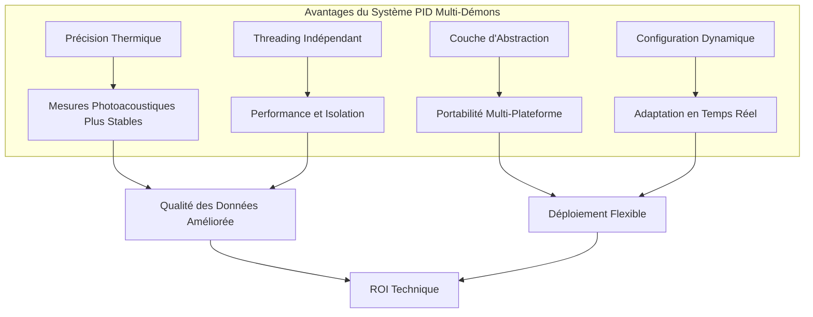

---

## Architecture Technique

### Vue d'Ensemble du Système

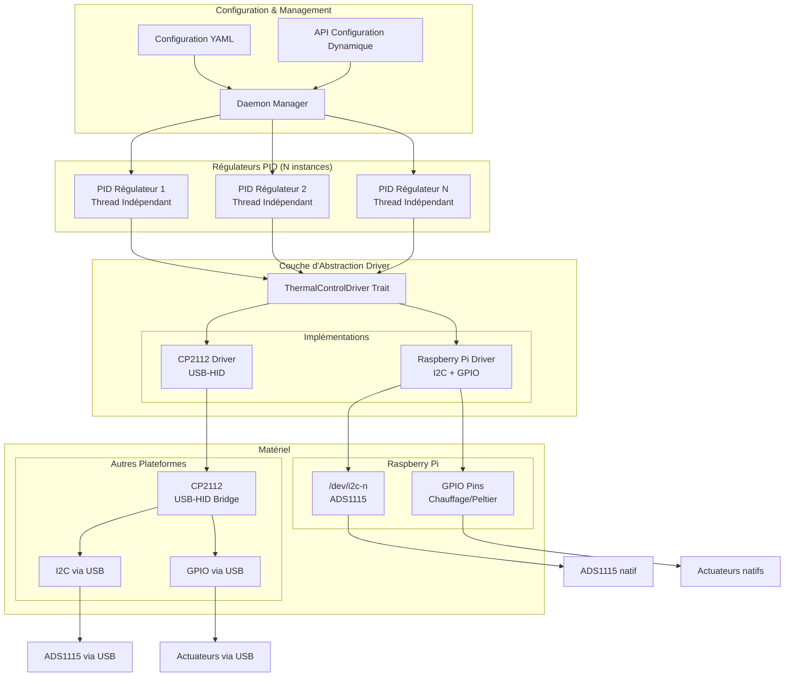

### Intégration dans l'Architecture Existante

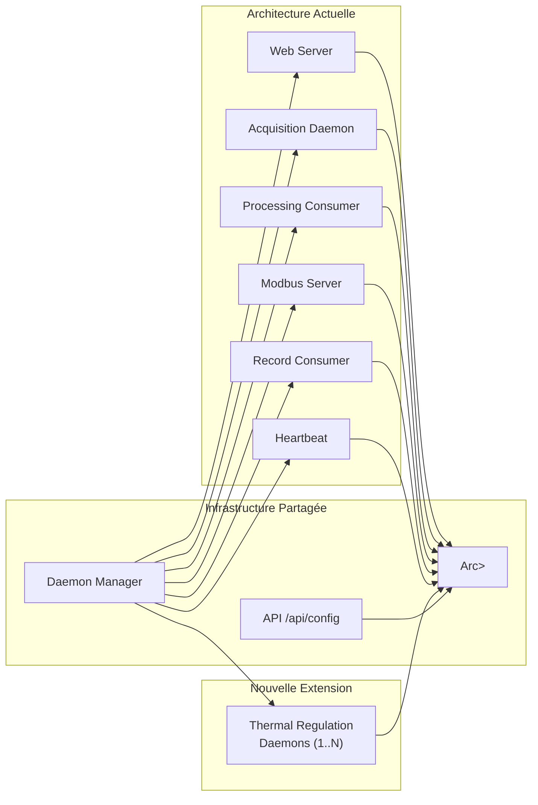

---

## Spécifications Détaillées

### Structure de Configuration

```yaml
# Extension de config.yaml
thermal_regulation:
  enabled: true
  regulators:
    - id: "sample_temperature"
      name: "Température Échantillon"
      enabled: true
      driver_type: "raspberry_pi"  # ou "cp2112"
      driver_config:
        # Pour Raspberry Pi
        i2c_device: "/dev/i2c-1"
        adc_address: 0x48
        adc_channel: 0
        heating_gpio_pin: 18
        cooling_gpio_pin: 19
        # Pour CP2112
        # usb_vendor_id: 0x10C4
        # usb_product_id: 0xEA90
        # i2c_address: 0x48
        # gpio_heating_pin: 0
        # gpio_cooling_pin: 1
      
      # Conversion ADC vers température (polynôme)
      temperature_conversion:
        formula: "0.0001*x^3 - 0.02*x^2 + 1.5*x + 273.15"  # Kelvin
        adc_resolution: 16  # bits
        voltage_reference: 3.3  # V
      
      # Paramètres PID
      pid_parameters:
        kp: 2.0      # Proportionnel
        ki: 0.1      # Intégral
        kd: 0.05     # Dérivé
        setpoint: 298.15  # K (25°C)
        output_min: 0.0
        output_max: 100.0
        integral_max: 50.0  # Anti-windup
      
      # Configuration PWM et scrutation
      control_parameters:
        sampling_frequency_hz: 10.0
        pwm_frequency_hz: 1000.0
        heating_pwm_channel: 0
        cooling_pwm_channel: 1
      
      # Limites de sécurité
      safety_limits:
        min_temperature_k: 273.15  # 0°C
        max_temperature_k: 373.15  # 100°C
        max_heating_duty: 80.0     # %
        max_cooling_duty: 80.0     # %
    
    - id: "detector_temperature"
      # Configuration similaire pour un deuxième régulateur
      # ...
```

### Architecture des Threads

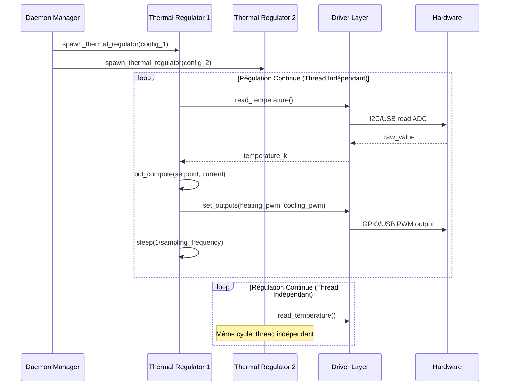

---

## Couche d'Abstraction des Drivers

### Trait Principal

```rust
use async_trait::async_trait;
use serde::{Deserialize, Serialize};

#[derive(Debug, Clone, Serialize, Deserialize)]
pub struct ThermalReading {
    pub temperature_k: f32,
    pub timestamp: std::time::SystemTime,
    pub raw_adc_value: u16,
}

#[derive(Debug, Clone, Serialize, Deserialize)]
pub struct ThermalOutput {
    pub heating_duty: f32,  // 0.0 - 100.0 %
    pub cooling_duty: f32,  // 0.0 - 100.0 %
}

#[async_trait]
pub trait ThermalControlDriver: Send + Sync {
    /// Initialise le driver avec la configuration spécifiée
    async fn initialize(&mut self, config: &DriverConfig) -> Result<(), ThermalError>;
    
    /// Lit la température depuis l'ADC
    async fn read_temperature(&self) -> Result<ThermalReading, ThermalError>;
    
    /// Applique les sorties PWM (chauffage/refroidissement)
    async fn set_outputs(&self, output: &ThermalOutput) -> Result<(), ThermalError>;
    
    /// Test de connectivité du matériel
    async fn health_check(&self) -> Result<bool, ThermalError>;
    
    /// Arrêt propre (PWM à 0, libération des ressources)
    async fn shutdown(&mut self) -> Result<(), ThermalError>;
}
```

### Implémentations Spécifiques

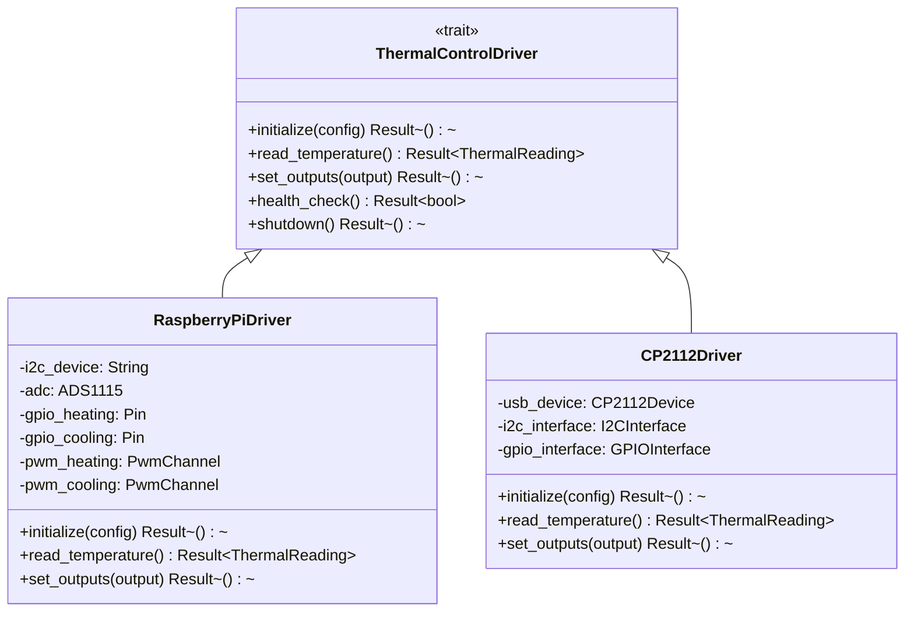

### Sélection Automatique du Driver

```rust
pub fn create_thermal_driver(driver_type: &str) -> Box<dyn ThermalControlDriver> {
    match driver_type {
        "raspberry_pi" => Box::new(RaspberryPiDriver::new()),
        "cp2112" => Box::new(CP2112Driver::new()),
        _ => panic!("Driver type non supporté: {}", driver_type),
    }
}
```

---

## Algorithme de Régulation PID

### Implémentation du Contrôleur PID

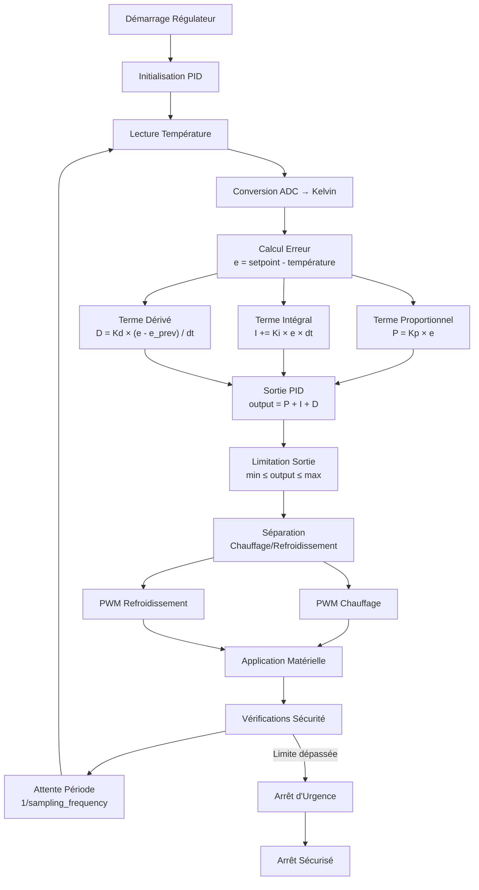

### Structure du Régulateur

```rust
pub struct PIDRegulator {
    pub id: String,
    pub config: ThermalRegulatorConfig,
    pub driver: Box<dyn ThermalControlDriver>,
    
    // État PID
    pub setpoint: f32,
    pub previous_error: f32,
    pub integral: f32,
    pub last_time: std::time::Instant,
    
    // Conversion température
    pub temperature_converter: PolynomialConverter,
    
    // Sécurité
    pub safety_monitor: SafetyMonitor,
    
    // Métriques
    pub metrics: RegulatorMetrics,
}

impl PIDRegulator {
    pub async fn regulation_loop(&mut self) -> Result<(), ThermalError> {
        loop {
            // Lecture température
            let reading = self.driver.read_temperature().await?;
            let current_temp = self.temperature_converter.convert(reading.raw_adc_value)?;
            
            // Calcul PID
            let output = self.compute_pid(current_temp).await?;
            
            // Vérifications sécurité
            self.safety_monitor.check_limits(current_temp, &output)?;
            
            // Application sortie
            self.driver.set_outputs(&output).await?;
            
            // Métriques et logging
            self.metrics.update(current_temp, &output);
            
            // Attente prochaine itération
            tokio::time::sleep(Duration::from_secs_f64(1.0 / self.config.sampling_frequency_hz)).await;
        }
    }
}
```

---

## Configuration et Intégration

### Extension du Système de Configuration Dynamique

Conformément aux audits existants (`AUDIT_CONFIG_DYNAMIQUE.md`, `AUDIT_IMPACT_RELOAD_DAEMON.md`), les démons de régulation thermique s'intègrent dans le système de configuration dynamique :

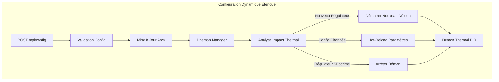

### Capacité de Hot-Reload pour les Régulateurs Thermiques

| Paramètre | Hot-Reload | Impact | Action |
|-----------|------------|--------|--------|
| `enabled` | NON | Start/Stop du démon | Géré par DaemonManager |
| `pid_parameters` (Kp, Ki, Kd, setpoint) | OUI | Mise à jour en temps réel | Notification au thread |
| `sampling_frequency_hz` | OUI | Changement période de boucle | Reconfiguration timer |
| `safety_limits` | OUI | Mise à jour limites | Hot-reload des seuils |
| `driver_type` | NON | Changement de matériel | Redémarrage requis |
| `driver_config` (pins, adresses) | NON | Reconfiguration matérielle | Redémarrage requis |
| `temperature_conversion.formula` | OUI | Recalcul conversion | Recompilation polynôme |

---

## Outils de Développement

### Binaire de Tuning PID

Un outil dédié sera développé pour déterminer les paramètres PID optimaux :

```bash
# Utilisation du binaire de tuning
./target/release/pid_tuner --config config.yaml --regulator-id sample_temperature --method ziegler-nichols

# Ou pour un tuning interactif
./target/release/pid_tuner --interactive --driver cp2112
```

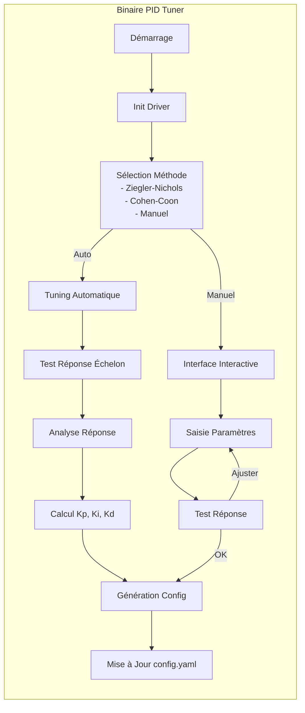

### Interface de Monitoring

Extension de l'interface web existante pour inclure le monitoring thermique :

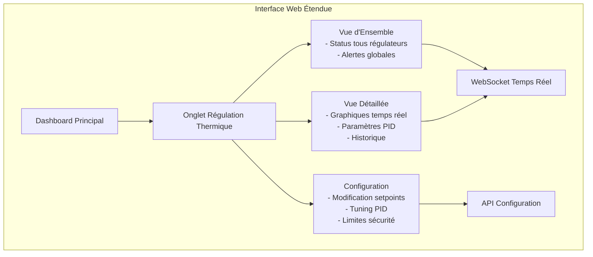

---

## Feuille de Route de Développement

### Phase 1 : Fondations (4-6 semaines)

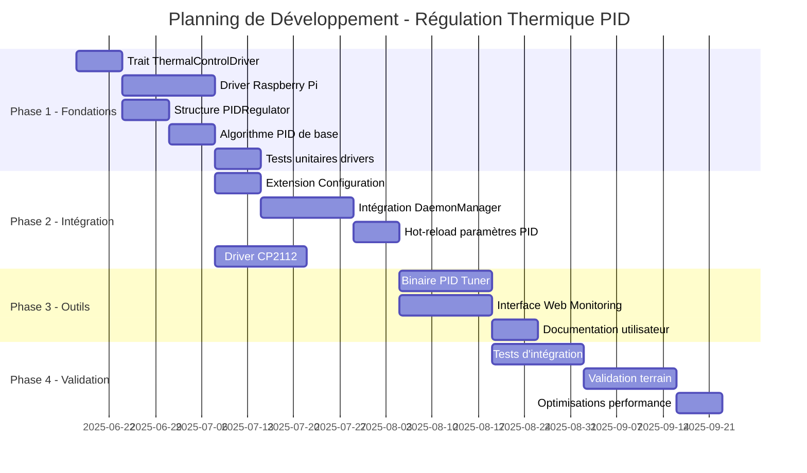

### Livrables par Phase

**Phase 1 - Fondations**
- [ ] Trait `ThermalControlDriver` complet
- [ ] Driver Raspberry Pi fonctionnel (ADS1115 + GPIO)
- [ ] Structure `PIDRegulator` avec algorithme PID
- [ ] Tests unitaires pour tous les composants
- [ ] Documentation technique détaillée

**Phase 2 - Intégration**
- [ ] Extension du système de configuration YAML
- [ ] Intégration complète avec `DaemonManager`
- [ ] Support hot-reload des paramètres PID
- [ ] Driver CP2112 fonctionnel
- [ ] Tests d'intégration avec l'architecture existante

**Phase 3 - Outils et Interface**
- [ ] Binaire `pid_tuner` avec méthodes automatiques
- [ ] Interface web de monitoring temps réel
- [ ] API REST pour contrôle des régulateurs
- [ ] Documentation utilisateur complète

**Phase 4 - Validation et Optimisation**
- [ ] Tests de charge et performance
- [ ] Validation sur cas d'usage réels
- [ ] Optimisations algorithme PID
- [ ] Formation équipes utilisatrices

---

## Impact Business et Technique

### Valeur Ajoutée pour la Photoacoustique

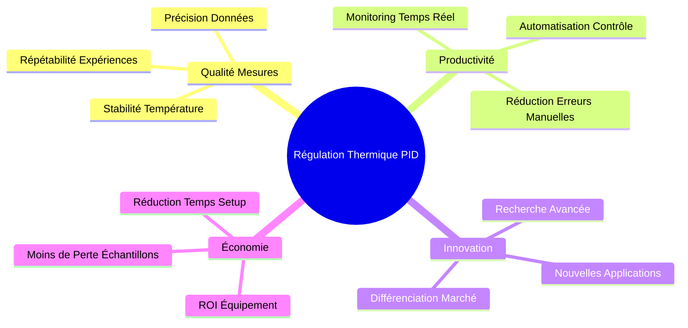

### Avantages Concurrentiels

1. **Précision de Contrôle** : Régulation PID professionnelle vs contrôle on/off basique
2. **Scalabilité** : Support multi-zones vs solutions single-point
3. **Portabilité** : Couche d'abstraction vs solutions propriétaires hardware-specific
4. **Intégration** : Extension naturelle de l'écosystème existant vs solutions standalone

### Métriques de Succès

| Métrique | Objectif | Mesure |
|----------|----------|---------|
| **Stabilité Thermique** | ±0.1°C | Écart-type température sur 30min |
| **Temps de Réponse** | <30s pour 95% setpoint | Temps de montée 5%-95% |
| **Disponibilité Système** | >99% | Uptime des démons de régulation |
| **Facilité Déploiement** | <1h setup complet | Temps installation + configuration |
| **Performance CPU** | <5% par régulateur | Utilisation CPU par thread |

---

## Analyse des Risques

### Risques Techniques

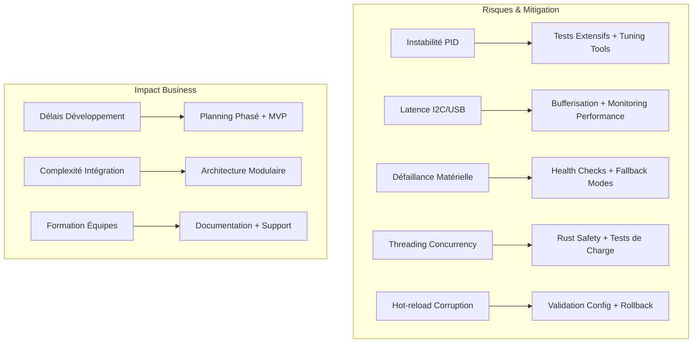

### Plan de Mitigation

| Risque | Probabilité | Impact | Mitigation |
|--------|-------------|---------|------------|
| **Oscillations PID** | Moyenne | Élevé | • Algorithme anti-windup<br/>• Outils de tuning automatique<br/>• Limites de sécurité strictes |
| **Latence Communication** | Faible | Moyen | • Profiling performance<br/>• Optimisation protocoles<br/>• Timeout configurables |
| **Défaillance Hardware** | Faible | Élevé | • Health monitoring continu<br/>• Mode dégradé gracieux<br/>• Alertes proactives |
| **Complexité Configuration** | Moyenne | Moyen | • Interface graphique<br/>• Validation automatique<br/>• Templates prédéfinis |

### Tests de Validation

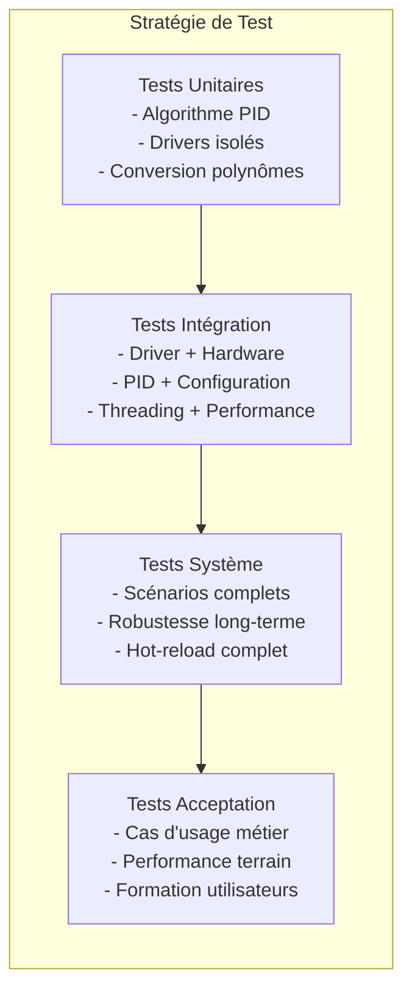

---

## Conclusion

L'intégration de la régulation thermique PID représente une évolution majeure qui positionne le projet `rust-photoacoustic` comme une solution complète et professionnelle pour les applications photoacoustiques avancées. 

### Points Clés

✅ **Architecture Extensible** : Intégration naturelle dans l'écosystème existant
✅ **Portabilité Garantie** : Support Raspberry Pi natif + CP2112 universal  
✅ **Qualité Industrielle** : Algorithme PID robuste avec outils de tuning
✅ **Configuration Dynamique** : Hot-reload intégré au système existant
✅ **Monitoring Avancé** : Interface temps réel et métriques détaillées

Cette évolution renforce significativement la proposition de valeur du produit et ouvre de nouvelles opportunités de marché dans le contrôle thermique de précision pour applications scientifiques et industrielles.

---

*Document rédigé le 17 juin 2025 - Version 1.0*
*Audience : Développeurs Rust, Spécialistes Photoacoustique, Ingénieurs Systèmes Embarqués, Investisseurs*
