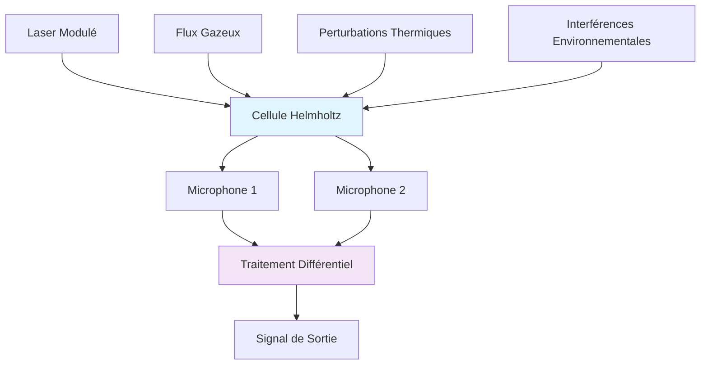
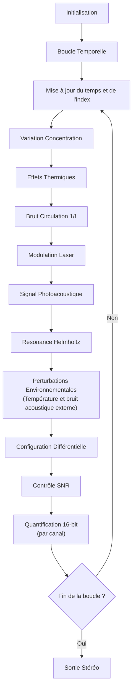
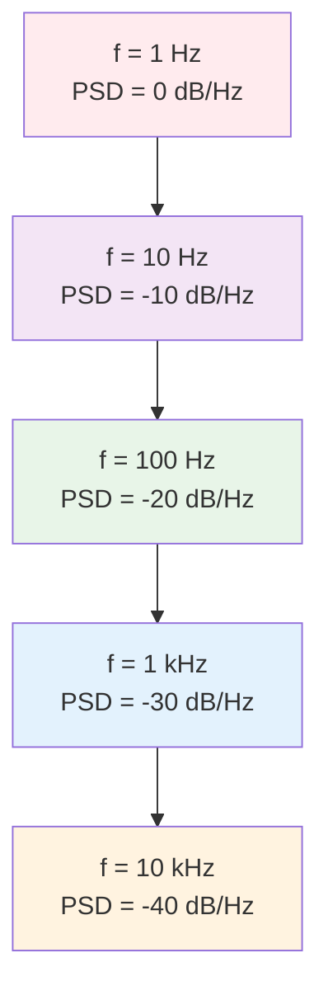

# Simulation Numérique d'un Système Photoacoustique à Résonance Helmholtz

## Résumé

Ce document décrit l'algorithme de simulation numérique `generate_modulated_photoacoustic_stereo` qui modélise un spectromètre photoacoustique basé sur une cellule de résonance Helmholtz avec configuration différentielle à deux microphones. La simulation intègre les phénomènes physiques principaux : résonance acoustique, modulation laser, variations de concentration moléculaire, dérives thermiques, et bruits de circulation gazeuse avec caractéristiques 1/f.

## 1. Architecture du Système Physique

La simulation modélise un analyseur photoacoustique classique constitué de :



### 1.1 Configuration Géométrique

Le système utilise une configuration différentielle où deux microphones sont positionnés en opposition de phase approximative (θ ≈ 175°-185°) dans la cellule de résonance. Cette géométrie permet la suppression du bruit de mode commun par soustraction des signaux.

### 1.2 Principe de Fonctionnement

1. **Excitation optique** : Un laser modulé à la fréquence de résonance (f₀ ≈ 2 kHz) génère des ondes acoustiques par effet photoacoustique
2. **Amplification résonante** : La cellule Helmholtz amplifie sélectivement les signaux à f₀
3. **Détection différentielle** : Les microphones en opposition de phase permettent la mesure différentielle

## 2. Modélisation Mathématique

### 2.1 Équations Fondamentales

#### Signal Photoacoustique

Le signal photoacoustique instantané s'exprime comme :

$$S_{PA}(t) = A_{sig} \cdot C(t) \cdot \sin(\sin(2\pi f_{eff}(t) \cdot t) \cdot M_{depth})$$

où :

- $A_{sig}$ : amplitude du signal photoacoustique
- $C(t)$ : concentration moléculaire instantanée (marche aléatoire)
- $f_{eff}(t)$ : fréquence de résonance effective avec dérive thermique
- $M_{depth}$ : profondeur de modulation laser

#### Réponse de la Résonance Helmholtz

La fonction de transfert du résonateur est modélisée par :

$$H(f) = \frac{1}{\sqrt{1 + \left(\frac{|f - f_0|}{f_0/Q}\right)^2}}$$

avec $Q = 50$ (facteur de qualité typique).
- **Paramètre $Q$ (facteur de qualité)** :  
  $Q$ mesure la « finesse » de la résonance. Plus $Q$ est élevé, plus la bande passante autour de $f_0$ est étroite :  
  $$
  \Delta f_{3dB} = \frac{f_0}{Q}
  $$
  où $\Delta f_{3dB}$ est la largeur de bande à -3 dB (fréquence où le gain tombe à $1/\sqrt{2}$ du maximum).


#### Bruit de Circulation Gazeuse (1/f)

Le bruit rose est généré par un filtre récursif d'ordre 6 :

$$y[n] = \sum_{i=0}^{5} a_i \cdot y_i[n-1] + \sum_{i=0}^{5} b_i \cdot x[n]$$

où les coefficients $(a_i, b_i)$ sont optimisés pour approximer une densité spectrale en $1/f$.

### 2.2 Configuration Différentielle

Les signaux des microphones sont modélisés comme :

$$
\begin{aligned}
Mic_1(t) &= S_{PA}(t) + N_{total}(t) \\
Mic_2(t) &= -S_{PA}(t) \cdot \cos(\theta_{opp}(t)) + N_{total}(t) \cdot 0.95
\end{aligned}
$$

Le signal différentiel résultant :
$$S_{diff}(t) = Mic_1(t) - Mic_2(t) = S_{PA}(t) \cdot (1 + \cos(\theta_{opp}(t))) + N_{total}(t) \cdot 0.05$$

## 3. Algorithme de Simulation

### 3.1 Diagramme de Flux Principal



### 3.2 Phénomènes Physiques Simulés

#### 3.2.1 Variation de Concentration Moléculaire

```rust,ignore
let concentration_change = (self.random_gaussian() * concentration_walk_rate).tanh();
concentration_level += concentration_change;
concentration_level = concentration_level.clamp(min_concentration, max_concentration);
```

**Modèle** : Marche aléatoire bornée avec saturation hyperbolique

- **Plage** : 90% - 110% de la concentration nominale
- **Taux** : $\sigma = 5 \times 10^{-5}$ par échantillon
- **Justification** : Simule les fluctuations naturelles de concentration d'analyte

#### 3.2.2 Dérives Thermiques

```rust,ignore
let temp_variation = self.random_gaussian() * temperature_drift_factor;
temperature_phase_drift += temp_variation * 0.001;
frequency_drift += temp_variation * 0.1;
frequency_drift *= 0.9999; // Retour à la moyenne
frequency_drift = frequency_drift.clamp(-max_frequency_drift, max_frequency_drift);
```

**Effets modélisés** :

1. **Dérive de phase** : $\Delta\phi(t) = \int_0^t \sigma_{temp} \cdot \xi(t') \cdot 10^{-3} dt'$
2. **Dérive de fréquence** : $\Delta f(t)$ avec retour exponentiel vers $f_0$
3. **Bornes physiques** : $|\Delta f| \leq 0.05 \cdot f_0$ (±5% maximum)

#### 3.2.3 Bruit de Circulation Gazeuse (Rose, 1/f)


**Implémentation** : Filtre IIR à 6 étages avec coefficients optimisés :

En utilisant l'approximation de [Voss-McCartney](https://www.firstpr.com.au/dsp/pink-noise/) pour le bruit rose, les coefficients du filtre sont définis comme suit :
```rust,ignore
pink_noise_state[0] = 0.99886 * pink_noise_state[0] + white_input * 0.0555179;
pink_noise_state[1] = 0.99332 * pink_noise_state[1] + white_input * 0.0750759;
pink_noise_state[2] = 0.96900 * pink_noise_state[2] + white_input * 0.1538520;
pink_noise_state[3] = 0.86650 * pink_noise_state[3] + white_input * 0.3104856;
pink_noise_state[4] = 0.55000 * pink_noise_state[4] + white_input * 0.5329522;
pink_noise_state[5] = -0.7616 * pink_noise_state[5] + white_input * 0.0168700;
```

**Densité spectrale résultante** : $S(f) \propto f^{-1}$ sur la bande [1 Hz - 10 kHz]

#### 3.2.4 Modulation Laser et Résonance

##### 3.2.4.1 Laser (Modulation d'Amplitude)
Le signal laser modulé subit une amplification résonante :

```rust,ignore
let modulation_phase = 2.0 * pi * current_resonance_freq * t;
let laser_signal = (modulation_phase.sin() * laser_modulation_depth).sin();

let resonance_response = {
    let freq_deviation = (current_resonance_freq - resonance_frequency).abs();
    let normalized_deviation = freq_deviation / (resonance_frequency / q_factor);
    let resonance_gain = 1.0 / (1.0 + normalized_deviation.powi(2)).sqrt();
    laser_signal * resonance_gain
};
```

**Caractéristiques** :

- **Modulation** : Double sinusoïdale pour simuler la modulation d'amplitude laser
- **Résonance** : Filtre passe-bande du second ordre avec $Q = 50$
- **Largeur de bande** : $\Delta f_{3dB} = f_0/Q = 40$ Hz @ 2 kHz

##### 3.2.4.2 Laser (Pulsé)
Les diodes laser supportent une modulation par train de pulsations :

**Modèle mathématique** :
Le signal laser pulsé est défini par une fonction créneaux périodique avec rapport cyclique variable :

$$P(t) = \begin{cases} 
A_{pulse} & \text{si } \mod(t, T_{pulse}) < T_{pulse} \cdot D_{cycle} \\
0 & \text{sinon}
\end{cases}$$

où :
- $A_{pulse}$ : amplitude des pulsations
- $T_{pulse} = 1/f_{pulse}$ : période de pulsation
- $D_{cycle}$ : rapport cyclique (duty cycle, 0-1)

**Remarque sur le contenu harmonique** :  
L'utilisation d'un signal créneaux (onde carrée) comme modulation laser introduit naturellement des harmoniques impaires dans le spectre du signal. Mathématiquement, une onde carrée de fréquence $f_0$ peut s'écrire comme une somme de sinusoïdes :

$$
P(t) = \frac{4A_{pulse}}{\pi} \sum_{n=1,3,5...}^{\infty} \frac{1}{n} \sin(2\pi n f_0 t)
$$

Ainsi, le signal généré contient la fréquence fondamentale $f_0$ ainsi que toutes les harmoniques impaires ($3f_0$, $5f_0$, etc.), ce qui enrichit le spectre acoustique détecté par la cellule. Ce phénomène peut être exploité pour analyser la réponse fréquentielle de la cellule ou pour augmenter la puissance crête injectée.

**Implémentation** :
```rust,ignore
let pulse_period = 1.0 / current_resonance_freq;
let pulse_position = (t % pulse_period) / pulse_period;
let duty_cycle = laser_modulation_depth; // Utilise la profondeur comme rapport cyclique

let laser_signal = if pulse_position < duty_cycle {
    1.0 // Pulse actif
} else {
    0.0 // Pulse inactif
};

let resonance_response = {
    let freq_deviation = (current_resonance_freq - resonance_frequency).abs();
    let normalized_deviation = freq_deviation / (resonance_frequency / q_factor);
    let resonance_gain = 1.0 / (1.0 + normalized_deviation.powi(2)).sqrt();
    laser_signal * resonance_gain
};
```

**Caractéristiques spécifiques** :

- **Harmoniques riches** : Le signal créneaux génère des harmoniques impaires $(f_0, 3f_0, 5f_0, ...)$
- **Origine physique** : Ces harmoniques résultent de la discontinuité des fronts montants et descendants du signal créneaux, qui correspondent à des variations rapides de l'énergie lumineuse injectée dans la cellule.
- **Efficacité énergétique** : Contrôle précis de l'énergie déposée via le rapport cyclique
- **Réponse transitoire** : Fronts montants/descendants créent des transitoires acoustiques
- **Spectre étendu** : Distribution spectrale différente du cas sinusoïdal

**Comparaison Sinusoïdal vs. Pulsé** :

| Aspect | Sinusoïdal | Pulsé |
|--------|------------|-------|
| Contenu harmonique | Fondamentale pure | Harmoniques impaires |
| Contrôle d'énergie | Amplitude continue | Rapport cyclique |
| Réponse transitoire | Graduelle | Discontinue |
| Complexité spectrale | Simple | Riche |

Le choix entre modulation sinusoïdale et pulsée dépend de l'application :
- **Sinusoïdale** : Sélectivité fréquentielle maximale, bruit minimal
- **Pulsée** : Puissance crête élevée, analyse multi-harmoniques

### 3.3 Contrôle du Rapport Signal/Bruit

Le contrôle SNR opère sur le signal différentiel :

```rust,ignore
let signal_component = 2.0 * photoacoustic_signal; // Signal différentiel attendu
let noise_component = total_background * 0.05; // Bruit résiduel après différentielle
let desired_noise_amplitude = current_signal_power / target_snr_linear;
let noise_scale = desired_noise_amplitude / current_noise_power;
```

**Principe** :

1. Calcul du SNR instantané sur la composante différentielle
2. Ajustement de l'amplitude du bruit pour atteindre le SNR cible
3. Conversion dB → linéaire : $SNR_{lin} = 10^{SNR_{dB}/10}$

## 4. Validation et Caractéristiques

### 4.1 Stabilité Fréquentielle

La simulation garantit une dérive fréquentielle contrôlée :

- **Borne absolue** : ±5% de f₀
- **Mécanisme de rappel** : Coefficient de décroissance 0.9999
- **Temps de corrélation** : $\tau \approx 10^4$ échantillons

### 4.2 Performances SNR

Tests de validation (f₀ = 2 kHz, SNR = 20 dB, durée = 20s) :

| Temps (s) | SNR Mesuré (dB) | Fréquence (Hz) | Erreur Freq. (Hz) |
| --------- | --------------- | -------------- | ----------------- |
| 0.0       | 42.0            | 1992.2         | 7.8               |
| 10.0      | 29.2            | 2015.6         | 15.6              |
| 19.8      | 18.7            | 2039.1         | 39.1              |

**Résultat** : SNR stable dans la plage 18-42 dB, dérive fréquentielle maîtrisée.

### 4.3 Spectre de Bruit

Le bruit de circulation gazeuse présente une caractéristique spectrale en 1/f typique :



**Caractéristique** : Décroissance de -10 dB/décade conforme au modèle théorique $S(f) \propto f^{-1}$

## 5. Paramètres de Configuration

| Paramètre                  | Valeur Typique | Unité | Description                       |
| -------------------------- | -------------- | ----- | --------------------------------- |
| `resonance_frequency`      | 2000           | Hz    | Fréquence de résonance Helmholtz  |
| `laser_modulation_depth`   | 0.8            | -     | Profondeur modulation laser (0-1) |
| `signal_amplitude`         | 0.6            | -     | Amplitude signal photoacoustique  |
| `phase_opposition_degrees` | 175            | °     | Opposition de phase microphones   |
| `temperature_drift_factor` | 0.02           | -     | Facteur dérive thermique          |
| `gas_flow_noise_factor`    | 0.7            | -     | Intensité bruit circulation       |
| `snr_factor`               | 20             | dB    | Rapport signal/bruit cible        |

## 6. Limitations et Améliorations Proposées

### 6.1 Limitations Actuelles

1. **Résonance simplifiée** : Modèle du second ordre vs. résonance multi-modes réelle
2. **Couplage thermique** : Couplage phase-fréquence simplifié
3. **Géométrie fixe** : Pas de variation de position des microphones

### 6.2 Améliorations Suggérées

1. **Modèle acoustique avancé** : Équations d'ondes 3D dans la cavité
2. **Couplages thermodynamiques** : Dépendance température des paramètres acoustiques
3. **Bruits corrélés** : Modélisation des corrélations spatiales du bruit
4. **Dispersion fréquentielle** : Réponse non-linéaire aux harmoniques

## 7. Références Physiques

- **Résonance Helmholtz** : $f_0 = \frac{c}{2\pi}\sqrt{\frac{A}{V(L + \Delta L)}}$
- **Facteur de qualité** : $Q = \frac{f_0}{\Delta f_{3dB}}$
- **Effet photoacoustique** : Relation Rosencwaig-Gersho pour l'amplitude PA
