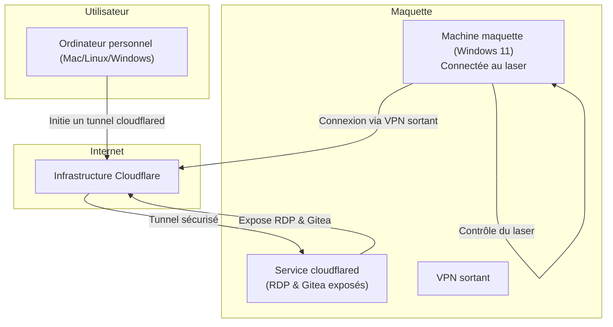

# Guide de connexion à distance à la maquette laser

Ce guide explique comment accéder à distance à l’ordinateur connecté à la maquette équipée du laser, ainsi qu’au serveur de gestion de code. Il s’adresse à un chercheur en physique, sans connaissances approfondies en informatique. **Merci de ne jamais communiquer les adresses ou identifiants fournis.**

## 1. Prérequis

- Un ordinateur personnel (Mac, Windows ou Linux)
- Un accès internet stable
- Les identifiants et liens d’accès fournis par l’administrateur (conservez-les confidentiels)
- Le logiciel [Cloudflared](https://developers.cloudflare.com/cloudflare-one/connections/connect-apps/install-and-setup/installation/) installé sur votre ordinateur

### Installation de cloudflared

#### Linux
```bash
curl -LO https://github.com/cloudflare/cloudflared/releases/download/2025.11.1/cloudflared-fips-linux-amd64
sudo mv cloudflared-fips-linux-amd64 /usr/local/bin/cloudflared
sudo chmod +x /usr/local/bin/cloudflared
```

#### MacOS Intel
```bash
curl -LO https://github.com/cloudflare/cloudflared/releases/download/2025.11.1/cloudflared-darwin-amd64.tgz
tar -xvzf cloudflared-darwin-amd64.tgz
sudo mv cloudflared /usr/local/bin/cloudflared
sudo chmod +x /usr/local/bin/cloudflared
```

#### MacOS Apple Silicon
```bash
curl -LO https://github.com/cloudflare/cloudflared/releases/download/2025.11.1/cloudflared-darwin-arm64.tgz
tar -xvzf cloudflared-darwin-arm64.tgz
sudo mv cloudflared /usr/local/bin/cloudflared
sudo chmod +x /usr/local/bin/cloudflared
```

#### Windows
Télécharger l’installateur depuis la [page des releases de cloudflared](https://github.com/cloudflare/cloudflared/releases/download/2025.11.1/cloudflared-windows-amd64.msi) et l’exécuter.

### Clients Bureau à distance

- **Linux** : installer Remmina
	```bash
	sudo apt update
	sudo apt install remmina -y
	```
- **MacOS** : installer [Microsoft Remote Desktop](https://apps.apple.com/us/app/microsoft-remote-desktop/id1295203466?mt=12) depuis le Mac App Store
- **Windows** : l’application « Bureau à distance » est déjà installée par défaut

## 2. Lancement du tunnel sécurisé

Sur votre ordinateur, ouvrez un terminal et exécutez la commande suivante (remplacez `<adresse fournie>` par l’adresse reçue de l’administrateur) :

```bash
cloudflared access rdp --hostname <adresse fournie> --url rdp://localhost:13389
```

Cette commande crée un tunnel sécurisé entre votre ordinateur et la maquette. Laissez ce terminal ouvert pendant toute la durée de la connexion.

## 3. Connexion au Bureau à distance

Ouvrez votre client Bureau à distance :

- **Linux** : Remmina
- **MacOS** : Microsoft Remote Desktop
- **Windows** : Bureau à distance

Créez une nouvelle connexion avec les paramètres suivants :

- **Adresse du serveur** : `localhost:13389`
- **Nom d’utilisateur** et **mot de passe** : ceux fournis par l’administrateur

Suivez les instructions de votre client pour établir la connexion.

## 4. Accès au serveur de gestion de code (Gitea)

Ouvrez votre navigateur web et rendez-vous à l’adresse fournie par l’administrateur. Connectez-vous avec vos identifiants personnels.


## 5. Conseils de sécurité et dépannage

- Ne communiquez jamais vos identifiants ou l’adresse du serveur à des tiers.
- Fermez le tunnel cloudflared après usage.
- Si vous suspectez un accès non autorisé, informez immédiatement l’administrateur.

### En cas de problème de connexion

1. **Vérifiez le tunnel cloudflared**
    - Le terminal où vous avez lancé la commande cloudflared doit rester ouvert et ne pas afficher d’erreur.
    - Si le tunnel se ferme ou affiche une erreur, relancez la commande.
    - Si un message indique que le port 13389 est déjà utilisé, fermez toute autre application Bureau à distance ou redémarrez votre ordinateur.

2. **Vérifiez votre connexion internet**
    - Essayez d’ouvrir un site web (ex : https://www.google.fr).
    - Si la connexion est instable, rapprochez-vous de votre box ou utilisez un câble Ethernet.

3. **Vérifiez les identifiants**
    - Vérifiez l’orthographe du nom d’utilisateur et du mot de passe.
    - Attention aux majuscules/minuscules et aux espaces.

4. **Redémarrez les applications**
    - Fermez puis rouvrez l’application Bureau à distance ou votre navigateur en cas de blocage.

5. **Messages d’erreur fréquents**
    - « Connexion refusée » : le tunnel n’est pas actif ou l’adresse du serveur est incorrecte.
    - « Mot de passe incorrect » : vérifiez les identifiants.
    - « Tunnel non établi » : relancez la commande cloudflared.

6. **Si le problème persiste**
    - Attendez quelques minutes et réessayez (il peut y avoir une maintenance temporaire).
    - Contactez l’administrateur en lui précisant le message d’erreur exact.

### Pour aller plus loin

- Documentation officielle Cloudflare Tunnel : https://developers.cloudflare.com/cloudflare-one/connections/connect-apps/
- Si vous avez accès à la machine cible (maquette), vérifiez que le service cloudflared y est bien en fonctionnement (demander à l’administrateur si besoin).

## 6. Comprendre l’architecture de connexion (pour les curieux)

Voici un schéma simplifié du fonctionnement de la connexion à distance :



**Explications :**

- La machine « maquette » est physiquement reliée au laser.
- Elle se connecte à internet via un tunnel VPN sortant, pour plus de sécurité.
- Un service Windows « cloudflared » tourne en permanence sur la machine maquette : il expose le bureau à distance (RDP) et le serveur de gestion de code (Gitea) à l’infrastructure Cloudflare, sans ouvrir de port direct sur internet.
- L’utilisateur, depuis son ordinateur, initialise un tunnel cloudflared vers Cloudflare, qui relie alors son poste à la machine maquette de façon sécurisée.
- Ainsi, l’utilisateur peut accéder au bureau à distance et à Gitea sans exposer la machine ni le laser directement à internet.

---

*Ce guide est destiné à un usage strictement confidentiel. Pour toute question, contactez l’administrateur du système.*