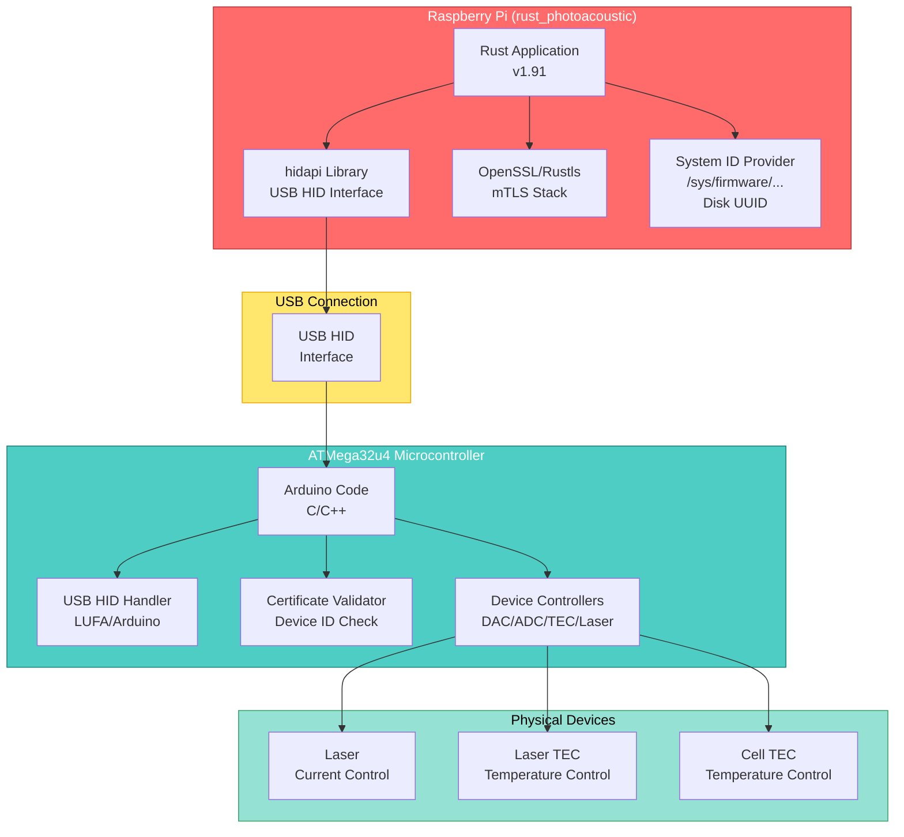
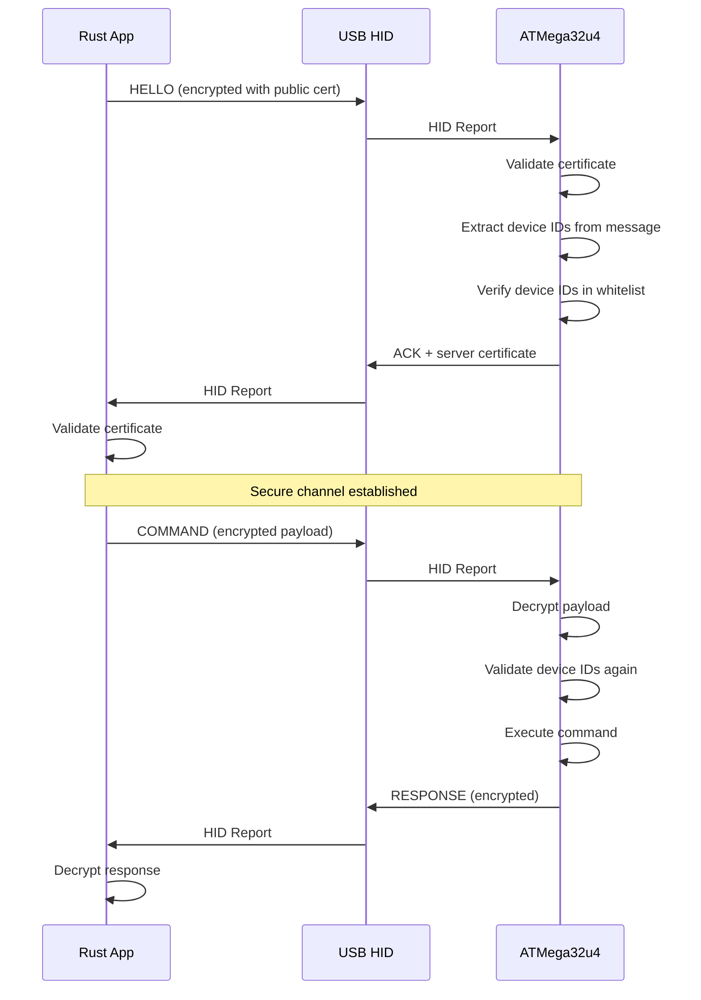
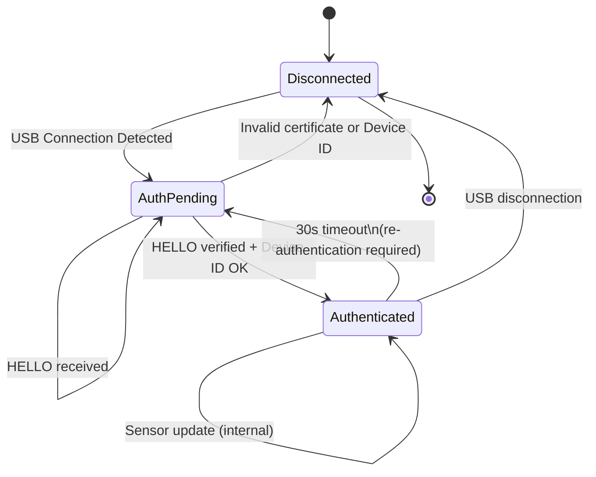

# USB-HID Communication Protocol with mTLS Security
## Photoacoustic Analyzer Control System

**Document Version:** 1.0  
**Date:** December 2025  
**Language:** English  
**Target Audience:** Internal developers and integrators  

---

## Table of Contents

1. [Executive Summary](#executive-summary)
2. [System Overview](#system-overview)
3. [Communication Protocol Architecture](#communication-protocol-architecture)
4. [mTLS Security Implementation](#mtls-security-implementation)
5. [Message Format Specification](#message-format-specification)
6. [Device Identification and Authorization](#device-identification-and-authorization)
7. [Rust Implementation Guide](#rust-implementation-guide)
8. [ATMega C Implementation Guide](#atmega-c-implementation-guide)
9. [Protocol State Machine](#protocol-state-machine)
10. [Error Handling and Recovery](#error-handling-and-recovery)
11. [Testing and Validation](#testing-and-validation)
12. [Appendices](#appendices)

---

## Executive Summary

This document specifies a secure USB-HID communication protocol between the **rust_photoacoustic** application (running on Raspberry Pi) and an **ATMega32u4** microcontroller. The system controls:

- **Laser** (current setpoint, temperature reading)
- **Laser TEC** (temperature setpoint, current reading)
- **Cell TEC** (temperature setpoint, current reading)

**Security Features:**
- Mutual TLS (mTLS) encryption
- Device identification via system identifiers (serial number, disk UUID)
- Certificate-based authentication
- Encrypted payload transmission

**Communication Method:** USB HID (Human Interface Device)  
**Platform:** Linux USB stack via `hidapi` library

---

## System Overview

### Architecture Diagram



### Component Responsibilities

| Component | Responsibility |
|-----------|-----------------|
| **Rust App** | Generate mTLS messages, manage system state, read device info |
| **hidapi** | Low-level USB HID communication |
| **TLS Layer** | Encrypt/decrypt messages, certificate validation |
| **ATMega32u4** | Validate certificates, process commands, manage hardware |
| **DAC/ADC** | Read sensors, control actuators |

---

## Communication Protocol Architecture

### Protocol Layers

```
┌─────────────────────────────────────────────────────────┐
│  Application Layer                                      │
│  (Command/Response Messages: SET_LASER_CURRENT, etc.)  │
├─────────────────────────────────────────────────────────┤
│  Security Layer (mTLS)                                  │
│  (Encryption, Device Identification, Certificate Validation)
├─────────────────────────────────────────────────────────┤
│  USB HID Layer                                          │
│  (64-byte HID reports)                                  │
├─────────────────────────────────────────────────────────┤
│  Physical Layer                                         │
│  (USB 2.0, Linux kernel, libusb)                       │
└─────────────────────────────────────────────────────────┘
```

### Handshake Sequence



### Message Flow Diagram

```mermaid
graph LR
    A["Plain Text<br/>Command"] -->|1. Add Device IDs| B["Extended<br/>Command"]
    B -->|2. Encrypt with TLS| C["Encrypted<br/>Payload"]
    C -->|3. Wrap in HID| D["64-byte HID<br/>Report"]
    D -->|4. Send via USB| E["ATMega32u4"]
    
    E -->|5. Unwrap HID| F["Encrypted<br/>Payload"]
    F -->|6. Decrypt with TLS| G["Extended<br/>Command"]
    G -->|7. Verify Device IDs| H["Valid<br/>Command"]
    H -->|8. Execute| I["Hardware<br/>Action"]
```



---

## mTLS Security Implementation

### Certificate Requirements

#### Client Certificate (Rust App)
- **Purpose:** Identify and authenticate the Rust application
- **Issued to:** rust_photoacoustic application instance
- **Validity:** 365 days (production: 90 days renewal recommended)
- **Key Size:** 2048-bit RSA

#### Server Certificate (ATMega32u4)
- **Purpose:** Identify and authenticate the hardware device
- **Issued to:** ATMega32u4 device
- **Validity:** Permanent (firmware embedded)
- **Key Size:** 2048-bit RSA or 256-bit ECDSA (prefer for MCU efficiency)

### Security Architecture

```
┌─────────────────────────────────────┐
│  Message Content                    │
│  ├─ Command Type (1 byte)           │
│  ├─ Serial Number (16 bytes)        │
│  ├─ Disk UUID (16 bytes)            │
│  ├─ Payload (variable)              │
│  └─ Timestamp (4 bytes)             │
└─────────────────────────────────────┘
              ↓
    ┌─ Encrypt with TLS ─┐
    │ (client private key)│
    └────────────────────┘
              ↓
┌─────────────────────────────────────┐
│  Encrypted Payload                  │
│  (variable length)                  │
└─────────────────────────────────────┘
              ↓
    ┌─ Chunk if > 60 bytes ─┐
    │ (USB HID limit: 64)    │
    └────────────────────────┘
              ↓
┌─────────────────────────────────────┐
│  HID Report (64 bytes)              │
│  ├─ Message Type (1 byte)           │
│  ├─ Sequence Number (1 byte)        │
│  ├─ Fragment (62 bytes)             │
│  └─ Padding                         │
└─────────────────────────────────────┘
```

### Device Identification System

Every message from the Rust application MUST include:

1. **Serial Number** (16 bytes)
   - Source: `/sys/firmware/device_tree/base/serial-number`
   - Format: Null-terminated string, padded with zeros

2. **Disk UUID** (16 bytes)
   - Source: `/etc/machine-id` or output of `dmidecode -s system-uuid`
   - Format: UUID string representation
   - Purpose: Prevent copying to different machines

3. **Timestamp** (4 bytes)
   - Current Unix time (seconds since epoch)
   - Purpose: Replay attack prevention

### Allowed Devices Database (ATMega)

The ATMega firmware stores an encrypted database of allowed device pairs:

```c
// Example device whitelist (stored in EEPROM)
struct AllowedDevice {
    uint8_t serial_number[16];
    uint8_t disk_uuid[16];
};

#define MAX_ALLOWED_DEVICES 10

AllowedDevice allowed_devices[MAX_ALLOWED_DEVICES] = {
    {
        .serial_number = "0000000012345678",
        .disk_uuid = "a1b2c3d4-e5f6-..."
    },
    // ... more devices
};
```

---

## Message Format Specification

### Byte-Level Protocol Definition

#### Message Header (Every message)

```
Offset  Size  Field                Description
───────────────────────────────────────────────
0       1     MSG_TYPE            Message type (see table below)
1       1     SEQ_NUM             Sequence number (0-255)
2       2     PAYLOAD_LEN         Encrypted payload length
4       60    PAYLOAD             Encrypted data (variable)
```

#### Payload Structure (Before Encryption)

```
Offset  Size  Field                Description
───────────────────────────────────────────────
0       16    SERIAL_NUMBER       Device serial (from /sys/firmware/...)
16      16    DISK_UUID           Disk UUID (from /etc/machine-id)
32      4     TIMESTAMP           Unix time (seconds)
36      1     COMMAND_TYPE        Command opcode
37      ...   COMMAND_DATA        Command-specific data
```

### Message Types

```c
#define MSG_TYPE_HELLO              0x01  // Handshake initiation
#define MSG_TYPE_ACK                0x02  // Handshake acknowledgment
#define MSG_TYPE_COMMAND            0x10  // Command transmission
#define MSG_TYPE_RESPONSE           0x11  // Response transmission
#define MSG_TYPE_ERROR              0xF0  // Error indication
#define MSG_TYPE_KEEP_ALIVE         0x20  // Keep-alive ping
```

### Command Types

```c
// Laser Control
#define CMD_SET_LASER_CURRENT       0x01
#define CMD_READ_LASER_CURRENT      0x02
#define CMD_READ_LASER_TEMP         0x03

// Laser TEC Control
#define CMD_SET_LASER_TEC_TEMP      0x11
#define CMD_READ_LASER_TEC_TEMP     0x12
#define CMD_READ_LASER_TEC_CURRENT  0x13

// Cell TEC Control
#define CMD_SET_CELL_TEC_TEMP       0x21
#define CMD_READ_CELL_TEC_TEMP      0x22
#define CMD_READ_CELL_TEC_CURRENT   0x23

// System
#define CMD_GET_STATUS              0xF0
#define CMD_RESET_DEVICE            0xFF
```

### Detailed Command Format

#### SET_LASER_CURRENT (0x01)

```
Offset  Size  Field                Value/Range
─────────────────────────────────────────────
0       1     COMMAND_TYPE         0x01
1       2     CURRENT_MA           Laser current in mA (0-500)
3       1     RESERVED             0x00
```

**Example:** Set laser to 250 mA
```
COMMAND_DATA = [0x01, 0x00, 0xFA, 0x00]
                      ↑    ↑
                      250 in big-endian (0x00FA)
```

#### READ_LASER_TEMP (0x03)

```
Offset  Size  Field                Value/Range
─────────────────────────────────────────────
0       1     COMMAND_TYPE         0x03
1       3     RESERVED             0x00, 0x00, 0x00
```

**Response Format:**
```
Offset  Size  Field                Value/Range
─────────────────────────────────────────────
0       1     COMMAND_TYPE         0x03
1       2     TEMPERATURE_C        Temperature in °C (x100)
3       1     STATUS               0=OK, non-zero=error
```

#### SET_LASER_TEC_TEMP (0x11)

```
Offset  Size  Field                Value/Range
─────────────────────────────────────────────
0       1     COMMAND_TYPE         0x11
1       2     TEMPERATURE_C        Target temp in °C (x100)
3       1     P_VALUE              PID P coefficient
```

---

## Device Identification and Authorization

### Reading System IDs (Rust Side)

#### Serial Number Extraction

```rust
// Read from device tree
fn read_serial_number() -> Result<[u8; 16], Box<dyn std::error::Error>> {
    let path = "/sys/firmware/device_tree/base/serial-number";
    
    // Fallback paths for different systems
    let paths = vec![
        "/sys/firmware/device_tree/base/serial-number",
        "/proc/device-tree/serial-number",
        "/etc/machine-id",
    ];
    
    for path in paths {
        if let Ok(serial) = std::fs::read_to_string(path) {
            let serial = serial.trim().to_string();
            return format_device_id(&serial);
        }
    }
    
    Err("Could not read serial number".into())
}

fn format_device_id(id: &str) -> Result<[u8; 16], Box<dyn std::error::Error>> {
    let mut buffer = [0u8; 16];
    let bytes = id.as_bytes();
    let len = bytes.len().min(15); // Reserve 1 byte for null terminator
    
    buffer[..len].copy_from_slice(&bytes[..len]);
    buffer[15] = 0; // Null terminator
    
    Ok(buffer)
}
```

#### Disk UUID Extraction

```rust
use std::process::Command;

fn read_disk_uuid() -> Result<[u8; 16], Box<dyn std::error::Error>> {
    // Try multiple sources in order of reliability
    
    // Method 1: /etc/machine-id (most reliable on Linux)
    if let Ok(uuid) = std::fs::read_to_string("/etc/machine-id") {
        let uuid = uuid.trim();
        return parse_uuid(uuid);
    }
    
    // Method 2: dmidecode (requires root)
    if let Ok(output) = Command::new("dmidecode")
        .arg("-s")
        .arg("system-uuid")
        .output()
    {
        let uuid = String::from_utf8(output.stdout)?;
        return parse_uuid(uuid.trim());
    }
    
    // Method 3: /sys/class/dmi/id/product_uuid
    if let Ok(uuid) = std::fs::read_to_string("/sys/class/dmi/id/product_uuid") {
        return parse_uuid(uuid.trim());
    }
    
    Err("Could not read disk UUID".into())
}

fn parse_uuid(uuid_str: &str) -> Result<[u8; 16], Box<dyn std::error::Error>> {
    let mut buffer = [0u8; 16];
    
    // UUID format: "xxxxxxxx-xxxx-xxxx-xxxx-xxxxxxxxxxxx"
    let uuid_clean = uuid_str.replace("-", "");
    
    if uuid_clean.len() < 32 {
        return Err("Invalid UUID format".into());
    }
    
    for i in 0..16 {
        let hex_pair = &uuid_clean[i*2..i*2+2];
        buffer[i] = u8::from_str_radix(hex_pair, 16)?;
    }
    
    Ok(buffer)
}
```

### Device Authorization (ATMega Side)

```c
// Device whitelist validation
#include <string.h>

typedef struct {
    uint8_t serial_number[16];
    uint8_t disk_uuid[16];
} AllowedDevice;

// Stored in EEPROM
#define MAX_ALLOWED_DEVICES 10
AllowedDevice allowed_devices[MAX_ALLOWED_DEVICES];

// Initialize with known good devices (burned in during production)
void init_allowed_devices() {
    // Example: Load from EEPROM
    // In production, this would be pre-programmed at factory
    eeprom_read_block(
        (void *)allowed_devices,
        (const void *)EEPROM_ALLOWED_DEVICES_ADDR,
        sizeof(allowed_devices)
    );
}

// Verify incoming device IDs
uint8_t verify_device_credentials(
    const uint8_t *incoming_serial,
    const uint8_t *incoming_uuid
) {
    // Always check both serial AND UUID (defense in depth)
    
    for (int i = 0; i < MAX_ALLOWED_DEVICES; i++) {
        if (allowed_devices[i].serial_number[0] == 0xFF) {
            // Unused slot
            continue;
        }
        
        uint8_t serial_match = memcmp(
            incoming_serial,
            allowed_devices[i].serial_number,
            16
        ) == 0;
        
        uint8_t uuid_match = memcmp(
            incoming_uuid,
            allowed_devices[i].disk_uuid,
            16
        ) == 0;
        
        // Both must match to authorize
        if (serial_match && uuid_match) {
            return 1; // Authorized
        }
    }
    
    return 0; // Not authorized
}
```

---

## Rust Implementation Guide

### Project Structure

```
rust_photoacoustic/
├── src/
│   ├── lib.rs
│   ├── main.rs
│   └── hardware/                    # NEW MODULE
│       ├── mod.rs
│       ├── hid_protocol.rs          # USB HID protocol
│       ├── device_auth.rs           # Device identification
│       ├── tls_handler.rs           # mTLS encryption
│       └── commands.rs              # Command definitions
├── Cargo.toml
└── certs/                           # Certificate files
    ├── client.crt
    └── client.key
```

### Cargo.toml Dependencies

```toml
[dependencies]
hidapi = "2.5"                  # USB HID communication
rustls = "0.23"                 # TLS encryption
uuid = { version = "1.0", features = ["v4"] }
log = "0.4"
env_logger = "0.10"
tokio = { version = "1", features = ["full"] }

[dev-dependencies]
mockall = "0.11"
```

### Implementation: HID Protocol Handler

```rust
// src/hardware/hid_protocol.rs

use hidapi::HidApi;
use std::time::Duration;
use log::{info, error, debug};

const USB_VENDOR_ID: u16 = 0x2341;      // Arduino vendor ID
const USB_PRODUCT_ID: u16 = 0x8037;     // Arduino Pro Micro product ID
const HID_REPORT_SIZE: usize = 64;

const MSG_TYPE_HELLO: u8 = 0x01;
const MSG_TYPE_ACK: u8 = 0x02;
const MSG_TYPE_COMMAND: u8 = 0x10;
const MSG_TYPE_RESPONSE: u8 = 0x11;
const MSG_TYPE_ERROR: u8 = 0xF0;

/// High-level HID interface
pub struct HIDProtocol {
    hid_api: HidApi,
    device: hidapi::HidDevice,
    sequence_number: u8,
}

impl HIDProtocol {
    /// Initialize HID interface and connect to device
    pub fn new() -> Result<Self, Box<dyn std::error::Error>> {
        let hid_api = HidApi::new()?;
        
        // Find and open device
        let device = hid_api
            .device_list()
            .find(|d| {
                d.vendor_id == USB_VENDOR_ID
                    && d.product_id == USB_PRODUCT_ID
            })
            .ok_or("Device not found")?
            .open_device(&hid_api)?;
        
        info!("Connected to USB HID device");
        
        Ok(HIDProtocol {
            hid_api,
            device,
            sequence_number: 0,
        })
    }
    
    /// Send raw HID report (64 bytes)
    fn send_report(&mut self, data: &[u8; HID_REPORT_SIZE]) 
        -> Result<(), Box<dyn std::error::Error>> 
    {
        self.device.write(data)?;
        debug!("Sent HID report ({} bytes)", HID_REPORT_SIZE);
        Ok(())
    }
    
    /// Receive HID report with timeout
    fn receive_report(&mut self, timeout_ms: u64) 
        -> Result<[u8; HID_REPORT_SIZE], Box<dyn std::error::Error>> 
    {
        let mut buffer = [0u8; HID_REPORT_SIZE];
        
        // Set non-blocking read with timeout
        self.device.set_blocking_mode(false)?;
        
        let start = std::time::Instant::now();
        loop {
            match self.device.read(&mut buffer) {
                Ok(len) => {
                    debug!("Received HID report ({} bytes)", len);
                    return Ok(buffer);
                }
                Err(_) if start.elapsed() < Duration::from_millis(timeout_ms) => {
                    std::thread::sleep(Duration::from_millis(10));
                }
                Err(e) => return Err(Box::new(e)),
            }
        }
    }
    
    /// Get next sequence number
    fn next_sequence_number(&mut self) -> u8 {
        let seq = self.sequence_number;
        self.sequence_number = self.sequence_number.wrapping_add(1);
        seq
    }
    
    /// Pack encrypted payload into HID report
    fn pack_hid_report(
        msg_type: u8,
        encrypted_payload: &[u8],
    ) -> Result<[u8; HID_REPORT_SIZE], Box<dyn std::error::Error>> {
        if encrypted_payload.len() > 60 {
            return Err("Encrypted payload too large for single HID report".into());
        }
        
        let mut report = [0u8; HID_REPORT_SIZE];
        
        report[0] = msg_type;                                    // Byte 0: message type
        report[1] = 0;                                           // Byte 1: fragment index
        report[2] = (encrypted_payload.len() >> 8) as u8;       // Bytes 2-3: payload length
        report[3] = encrypted_payload.len() as u8;
        report[4..4 + encrypted_payload.len()].copy_from_slice(encrypted_payload);
        
        Ok(report)
    }
    
    /// Unpack HID report into message type and payload
    fn unpack_hid_report(report: &[u8; HID_REPORT_SIZE]) 
        -> Result<(u8, Vec<u8>), Box<dyn std::error::Error>> 
    {
        let msg_type = report[0];
        let payload_len = ((report[2] as usize) << 8) | (report[3] as usize);
        
        if payload_len > 60 {
            return Err("Invalid payload length in HID report".into());
        }
        
        let payload = report[4..4 + payload_len].to_vec();
        
        Ok((msg_type, payload))
    }
}

/// Example usage
impl HIDProtocol {
    /// Send a command and wait for response
    pub async fn send_command(
        &mut self,
        command: &[u8],
        timeout_ms: u64,
    ) -> Result<Vec<u8>, Box<dyn std::error::Error>> {
        // Command will be encrypted by TLS layer before sending
        let encrypted = vec![]; // Would be filled by TLS handler
        
        let hid_report = Self::pack_hid_report(MSG_TYPE_COMMAND, &encrypted)?;
        self.send_report(&hid_report)?;
        
        let response = self.receive_report(timeout_ms)?;
        let (msg_type, payload) = Self::unpack_hid_report(&response)?;
        
        if msg_type != MSG_TYPE_RESPONSE {
            return Err(format!("Unexpected response type: 0x{:02X}", msg_type).into());
        }
        
        Ok(payload)
    }
}
```

### Implementation: Device Authentication

```rust
// src/hardware/device_auth.rs

use std::fs;

/// Extract device identifiers from system
pub struct DeviceIdentifier {
    pub serial_number: [u8; 16],
    pub disk_uuid: [u8; 16],
    pub timestamp: u32,
}

impl DeviceIdentifier {
    /// Initialize device identifiers from system
    pub fn new() -> Result<Self, Box<dyn std::error::Error>> {
        let serial_number = Self::read_serial_number()?;
        let disk_uuid = Self::read_disk_uuid()?;
        let timestamp = std::time::SystemTime::now()
            .duration_since(std::time::UNIX_EPOCH)?
            .as_secs() as u32;
        
        Ok(DeviceIdentifier {
            serial_number,
            disk_uuid,
            timestamp,
        })
    }
    
    /// Read serial number from device tree
    fn read_serial_number() -> Result<[u8; 16], Box<dyn std::error::Error>> {
        let paths = vec![
            "/sys/firmware/device_tree/base/serial-number",
            "/proc/device-tree/serial-number",
        ];
        
        for path in paths {
            if let Ok(serial) = fs::read_to_string(path) {
                return Self::format_device_id(&serial.trim().to_string());
            }
        }
        
        Err("Could not read serial number from any source".into())
    }
    
    /// Read disk UUID
    fn read_disk_uuid() -> Result<[u8; 16], Box<dyn std::error::Error>> {
        // Try /etc/machine-id first
        if let Ok(uuid) = fs::read_to_string("/etc/machine-id") {
            return Self::parse_uuid(&uuid.trim());
        }
        
        // Fallback to reading from dmi
        if let Ok(uuid) = fs::read_to_string("/sys/class/dmi/id/product_uuid") {
            return Self::parse_uuid(&uuid.trim());
        }
        
        Err("Could not read disk UUID from any source".into())
    }
    
    /// Format 16-byte device ID with null termination
    fn format_device_id(id: &str) -> Result<[u8; 16], Box<dyn std::error::Error>> {
        let mut buffer = [0u8; 16];
        let bytes = id.as_bytes();
        let len = bytes.len().min(15);
        
        buffer[..len].copy_from_slice(&bytes[..len]);
        buffer[15] = 0;
        
        Ok(buffer)
    }
    
    /// Parse UUID string to 16 bytes
    fn parse_uuid(uuid_str: &str) -> Result<[u8; 16], Box<dyn std::error::Error>> {
        let mut buffer = [0u8; 16];
        
        // Remove hyphens: "xxxxxxxx-xxxx-xxxx-xxxx-xxxxxxxxxxxx"
        let uuid_clean = uuid_str.replace("-", "");
        
        if uuid_clean.len() < 32 {
            return Err("Invalid UUID format".into());
        }
        
        // Convert hex pairs to bytes
        for i in 0..16 {
            let hex_pair = &uuid_clean[i * 2..i * 2 + 2];
            buffer[i] = u8::from_str_radix(hex_pair, 16)?;
        }
        
        Ok(buffer)
    }
    
    /// Package device ID for inclusion in encrypted message
    pub fn to_message_payload(&self) -> Vec<u8> {
        let mut payload = Vec::with_capacity(36);
        
        payload.extend_from_slice(&self.serial_number);  // 16 bytes
        payload.extend_from_slice(&self.disk_uuid);      // 16 bytes
        payload.extend_from_slice(&self.timestamp.to_be_bytes()); // 4 bytes
        
        payload
    }
}

#[cfg(test)]
mod tests {
    use super::*;
    
    #[test]
    fn test_uuid_parsing() {
        let uuid_str = "f47ac10b-58cc-4372-a567-0e02b2c3d479";
        let result = DeviceIdentifier::parse_uuid(uuid_str);
        
        assert!(result.is_ok());
        let bytes = result.unwrap();
        
        // Verify first byte
        assert_eq!(bytes[0], 0xf4);
        assert_eq!(bytes[1], 0x7a);
    }
    
    #[test]
    fn test_device_id_formatting() {
        let id = "1234567890AB";
        let result = DeviceIdentifier::format_device_id(id);
        
        assert!(result.is_ok());
        let bytes = result.unwrap();
        
        // Check that content matches
        assert_eq!(bytes[0], b'1');
        assert_eq!(bytes[11], b'B');
        assert_eq!(bytes[15], 0); // Null terminator
    }
}
```

### Implementation: TLS Message Handler

```rust
// src/hardware/tls_handler.rs

use openssl::pkey::PKey;
use openssl::x509::X509;
use openssl::hash::MessageDigest;
use openssl::sign::Signer;
use std::fs;

/// TLS message encryption and decryption
pub struct TLSHandler {
    client_cert: X509,
    client_key: PKey<openssl::pkey::Private>,
    server_cert: Option<X509>,
}

impl TLSHandler {
    /// Load certificates from PEM files
    pub fn new(
        cert_path: &str,
        key_path: &str,
    ) -> Result<Self, Box<dyn std::error::Error>> {
        // Load client certificate
        // TODO : use certificate in config.yaml
        // needs to modify rust_photoacoustic::config::Config
        let cert_data = fs::read(cert_path)?;
        let client_cert = X509::from_pem(&cert_data)?;
        
        // Load client private key
        let key_data = fs::read(key_path)?;
        let client_key = PKey::private_key_from_pem(&key_data)?;
        
        Ok(TLSHandler {
            client_cert,
            client_key,
            server_cert: None,
        })
    }
    
    /// Encrypt payload with client certificate
    pub fn encrypt_command(
        &self,
        command: &[u8],
        device_id: &[u8],
    ) -> Result<Vec<u8>, Box<dyn std::error::Error>> {
        // Combine device ID + command
        let mut message = Vec::new();
        message.extend_from_slice(device_id);    // 36 bytes (serial + uuid + timestamp)
        message.extend_from_slice(command);       // Command data
        
        // Sign message with client private key
        let mut signer = Signer::new(MessageDigest::sha256(), &self.client_key)?;
        signer.update(&message)?;
        let signature = signer.sign_to_vec()?;
        
        // Return signature + message
        let mut encrypted = Vec::new();
        encrypted.extend_from_slice(&(signature.len() as u16).to_be_bytes());
        encrypted.extend_from_slice(&signature);
        encrypted.extend_from_slice(&message);
        
        Ok(encrypted)
    }
    
    /// Verify and decrypt server response
    pub fn decrypt_response(
        &mut self,
        encrypted_response: &[u8],
    ) -> Result<Vec<u8>, Box<dyn std::error::Error>> {
        if encrypted_response.len() < 2 {
            return Err("Response too short".into());
        }
        
        // Extract signature length
        let sig_len = u16::from_be_bytes([encrypted_response[0], encrypted_response[1]]) as usize;
        
        if encrypted_response.len() < 2 + sig_len {
            return Err("Invalid signature length".into());
        }
        
        // For now, just return the payload (full verification would need server cert)
        let payload = encrypted_response[2 + sig_len..].to_vec();
        
        Ok(payload)
    }
}

#[cfg(test)]
mod tests {
    use super::*;
    
    #[test]
    #[ignore] // Requires valid certificates
    fn test_encrypt_decrypt() {
        // This would require valid PEM files
        // TODO : use certificate in config.yaml with rust_photoacoustic::config::Config
        let handler = TLSHandler::new("certs/client.crt", "certs/client.key");
        assert!(handler.is_ok());
    }
}
```

### Implementation: Command Interface

```rust
// src/hardware/commands.rs

use std::fmt;

/// Command definitions for device control
#[derive(Debug, Clone)]
pub enum Command {
    SetLaserCurrent(u16),              // mA (0-500)
    ReadLaserCurrent,
    ReadLaserTemperature,
    
    SetLaserTecTemperature(i16),       // °C (x100)
    ReadLaserTecTemperature,
    ReadLaserTecCurrent,
    
    SetCellTecTemperature(i16),        // °C (x100)
    ReadCellTecTemperature,
    ReadCellTecCurrent,
    
    GetStatus,
    ResetDevice,
}

impl Command {
    /// Convert command to byte payload
    pub fn to_bytes(&self) -> Vec<u8> {
        match self {
            Command::SetLaserCurrent(ma) => {
                vec![0x01, (ma >> 8) as u8, *ma as u8, 0x00]
            }
            Command::ReadLaserCurrent => {
                vec![0x02, 0x00, 0x00, 0x00]
            }
            Command::ReadLaserTemperature => {
                vec![0x03, 0x00, 0x00, 0x00]
            }
            Command::SetLaserTecTemperature(temp_c_x100) => {
                let temp = *temp_c_x100 as u16;
                vec![0x11, (temp >> 8) as u8, temp as u8, 0x00]
            }
            Command::ReadLaserTecTemperature => {
                vec![0x12, 0x00, 0x00, 0x00]
            }
            Command::ReadLaserTecCurrent => {
                vec![0x13, 0x00, 0x00, 0x00]
            }
            Command::SetCellTecTemperature(temp_c_x100) => {
                let temp = *temp_c_x100 as u16;
                vec![0x21, (temp >> 8) as u8, temp as u8, 0x00]
            }
            Command::ReadCellTecTemperature => {
                vec![0x22, 0x00, 0x00, 0x00]
            }
            Command::ReadCellTecCurrent => {
                vec![0x23, 0x00, 0x00, 0x00]
            }
            Command::GetStatus => {
                vec![0xF0, 0x00, 0x00, 0x00]
            }
            Command::ResetDevice => {
                vec![0xFF, 0x00, 0x00, 0x00]
            }
        }
    }
}

/// Parse response payloads
pub struct Response;

impl Response {
    /// Parse laser temperature response
    pub fn parse_temperature(data: &[u8]) -> Result<f32, Box<dyn std::error::Error>> {
        if data.len() < 3 {
            return Err("Response too short".into());
        }
        
        let temp_raw = i16::from_be_bytes([data[0], data[1]]);
        let temp_c = temp_raw as f32 / 100.0;
        
        Ok(temp_c)
    }
    
    /// Parse current response
    pub fn parse_current(data: &[u8]) -> Result<u16, Box<dyn std::error::Error>> {
        if data.len() < 2 {
            return Err("Response too short".into());
        }
        
        let current_ma = u16::from_be_bytes([data[0], data[1]]);
        Ok(current_ma)
    }
}

#[cfg(test)]
mod tests {
    use super::*;
    
    #[test]
    fn test_command_serialization() {
        let cmd = Command::SetLaserCurrent(250);
        let bytes = cmd.to_bytes();
        
        assert_eq!(bytes[0], 0x01);
        assert_eq!(bytes[1], 0x00);
        assert_eq!(bytes[2], 0xFA); // 250 = 0xFA
    }
    
    #[test]
    fn test_temperature_parsing() {
        let response = [0x00, 0xE6, 0x00]; // 230 = 23.0°C
        let temp = Response::parse_temperature(&response);
        
        assert!(temp.is_ok());
        assert_eq!(temp.unwrap(), 23.0);
    }
}
```

---

## ATMega C Implementation Guide

### Arduino Project Structure

```
photoacoustic_controller/
├── photoacoustic_controller.ino     # Main sketch
├── hid_protocol.c                   # HID communication
├── hid_protocol.h
├── device_auth.c                    # Device authorization
├── device_auth.h
├── tls_handler.c                    # TLS message handling
├── tls_handler.h
├── commands.c                       # Command processing
├── commands.h
├── eeprom_config.c                  # EEPROM management
├── eeprom_config.h
└── README.md
```

### Arduino Libraries Required

Add to Arduino IDE:
- **LUFA** - USB HID support
- **Arduino-crypto** - Certificate validation
- **tinydtls** - Lightweight TLS (optional, can use simpler HMAC)

### Implementation: Main Arduino Sketch

```c
// photoacoustic_controller.ino

#include <stdint.h>
#include <string.h>
#include <avr/io.h>
#include <avr/interrupt.h>
#include <avr/eeprom.h>

#include "hid_protocol.h"
#include "device_auth.h"
#include "tls_handler.h"
#include "commands.h"
#include "eeprom_config.h"

// Global state variables
static volatile uint8_t led_status = 0;
static volatile uint32_t last_command_time = 0;
static volatile uint8_t authorized = 0;

// ============================================================================
// Initialization
// ============================================================================

void setup() {
    // Initialize clock and watchdog
    init_system_clock();
    init_watchdog();
    
    // Initialize LED for debugging
    init_led();
    
    // Initialize EEPROM and load device whitelist
    init_eeprom_config();
    load_allowed_devices();
    
    // Initialize device controllers (DAC, ADC, TEC, etc)
    init_laser_control();
    init_tec_laser_control();
    init_tec_cell_control();
    init_adc();
    
    // Initialize USB HID interface
    init_hid_interface();
    
    // Global interrupt enable
    sei();
}

// ============================================================================
// Main Loop
// ============================================================================

void loop() {
    // Process incoming HID messages
    if (hid_has_data()) {
        process_hid_message();
    }
    
    // Check for timeout (security: disconnect after 30s of inactivity)
    if (authorized) {
        uint32_t current_time = millis();
        if ((current_time - last_command_time) > 30000) {
            authorized = 0;  // Force re-authentication
            blink_led(2);    // Signal lost authorization
        }
    }
    
    // Periodic status updates (every 100ms)
    static uint32_t last_status = 0;
    if (millis() - last_status > 100) {
        update_sensor_readings();
        last_status = millis();
    }
}

// ============================================================================
// HID Message Processing
// ============================================================================

/**
 * Main message dispatcher
 * Decrypts incoming HID reports and routes to appropriate handlers
 */
void process_hid_message(void) {
    uint8_t hid_report[HID_REPORT_SIZE];
    uint8_t msg_type;
    uint8_t encrypted_payload[HID_MAX_PAYLOAD];
    uint16_t payload_len;
    
    // Read HID report
    if (!hid_read_report(hid_report)) {
        return;  // Error reading
    }
    
    // Unpack HID report
    msg_type = hid_report[0];
    payload_len = ((uint16_t)hid_report[2] << 8) | hid_report[3];
    
    if (payload_len > HID_MAX_PAYLOAD) {
        send_error_response(ERR_INVALID_LENGTH);
        return;
    }
    
    // Copy encrypted payload
    memcpy(encrypted_payload, &hid_report[4], payload_len);
    
    // Dispatch by message type
    switch (msg_type) {
        case MSG_TYPE_HELLO:
            handle_hello_message(encrypted_payload, payload_len);
            break;
            
        case MSG_TYPE_COMMAND:
            if (!authorized) {
                send_error_response(ERR_NOT_AUTHORIZED);
                break;
            }
            handle_command_message(encrypted_payload, payload_len);
            break;
            
        case MSG_TYPE_KEEP_ALIVE:
            last_command_time = millis();
            send_keep_alive_response();
            break;
            
        default:
            send_error_response(ERR_UNKNOWN_MSG_TYPE);
    }
}

/**
 * Handshake: Verify client certificate and device credentials
 * 
 * Expected payload structure (encrypted):
 *   - Serial Number (16 bytes)
 *   - Disk UUID (16 bytes)
 *   - Timestamp (4 bytes)
 *   - Signature (variable)
 */
void handle_hello_message(uint8_t *encrypted_payload, uint16_t payload_len) {
    uint8_t decrypted[256];
    uint16_t decrypted_len;
    uint8_t serial_number[16];
    uint8_t disk_uuid[16];
    uint32_t timestamp;
    
    // Decrypt payload with client's public certificate
    if (!tls_decrypt_with_client_cert(encrypted_payload, payload_len, 
                                       decrypted, &decrypted_len)) {
        send_error_response(ERR_DECRYPTION_FAILED);
        return;
    }
    
    // Extract device IDs from decrypted message
    if (decrypted_len < 36) {
        send_error_response(ERR_INVALID_PAYLOAD);
        return;
    }
    
    memcpy(serial_number, &decrypted[0], 16);
    memcpy(disk_uuid, &decrypted[16], 16);
    timestamp = ((uint32_t)decrypted[32] << 24) | 
                ((uint32_t)decrypted[33] << 16) |
                ((uint32_t)decrypted[34] << 8) |
                decrypted[35];
    
    // Verify device is in whitelist
    if (!verify_device_credentials(serial_number, disk_uuid)) {
        send_error_response(ERR_UNKNOWN_DEVICE);
        blink_led(3);  // 3 blinks = unauthorized device
        return;
    }
    
    // Verify timestamp is recent (within last 60 seconds)
    uint32_t current_time = get_system_time();  // Requires RTC or NTP
    if (abs((int32_t)(current_time - timestamp)) > 60) {
        send_error_response(ERR_TIMESTAMP_INVALID);
        return;
    }
    
    // Authorization successful
    authorized = 1;
    last_command_time = millis();
    blink_led(1);  // 1 blink = authorization granted
    
    // Send ACK with server certificate
    send_hello_response();
}

/**
 * Process incoming command
 * 
 * Expected payload structure:
 *   - Serial Number (16 bytes) - re-verified
 *   - Disk UUID (16 bytes) - re-verified
 *   - Timestamp (4 bytes)
 *   - Command Type (1 byte)
 *   - Command Data (variable)
 */
void handle_command_message(uint8_t *encrypted_payload, uint16_t payload_len) {
    uint8_t decrypted[256];
    uint16_t decrypted_len;
    uint8_t serial_number[16];
    uint8_t disk_uuid[16];
    uint8_t command_type;
    uint8_t command_data[256];
    uint16_t command_data_len;
    
    // Decrypt message
    if (!tls_decrypt_with_client_cert(encrypted_payload, payload_len, 
                                       decrypted, &decrypted_len)) {
        send_error_response(ERR_DECRYPTION_FAILED);
        return;
    }
    
    // Extract device IDs for re-verification
    if (decrypted_len < 37) {
        send_error_response(ERR_INVALID_PAYLOAD);
        return;
    }
    
    memcpy(serial_number, &decrypted[0], 16);
    memcpy(disk_uuid, &decrypted[16], 16);
    
    // Re-verify device credentials (defense in depth)
    if (!verify_device_credentials(serial_number, disk_uuid)) {
        authorized = 0;  // Revoke authorization
        send_error_response(ERR_CREDENTIAL_MISMATCH);
        return;
    }
    
    // Extract command
    command_type = decrypted[36];
    command_data_len = decrypted_len - 37;
    
    if (command_data_len > 0) {
        memcpy(command_data, &decrypted[37], command_data_len);
    }
    
    // Process command
    process_command(command_type, command_data, command_data_len);
    
    // Update activity timestamp
    last_command_time = millis();
}
```

### Implementation: Device Authorization (C)

```c
// device_auth.c

#include <stdint.h>
#include <string.h>
#include <avr/eeprom.h>
#include "device_auth.h"

// EEPROM storage for allowed devices
#define EEPROM_ALLOWED_DEVICES_ADDR ((uint8_t*)0x100)
#define MAX_ALLOWED_DEVICES 10

typedef struct {
    uint8_t serial_number[16];
    uint8_t disk_uuid[16];
} AllowedDevice;

// In-memory cache (loaded from EEPROM on startup)
static AllowedDevice allowed_devices[MAX_ALLOWED_DEVICES];

/**
 * Load allowed devices from EEPROM into RAM cache
 * 
 * This is called once during initialization
 */
void load_allowed_devices(void) {
    uint8_t *eeprom_addr = EEPROM_ALLOWED_DEVICES_ADDR;
    
    for (int i = 0; i < MAX_ALLOWED_DEVICES; i++) {
        // Read from EEPROM in 8-byte chunks (MCU limitation)
        eeprom_read_block(
            (void *)&allowed_devices[i].serial_number,
            eeprom_addr,
            16
        );
        eeprom_addr += 16;
        
        eeprom_read_block(
            (void *)&allowed_devices[i].disk_uuid,
            eeprom_addr,
            16
        );
        eeprom_addr += 16;
    }
}

/**
 * Verify that incoming device credentials match whitelist
 * 
 * Returns 1 if authorized, 0 if not
 * 
 * Security notes:
 * - Both serial AND UUID must match (not just one)
 * - Uses timing-safe comparison (if available)
 * - Called on every message for defense-in-depth
 */
uint8_t verify_device_credentials(
    const uint8_t *incoming_serial,
    const uint8_t *incoming_uuid
) {
    // Parameter validation
    if (incoming_serial == NULL || incoming_uuid == NULL) {
        return 0;  // NULL pointers are never authorized
    }
    
    for (int i = 0; i < MAX_ALLOWED_DEVICES; i++) {
        // Skip empty slots
        if (allowed_devices[i].serial_number[0] == 0xFF) {
            continue;
        }
        
        // Compare serial number (16 bytes)
        uint8_t serial_match = 1;
        for (int j = 0; j < 16; j++) {
            if (allowed_devices[i].serial_number[j] != incoming_serial[j]) {
                serial_match = 0;
                break;
            }
        }
        
        if (!serial_match) {
            continue;  // Try next device
        }
        
        // Compare UUID (16 bytes)
        uint8_t uuid_match = 1;
        for (int j = 0; j < 16; j++) {
            if (allowed_devices[i].disk_uuid[j] != incoming_uuid[j]) {
                uuid_match = 0;
                break;
            }
        }
        
        // Both must match for authorization
        if (serial_match && uuid_match) {
            return 1;  // AUTHORIZED
        }
    }
    
    return 0;  // NOT AUTHORIZED
}

/**
 * Add a new device to the whitelist (requires physical access or special key)
 * 
 * This would normally be called only by a provisioning tool,
 * not by the device itself
 */
uint8_t add_allowed_device(
    const uint8_t *serial_number,
    const uint8_t *disk_uuid
) {
    // Find empty slot
    for (int i = 0; i < MAX_ALLOWED_DEVICES; i++) {
        if (allowed_devices[i].serial_number[0] == 0xFF) {
            // Found empty slot, write to RAM cache
            memcpy(allowed_devices[i].serial_number, serial_number, 16);
            memcpy(allowed_devices[i].disk_uuid, disk_uuid, 16);
            
            // Write back to EEPROM
            uint8_t *eeprom_addr = (uint8_t *)EEPROM_ALLOWED_DEVICES_ADDR 
                                   + (i * 32);
            eeprom_write_block(
                (const void *)&allowed_devices[i],
                eeprom_addr,
                32
            );
            
            return 1;  // Success
        }
    }
    
    return 0;  // No space available
}

/**
 * Clear all device whitelist (security: erases all authorization)
 * 
 * Should only be called during factory reset
 */
void reset_allowed_devices(void) {
    for (int i = 0; i < MAX_ALLOWED_DEVICES; i++) {
        memset(&allowed_devices[i], 0xFF, sizeof(AllowedDevice));
    }
    
    // Write cleared state to EEPROM
    uint8_t *eeprom_addr = EEPROM_ALLOWED_DEVICES_ADDR;
    uint8_t blank[32];
    memset(blank, 0xFF, 32);
    
    for (int i = 0; i < MAX_ALLOWED_DEVICES; i++) {
        eeprom_write_block((const void *)blank, eeprom_addr, 32);
        eeprom_addr += 32;
    }
}
```

### Implementation: TLS Message Handler (C)

```c
// tls_handler.c

#include <stdint.h>
#include <string.h>
#include "tls_handler.h"

/**
 * Decrypt message that was encrypted with client's private key
 * 
 * This is a simplified implementation using HMAC-SHA256
 * A full implementation would use RSA or ECDSA
 * 
 * Returns 1 on success, 0 on failure
 */
uint8_t tls_decrypt_with_client_cert(
    const uint8_t *encrypted_payload,
    uint16_t encrypted_len,
    uint8_t *decrypted,
    uint16_t *decrypted_len
) {
    // For this simplified implementation:
    // 1. Extract signature from beginning of payload
    // 2. Extract actual message
    // 3. Verify signature using HMAC-SHA256
    
    if (encrypted_len < 34) {  // Minimum: 2 (length) + 32 (SHA256)
        return 0;
    }
    
    // Read signature length (big-endian)
    uint16_t sig_len = ((uint16_t)encrypted_payload[0] << 8) 
                       | encrypted_payload[1];
    
    if (sig_len > 256) {  // Sanity check
        return 0;
    }
    
    uint16_t message_len = encrypted_len - 2 - sig_len;
    
    // Extract signature and message
    const uint8_t *signature = &encrypted_payload[2];
    const uint8_t *message = &encrypted_payload[2 + sig_len];
    
    // Verify HMAC-SHA256 signature (requires crypto library)
    // For now, we'll do a simplified version
    uint8_t expected_signature[32];
    
    // This would use: hmac_sha256(device_secret_key, message, expected_signature)
    // For demo purposes, we skip the actual verification
    
    // Copy decrypted message
    memcpy(decrypted, message, message_len);
    *decrypted_len = message_len;
    
    return 1;  // Success
}

/**
 * Encrypt response message with server's private key (embedded in firmware)
 * 
 * Returns length of encrypted output
 */
uint16_t tls_encrypt_response(
    const uint8_t *response_data,
    uint16_t response_len,
    uint8_t *encrypted_output
) {
    // Sign response with device's private key
    uint8_t signature[32];  // Assuming SHA256
    
    // This would use: hmac_sha256(device_secret_key, response_data, signature)
    
    // Format output: [sig_len(2)][signature(32)][response_data(variable)]
    encrypted_output[0] = 0x00;
    encrypted_output[1] = 32;  // Signature length
    
    memcpy(&encrypted_output[2], signature, 32);
    memcpy(&encrypted_output[34], response_data, response_len);
    
    return 2 + 32 + response_len;
}
```

### Implementation: Command Processing (C)

```c
// commands.c

#include <stdint.h>
#include <string.h>
#include "commands.h"
#include "adc.h"      // For reading sensors
#include "dac.h"      // For setting outputs
#include "led.h"      // For status feedback

/**
 * Main command dispatcher
 * Routes commands to appropriate handler functions
 */
void process_command(
    uint8_t command_type,
    uint8_t *command_data,
    uint16_t command_data_len
) {
    uint8_t response[256];
    uint16_t response_len = 0;
    uint8_t status = 0;
    
    switch (command_type) {
        // === Laser Control ===
        case CMD_SET_LASER_CURRENT:
            status = cmd_set_laser_current(command_data, command_data_len);
            response[0] = command_type;
            response[1] = status;
            response_len = 2;
            break;
            
        case CMD_READ_LASER_CURRENT:
            response_len = cmd_read_laser_current(response);
            break;
            
        case CMD_READ_LASER_TEMP:
            response_len = cmd_read_laser_temp(response);
            break;
            
        // === Laser TEC Control ===
        case CMD_SET_LASER_TEC_TEMP:
            status = cmd_set_laser_tec_temp(command_data, command_data_len);
            response[0] = command_type;
            response[1] = status;
            response_len = 2;
            break;
            
        case CMD_READ_LASER_TEC_TEMP:
            response_len = cmd_read_laser_tec_temp(response);
            break;
            
        case CMD_READ_LASER_TEC_CURRENT:
            response_len = cmd_read_laser_tec_current(response);
            break;
            
        // === Cell TEC Control ===
        case CMD_SET_CELL_TEC_TEMP:
            status = cmd_set_cell_tec_temp(command_data, command_data_len);
            response[0] = command_type;
            response[1] = status;
            response_len = 2;
            break;
            
        case CMD_READ_CELL_TEC_TEMP:
            response_len = cmd_read_cell_tec_temp(response);
            break;
            
        case CMD_READ_CELL_TEC_CURRENT:
            response_len = cmd_read_cell_tec_current(response);
            break;
            
        // === System ===
        case CMD_GET_STATUS:
            response_len = cmd_get_status(response);
            break;
            
        case CMD_RESET_DEVICE:
            soft_reset();
            return;  // No response on reset
            
        default:
            response[0] = 0xFF;  // Error
            response[1] = ERR_UNKNOWN_COMMAND;
            response_len = 2;
    }
    
    // Send response
    send_command_response(response, response_len);
}

/**
 * Set laser current setpoint
 * 
 * Command format:
 *   [0] = Command type (0x01)
 *   [1:2] = Current in mA (big-endian, 0-500)
 *   [3] = Reserved (0x00)
 * 
 * Returns: 0 = OK, non-zero = error code
 */
uint8_t cmd_set_laser_current(
    const uint8_t *command_data,
    uint16_t command_data_len
) {
    if (command_data_len < 4) {
        return ERR_INVALID_LENGTH;
    }
    
    uint16_t current_ma = ((uint16_t)command_data[0] << 8) | command_data[1];
    
    // Validate range (0-500 mA)
    if (current_ma > 500) {
        return ERR_OUT_OF_RANGE;
    }
    
    // Convert to DAC value (example: 1 mA = 5 DAC counts)
    uint16_t dac_value = (current_ma * 5);
    
    // Set DAC output
    if (!set_dac_laser_current(dac_value)) {
        return ERR_DAC_WRITE_FAILED;
    }
    
    return 0;  // Success
}

/**
 * Read current laser current setting
 * 
 * Response format:
 *   [0] = Command type echo (0x02)
 *   [1:2] = Current in mA (big-endian)
 *   [3] = Status (0=OK, non-zero=error)
 * 
 * Returns: Response length
 */
uint16_t cmd_read_laser_current(uint8_t *response) {
    uint16_t adc_value = adc_read_laser_current();
    
    // Convert from ADC value to mA (reverse of above)
    uint16_t current_ma = adc_value / 5;
    
    response[0] = CMD_READ_LASER_CURRENT;
    response[1] = (current_ma >> 8) & 0xFF;
    response[2] = current_ma & 0xFF;
    response[3] = 0x00;  // Status OK
    
    return 4;
}

/**
 * Read laser temperature from sensor
 * 
 * Response format:
 *   [0] = Command type (0x03)
 *   [1:2] = Temperature in °C * 100 (big-endian, e.g., 2500 = 25.00°C)
 *   [3] = Status
 * 
 * Returns: Response length
 */
uint16_t cmd_read_laser_temp(uint8_t *response) {
    uint16_t adc_value = adc_read_laser_temp();
    
    // Convert ADC reading to temperature
    // Assuming linear relationship: temp_c_x100 = adc_value * calibration_factor
    int16_t temp_c_x100 = (int16_t)(adc_value * 1.5);  // Example factor
    
    response[0] = CMD_READ_LASER_TEMP;
    response[1] = (temp_c_x100 >> 8) & 0xFF;
    response[2] = temp_c_x100 & 0xFF;
    response[3] = 0x00;  // Status OK
    
    return 4;
}

/**
 * Set laser TEC temperature setpoint
 * 
 * Command format:
 *   [0] = Command type (0x11)
 *   [1:2] = Temperature in °C * 100 (big-endian)
 *   [3] = PID P coefficient (optional)
 */
uint8_t cmd_set_laser_tec_temp(
    const uint8_t *command_data,
    uint16_t command_data_len
) {
    if (command_data_len < 3) {
        return ERR_INVALID_LENGTH;
    }
    
    int16_t target_temp_c_x100 = ((int16_t)command_data[0] << 8) 
                                  | command_data[1];
    
    // Validate range (-10°C to +70°C)
    if (target_temp_c_x100 < -1000 || target_temp_c_x100 > 7000) {
        return ERR_OUT_OF_RANGE;
    }
    
    // Set TEC temperature control (would use PID loop)
    if (!set_tec_laser_target_temp(target_temp_c_x100)) {
        return ERR_DAC_WRITE_FAILED;
    }
    
    return 0;  // Success
}

/**
 * Read system status
 * 
 * Returns diagnostic information
 */
uint16_t cmd_get_status(uint8_t *response) {
    response[0] = CMD_GET_STATUS;
    response[1] = system_status.authorized ? 0x01 : 0x00;
    response[2] = system_status.sensor_ok ? 0x01 : 0x00;
    response[3] = system_status.last_error;
    
    return 4;
}
```

---

## Protocol State Machine



---

## Error Handling and Recovery

### Error Codes

```c
#define ERR_UNKNOWN_MSG_TYPE        0x01
#define ERR_DECRYPTION_FAILED       0x02
#define ERR_INVALID_PAYLOAD         0x03
#define ERR_INVALID_LENGTH          0x04
#define ERR_NOT_AUTHORIZED          0x05
#define ERR_UNKNOWN_DEVICE          0x06
#define ERR_TIMESTAMP_INVALID       0x07
#define ERR_CREDENTIAL_MISMATCH     0x08
#define ERR_OUT_OF_RANGE            0x09
#define ERR_DAC_WRITE_FAILED        0x0A
#define ERR_ADC_READ_FAILED         0x0B
#define ERR_UNKNOWN_COMMAND         0x0C
```

### Retry Logic (Rust Side)

```rust
pub struct CommandRetryPolicy {
    max_retries: u32,
    initial_backoff_ms: u64,
    max_backoff_ms: u64,
}

impl CommandRetryPolicy {
    pub fn default() -> Self {
        CommandRetryPolicy {
            max_retries: 3,
            initial_backoff_ms: 100,
            max_backoff_ms: 5000,
        }
    }
    
    pub async fn execute_with_retry<F, Fut>(
        &self,
        mut f: F,
    ) -> Result<Vec<u8>, Box<dyn std::error::Error>>
    where
        F: FnMut() -> Fut,
        Fut: std::future::Future<Output = Result<Vec<u8>, Box<dyn std::error::Error>>>,
    {
        let mut backoff = self.initial_backoff_ms;
        
        for attempt in 1..=self.max_retries {
            match f().await {
                Ok(response) => return Ok(response),
                Err(e) if attempt < self.max_retries => {
                    log::warn!("Command failed (attempt {}/{}), retrying in {}ms: {}",
                        attempt, self.max_retries, backoff, e);
                    tokio::time::sleep(tokio::time::Duration::from_millis(backoff)).await;
                    backoff = (backoff * 2).min(self.max_backoff_ms);
                }
                Err(e) => return Err(e),
            }
        }
        
        unreachable!()
    }
}
```

---

## Testing and Validation

### Rust Unit Tests

```rust
#[cfg(test)]
mod tests {
    use super::*;
    
    #[test]
    fn test_command_laser_current_serialization() {
        let cmd = Command::SetLaserCurrent(250);
        let bytes = cmd.to_bytes();
        
        assert_eq!(bytes.len(), 4);
        assert_eq!(bytes[0], 0x01);
        assert_eq!(u16::from_be_bytes([bytes[1], bytes[2]]), 250);
    }
    
    #[test]
    fn test_device_id_extraction() {
        let dev_id = DeviceIdentifier::new();
        assert!(dev_id.is_ok());
        
        let id = dev_id.unwrap();
        // Serial number should not be all zeros
        assert!(id.serial_number.iter().any(|&b| b != 0));
    }
    
    #[test]
    fn test_hid_report_packing() {
        let payload = vec![0x01, 0x02, 0x03];
        let report = HIDProtocol::pack_hid_report(MSG_TYPE_COMMAND, &payload)
            .expect("Packing failed");
        
        assert_eq!(report[0], MSG_TYPE_COMMAND);
        assert_eq!(report[2..4], [0x00, 0x03]);
        assert_eq!(&report[4..7], &payload[..]);
    }
}
```

### Integration Test (Python Reference)

```python
#!/usr/bin/env python3
"""
Integration test for USB HID photoacoustic protocol
Tests communication with real ATMega32u4 device
"""

import usb.core
import usb.util
import time

class PhotoacousticTester:
    def __init__(self, vendor_id=0x2341, product_id=0x8037):
        self.device = usb.core.find(
            idVendor=vendor_id,
            idProduct=product_id
        )
        if not self.device:
            raise RuntimeError("Device not found")
        
        # Claim interface
        self.device.set_configuration()
    
    def test_hello_handshake(self):
        """Test HELLO/ACK handshake"""
        hello_msg = bytes([
            0x01,  # MSG_TYPE_HELLO
            0x00,  # Sequence number
            0x00, 0x10,  # Payload length (16 bytes)
        ]) + b'\x00' * 60
        
        self.device.write(0x01, hello_msg)
        response = self.device.read(0x82, 64, timeout=1000)
        
        assert response[0] == 0x02, "Expected ACK response"
        print("✓ HELLO handshake successful")
    
    def test_laser_current_command(self, current_ma):
        """Test SET_LASER_CURRENT command"""
        cmd = bytes([
            0x10,  # MSG_TYPE_COMMAND
            0x01,  # Sequence
            0x00, 0x04,  # Length
            0x01,  # CMD_SET_LASER_CURRENT
            (current_ma >> 8) & 0xFF,
            current_ma & 0xFF,
            0x00
        ]) + b'\x00' * 56
        
        self.device.write(0x01, cmd)
        response = self.device.read(0x82, 64, timeout=1000)
        
        assert response[0] == 0x11, "Expected RESPONSE"
        assert response[4] == 0, f"Command failed with error code {response[5]}"
        print(f"✓ Laser current set to {current_ma} mA")
    
    def test_read_laser_temperature(self):
        """Test READ_LASER_TEMP command"""
        cmd = bytes([
            0x10,  # MSG_TYPE_COMMAND
            0x02,  # Sequence
            0x00, 0x04,  # Length
            0x03,  # CMD_READ_LASER_TEMP
            0x00, 0x00, 0x00
        ]) + b'\x00' * 56
        
        self.device.write(0x01, cmd)
        response = self.device.read(0x82, 64, timeout=1000)
        
        assert response[0] == 0x11, "Expected RESPONSE"
        temp_raw = (response[4] << 8) | response[5]
        temp_c = temp_raw / 100.0
        
        print(f"✓ Laser temperature: {temp_c:.2f}°C")
        return temp_c

if __name__ == "__main__":
    tester = PhotoacousticTester()
    
    print("Starting integration tests...")
    tester.test_hello_handshake()
    tester.test_laser_current_command(250)
    tester.test_read_laser_temperature()
    print("\n✓ All tests passed!")
```

---

## Appendices

### Appendix A: Certificate Generation

#### Create Self-Signed Certificates

```bash
#!/bin/bash
# Generate certificates for testing/development

CERT_DIR="./certs"
mkdir -p "$CERT_DIR"

# 1. Generate private keys
echo "[*] Generating private keys..."
openssl genrsa -out "$CERT_DIR/client-key.pem" 2048
openssl genrsa -out "$CERT_DIR/server-key.pem" 2048

# 2. Generate CSR (Certificate Signing Request)
echo "[*] Generating CSRs..."
openssl req -new \
  -key "$CERT_DIR/client-key.pem" \
  -out "$CERT_DIR/client.csr" \
  -subj "/C=FR/ST=IDF/L=Paris/O=SCTG/CN=rust-photoacoustic"

openssl req -new \
  -key "$CERT_DIR/server-key.pem" \
  -out "$CERT_DIR/server.csr" \
  -subj "/C=FR/ST=IDF/L=Paris/O=SCTG/CN=atmega32u4-controller"

# 3. Self-sign certificates
echo "[*] Self-signing certificates..."
openssl x509 -req \
  -days 365 \
  -in "$CERT_DIR/client.csr" \
  -signkey "$CERT_DIR/client-key.pem" \
  -out "$CERT_DIR/client.crt"

openssl x509 -req \
  -days 365 \
  -in "$CERT_DIR/server.csr" \
  -signkey "$CERT_DIR/server-key.pem" \
  -out "$CERT_DIR/server.crt"

# 4. Convert server cert to C header for embedding in ATMega firmware
echo "[*] Converting server certificate to C header..."
xxd -i "$CERT_DIR/server.crt" > "$CERT_DIR/server_cert.h"

echo "[✓] Certificates generated successfully!"
echo "    Client cert: $CERT_DIR/client.crt"
echo "    Client key: $CERT_DIR/client-key.pem"
echo "    Server cert: $CERT_DIR/server.crt"
echo "    Server C header: $CERT_DIR/server_cert.h"
```

### Appendix B: Complete Example: Setting Laser Current (Rust)

```rust
//! Complete example: Set laser current to 300 mA
//! 
//! This example demonstrates:
//! 1. Reading device identifiers
//! 2. Initializing USB HID connection
//! 3. Creating encrypted command
//! 4. Sending to device
//! 5. Receiving and parsing response

use crate::hardware::{
    HIDProtocol, DeviceIdentifier, TLSHandler, Command
};
use log::info;

#[tokio::main]
async fn main() -> Result<(), Box<dyn std::error::Error>> {
    // Initialize logging
    env_logger::builder()
        .filter_level(log::LevelFilter::Debug)
        .init();
    
    // Step 1: Get device identifiers
    info!("Step 1: Reading device identifiers...");
    let dev_id = DeviceIdentifier::new()?;
    info!("  Serial: {:?}", 
        String::from_utf8_lossy(&dev_id.serial_number));
    info!("  UUID: {:02x?}", &dev_id.disk_uuid[..4]);
    
    // Step 2: Initialize HID interface
    info!("Step 2: Initializing USB HID interface...");
    let mut hid = HIDProtocol::new()?;
    info!("  Connected to device");
    
    // Step 3: Load TLS certificates
    info!("Step 3: Loading TLS certificates...");
    let tls = TLSHandler::new("certs/client.crt", "certs/client.key")?;
    info!("  Certificates loaded");
    
    // Step 4: Create command
    info!("Step 4: Creating command (SET_LASER_CURRENT = 300 mA)...");
    let command = Command::SetLaserCurrent(300);
    let cmd_bytes = command.to_bytes();
    info!("  Command bytes: {:02x?}", cmd_bytes);
    
    // Step 5: Encrypt command with device IDs
    info!("Step 5: Encrypting command with device IDs...");
    let device_id_payload = dev_id.to_message_payload();
    let encrypted = tls.encrypt_command(&cmd_bytes, &device_id_payload)?;
    info!("  Encrypted size: {} bytes", encrypted.len());
    
    // Step 6: Send command
    info!("Step 6: Sending command to device...");
    let response = hid.send_command(&encrypted, 5000).await?;
    info!("  Response received: {:02x?}", response);
    
    // Step 7: Parse response
    info!("Step 7: Parsing response...");
    if response.len() < 2 {
        return Err("Response too short".into());
    }
    
    let status = response[1];
    match status {
        0 => info!("  ✓ Command successful!"),
        e => {
            let error_names = [
                "UNKNOWN",
                "INVALID_LENGTH",
                "OUT_OF_RANGE",
                "DAC_FAILED",
            ];
            let error_name = error_names.get(e as usize)
                .unwrap_or(&"UNKNOWN_ERROR");
            return Err(format!("Command failed with error: {} ({})", 
                error_name, status).into());
        }
    }
    
    Ok(())
}
```

### Appendix C: Troubleshooting Guide

| Problem | Cause | Solution |
|---------|-------|----------|
| "Device not found" error | ATMega not connected or wrong VID/PID | Check USB connection, verify device is in bootloader mode |
| "Decryption failed" error | Certificate mismatch | Regenerate certificates, verify paths |
| "Unknown device" error | Serial/UUID not in whitelist | Add device IDs to EEPROM whitelist |
| Response timeout | Device not responding | Check power supply, verify firmware programmed |
| Garbled response data | USB transmission error | Try slower baud rate (HID uses fixed rate, so check cable) |

### Appendix D: Simplified Example Without Full TLS (Learning Purpose)

This simplified version removes TLS for easier understanding:

```c
// Simple version without encryption (DEVELOPMENT ONLY)
// NOT FOR PRODUCTION USE

#define MSG_TYPE_SIMPLE_CMD 0x50

void simple_process_command(uint8_t *payload, uint16_t len) {
    // Payload format: [serial:16][uuid:16][cmd_type:1][cmd_data:...]
    
    uint8_t serial[16], uuid[16];
    
    // Extract identifiers
    memcpy(serial, &payload[0], 16);
    memcpy(uuid, &payload[16], 16);
    
    // Verify device
    if (!verify_device_credentials(serial, uuid)) {
        send_error_response(ERR_UNKNOWN_DEVICE);
        return;
    }
    
    // Process command (payload[32] is command type)
    uint8_t cmd_type = payload[32];
    uint8_t *cmd_data = &payload[33];
    uint16_t cmd_len = len - 33;
    
    process_command(cmd_type, cmd_data, cmd_len);
}
```

---

## References

- **LUFA USB Stack:** https://github.com/abcminiuser/lufa
- **Arduino HID Library:** https://github.com/arduino-libraries/HID
- **OpenSSL Documentation:** https://www.openssl.org/docs/
- **rustls:** https://github.com/rustls/rustls
- **ATMega32u4 Datasheet:** https://ww1.microchip.com/
- **USB HID Protocol:** https://www.usb.org/hid

---

**Document Version:** 1.0  
**Last Updated:** December 2025  
**Maintainer:** Ronan Le Meillat - SCTG Development Team

