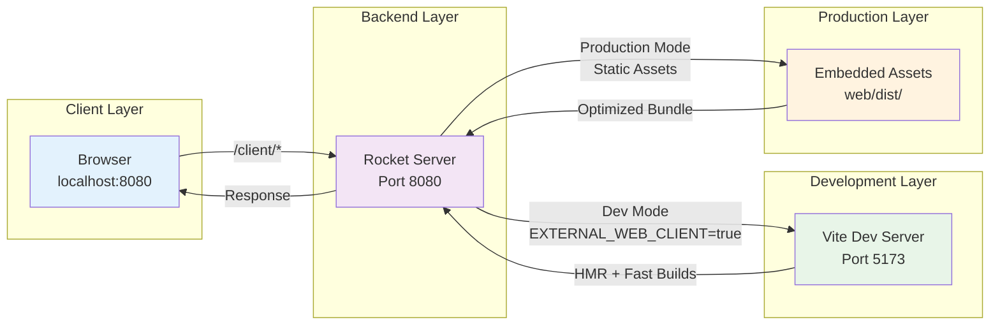

# Vite Development Server Integration with Rocket

This document explains the technical implementation of Vite development server integration in our Rust/Rocket application, providing seamless hot module replacement (HMR) and development features.

## Overview

The integration allows developers to run a Vite development server alongside the Rust/Rocket backend, with the Rocket server acting as a proxy to the Vite server when in development mode. This provides:

- **Hot Module Replacement (HMR)** for instant React updates
- **Fast development builds** via Vite's optimized bundling
- **Unified development workflow** with a single server endpoint
- **Seamless production deployment** with embedded static assets

## Architecture



### Development Mode Flow

1. **Request arrives** at Rocket server (`/client/*`)
2. **Environment check** for `EXTERNAL_WEB_CLIENT` variable
3. **Proxy decision**: If set, proxy to Vite; otherwise, serve embedded assets
4. **Request forwarding** to Vite development server
5. **Response processing** and content type handling
6. **Client delivery** with appropriate headers

### Production Mode Flow

1. **Request arrives** at Rocket server (`/client/*`)
2. **Static asset lookup** in embedded files (from `web/dist/`)
3. **Content delivery** with appropriate MIME types
4. **Fallback handling** to `index.html` for client-side routing

## Code Organization

### Module Structure

```text
src/visualization/
├── mod.rs                 # Module declarations
├── server.rs             # Main server and route handlers
└── vite_dev_proxy.rs     # Vite development proxy (NEW)
```

### Key Components

#### 1. Environment Detection

```rust,ignore
/// Check if Vite development mode is enabled
pub fn is_vite_development_enabled() -> bool {
    env::var("EXTERNAL_WEB_CLIENT").is_ok()
}
```

#### 2. URL Building

```rust,ignore
fn build_vite_url(path: &PathBuf, raw_query: &RawQueryString, prefix: &str) -> String {
    let vite_base = get_vite_base_url();
    let path_str = path.to_str().unwrap_or("");
    let query_str = if raw_query.0.is_empty() {
        String::new()
    } else {
        format!("?{}", raw_query.0)
    };
    format!("{}/{}{}{}", vite_base, prefix, path_str, query_str)
}
```

#### 3. Generic Proxy Function

```rust,ignore
async fn proxy_to_vite(url: &str, request_type: &str) -> Option<StaticFileResponse> {
    // HTTP request to Vite server
    // Content-Type detection and handling
    // Error handling and logging
    // Response transformation
}
```

## Route Handlers

### Standard Web Client Route

```rust,ignore
#[get("/client/<path..>", rank = 2)]
async fn webclient(path: PathBuf, raw_query: RawQueryString) -> Option<StaticFileResponse> {
    if vite_dev_proxy::is_vite_development_enabled() {
        return vite_dev_proxy::proxy_to_vite_dev_server(path, raw_query).await;
    }
    // ... serve embedded static files
}
```

### Specialized Vite Routes

The system includes specialized route handlers for different Vite request patterns:

#### 1. Vite Special Paths (`/client/.vite/*`)

- **Purpose**: Handle Vite's internal development files
- **Examples**: `/client/.vite/deps/react.js`, `/client/.vite/manifest.json`
- **Rank**: 1 (higher priority than general routes)

#### 2. Vite Client Assets (`/client/@vite/*`)

- **Purpose**: Serve Vite's client-side scripts and assets
- **Examples**: `/client/@vite/client`, `/client/@vite/env.js`
- **Special handling**: WebSocket HMR client script

#### 3. Node Modules (`/client/node_modules/.vite/*`)

- **Purpose**: Handle pre-bundled dependencies
- **Examples**: `/client/node_modules/.vite/deps/chunk-ABCD1234.js`
- **Performance**: Optimized dependency loading

#### 4. File System Access (`/client/@fs/*`)

- **Purpose**: Direct file system access for development
- **Examples**: `/client/@fs/Users/dev/project/src/component.tsx`
- **Security**: Only available in development mode

#### 5. WebSocket Proxy (`/client/@vite/client`)

- **Purpose**: Hot Module Replacement (HMR) WebSocket client
- **Content-Type**: Forced to `application/javascript`
- **Limitation**: WebSocket upgrade handled by browser directly

## Configuration

### Environment Variables

```bash
# Required for development mode
export EXTERNAL_WEB_CLIENT=http://localhost:5173

# For HTTPS development (if backend uses TLS)
export EXTERNAL_WEB_CLIENT=https://localhost:5173
```

### Vite Configuration

```typescript
// web/vite.config.ts
export default defineConfig({
  server: {
    port: 5173,
    host: 'localhost',
    // Enable HTTPS if backend uses TLS
    https: process.env.HTTPS_DEV === 'true' ? {
      key: '../key.pem',
      cert: '../cert.pem'
    } : false
  },
  base: '/client/',
  // ... other config
});
```

## Development Workflow

### 1. Start Development Servers

```bash
# Terminal 1: Start Vite development server
cd web
npm run dev

# Terminal 2: Start Rust server with proxy enabled
cd ..
EXTERNAL_WEB_CLIENT=http://localhost:5173 cargo run
```

### 2. Development Process

1. **Frontend changes**: Edit React/TypeScript files in `web/src/`
2. **Hot reloading**: Vite automatically updates the browser
3. **Backend changes**: Restart Rust server (cargo-watch recommended)
4. **Unified access**: Use `http://localhost:8080/client/` for development

### 3. Production Build

```bash
# Build frontend assets
cd web
npm run build

# Build Rust application (assets embedded at compile time)
cd ..
cargo build --release
```

## Technical Details

### Content-Type Handling

The proxy automatically detects and preserves content types from the Vite server:

```rust,ignore,ignore
let content_type = response
    .headers()
    .get("content-type")
    .and_then(|h| h.to_str().ok())
    .and_then(|s| s.parse::<ContentType>().ok())
    .unwrap_or(ContentType::Binary);
```

### Error Handling

- **Connection failures**: Graceful fallback with debug logging
- **Invalid responses**: Proper error propagation
- **Missing files**: Fallback to `index.html` for SPA routing

### Performance Considerations

- **Route ranking**: Specialized routes have higher priority (rank = 1)
- **Caching**: Development requests are not cached (intentional)
- **Connection pooling**: Reqwest client handles HTTP connection reuse
- **Async operations**: Non-blocking proxy requests

## Debugging

### Common Issues

#### 1. CORS Errors

```bash
# Ensure Vite server allows proxy requests
# Check browser network tab for failed requests
```

#### 2. WebSocket Connection Failures

```bash
# For HTTPS backends, Vite must also use HTTPS
export EXTERNAL_WEB_CLIENT=https://localhost:5173
```

#### 3. Missing Assets

```bash
# Check if Vite server is running
curl http://localhost:5173/client/

# Verify environment variable
echo $EXTERNAL_WEB_CLIENT
```

### Logging

Enable debug logging to trace proxy requests:

```bash
RUST_LOG=debug EXTERNAL_WEB_CLIENT=http://localhost:5173 cargo run
```

Look for log messages like:

```log
INFO  rust_photoacoustic::visualization::vite_dev_proxy] Proxying web client in development mode to: http://localhost:5173/client/index.html
DEBUG rust_photoacoustic::visualization::vite_dev_proxy] Returning web client content: StaticFileResponse([60, 33, 68, ...], text/html)
```

## Best Practices

### For React Developers

1. **Use standard Vite patterns**: The proxy transparently forwards all Vite features
2. **Environment variables**: Use Vite's `import.meta.env` for configuration
3. **Asset imports**: Use relative imports, Vite handles the bundling
4. **Hot reloading**: Works automatically, no additional configuration needed

### For Rust Developers

1. **Route ordering**: Specialized routes must have higher rank (lower number)
2. **Error handling**: Always handle proxy failures gracefully
3. **Content types**: Preserve HTTP headers from the Vite server
4. **Development vs Production**: Use feature flags or environment checks

### For DevOps

1. **Environment separation**: Never set `EXTERNAL_WEB_CLIENT` in production
2. **Asset embedding**: Ensure `web/dist/` is built before Rust compilation
3. **HTTPS consistency**: If backend uses TLS, Vite should too
4. **Port management**: Ensure development ports don't conflict

## Security Considerations

- **Development only**: Proxy functionality is disabled in production
- **Local access**: Vite server should only bind to localhost
- **File system access**: `@fs` routes are development-only features
- **Environment isolation**: Development variables must not leak to production

## Performance Impact

### Development Mode

- **Latency**: Additional hop through proxy (~1-5ms overhead)
- **Memory**: Minimal impact, async request handling
- **CPU**: Negligible proxy processing overhead

### Production Mode

- **Zero overhead**: Proxy code not executed
- **Embedded assets**: No file system access required
- **Optimal delivery**: Direct binary asset serving

## Future Improvements

- **WebSocket proxying**: Full WebSocket proxy support for enhanced HMR
- **Caching layer**: Optional development asset caching
- **Load balancing**: Multiple Vite server support
- **HTTPS automation**: Automatic certificate handling for development
