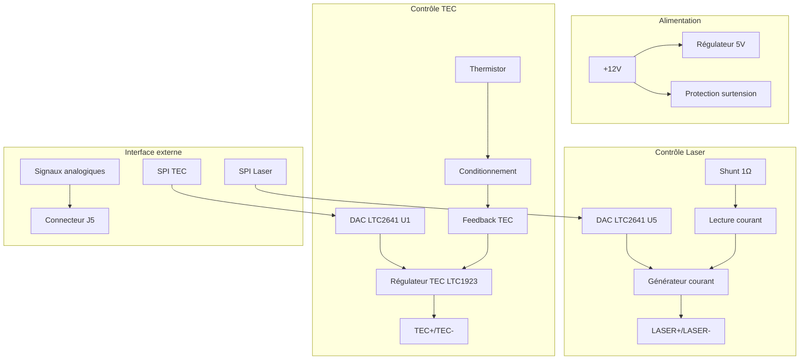
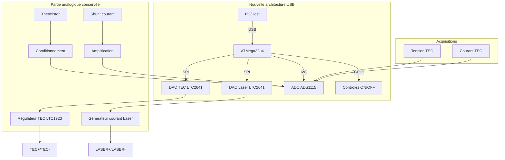
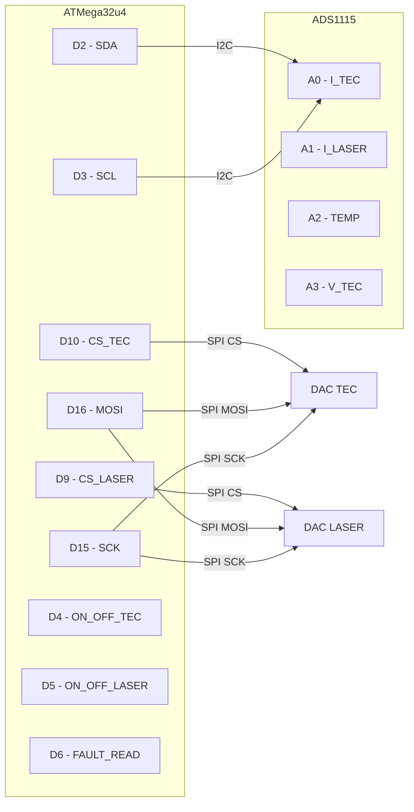
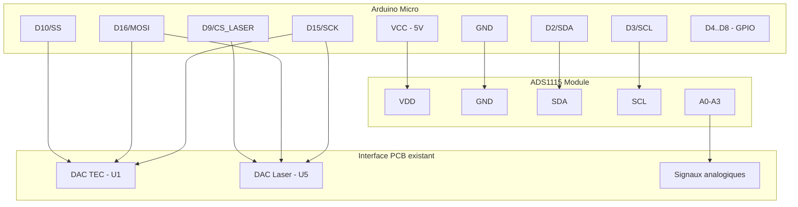
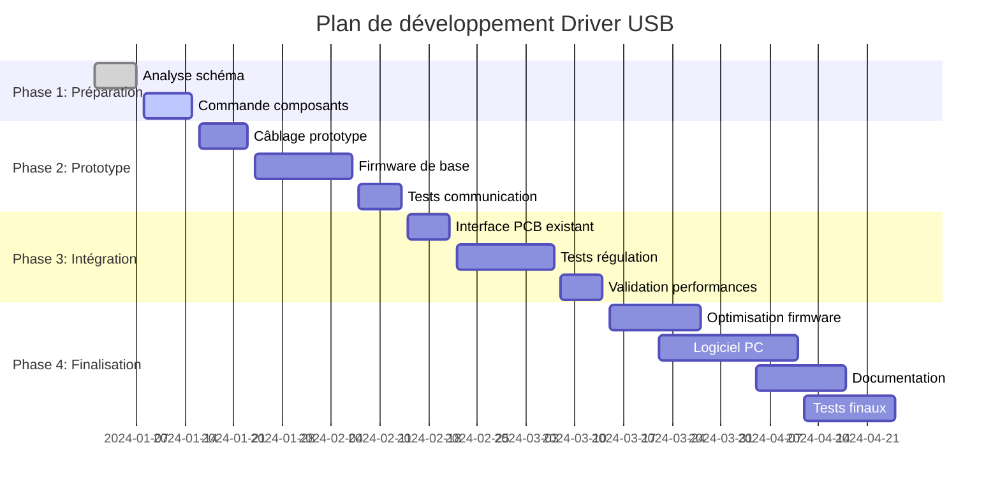

# Analyse et Évolution du Driver TEC/Laser - DTL100-A03

## Table des matières
1. [Vue d'ensemble](#vue-densemble)
2. [Analyse du système actuel](#analyse-du-système-actuel)
3. [Architecture proposée](#architecture-proposée)
4. [Stratégie de migration](#stratégie-de-migration)
5. [Implémentation prototype](#implémentation-prototype)
6. [Spécifications techniques](#spécifications-techniques)
7. [Plan de développement](#plan-de-développement)

---

## Vue d'ensemble

Le driver TEC/Laser DTL100-A03 est un système de contrôle analogique haute performance pour la régulation thermique (TEC) et le pilotage de diodes laser. Ce document présente l'analyse du système existant et propose une évolution vers une architecture USB moderne basée sur microcontrôleur.

### Objectifs de l'évolution
- **Modernisation** : Remplacement de l'interface analogique par USB
- **Flexibilité** : Paramétrage logiciel des consignes
- **Monitoring** : Acquisition temps réel des paramètres
- **Intégration** : Simplification de l'intégration système

---

## Analyse du système actuel

### Architecture générale



### Fonctions principales

#### 1. Régulation TEC (Thermoelectric Cooler)
- **Contrôleur** : LTC1923 (contrôleur TEC dédié)
- **Consigne** : DAC LTC2641 U1 (12 bits, interface SPI)
- **Capteur** : Thermistor avec conditionnement analogique
- **Puissance** : Pilotage H-bridge pour TEC
- **Sécurités** : Protection thermique, limitation courant

#### 2. Pilotage Laser
- **Consigne** : DAC LTC2641 U5 (12 bits, interface SPI)
- **Générateur** : Boucle de régulation avec MOSFET IRLB3034
- **Mesure** : Shunt 1Ω (20W) pour lecture courant
- **Conversion** : 1V = 200mA (selon schéma)
- **Sécurités** : Coupure laser, protection surtension

#### 3. Interface de contrôle
- **Entrées SPI** : Consignes TEC et Laser
- **Sorties analogiques** : Mesures courant, température
- **Signaux logiques** : ON/OFF, FAULT, H/C

### Performances actuelles

| Paramètre | Valeur | Composant |
|-----------|--------|-----------|
| Résolution DAC | 12 bits | LTC2641 |
| Courant laser max | ~10A | IRLB3034 |
| Précision shunt | 1Ω ±0.1% | R23 |
| Alimentation | 12V | - |
| Fréquence découpage TEC | ~100kHz | LTC1923 |

---

## Architecture proposée

### Vue d'ensemble de l'évolution



### Composants principaux

#### 1. ATMega32u4 (Arduino Micro)
- **USB natif** : Communication directe sans convertisseur
- **SPI hardware** : Pilotage des DACs existants
- **I2C hardware** : Communication avec ADS1115
- **GPIO** : Contrôles ON/OFF et signaux de status

#### 2. ADS1115 (16 bits, 4 canaux)
- **Canal 0** : Courant TEC (I_READ_TEC)
- **Canal 1** : Courant Laser (I_READ_LAS01)
- **Canal 2** : Température (DELTA_T)
- **Canal 3** : Tension TEC ou extension

### Schéma de connexion détaillé



---

## Stratégie de migration

### Phase 1 : Analyse et validation
- [x] Analyse du schéma existant
- [x] Identification des signaux critiques
- [x] Définition de l'architecture cible
- [ ] Validation des niveaux de tension

### Phase 2 : Développement prototype
- [ ] Réalisation du prototype Arduino Micro + ADS1115
- [ ] Développement firmware de base
- [ ] Tests de communication SPI/I2C
- [ ] Validation des acquisitions

### Phase 3 : Intégration
- [ ] Interface avec le circuit existant
- [ ] Tests de régulation TEC
- [ ] Tests de pilotage laser
- [ ] Validation des performances

### Phase 4 : Finalisation
- [ ] Optimisation du firmware
- [ ] Développement logiciel PC
- [ ] Documentation utilisateur
- [ ] Tests de validation finale

---

## Implémentation prototype

### Matériel requis

#### Composants principaux
- **Arduino Micro** (ATMega32u4)
- **Module ADS1115** (breakout board)
- **Connecteurs** : Compatible avec PCB existant
- **Composants passifs** : Résistances pull-up, condensateurs découplage

#### Schéma de câblage prototype



### Configuration logicielle

#### Bibliothèques requises
```cpp
#include <SPI.h>
#include <Wire.h>
#include <Adafruit_ADS1X15.h>
```

#### Structure du firmware
```cpp
// Configuration ADC
Adafruit_ADS1115 ads;

// Pins definition
#define CS_TEC_PIN    10
#define CS_LASER_PIN  9
#define ON_OFF_TEC    4
#define ON_OFF_LASER  5

// Fonctions principales
void setup() {
    // Init USB Serial
    // Init SPI pour DACs
    // Init I2C pour ADS1115
    // Config GPIO
}

void loop() {
    // Lecture commandes USB
    // Acquisition ADC
    // Mise à jour DACs
    // Gestion sécurités
    // Envoi données monitoring
}
```

---

## Spécifications techniques

### Performances cibles

| Paramètre | Valeur actuelle | Valeur cible | Amélioration |
|-----------|----------------|--------------|--------------|
| Résolution consigne | 12 bits | 12 bits | = |
| Résolution mesure | Analogique | 16 bits | ++ |
| Interface | SPI externe | USB | ++ |
| Fréquence acquisition | - | 860 SPS | ++ |
| Temps de réponse | <1ms | <10ms | Acceptable |

### Protocole de communication USB

#### Format des commandes
```
Commande TEC:     "TEC:SET:<valeur>\n"
Commande Laser:   "LAS:SET:<valeur>\n"
Lecture status:   "STATUS?\n"
Activation TEC:   "TEC:ON\n" / "TEC:OFF\n"
Activation Laser: "LAS:ON\n" / "LAS:OFF\n"
```

#### Format des réponses
```
Status: "TEC:<temp>,<current>;LAS:<current>,<voltage>;STATUS:<flags>\n"
Acknowledge: "OK\n"
Error: "ERROR:<code>\n"
```

### Gammes de mesure ADS1115

| Canal | Signal | Gamme | Gain ADS1115 | Résolution |
|-------|--------|-------|--------------|------------|
| A0 | I_TEC | 0-5V | 1x | 0.125 mV |
| A1 | I_LASER | 0-5V | 1x | 0.125 mV |
| A2 | TEMP | 0-5V | 1x | 0.125 mV |
| A3 | V_TEC | 0-5V | 1x | 0.125 mV |

---

## Plan de développement

### Étapes de développement



### Livrables

#### Firmware ATMega32u4
- **Pilotage DACs** : Interface SPI pour LTC2641
- **Acquisition** : Lecture ADS1115 multi-canal
- **Communication USB** : Protocole de commande/réponse
- **Sécurités** : Gestion des signaux de protection
- **Monitoring** : Acquisition temps réel des paramètres

#### Logiciel PC (optionnel)
- **Interface graphique** : Contrôle et monitoring
- **Courbes temps réel** : Affichage des paramètres
- **Sauvegarde** : Enregistrement des données
- **Profils** : Gestion des configurations

#### Documentation
- **Manuel d'utilisation** : Guide utilisateur
- **Documentation technique** : Spécifications détaillées
- **Code source** : Firmware documenté
- **Schémas** : Plans de câblage

---

## Conclusions et recommandations

### Avantages de l'évolution proposée

1. **Modernisation** : Interface USB standard, compatible avec tous les OS
2. **Flexibilité** : Paramétrage logiciel, profils utilisateur
3. **Monitoring** : Acquisition continue et historique des données
4. **Intégration** : Simplification de l'intégration dans des systèmes complexes
5. **Maintenance** : Firmware updatable, diagnostic avancé

### Risques et mitigation

| Risque | Impact | Probabilité | Mitigation |
|--------|--------|-------------|------------|
| Bruit numérique | Moyen | Faible | Découplage soigné, layout optimisé |
| Latence régulation | Élevé | Moyen | Tests performance, optimisation code |
| Compatibilité niveaux | Moyen | Faible | Validation préalable, adaptation |
| Fiabilité USB | Faible | Faible | Watchdog, gestion erreurs |

### Qualité

1. **Prototypage rapide** : Utilisation Arduino Micro et d'un HDK AD115 largement disponible pour validation concept
2. **Tests progressifs** : Validatioj chaque fonction séparément
3. **Mesures comparatives** : Benchmark avec système existant
4. **Documentation continue** : Maintenir la documentation à jour
