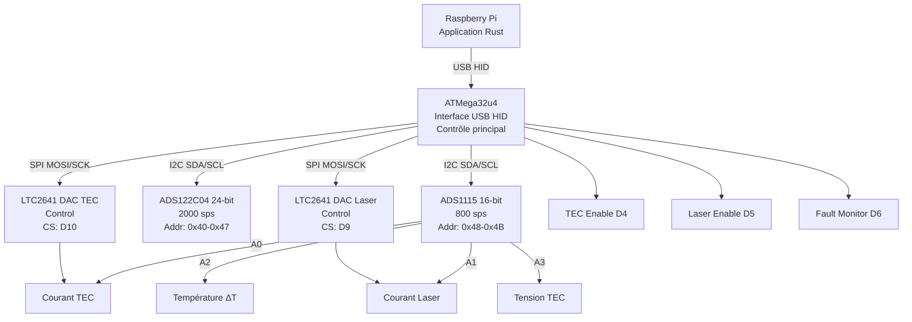
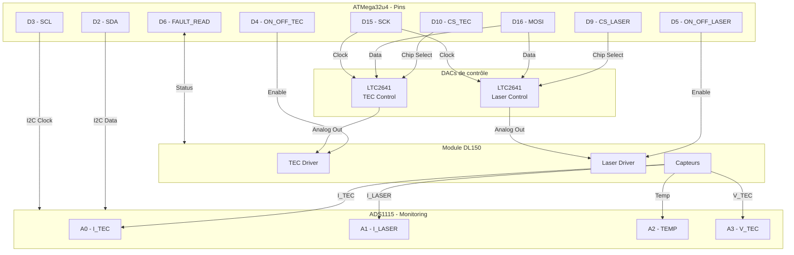

# Développement de la plateforme matérielle

## Table des matières

- [Objectifs](#objectifs)
- [Architecture système](#architecture-système)
- [Outils et méthodologie](#outils-et-méthodologie)
- [Plateforme de contrôle](#plateforme-de-contrôle)
- [Acquisition de données](#acquisition-de-données)
  - [Acquisition 16 bits](#acquisition-16-bits)
  - [Acquisition 24 bits](#acquisition-24-bits)
- [Pilotage DL150](#pilotage-dl150)
- [Composants et budget](#composants-et-budget)
- [Spécifications techniques](#spécifications-techniques)
- [Workflow de développement](#workflow-de-développement)
- [Considérations de sécurité](#considérations-de-sécurité)
- [Documentation complémentaire](#documentation-complémentaire)

## Objectifs

Développer une plateforme matérielle de contrôle et d'acquisition pour le système photoacoustique avec les caractéristiques suivantes :

- Communication USB HID avec le Raspberry Pi (isolation de l'interface matérielle)
- Acquisition multicanaux 16 bits (contrôle) et 24 bits (signal)
- Pilotage précis du laser et du TEC via DAC
- Architecture modulaire et évolutive
- Composants facilement disponibles et coût optimisé

## Architecture système



## Outils et méthodologie

**Logiciel de conception :** Altium Designer 25.8

### Approche de développement par prototypage modulaire

**Principe fondamental :**

> **Toujours commencer par des modules du commerce pour validation fonctionnelle, puis reproduire les schémas validés dans le PCB final.**

Cette méthodologie en deux temps garantit :

- ✅ Validation rapide des concepts sans risque
- ✅ Détection précoce des problèmes d'intégration
- ✅ Économie de temps et d'argent (pas de PCB à refaire)
- ✅ Documentation des schémas validés pour le PCB

### Phase 1 : Prototypage avec modules commerciaux

**Objectif :** Valider TOUS les aspects fonctionnels avant de concevoir le PCB.

1. **Sélection des modules** (Amazon/Bangood/Aliexpress)

   - Modules avec schémas électriques disponibles
   - Circuits simples et bien documentés
   - Composants standard (pas d'obsolescence)
   - Prix unitaire faible pour tests multiples
2. **Validation sur breadboard/PCB de test**

   - Connexions, communication (I2C, SPI, USB)
   - Niveaux électriques et timing
   - Consommation et dissipation thermique
   - Interférences et compatibilité électromagnétique
   - **Récupération des schémas des modules fonctionnels**
3. **Documentation de la configuration validée**

   - Photos du montage
   - Schéma de câblage
   - Valeurs des composants critiques (pull-up, découplage)
   - Code de test et résultats de mesures
   - **Extraction des schémas électriques des modules**

### Phase 2 : Conception PCB à partir des modules validés

**Objectif :** Reproduire les schémas validés dans un PCB intégré professionnel.

1. **Réutilisation des schémas validés**

   - Copier les schémas des modules commerciaux fonctionnels
   - Utiliser les mêmes références de composants si possible
   - Conserver les valeurs de résistances/condensateurs validées
   - Reproduire les routages critiques (horloge, différentiel, etc.)
2. **Sources des schémas de référence**

   - GitHub (projets open-source)
   - Sites fabricants (Texas Instruments, Analog Devices, Microchip)
   - Datasheets (circuits d'application typiques)
   - Reverse engineering des modules (si nécessaire)
3. **Organisation des schémas Altium**

   - **Un schéma par module/fonction** (facilite la validation)
     - Schéma alimentation (5V USB → 3.3V régulé)
     - Schéma MCU ATMega32u4 (copié du Arduino Pro Micro)
     - Schéma ADC ADS1115 (copié du module commercial)
     - Schéma DAC LTC2641 (depuis datasheet Analog Devices)
     - Schéma connexions I2C/SPI
     - Schéma GPIO et protections
   - Design hiérarchique avec blocs réutilisables
   - Revue de conception page par page
4. **Vérifications avant fabrication**

   - ✓ Chaque schéma correspond à un module validé
   - ✓ Footprints vérifiés sur site JLCPCB
   - ✓ Composants disponibles ([mes composants JLCPCB](https://jlcpcb.com/user-center/smtPrivateLibrary/myPartsLib))
   - ✓ BOM vérifiée avec stock fabricant
   - ✓ DRC (Design Rule Check) passé
   - ✓ Revue croisée avec l'équipe

### Avantages de cette méthodologie


| Aspect                      | Modules commerciaux            | PCB intégré final               |
| ----------------------------- | -------------------------------- | ----------------------------------- |
| **Temps de développement** | Rapide (4 semaines)            | Long (3 mois)                     |
| **Coût prototype**         | Faible (20-50€)               | Moyen (100-200€)                 |
| **Risque**                  | Très faible                   | Réduit par validation préalable |
| **Flexibilité**            | Maximale (câblage modifiable) | Fixe (nécessite nouveau PCB)     |
| **Production série**       | Non adapté                    | Optimisé                         |
| **Fiabilité**              | Médiocre                      | Excellente (PCB dédié)          |

### Exemple concret : Module ADS1115

**Étape 1 - Module commercial (16€/5pcs)**

- Achat module breakout ADS1115
- Test sur breadboard avec Arduino Pro Micro
- Validation lecture 4 canaux, I2C, précision
- Récupération du schéma du module (GitHub/fabricant)

**Étape 2 - Intégration PCB**

- Copie du schéma ADS1115 validé dans Altium
- Ajout des mêmes pull-up I2C (4.7kΩ)
- Mêmes condensateurs de découplage (100nF + 10µF)
- Vérification footprint SOIC-10 disponible chez JLCPCB
- Routage identique pour lignes I2C critiques

## Plateforme de contrôle

### ATMega32u4 - Microcontrôleur USB

**Caractéristiques :**

- Communication USB HID native (pas de convertisseur externe)
- 20 I/O numériques
- Interfaces : I2C, SPI, UART
- Fréquence : 16 MHz
- Mémoire : 32 KB Flash, 2.5 KB SRAM

**Module compatible Arduino Pro Micro :**

- Prix : 28€ les 5 unités → **5.60€/unité**
- Lien : https://amzn.eu/d/4W1vUn8
- Schémas de référence : [arduino_pro_micro](doc/resources/arduino_pro_micro/)
- Source : [ElectronicClinic - Arduino Pro Micro](https://www.electroniclinic.com/how-to-make-arduino-pro-micro-at-home-altium-designer/)

**Vérifications nécessaires :**

- Disponibilité des composants chez [JLCPCB](https://jlcpcb.com/)
- Vérifier dans [mes composants](https://jlcpcb.com/user-center/smtPrivateLibrary/myPartsLib)
- Validation du schéma avant fabrication

**Avantages architecture :**

- Séparation interface matérielle / Raspberry Pi via USB
- Communication HID (pas de driver spécifique)
- Isolation galvanique possible

## Acquisition de données

### Acquisition 16 bits

**ADS1115 - ADC 16 bits I2C**

**Caractéristiques :**

- Résolution : 16 bits
- Fréquence d'échantillonnage : 800 SPS max
- Interface : I2C
- Canaux : 4 canaux single-ended ou 2 différentiels
- Adresses I2C : 4 adresses configurables (0x48, 0x49, 0x4A, 0x4B)
- **Capacité d'extension : jusqu'à 4 ADS1115 = 16 canaux**

**Approvisionnement :**

- Prix : 16€ pour 5 modules → **3.20€/unité**
- Lien : https://amzn.eu/d/66uGC1o
- Bibliothèque Arduino : [ADS1115_WE](https://github.com/wollewald/ADS1115_WE)

**Configuration pour pilotage laser/TEC :**

1 ADS1115 dédié au contrôle (4 canaux) :


| Canal  | Signal       | Description                | Plage typique    |
| -------- | -------------- | ---------------------------- | ------------------ |
| **A0** | I_READ_TEC   | Courant TEC                | 0-3A             |
| **A1** | I_READ_LAS01 | Courant Laser              | 0-500mA          |
| **A2** | DELTA_T      | Différence température   | -10°C à +10°C |
| **A3** | V_TEC        | Tension TEC (ou extension) | 0-5V             |

**Connexions I2C :**

- SDA : D2 (ATMega32u4)
- SCL : D3 (ATMega32u4)
- Pull-up : 4.7kΩ sur SDA et SCL
- Capacités de découplage : 100nF sur VDD

## Pilotage DL150

### Architecture de contrôle

**Composants :**

- **1x ADS1115** : Lecture des paramètres (courant TEC/Laser, température, tension)
- **2x LTC2641** : DAC 12/16 bits pour pilotage TEC et Laser
- **Port SPI ATMega32u4** : Communication avec les DACs
- **2 Chip Select** : D10 (TEC) et D9 (Laser)

**Bibliothèque Arduino :**

- [LTC2641 - Analog Devices Linduino](https://github.com/analogdevicesinc/Linduino/tree/master/LTSketchbook/libraries/LTC2641)

### Schéma de connexion détaillé



### Configuration SPI

**Paramètres SPI pour LTC2641 :**

- Mode : SPI Mode 0 (CPOL=0, CPHA=0)
- Vitesse : Jusqu'à 50 MHz (utiliser 4 MHz pour fiabilité)
- Ordre des bits : MSB first
- Résolution : 12 ou 16 bits selon version

**Pinout ATMega32u4 :**


| Pin | Fonction | Connexion                          |
| ----- | ---------- | ------------------------------------ |
| D16 | MOSI     | DAC TEC + DAC Laser (Data In)      |
| D15 | SCK      | DAC TEC + DAC Laser (Clock)        |
| D14 | MISO     | Non utilisé (DAC unidirectionnel) |
| D10 | SS/CS    | DAC TEC (Chip Select)              |
| D9  | GPIO     | DAC Laser (Chip Select)            |

### Acquisition 24 bits

**ADS122C04IPWR - ADC 24 bits I2C**

**Caractéristiques :**

- Résolution : 24 bits
- Fréquence d'échantillonnage : 2000 SPS
- Interface : I2C
- Adresses : 8 adresses configurables (0x40-0x47)
- PGA intégré : gains 1, 2, 4, 8, 16, 32, 64, 128
- Faible bruit : idéal pour acquisition signal photoacoustique

**Approvisionnement :**

- Package : TSSOP-16
- Prix : À vérifier chez distributeurs
- Bibliothèque Arduino : [SparkFun ADS122C04](https://github.com/sparkfun/SparkFun_ADS122C04_ADC_Arduino_Library)

**Application :**

- Acquisition haute résolution du signal photoacoustique
- Mesures différentielles basse amplitude
- Extension possible à 8 canaux (8 adresses I2C)

## Composants et budget

### Tableau récapitulatif


| Composant            | Référence                   | Qté | Prix unitaire | Prix total     | Interface | Fonction             | Fournisseur    |
| ---------------------- | ------------------------------- | ------ | --------------- | ---------------- | ----------- | ---------------------- | ---------------- |
| **Microcontrôleur** | ATMega32u4 Pro Micro (module) | 1    | 5.60€        | 5.60€         | USB HID   | Contrôle principal  | Amazon         |
|                      | ATMega32u4 composant          | 1    | 5.77€        | 5.77€         | USB HID   | Contrôle principal  | JLPCV          |
| **ADC 16-bit**       | ADS1115                       | 1-4  | 3.20€        | 3.20€-12.80€ | I2C       | Monitoring contrôle | Amazon         |
| **ADC 24-bit**       | ADS122C04IPWR                 | 1-8  | TBD           | TBD            | I2C       | Acquisition signal   | Mouser/DigiKey |
| **DAC 12/16-bit**    | LTC2641                       | 2    | TBD           | TBD            | SPI       | Pilotage TEC/Laser   | Analog Devices |
| **Passifs**          | Résistances, condensateurs   | -    | -             | ~5€           | -         | Découplage, pull-up | JLCPCB         |
| **Connecteurs**      | Headers, USB                  | -    | -             | ~3€           | -         | Interfaçage         | JLCPCB         |
| **PCB**              | 2 couches, 100x100mm          | 5    | -             | ~10€          | -         | Support              | JLCPCB         |
|                      |                               |      |               | **~27€-47€** |           |                      |                |

*Prix estimatif pour un prototype (hors frais de port)*

### Approvisionnement recommandé

**Modules de développement (prototypage) :**

- ATMega32u4 Pro Micro : [Amazon 28€/5pcs](https://amzn.eu/d/4W1vUn8)
- ADS1115 : [Amazon 16€/5pcs](https://amzn.eu/d/66uGC1o)

**Composants pour PCB final :**

- JLCPCB : Assemblage PCB + composants standards
- Mouser/DigiKey : Composants spécifiques (ADS122C04, LTC2641)

## Spécifications techniques

### Alimentation


| Paramètre              | Valeur       | Notes                                  |
| ------------------------- | -------------- | ---------------------------------------- |
| Tension d'entrée       | 5V USB       | Régulée par module Pro Micro         |
| Régulation 3.3V        | Intégrée   | Pour composants I2C/SPI si nécessaire |
| Consommation MCU        | ~50mA        | ATMega32u4 à 16 MHz                   |
| Consommation ADC        | ~1mA/unité  | ADS1115 + ADS122C04                    |
| Consommation DAC        | ~5mA/unité  | LTC2641                                |
| **Consommation totale** | **~65-75mA** | Hors charge TEC/Laser                  |

### Protection requise

- **Protection USB :** Fusible réarmable 500mA
- **Protection ESD :** Diodes TVS sur lignes USB D+/D-
- **Découplage :** Condensateurs 100nF sur tous les VDD + 10µF sur alimentation principale
- **Pull-up I2C :** 4.7kΩ sur SDA et SCL
- **Watchdog :** Timer MCU activé pour reset automatique

### Environnement


| Paramètre                     | Valeur                       |
| -------------------------------- | ------------------------------ |
| Température de fonctionnement | 0°C à +50°C               |
| Humidité                      | 20% à 80% sans condensation |
| Dimensions PCB (estimé)       | 80mm x 60mm                  |

## Workflow de développement

### Phase 1 : Prototype breadboard avec modules commerciaux (2-3 semaines)

**Objectifs :**

- ✓ Validation communication USB HID ATMega32u4 ↔ Raspberry Pi
- ✓ Test acquisition ADS1115 (lecture courant, tension, température)
- ✓ Validation bus I2C (adressage multiple)
- ✓ Test pilotage DAC LTC2641 via SPI
- ✓ Développement firmware de base
- ✓ **Récupération et documentation des schémas des modules fonctionnels**

**Matériel requis - Modules commerciaux :**

- **Arduino Pro Micro (ATMega32u4)** - [28€/5pcs Amazon](https://amzn.eu/d/4W1vUn8)
  - Schéma disponible : [arduino_pro_micro](doc/resources/arduino_pro_micro/)
  - À récupérer pour intégration PCB
- **Module ADS1115** - [16€/5pcs Amazon](https://amzn.eu/d/66uGC1o)
  - Schéma disponible sur GitHub/fabricant
  - Pull-up I2C et découplage à documenter
- **Module DAC (si disponible)** ou circuit sur breadboard
  - Schéma d'application depuis datasheet LTC2641
- **Breadboard + fils Dupont**
- **Alimentation USB 5V**
- **Outils de mesure :** Multimètre, oscilloscope (si disponible)

**Activités essentielles :**

1. **Montage et tests fonctionnels**

   ```
   Arduino Pro Micro (USB) → Raspberry Pi
         ↓ ("I2C: SDA, SCL")
   ADS1115 Module (lecture analogique)
         ↓ ("SPI: MOSI, SCK, CS")
   DAC LTC2641 (pilotage TEC/Laser)
   ```
2. **Documentation des modules validés** 📋

   - [ ] Prendre photos du montage breadboard
   - [ ] Récupérer schémas électriques de chaque module
   - [ ] Noter toutes les valeurs de composants (R, C)
   - [ ] Mesurer signaux critiques (oscilloscope)
   - [ ] Documenter la configuration I2C/SPI fonctionnelle
   - [ ] Archiver le code Arduino de test
3. **Extraction des schémas de référence** 🔍

   - **Arduino Pro Micro :** Schéma open-source disponible
   - **ADS1115 :** Schéma du module breakout (GitHub)
   - **LTC2641 :** Circuit d'application (datasheet Analog Devices)
   - **Alimentation :** Schéma régulateur 5V→3.3V du module
4. **Validation complète**

   - Communication USB stable
   - Acquisition ADC précise (erreur < 1%)
   - Pilotage DAC fonctionnel (résolution validée)
   - Pas d'interférences I2C/SPI
   - Température de fonctionnement acceptable

**Livrables Phase 1 :**

- ✅ Code Arduino fonctionnel et testé
- ✅ Protocole de communication HID défini et validé
- ✅ **Dossier complet des schémas des modules** (format PDF/Altium)
- ✅ Documentation des tests avec résultats de mesures
- ✅ **Spécification technique validée** (base pour PCB)

**🔑 Critère de passage à la Phase 2 :**

> Tous les modules commerciaux fonctionnent ensemble de manière stable, et leurs schémas électriques sont documentés et archivés.

### Phase 2 : Conception PCB v1.0 à partir des schémas validés (3-4 semaines)

**Pré-requis :** Phase 1 complétée avec succès, schémas des modules disponibles.

**Étapes :**

1. **Import et adaptation des schémas validés** 📥

   a) **Schéma Alimentation** (depuis module USB)

   - Copier le circuit de protection USB du Pro Micro
   - Réutiliser le régulateur 3.3V si nécessaire
   - Ajouter les mêmes condensateurs de découplage validés
   - Fusible PTC identique au module commercial

   b) **Schéma MCU ATMega32u4** (depuis Arduino Pro Micro)

   - Importer le schéma open-source Arduino Pro Micro
   - Conserver l'oscillateur 16 MHz (même valeur condensateurs)
   - Garder le circuit de reset identique
   - Reproduire le circuit USB (résistances, ferrites)

   c) **Schéma ADC ADS1115** (depuis module breakout)

   - Copier le schéma du module commercial
   - **Mêmes pull-up I2C : 4.7kΩ** (validés en Phase 1)
   - **Mêmes condensateurs : 100nF + 10µF** (validés)
   - Configuration adresse identique (A0, A1)

   d) **Schéma DAC LTC2641** (depuis datasheet/breadboard validé)

   - Utiliser le circuit d'application du datasheet
   - Reproduire les valeurs de composants testées
   - Conserver le routage SPI validé

   e) **Schéma GPIO et protections**

   - Ajouter les protections ESD validées
   - Résistances série identiques au prototype
2. **Organisation Altium Designer** 📐

   ```
   Projet PCB Photoacoustic Control
   ├── 01_Alimentation.SchDoc          "(du Pro Micro)"
   ├── 02_MCU_ATMega32u4.SchDoc        "(du Pro Micro)"
   ├── 03_USB_Interface.SchDoc         "(du Pro Micro)"
   ├── 04_ADC_ADS1115_Control.SchDoc   "(du module ADS1115)"
   ├── 05_ADC_ADS122C04_Signal.SchDoc  "(datasheet + app note)"
   ├── 06_ConnexionDL150.SchDoc        "(du PCB_QCNOSE_DTL100-A03)"
   ├── 07_I2C_Bus.SchDoc               "(connexions validées)"
   ├── 08_SPI_Bus.SchDoc               "(connexions validées)"
   └── 09_GPIO_Protection.SchDoc       "(circuit de test)"
   ```

   **Règle :** Chaque schéma = 1 module validé ou 1 fonction testée
3. **Layout PCB** 🔧

   a) **Placement inspiré des modules**

   - Reproduire l'espacement composants des modules fonctionnels
   - Respecter les zones critiques (horloge, USB, analog)
   - Grouper par fonction comme sur breadboard

   b) **Routage basé sur les modules validés**

   - I2C : même longueur/largeur de pistes que modules
   - SPI : reproduire le routage du circuit de test
   - USB : copier le routage différentiel du Pro Micro
   - Plans de masse : continus comme sur modules

   c) **Vérifications avant fabrication** ✓

   - [ ] DRC (Design Rule Check) passé sans erreur
   - [ ] Comparaison schéma PCB ↔ modules de référence
   - [ ] Tous les composants disponibles JLCPCB
   - [ ] BOM vérifiée avec stock en temps réel
   - [ ] Footprints validés (vérification manuelle)
   - [ ] Revue de conception croisée (2 personnes minimum)
4. **Revue de conception finale** 🔍

   **Checklist de validation :**

   - ✓ Chaque partie du PCB correspond à un module commercial validé
   - ✓ Aucune modification "créative" non testée
   - ✓ Valeurs de composants = celles des modules fonctionnels
   - ✓ Routages critiques reproduits à l'identique
   - ✓ Documentation de traçabilité (PCB ← modules)

   **Documents à préparer :**

   - Schématique complet (PDF multi-pages)
   - Tableau de correspondance PCB ↔ Modules sources
   - Liste des modifications par rapport aux modules
   - Justification de chaque adaptation
5. **Fabrication JLCPCB** 🏭

   a) **Vérification finale sur site JLCPCB**

   - Upload Gerber → vérification visuelle
   - Upload BOM → vérification disponibilité composants
   - Upload Pick-and-place → vérification placement
   - Sélection finition : HASL / ENIG selon besoin

   b) **Commande**

   - PCB : 5 pièces (pour tests multiples)
   - Assemblage : Top side (composants SMD)
   - Option stencil : OUI (pour composants manuels)
   - Délai : 1-2 semaines livraison

   c) **Documentation de fabrication**

   - Sauvegarde fichiers Gerber + sources Altium
   - Export schématique PDF annoté
   - Guide d'assemblage (composants through-hole)

**Livrables Phase 2 :**

- ✅ Fichiers Altium complets (schéma + PCB)
- ✅ **Tableau de traçabilité** (chaque schéma → module source)
- ✅ Gerbers + BOM + Pick-and-place
- ✅ Documentation de correspondance modules/PCB
- ✅ 5 PCB assemblés reçus de JLCPCB

**🔑 Principe clé Phase 2 :**

> Ne jamais inventer : copier les schémas validés. Si une partie n'a pas été testée en Phase 1, retourner au prototypage.

### Phase 3 : Tests et validation PCB v1.0 (2-3 semaines)

**Objectif :** Vérifier que le PCB se comporte exactement comme les modules commerciaux.

**Tests de correspondance modules ↔ PCB :**

1. **Tests d'équivalence fonctionnelle** ⚖️

   Pour chaque fonction, comparer PCB vs modules originaux :


   | Fonction               | Module commercial | PCB v1.0       | Écart acceptable |
   | ------------------------ | ------------------- | ---------------- | ------------------- |
   | Communication USB      | Pro Micro         | PCB ATMega32u4 | < 1% erreur       |
   | Acquisition ADC 16-bit | Module ADS1115    | PCB ADS1115    | < 0.5% erreur     |
   | I2C timing             | Module breakout   | PCB            | Identique         |
   | SPI DAC                | Breadboard DAC    | PCB LTC2641    | < 1% erreur       |
   | Consommation           | Somme modules     | PCB intégré  | ± 10%            |
2. **Tests fonctionnels détaillés**

   - [ ] Alimentation (tensions identiques aux modules)
   - [ ] Communication USB HID (même protocole)
   - [ ] Acquisition I2C (mêmes valeurs lues)
   - [ ] Pilotage SPI (même précision)
   - [ ] GPIO (mêmes niveaux logiques)
   - [ ] Tests d'intégration avec DL150 (si disponible)

**Tests de performance :**

- [ ] Précision acquisition ADC (comparaison avec modules)
- [ ] Stabilité DAC (comparaison avec circuit breadboard)
- [ ] Temps de réponse (doit être ≤ prototype)
- [ ] Bruit de mesure (doit être ≤ modules)
- [ ] Fréquence d'échantillonnage (identique aux specs)

**Tests de fiabilité :**

- [ ] Fonctionnement continu 24h (comme modules)
- [ ] Tests thermiques 0-50°C
- [ ] Robustesse déconnexion/reconnexion USB
- [ ] Gestion des erreurs I2C/SPI

**Analyse des écarts :**

```
Si PCB ≠ Modules commerciaux :
  ├─ Identifier la différence schématique
  ├─ Vérifier le routage PCB vs module
  ├─ Analyser les mesures électriques
  └─ Documenter pour correction v2.0
```

**Livrables Phase 3 :**

- ✅ Rapport de tests comparatifs modules/PCB
- ✅ Liste des écarts fonctionnels (si existants)
- ✅ Analyse des causes (schéma, layout, composants)
- ✅ Liste des modifications pour v2.0
- ✅ Firmware validé sur PCB

### Phase 4 : PCB v2.0 Production (si nécessaire)

**Entrée en Phase 4 uniquement si :** Des écarts significatifs détectés en Phase 3.

**Corrections basées sur l'analyse modules vs PCB :**

1. **Modifications schématiques** 🔧

   - Retour aux schémas des modules pour composants problématiques
   - Vérification double des valeurs de composants
   - Ajout de composants manquants (détectés en Phase 3)
   - **Principe :** Se rapprocher encore plus des modules commerciaux
2. **Optimisations layout** 📐

   - Correction routage basée sur mesures oscilloscope
   - Amélioration plans de masse (si bruit détecté)
   - Ajustement placement (si thermique problématique)
   - **Règle :** Copier davantage le layout des modules fonctionnels
3. **Amélioration documentation** 📚

   - Mise à jour tableau traçabilité modules/PCB
   - Documentation des leçons apprises
   - Guide de modifications v1.0 → v2.0

**Livrables Phase 4 :**

- ✅ PCB v2.0 prêt pour production
- ✅ Documentation complète utilisateur
- ✅ Guide de montage et test
- ✅ **Validation finale : PCB = modules commerciaux**

---

## Récapitulatif de la méthodologie

### 🎯 Règles d'or du développement

1. **TOUJOURS prototyper avec modules du commerce d'abord**

   - Jamais de PCB sans validation préalable
   - Chaque fonction doit être testée séparément
   - Documentation exhaustive du prototype
2. **PCB = Copie des modules validés**

   - Réutiliser schémas existants (GitHub, fabricants, datasheets)
   - Ne pas "améliorer" sans tester d'abord
   - Traçabilité complète module → schéma PCB
3. **Validation par comparaison**

   - PCB doit se comporter comme modules commerciaux
   - Mesures identiques = validation réussie
   - Écart = retour au schéma du module

### 📋 Checklist méthodologie

**Avant de concevoir le PCB :**

- [ ] Tous les modules commerciaux fonctionnent ensemble
- [ ] Schémas électriques de tous les modules récupérés
- [ ] Code de test fonctionnel et documenté
- [ ] Mesures électriques documentées (oscilloscope, multimètre)
- [ ] Photos et vidéos du prototype
- [ ] Validation avec DL150 avec faux laser puis QCL et wattmètre laser

**Pendant la conception PCB :**

- [ ] Chaque schéma Altium correspond à un module validé
- [ ] Tableau de traçabilité module → schéma → PCB
- [ ] Aucune "innovation" non testée
- [ ] Revue croisée avec référence aux modules sources
- [ ] Vérification composants disponibles JLCPCB

**Après réception PCB :**

- [ ] Comparaison systématique PCB vs modules
- [ ] Tests identiques à ceux des modules
- [ ] Même performance attendue
- [ ] Documentation des écarts et corrections

### 💡 Avantages concrets


| Étape              | Sans cette méthodologie | Avec cette méthodologie      |
| --------------------- | -------------------------- | ------------------------------- |
| **Conception**      | Risque élevé d'erreurs | Schémas pré-validés        |
| **Premier PCB**     | 50% de chance d'échec   | 90% de chance de succès      |
| **Temps total**     | 3-6 mois (itérations)   | 2-3 mois (méthodique)        |
| **Coût**           | 500-1000€ (PCB refaits) | 200-300€ (optimisé)         |
| **Qualité finale** | Incertaine               | Garantie (basée sur modules) |

### 🔬 Exemple complet : ADS1115

**Méthodologie :**

```
"Acheter module ADS1115 (3€)" → "Tester sur breadboard"
              ↓
    "Valider lectures précises, I2C stable"
              ↓
    "Récupérer schéma du module (GitHub)"
              ↓
    "Copier schéma identique dans PCB"
              ↓
    "PCB fonctionne du premier coup ✓"
```

## Considérations de sécurité

### Protection électrique


| Élément        | Protection                | Composant         |
| ------------------ | --------------------------- | ------------------- |
| USB 5V           | Fusible réarmable        | 500mA PTC         |
| Lignes USB D+/D- | Diodes TVS                | PRTR5V0U2X        |
| Entrées ADC     | Résistances série       | 1kΩ              |
| Sorties DAC      | Limitation courant        | Selon application |
| Alimentation     | Condensateurs découplage | 100nF + 10µF     |

### Surveillance et diagnostics

**LED de statut :**

- LED Power (verte) : Alimentation OK
- LED USB (bleue) : Communication active
- LED Fault (rouge) : Erreur détectée

**Signaux de surveillance :**

- GPIO Fault Read (D6) : Lecture état erreur DL150
- Watchdog MCU : Reset automatique si blocage
- Détection déconnexion USB : Mode safe

### Sécurité laser

**Interlocks requis :**

- Enable Laser (D5) : Activation contrôlée
- Surveillance courant laser : Limite max via ADC
- Timeout logiciel : Désactivation auto après délai
- Bouton d'arrêt d'urgence : Coupure hardware (optionnel)

## Documentation complémentaire

### Documents à créer

1. **Schéma électrique complet (PDF)**

   - Vue d'ensemble système
   - Schéma détaillé par fonction
   - Liste des signaux et connecteurs
2. **Pinout détaillé ATMega32u4**

   - Affectation de tous les pins
   - Fonctions alternatives
   - Contraintes électriques
3. **Protocole de communication USB HID**

   - Format des paquets
   - Commandes disponibles
   - Codes d'erreur
   - Exemples d'utilisation
4. **Format des données I2C/SPI**

   - Registres ADS1115/ADS122C04
   - Commandes LTC2641
   - Séquences d'initialisation
5. **Guide de montage et test**

   - Procédure d'assemblage
   - Checklist de test
   - Procédure de calibration
   - Dépannage
6. **Firmware Arduino**

   - Code source commenté
   - Guide de compilation
   - Procédure de flash
   - API de développement
7. **Manuel utilisateur**

   - Installation
   - Configuration
   - Utilisation
   - Maintenance

### Ressources externes

**Datasheets :**

- [ATMega32u4](https://ww1.microchip.com/downloads/en/DeviceDoc/Atmel-7766-8-bit-AVR-ATmega16U4-32U4_Datasheet.pdf)
- [ADS1115](https://www.ti.com/lit/ds/symlink/ads1115.pdf)
- [ADS122C04](https://www.ti.com/lit/ds/symlink/ads122c04.pdf)
- [LTC2641](https://www.analog.com/media/en/technical-documentation/data-sheets/2641fb.pdf)

**Application Notes :**

- I2C Bus Pull-up Resistor Calculation
- SPI Interface Best Practices
- USB HID Device Implementation
- Low-noise PCB Layout Guidelines

---

**Document version:** 2.0
**Date:** 14 octobre 2025
**Auteur:** Ronan Le Meillat
**Statut:** En cours de développement
