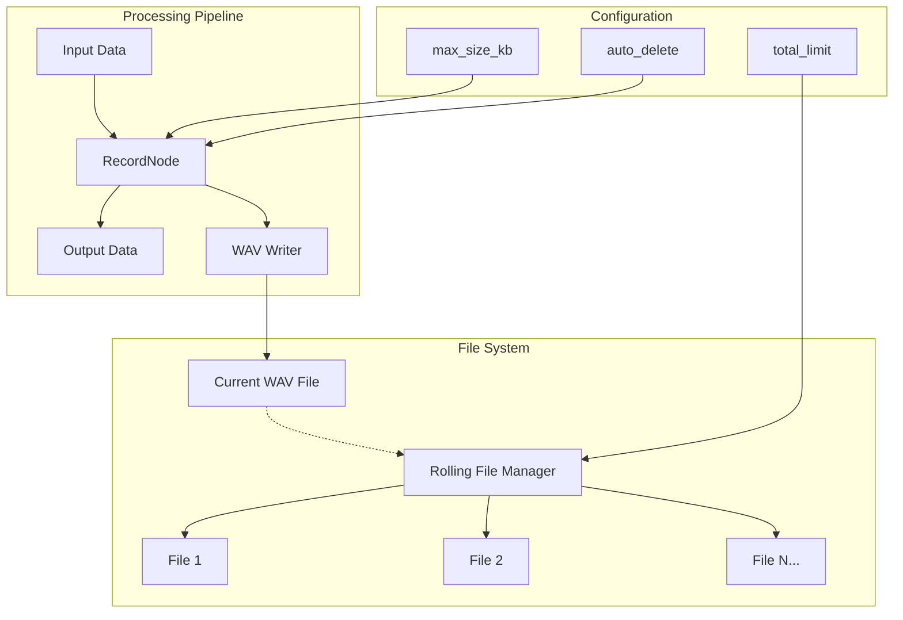
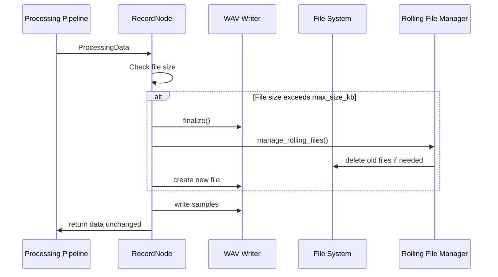
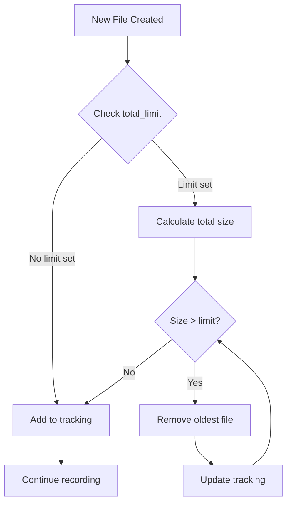
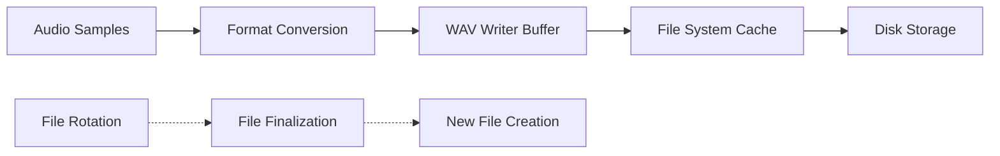

# RecordNode Comprehensive Guide

The `RecordNode` is a critical component of the rust-photoacoustic processing pipeline that provides transparent audio stream recording capabilities with advanced file management features.

## Table of Contents

- [Overview](#overview)
- [Architecture](#architecture)
- [Features](#features)
- [Configuration](#configuration)
- [Rolling File Management](#rolling-file-management)
- [Usage Examples](#usage-examples)
- [Implementation Details](#implementation-details)
- [Error Handling](#error-handling)
- [Performance Considerations](#performance-considerations)
- [Testing](#testing)

## Overview

The `RecordNode` implements the `ProcessingNode` trait and acts as a **pass-through** recording device in the audio processing pipeline. It captures audio data to WAV files while allowing the stream to continue unchanged to downstream nodes.

### Key Characteristics

- **Non-blocking**: Recording operations don't interrupt the processing pipeline
- **Format-agnostic**: Handles mono, stereo, and AudioFrame data types
- **Memory-efficient**: Streams data directly to disk without buffering
- **Robust**: Continues processing even if recording fails

## Architecture



### Data Flow



## Features

### Core Recording Features

- **Multiple Audio Formats**: Supports `SingleChannel`, `DualChannel`, and `AudioFrame` data
- **PCM WAV Output**: 16-bit integer PCM format with configurable sample rates
- **Automatic Channel Detection**: Mono/stereo format determined from input data
- **Pass-through Design**: Input data returned unchanged for pipeline continuation

### File Management Features

- **Automatic File Rotation**: Creates new files when size limits are exceeded
- **Timestamp-based Naming**: Rotated files get unique timestamp suffixes
- **Auto-delete Option**: Optionally removes files with the same name
- **Rolling File Management**: Maintains total disk usage within specified limits

### Robustness Features

- **Error Resilience**: Recording failures don't interrupt processing
- **Proper Resource Cleanup**: WAV files finalized on node drop
- **Directory Creation**: Automatically creates output directories
- **Thread Safety**: Designed for single-threaded use in processing graphs

## Configuration

### Constructor Parameters

```rust
pub fn new(
    id: String,              // Unique node identifier
    record_file: PathBuf,    // Base file path for recordings
    max_size_kb: usize,      // Max file size in KB before rotation
    auto_delete: bool,       // Delete same-name files on rotation
    total_limit: Option<usize>, // Total disk space limit in KB
) -> Self
```

### Parameter Details

| Parameter | Type | Description | Example |
|-----------|------|-------------|---------|
| `id` | `String` | Unique identifier for the node | `"main_recorder"` |
| `record_file` | `PathBuf` | Base path for recording files | `PathBuf::from("recordings/audio.wav")` |
| `max_size_kb` | `usize` | File size limit in kilobytes | `1024` (1MB) |
| `auto_delete` | `bool` | Whether to delete same-name files | `false` |
| `total_limit` | `Option<usize>` | Total disk space limit in KB | `Some(5120)` (5MB) |

### Configuration Examples

```rust
// Basic recording without limits
let basic_recorder = RecordNode::new(
    "basic".to_string(),
    PathBuf::from("recording.wav"),
    10240,  // 10MB per file
    false,  // keep all files
    None,   // no total limit
);

// Rolling file recorder
let rolling_recorder = RecordNode::new(
    "rolling".to_string(),
    PathBuf::from("stream.wav"),
    1024,        // 1MB per file
    false,       // keep old files
    Some(5120),  // 5MB total limit
);

// Auto-delete recorder
let temp_recorder = RecordNode::new(
    "temp".to_string(),
    PathBuf::from("temp.wav"),
    2048,   // 2MB per file
    true,   // auto-delete same-name files
    None,   // no rolling limit
);
```

## Rolling File Management

The rolling file management system provides automatic disk space management for long-running recording sessions.

### How It Works



### File Naming Convention

- **First file**: Uses the original `record_file` name
- **Subsequent files**: Append timestamp suffix

```
recording.wav                    # First file
recording_1672531200.wav         # Second file (with timestamp)
recording_1672531260.wav         # Third file (with timestamp)
```

### Rolling Algorithm

1. **Track all created files** with their sizes in kilobytes
2. **Calculate total disk usage** when a new file is completed
3. **Remove oldest files** until total usage ≤ `total_limit`
4. **Update tracking list** to reflect current state

### Example Scenario

Configuration: `max_size_kb: 1024`, `total_limit: 5120`

```
File 1: recording.wav (1024KB)           # Total: 1024KB
File 2: recording_1001.wav (1024KB)      # Total: 2048KB  
File 3: recording_1002.wav (1024KB)      # Total: 3072KB
File 4: recording_1003.wav (1024KB)      # Total: 4096KB
File 5: recording_1004.wav (1024KB)      # Total: 5120KB (at limit)
File 6: recording_1005.wav (1024KB)      # Delete File 1, Total: 5120KB
```

## Usage Examples

### Basic Integration

```rust
use rust_photoacoustic::processing::{RecordNode, ProcessingNode, ProcessingData};
use std::path::PathBuf;

fn create_recording_pipeline() -> Result<(), Box<dyn std::error::Error>> {
    let mut recorder = RecordNode::new(
        "main_recorder".to_string(),
        PathBuf::from("output/recording.wav"),
        2048,        // 2MB files
        false,       // keep all files
        Some(10240), // 10MB total limit
    );

    // Process audio data
    let mono_data = ProcessingData::SingleChannel {
        samples: vec![0.1, 0.2, 0.3, 0.4],
        sample_rate: 44100,
        timestamp: 1000,
        frame_number: 1,
    };

    // Record and pass through
    let output = recorder.process(mono_data.clone())?;
    assert_eq!(output, mono_data); // Data unchanged

    Ok(())
}
```

### Processing Pipeline Integration

```rust
use rust_photoacoustic::processing::{ProcessingGraph, RecordNode};

fn setup_pipeline_with_recording() -> Result<ProcessingGraph, Box<dyn std::error::Error>> {
    let mut graph = ProcessingGraph::new();

    // Add input node
    graph.add_input_node("audio_input")?;

    // Add filter node (example)
    // graph.add_filter_node("bandpass", filter_config)?;

    // Add record node
    let record_node = RecordNode::new(
        "recorder".to_string(),
        PathBuf::from("recordings/processed_audio.wav"),
        1024,        // 1MB files
        false,       // keep files
        Some(5120),  // 5MB rolling limit
    );
    graph.add_node("recorder", Box::new(record_node))?;

    // Connect nodes
    graph.connect("audio_input", "recorder")?;

    Ok(graph)
}
```

### Real-time Streaming Recording

```rust
use tokio::time::{Duration, interval};

async fn streaming_recorder() -> Result<(), Box<dyn std::error::Error>> {
    let mut recorder = RecordNode::new(
        "stream_recorder".to_string(),
        PathBuf::from("stream/live.wav"),
        512,         // 512KB files (small for frequent rotation)
        false,       // keep all segments
        Some(2048),  // 2MB rolling buffer
    );

    let mut interval = interval(Duration::from_millis(100));

    loop {
        interval.tick().await;
        
        // Get audio data from stream (implementation specific)
        if let Some(audio_data) = get_audio_chunk().await {
            recorder.process(audio_data)?;
        }
    }
}

// Mock function - replace with actual stream source
async fn get_audio_chunk() -> Option<ProcessingData> {
    // Implementation depends on your audio source
    None
}
```

## Implementation Details

### Internal State Management

```rust
pub struct RecordNode {
    id: String,                                    // Node identifier
    record_file: PathBuf,                         // Base file path
    max_size_kb: usize,                           // File size limit
    auto_delete: bool,                            // Auto-delete flag
    total_limit: Option<usize>,                   // Total space limit
    wav_writer: Option<WavWriter<BufWriter<File>>>, // Current writer
    current_spec: Option<WavSpec>,                // Audio format spec
    current_size_bytes: usize,                    // Current file size
    created_files: Vec<(PathBuf, usize)>,         // File tracking
    file_index: u32,                              // File counter
}
```

### Audio Format Conversion

The node handles different input formats by converting them to interleaved 16-bit PCM:

```rust
// Single channel: direct conversion
samples -> i16_samples

// Dual channel: interleaving
[a1, a2, a3] + [b1, b2, b3] -> [a1, b1, a2, b2, a3, b3]

// F32 to i16 conversion with clipping
sample_i16 = (sample_f32 * 32767.0).clamp(-32768.0, 32767.0) as i16
```

### File Rotation Logic

```rust
fn ensure_wav_writer(&mut self, spec: WavSpec) -> Result<()> {
    let max_size_bytes = self.max_size_kb * 1024;
    let needs_rotation = self.current_size_bytes >= max_size_bytes;
    let spec_changed = self.current_spec.as_ref() != Some(&spec);

    if self.wav_writer.is_none() || needs_rotation || spec_changed {
        self.rotate_file(spec)?;
    }
    Ok(())
}
```

### Resource Cleanup

The `Drop` trait ensures proper cleanup:

```rust
impl Drop for RecordNode {
    fn drop(&mut self) {
        if let Some(writer) = self.wav_writer.take() {
            writer.finalize().ok(); // Ensure WAV file is valid
            // Handle final file in rolling management
        }
    }
}
```

## Error Handling

### Error Resilience Strategy

The RecordNode implements a **fail-soft** approach:

```rust
fn process(&mut self, input: ProcessingData) -> Result<ProcessingData> {
    // Record the audio data
    if let Err(e) = self.record_audio_data(&input) {
        error!("Recording failed for node '{}': {}", self.id, e);
        // Continue processing even if recording fails
    }

    // Always return input unchanged
    Ok(input)
}
```

### Common Error Scenarios

| Error Type | Cause | Recovery Strategy |
|------------|-------|------------------|
| `IO Error` | Disk full, permissions | Log error, continue processing |
| `Format Error` | Invalid WAV spec | Skip problematic frame |
| `File Creation` | Directory missing | Create directory, retry |
| `Finalization` | Writer corruption | Log error, start new file |

### Error Logging

- **Error level**: Critical failures (disk full, permissions)
- **Warn level**: Recoverable issues (file deletion failures)
- **Info level**: Normal operations (file rotation, finalization)
- **Debug level**: Detailed state information

## Performance Considerations

### Memory Usage

- **Minimal buffering**: Data streamed directly to disk
- **Fixed overhead**: ~200 bytes per node instance
- **File tracking**: ~100 bytes per tracked file

### CPU Impact

- **Sample conversion**: O(n) where n = number of samples
- **File operations**: Amortized O(1) per sample
- **Rolling management**: O(m) where m = number of tracked files

### Disk I/O Patterns



### Optimization Tips

1. **Buffer size**: Use appropriate WAV writer buffer sizes
2. **File size**: Balance between rotation frequency and file count
3. **Directory structure**: Use subdirectories for large file counts
4. **SSD storage**: Recommended for high-frequency rotation

## Testing

### Test Coverage

The RecordNode includes comprehensive tests covering:

- **Basic functionality**: Node creation, input acceptance
- **Recording formats**: Mono, stereo, and AudioFrame data
- **File rotation**: Size-based rotation triggers
- **Auto-delete**: Same-name file deletion
- **Rolling files**: Disk space management
- **Edge cases**: Zero limits, no limits, error conditions

### Example Test

```rust
#[test]
fn test_rolling_files_basic() -> Result<()> {
    let temp_dir = TempDir::new()?;
    let file_path = temp_dir.path().join("test_rolling.wav");

    let mut record_node = RecordNode::new(
        "test_rolling".to_string(),
        file_path.clone(),
        1,       // 1KB max per file
        false,   // keep files
        Some(3), // 3KB total limit
    );

    // Process data to create multiple files
    for i in 0..5 {
        let input = ProcessingData::SingleChannel {
            samples: vec![0.1; 500], // 1KB of data
            sample_rate: 44100,
            timestamp: (i + 1) * 1000,
            frame_number: i + 1,
        };
        let result = record_node.process(input.clone())?;
        assert_eq!(result, input); // Verify pass-through
    }

    drop(record_node); // Trigger cleanup

    // Verify rolling behavior
    let files_in_dir: Vec<_> = fs::read_dir(temp_dir.path())?
        .filter_map(|entry| {
            let entry = entry.ok()?;
            let path = entry.path();
            if path.extension()?.to_str()? == "wav" {
                Some(path)
            } else {
                None
            }
        })
        .collect();

    // Should have created files but respected rolling limit
    assert!(!files_in_dir.is_empty());
    Ok(())
}
```

### Testing Best Practices

1. **Use temporary directories** for test files
2. **Test resource cleanup** with `Drop` behavior
3. **Verify pass-through** behavior in all scenarios
4. **Mock file system errors** for error handling tests
5. **Test with various audio formats** and sample rates

## Conclusion

The `RecordNode` provides a robust, efficient solution for audio stream recording in the rust-photoacoustic pipeline. Its rolling file management system ensures sustainable long-term recording, while the pass-through design maintains pipeline integrity. The comprehensive error handling and testing make it suitable for production use in real-time audio processing applications.

## See Also

- [ProcessingNode trait documentation](processing_node_trait.md)
- [Audio Processing Pipeline Guide](processing_pipeline_guide.md)
- [File Format Specifications](audio_formats.md)
- [Performance Optimization Guide](performance_optimization.md)
